
数字编码系统v1.0

| 数字 |        编码方式        |    编码    |                             图片                             |
| :--: | :--------------------: | :--------: | :----------------------------------------------------------: |
|  00  |          形状          |   望远镜   |    |
|  01  |    形状：草坪0，树1    |    小树    |      |
|  02  |          谐音          |    铃儿    |      |
|  03  | 形状：0是凳面，1是凳腿 |   三角凳   |  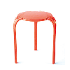  |
|  04  |  形状+数量：4个圆轮子  |   小汽车   |      |
|  05  |  形状+数量：5个圆手指  |    手套    |      |
|  06  |   形状+数量：6发子弹   |    手枪    |   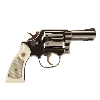   |
|  07  |          谐音          |    令旗    |      |
|  08  |    形状：8个圆轮子     |   溜冰鞋   |  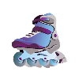  |
|  09  |    常识：猫有9条命     |     猫     |        |
|  10  |          形状          |    棒球    |   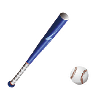   |
|  11  |          形状          |    筷子    |   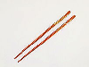   |
|  12  |          谐音          |    椅儿    |   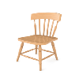   |
|  13  |          谐音          |    医生    |      |
|  14  |          谐音          |    钥匙    |      |
|  15  |          谐音          |    鹦鹉    |   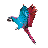   |
|  16  |          谐音          |    石榴    |      |
|  17  |          谐音          |    仪器    |      |
|  18  |          谐音          |    腰包    |   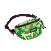   |
|  19  |          谐音          |    药酒    |      |
|  20  |     常识：一盒2支      |    香烟    |      |
|  21  |          谐音          |    鳄鱼    |   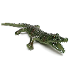   |
|  22  |    形状：衣服上有2     |   双胞胎   |    |
|  23  |          谐音          |    耳塞    |      |
|  24  |    常识：一天24小时    |    闹钟    |      |
|  25  |          谐音          |    二胡    |   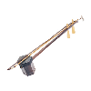   |
|  26  |          谐音          |    河流    |      |
|  27  |          谐音          |    耳机    |      |
|  28  |          谐音          |    恶霸    |      |
|  29  |          谐音          |    饿囚    |      |
|  30  |          谐音          |   三轮车   |  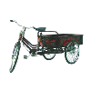  |
|  31  |          谐音          |    鲨鱼    |      |
|  32  |          谐音          |    扇儿    |      |
|  33  |          谐音          | 闪闪的星星 |      |
|  34  |          谐音          |  三条丝巾  |   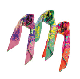   |
|  35  |          谐音          |    山虎    |      |
|  36  |          谐音          |    山鹿    |      |
|  37  |          谐音          |    山鸡    |   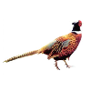   |
|  38  |      节日：妇女节      |    妇女    |      |
|  39  |          谐音          |  三九胃泰  | 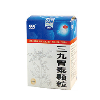 |
|  40  |          谐音          |    司令    |      |
|  41  |          谐音          |    蜥蜴    |      |
|  42  |          谐音          |    柿儿    |   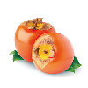   |
|  43  |          谐音          |    死神    |   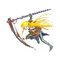   |
|  44  |     蛇“嘶嘶”的声音     |     蛇     |        |
|  45  |          谐音          |    师傅    |      |
|  46  |          谐音          |    饲料    |      |
|  47  |          谐音          |    司机    |      |
|  48  |          谐音          |    石板    |   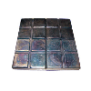   |
|  49  |          谐音          |    湿狗    |      |
|  50  |          谐音          |    武林    |      |
|  51  |      节日：劳动节      |    工人    |      |
|  52  |          谐音          |    鼓儿    |      |
|  53  |          谐音          |   乌纱帽   |    |
|  54  |      节日：青年节      |    青年    |      |
|  55  | 谐音：火车“呜呜”的声音 |    火车    |   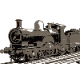   |
|  56  |          谐音          |    蜗牛    |      |
|  57  |          谐音          |    武器    |   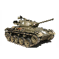   |
|  58  |          谐音          |    尾巴    |   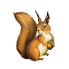   |
|  59  |          谐音          |    蜈蚣    |   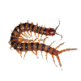   |
|  60  |          谐音          |    榴莲    |   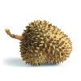   |
|  61  |      节日：儿童节      |    儿童    |      |
|  62  |          谐音          |    牛儿    |   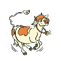   |
|  63  |          谐音          |    流沙    |      |
|  64  |          谐音          |    螺丝    |   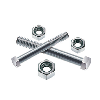   |
|  65  |          谐音          |    尿壶    |   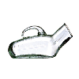   |
|  66  |          谐音          |   溜溜球   |  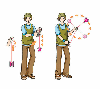  |
|  67  |          谐音          |    油漆    |      |
|  68  |          谐音          |    喇叭    |      |
|  69  |          谐音          |    料酒    |      |
|  70  |          谐音          |   冰淇凌   |    |
|  71  |          谐音          |    鸡翼    |   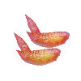   |
|  72  |          谐音          |    企鹅    |   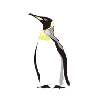   |
|  73  |          谐音          |   花旗参   |    |
|  74  |          谐音          |    骑士    |      |
|  75  |          谐音          |    西服    |      |
|  76  |          谐音          |    汽油    |      |
|  77  |          谐音          |   机器人   |  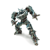  |
|  78  |          谐音          |    青蛙    |      |
|  79  |          谐音          |    气球    |      |
|  80  |          谐音          |  巴黎铁塔  | 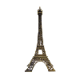 |
|  81  |          谐音          |    白蚁    |   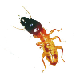   |
|  82  |          谐音          |    靶儿    |      |
|  83  |          谐音          |   芭蕉扇   |  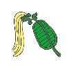  |
|  84  |          谐音          |    巴士    |      |
|  85  |          谐音          |    宝物    |   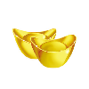   |
|  86  |          谐音          |   八路军   |   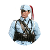   |
|  87  |          谐音          |    白棋    |      |
|  88  |          谐音          |    爸爸    |      |
|  89  |          谐音          |    芭蕉    |      |
|  90  |          谐音          |    精灵    |      |
|  91  |          谐音          |    球衣    |   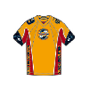   |
|  92  |          谐音          |    球儿    |      |
|  93  |          谐音          |    旧伞    |      |
|  94  |          谐音          |    教师    |      |
|  95  |          谐音          |    酒壶    |   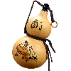   |
|  96  |          谐音          |    酒楼    |   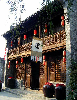   |
|  97  |          谐音          |    旧旗    |   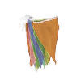   |
|  98  |          谐音          |    酒吧    |      |
|  99  |          谐音          |    舅舅    |   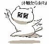   |
|  0   |          形状          |   呼啦圈   |  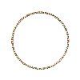   |
|  1   |          形状          |    蜡烛    |       |
|  2   |          形状          |     鹅     |    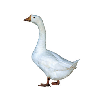     |
|  3   |          形状          |    耳朵    |       |
|  4   |          形状          |    帆船    |       |
|  5   |          形状          |    秤钩    |   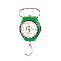    |
|  6   |          形状          |    勺子    |   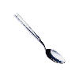    |
|  7   |          形状          |    镰刀    |   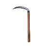    |
|  8   |          形状          |    眼镜    |   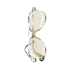    |
|  9   |          形状          |    口哨    |   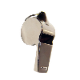    |

