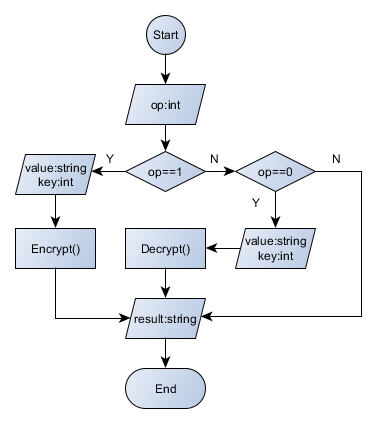

> ---
>
> Title: 《CeasarCipher》
>
> Author: Pleione_Plus
>
> Started Date: September 13th. 2019
>
> Finished Date: September 14th. 2019
>
> ------


# 凯撒密码

​		根据罗马早期纪传体作者**盖乌斯·苏维托尼乌斯**的记载，**凯撒大帝**曾用一种移位的方式对军事信息进行加密，后人称这种加密方式为凯撒加密。**凯撒密码**是一种**替换加密**的方案，**明文**中所有字母都在**字母表**上向后(或向前)按照一个固定数目进行偏移后被替换成**密文**。

# 原理解析

​		**凯撒加密**：

​		将**26个字母**按顺序进行排列并形成环，将每一位英文字母用其前面(或后面)的第k位字母来表示，替换之后形成新的字符串即为密文。

​		**举个栗子**：

​		当明文为：T，偏移量为：3时，使用CeasarCipher如下图所示。


​		以单表替换的角度来解释即为：

​		明文字母表：ABCDEFGHIJKLMNOPQRSTUVWXYZ

​		密文字母表：DEFGHIJKLMNOPQRSTUVWXYZABC

​		明文字母表与密文字母表存在上下的一一对应。当明文为T时，对应密文字母表中的W；解密时也按照一一对应的关系找到每个密文对应的明文即可。

​		**数学语言描述**：

1. 首先将字母用数字代替，即：A=0，B=1，C=2，...，Z=25。
2. 明文空间记为：M
3. 密文空间记为：C
4. 密钥空间记为：K~m~
5. 将偏移量记为：k
6. 加密操作记为：E~(m)~
7. 解密操作记为：D~(c)~

则有：

**加密变换**：
$$
E_(m_) = (m + k) \ mod \ 26 \ \   ,(m∈M，k∈K)
$$
**解密变换**：
$$
D_(c_) = (c - k) \ mod \ 26  ,\ \ \  (c∈C，k∈K)
$$
<font color="red">其中：明文空间M、密文空间C、密钥空间K~m~相同都为模26的余数集合</font>

# 程序设计

**程序流程图**：



注：

- 第一次输入一个int型数据op，若``op==1``则执行加密操作，若``op==0``则执行解密操作，否则结束程序。

- 第二次输入一个字符串，进行加密或解密操作。

- 操作结果后显示加密或解密的结果。


# 编程实现

**Ceasar类**：

```C#
namespace DemoCeasar
{
    public class Ceasar
    {
        #region 加密操作
        /// <summary>
        /// Ceasar加密操作
        /// </summary>
        /// <param name="plaintext">明文)</param>
        /// <param name="key">密钥(1-25)</param>
        /// <returns>密文</returns>
        internal string EnCrypt(string plaintext, int key)
        {
            string ciphertext = null;
            string str;
            str = plaintext.ToUpper();
            foreach(char ch in str)
            {
                if(ch >= 'A' && ch <= 'Z')
                {
                    ciphertext += (char)('A' + (ch - 'A' + key + 26) % 26);
                }
                else
                {
                    ciphertext += ch;
                }
                
            }

            return ciphertext;
        }

        /// <summary>
        /// Avocat加密（密钥为10）
        /// </summary>
        /// <param name="plaintext">明文</param>
        /// <returns>密文</returns>
        internal string AvocatEnCrypt(string plaintext)
        {
            return EnCrypt(plaintext, 10);
        }

        /// <summary>
        /// ROT13加密（密钥为13）
        /// </summary>
        /// <param name="plaintext">明文</param>
        /// <returns>密文</returns>
        internal string ROT13EnCrypt(string plaintext)
        {
            return EnCrypt(plaintext, 13);
        }

        /// <summary>
        /// Cassis加密（密钥为-5）
        /// </summary>
        /// <param name="plaintext">明文</param>
        /// <returns>密文</returns>
        internal string CassisEnCrypt(string plaintext)
        {
            return EnCrypt(plaintext, -5);
        }

        /// <summary>
        /// Cassette加密（密钥为-6）
        /// </summary>
        /// <param name="plaintext">明文</param>
        /// <returns>密文</returns>
        internal string CassetteEnCrypt(string plaintext)
        {
            return EnCrypt(plaintext, -6);
        }

        #endregion

        #region 解密操作
        /// <summary>
        /// Ceasar解密操作
        /// </summary>
        /// <param name="ciphertext">密文</param>
        /// <param name="key">密钥(1-25)</param>
        /// <returns>明文</returns>
        internal string DeCrypt(string ciphertext, int key)
        {
            string plaintext = null;
            string str;
            str = ciphertext.ToUpper();
            foreach (char ch in str)
            {
                if(ch >= 'A' && ch <= 'Z')
                {
                    plaintext += (char)('A' + (ch - 'A' - key + 26) % 26);
                }
                else
                {
                    plaintext += ch;
                }
                
            }

            return plaintext;
        }

        /// <summary>
        /// Avocat解密（密钥为10）
        /// </summary>
        /// <param name="ciphertext">密文</param>
        /// <returns>明文</returns>
        internal string AvocatDeCrypt(string ciphertext)
        {
            return DeCrypt(ciphertext, 10);
        }

        /// <summary>
        /// ROT13解密（密钥为13）
        /// </summary>
        /// <param name="ciphertext">密文</param>
        /// <returns>明文</returns>
        internal string ROT13DeCrypt(string ciphertext)
        {
            return DeCrypt(ciphertext, 13);
        }

        /// <summary>
        /// Cassis解密（密钥为-5）
        /// </summary>
        /// <param name="ciphertext">密文</param>
        /// <returns>明文</returns>
        internal string CassisDeCrypt(string ciphertext)
        {
            return DeCrypt(ciphertext, -5);
        }

        /// <summary>
        /// Cassette解密（密钥为-6）
        /// </summary>
        /// <param name="ciphertext">密文</param>
        /// <returns>明文</returns>
        internal string CassetteDeCrypt(string ciphertext)
        {
            return DeCrypt(ciphertext, -6);
        }
        #endregion
    }
}
```

Ceasar类核心解读：

​		在ceasar中理解的字母表是一个转轮的形式，但在实际的存储中而是以线性方式存储，所有在本代码中通过使用《初等数论》中的**模运算**来得到移位后的字母。（全部以**“A”**为基准）

1. 得到**给定字母**与“A”的偏移量
2. 计算**移位后**对“A”的偏移量
3. <font color="red">在取模之前先加上一个基数，使之前的计算结果全部以转化为正数</font>
4. **取模运算**得到目标字母相对于“A”的偏移量
5. 得到相对于“A”偏移字母的ASCII码并将其**强制转化为字母**

**Program测试类：**

```C#
using System;

namespace DemoCeasar
{
    class Program
    {
        static void Main(string[] args)
        {
            Console.Title = "欢迎使用Ceasar";
            Console.WriteLine("请输入您期望的操作：(1:加密,0:解密)");

            string str = Console.ReadLine();
            int op;
            if(int.TryParse(str,out op))
            {
                Ceasar ceasar = new Ceasar();

                if (op == 1)
                {
                    Console.WriteLine("请输入明文：(字母串)");
                    string plaintext = Console.ReadLine();
                    Console.WriteLine("请输入密钥:(整数)");
                    int key = Console.Read() - '0';

                    string ciphertext = ceasar.EnCrypt(plaintext, key);

                    Console.WriteLine("{0}加密之后的密文为:{1}",plaintext,ciphertext);
                }
                else if(op == 0)
                {
                    Console.WriteLine("请输入密文：(字母串)");
                    string ciphertext = Console.ReadLine();
                    Console.WriteLine("请输入密钥:(整数)");
                    int key = Console.Read() - '0';

                    string plaintext = ceasar.DeCrypt(ciphertext, key);

                    Console.WriteLine(plaintext);
                }
                else
                {
                    Console.WriteLine("输入错误程序终止!!!");
                }
            }

            Console.ReadKey();
        }
    }
}
```


# 结果显示

**加密操作**：


**解密操作**：


# 密码分析

​		Ceasar密码作为经典的加密算法，在罗马时期有很好的应用。其明文空间M、密文空间C、密钥空间K~m~相同都为模26的余数集合，也即其加密的密钥有25种情况(<font color="blue">0不计算在内</font>)，通过枚举密钥的方式揣测明文。

## 穷举搜索

**CrackSeasar类**：

```C#
namespace Crack_Seasar
{
    public class CrackSeasar
    {
        #region 枚举检索
        /// <summary>
        /// 枚举搜索
        /// </summary>
        /// <param name="ciphertext">密文</param>
        /// <returns>返回可能的明文字符串组</returns>
        internal string[] EnumerativeSearch(string ciphertext)
        {
            string[] plaintext = new string[26];
            string str = ciphertext.ToUpper();

            // 枚举解密
            for (int key = 1; key < 26; key++)
            {
                foreach (char ch in str)
                {
                    if (ch >= 'A' && ch <= 'Z')
                    {
                        plaintext[key - 1] += (char)('A' + (ch - 'A' - key + 26) % 26);
                    }
                    else
                    {
                        plaintext[key - 1] += ch;
                    }
                }
            }

            return plaintext;
        }
        #endregion
    }
}
```

**Program测试类**：

```csahrp
using System;

namespace Crack_Seasar
{
    class Program
    {
        static void Main(string[] args)
        {
            Console.Title = "CrackSear";

            Console.WriteLine("请输入待破解密文：");
            string ciphertext = Console.ReadLine();

            // 枚举搜索
            CrackSeasar crackSeasar = new CrackSeasar();
            string[] plaintext = crackSeasar.EnumerativeSearch(ciphertext);

            // Display
            for(int i = 0;i < 25;i++)
            {
                Console.WriteLine("key:{0} \t -> \t {1}", i + 1, plaintext[i]);
            }

            Console.ReadKey();
        }
    }
}
```

**测试结果**：


# 附录

**参考链接**：

[凯撒密码-百度百科](https://baike.baidu.com/item/恺撒密码/4905284?fromtitle=%E5%87%AF%E6%92%92%E5%AF%86%E7%A0%81&fromid=1336345&fr=aladdin)

[凯撒密码加解密即破解实现原理](https://www.cnblogs.com/ECJTUACM-873284962/p/8639300.html)

