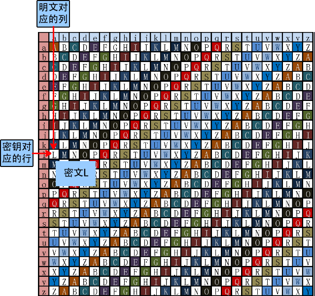

> ---
>
> Title: 《VigenereCipher》
>
> Author: Pleione_Plus
>
> Started Date: September 13th. 2019
>
> Finished Date: 
>
> ---


# 维吉尼亚密码

**介绍**：

​		**维吉尼亚密码**（又译 **维热纳尔密码**）是使用一系列**凯撒密码**组成密码字母表的加密算法，属于**多表密码**的一种简单形式。

​		维吉尼亚密码曾多次被发明。该方法最早记录在吉奥万·巴蒂斯塔·贝拉索（ Giovan Battista Bellaso）于1553年所著的书《吉奥万·巴蒂斯塔·贝拉索先生的密码》中。然而，后来在19世纪时被误传为是法国外交官布莱斯·德·维吉尼亚所创造，因此现在被称为“维吉尼亚密码”。

​		维吉尼亚密码以其简单易用而著称，同时初学者通常难以破解，因而又被称为“不可破译的密码”。这也让很多人使用维吉尼亚密码来加密的目的就是为了将其破解。

**历史**：

​		多表密码最早在1467年左右由莱昂·巴蒂斯塔·阿尔伯蒂提出，他使用了一个金属**密码盘**来切换密码表，只是这个系统只能做些有限的转换。后来1508年时，约翰尼斯·特里特米乌斯《**隐写术**》（Steganographia）中发明的表格法（tabula recta）成为了维吉尼亚密码的关键部分。然而当时此方法只能对密码表做一些简单的、可预测的切换。这一加密技术也称为**特里特米乌斯密码**。  

​		这一方法真正出现是在吉奥万·巴蒂斯塔·贝拉索于1553年所著的书《吉奥万·巴蒂斯塔·贝拉索先生的算术》中。他以特里特米乌斯的表格法为基础，同时引入了密钥的概念。

​		布莱斯·德·维吉尼亚于1586年亨利三世时期发明了更为简单却又更有效的自动密钥密码（autokey cipher）。之后，19世纪时贝拉索的方法被误认为是由维吉尼亚首先发明的。大卫·卡恩在《破译者（The Codebreakers）》中对此表示遗憾，他写道“历史忽略了这一重要贡献，将其归功于维吉尼亚，虽然他对此并不知道”。

​		由于破译的难度很高，维吉尼亚密码也因此获得了很高的声望。知名作家、数学家查尔斯·路特维奇·道奇森（笔名路易斯·卡罗）在其1868年所编、收于一儿童杂志的《字母表密码（The Alphabet Cipher）》中称其是不可破译的。1917年，《科学美国人》将维吉尼亚密码称为“无法被转化的”。然而，维吉尼亚密码却配不上这样的称号。查尔斯·巴贝奇完成了破译的工作，但他没有将此发表。之后，弗里德里希·卡西斯基（Friedrich Kasiski）于19世纪完全破解并发表了他的方法。甚至在此之前，一些资深密码分析家在16世纪就能偶尔将其破解。

​		维吉尼亚密码足够地易于使用使其能够作为战地密码。例如，美国南北战争期间南军就使用黄铜密码盘生成维吉尼亚密码。北军则经常能够破译南军的密码。战争自始至终，南军主要使用三个密钥，分别为“Manchester Bluff（曼彻斯特的虚张声势）”、“Complete Victory（完全的胜利）”以及战争后期的“Come Retribution（报应来临）”。

​		吉尔伯特·维尔南（Gilbert Vernam）曾试图对已被破译的密码进行修补（于1918年创造了维尔南-维尼吉亚密码），然而这终究无济于事。不过维尔南的发明最终促成了一次性密码本的诞生，这是一种理论上不可破译的密码。


# 原理解析

​		维吉尼亚密码可以说是凯撒密码的升级版，在凯撒密码中，字母表中的每一字母会做一定的偏移，而维吉尼亚密码可以看作是由一些偏移量不同的凯撒密码组成。

​		为了生成密码，需要使用**表格法**。这一表格（如图1所示）包括了26行字母表，每一行都由前一行向左偏移一位得到。具体使用哪一行字母表进行编译是基于密钥进行的，在过程中会不断地变换。

**举个栗子**：

使用的维吉尼亚密码表如下图所示：


**加密**：

- 假设明文为：

  <font color="blue">ATTACKATDAWN</font>

- LEMON为选定关键词，则密钥为：

  <font color="blue">LEMONLEMONLE</font>

- 将密钥作为**行标识**，明文作为**列标识**，对明文中的字母依次替换为行列相交处的字母，则得到密文：

  <font color="blue">LXFOPVEFRNHR</font>

明文字符串首字母的加密过程如下图所示：



**解密**：

- 假设密文为：

  <font color="blue">LXFOPVEFRNHR</font>

- LEMON为选定关键词，则密钥为：

  <font color="blue">LEMONLEMONLE</font>

- 将密钥作为**行标识**，在该行内查找与其密文一样的字母，该字母对应的列值即为明文，则得到明文：

  <font color="blue">ATTACKATDAWN</font>

密文字符串首字母的解密过程如下图所示：


**数学语言描述**：

1. 首先将字母用数字代替，即：A=0，B=1，C=2，...，Z=25。
2. 明文空间记为：M
3. 密文空间记为：C
4. 密钥空间记为：K~m~
5. 将偏移量记为：k~n~
6. 加密操作记为：E~(m)~
7. 解密操作记为：D~(c)~

则有：

**加密变换**：
$$
E(m_1,m_2,...,m_n) = (m_1+k_1 \ mod \ 26,m_2+k_2 \ mod \ 26,..,m_n+k_n \ mod \ 26),(m_i∈M，k_i∈K,n∈N)
$$
**解密变换**：
$$
E(m_1,m_2,...,m_n) = (m_1-k_1 \ mod \ 26,m_2-k_2 \ mod \ 26,..,m_n-k_n \ mod \ 26),(m_i∈M，k_i∈K,n∈N)
$$


# 程序设计

**程序流程图**：


注：

- 第一次输入一个int型数据op，若``op==1``则执行加密操作，若``op==0``则执行解密操作，否则结束程序。
- 第二次输入一个字符串，进行加密或解密操作。
- 操作结果后显示加密或解密的结果。


# 编程实现

**Vigenere类**：

```csharp
using System;
using System.Text;

namespace Cryptology_Vigenere
{
    class Vigenere
    {
        #region 定义全局变量
        private char[,] codeMatrix;

        #endregion

        #region 构造函数
        public Vigenere()
        {
            // 初始化对象时也初始化密码矩阵
            Vigenere_InitCodeMatrix();

            // 展示密码表
            DisplayCipherTable();
        }
        #endregion

        #region 初始化Vigenere密码矩阵
        private void Vigenere_InitCodeMatrix()
        {
            codeMatrix = new char[26, 26];//矩阵
            char temp;

            for(int i = 0;i < 26;i++)
            {
                temp = 'A';
                temp = (char)(temp + i);
                for(int j = 0;j < 26;j++)
                {
                    if((char)(temp + j) > 'Z')
                    {
                        codeMatrix[i, j] = (char)((temp + j) - 26);
                    }
                    else
                    {
                        codeMatrix[i, j] = (char)(temp + j);
                    }
                    
                }
            }
        }
        #endregion

        #region 展示维吉尼亚密码表
        private void DisplayCipherTable()
        {
            Console.Write("  ");
            for(int i = 0;i < 26;i++)
            {
                Console.Write((char)('a' + i) + " ");
            }
            Console.WriteLine();

            for (int i = 0; i < 26; i++)
            {
                for (int j = 0; j < 26; j++)
                {
                    if(j == 0)
                    {
                        Console.Write((char)('a' + i) + " ");
                    }

                    Console.Write(codeMatrix[i, j] + " ");
                }
                Console.WriteLine();
            }
        }
        #endregion

        #region Vigenere加密
        /// <summary>
        /// Vigenere加密
        /// </summary>
        /// <param name="plaintext">明文</param>
        /// <param name="key">密钥</param>
        /// <returns>密文</returns>
        internal string Encrypt(string plaintext, string key)
        {
            int x, y,k=0;//k:密钥计数器
            string str = plaintext.ToUpper();
            int min_mod = str.Length > key.Length ? key.Length : str.Length;
            StringBuilder strBuilder = new StringBuilder();
            for(int i = 0;i < str.Length;i++)
            {
                if(str[i] >= 'A' && str[i] <= 'Z')
                {
                    x = str[i] - 'A';
                    y = key[k++ % min_mod] - 'A';
                    strBuilder.Append(codeMatrix[x, y]);
                }
                else
                {
                    strBuilder.Append(str[i]);
                }
            }
            return strBuilder.ToString();
        }
        #endregion

        #region Vigenere解密
        /// <summary>
        /// Vigenere解密
        /// </summary>
        /// <param name="ciphertext">密文</param>
        /// <param name="key">密钥</param>
        /// <returns>明文</returns>
        internal string Decrypt(string ciphertext, string key)
        {
            int x, y,temp,k=0;//k:密钥计数器
            string str = ciphertext.ToUpper();
            int min_mod = str.Length > key.Length ? key.Length : str.Length;
            StringBuilder strBuilder = new StringBuilder();
            for(int i = 0;i < str.Length;i++)
            {
                if(str[i] >= 'A' && str[i] <= 'Z')
                {
                    y = key[k++ % min_mod] - 'A';
                    temp = str[i] - 'A';
                    if (temp < y)//是否发生回环
                    {
                        x = temp + 26 - y;
                    }
                    else
                    {
                        x = str[i] - 'A' - y;
                    }
                    strBuilder.Append((char)(x + 'A'));
                }
                else
                {
                    strBuilder.Append(str[i]);
                }
            }
            return strBuilder.ToString();
        }
        #endregion

    }
}
```

注：

- 先构造一张密码表，并显示加(解)密时使用的表
- 加密时**查表**，解密时也**查表**


**Program测试类**：

```csharp
using System;

namespace Cryptology_Vigenere
{
    class Program
    {
        static void Main(string[] args)
        {
            Console.Title = "Vigenere";
            int op;
            string plaintext, key, ciphytext,str;
            Vigenere vig = new Vigenere();

            Console.Write("请输入您想要进行的操作：(1:加密,0:解密) ->");
            str = Console.ReadLine();

            if(int.TryParse(str,out op))
            {
                if (op == 1)
                {
                    Console.Write("请输入明文：");
                    plaintext = Console.ReadLine();
                    Console.Write("请输入密钥：");
                    key = Console.ReadLine();
                    ciphytext = vig.Encrypt(plaintext, key);
                    Console.WriteLine(ciphytext);
                }
                else if (op == 0)
                {
                    Console.Write("请输入密文");
                    ciphytext = Console.ReadLine();
                    Console.Write("请输入密钥：");
                    key = Console.ReadLine();
                    plaintext = vig.Decrypt(ciphytext, key);
                    Console.WriteLine(plaintext);
                }
                else
                {
                    Console.WriteLine("输入错误程序停止!!!");
                }
            }
            else
            {
                Console.WriteLine("输入错误程序停止!!!");
            }
            
            Console.ReadKey();
        }
    }
}
```


# 结果显示

**加密结果**：


**解密结果**：


# 密码分析


# 附录

参考链接：

[维吉尼亚密码](http://www.baike.com/wiki/维吉尼亚密码)

[简单的加密算法——维吉尼亚密码](https://www.jianshu.com/p/2b69dde012e3)