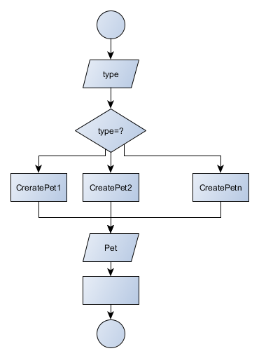
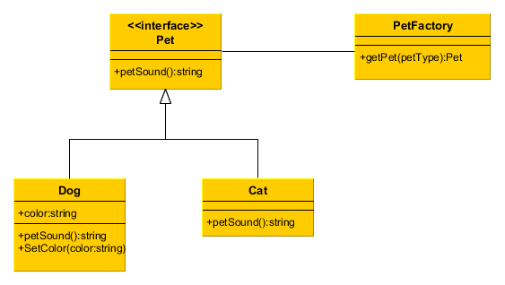
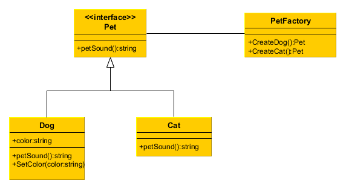
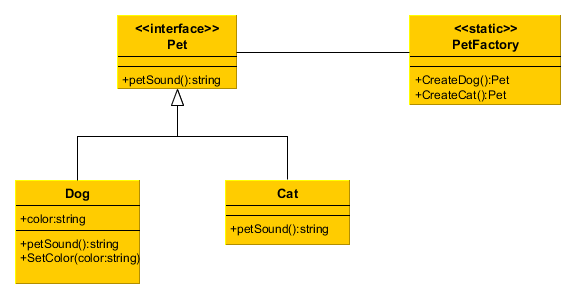

> ---
>
> Title：《设计模式——工厂方法模式》
>
> Author：Pleione_Plus
>
> StartedDate：September 18th. 2019.
>
> FinishedDate：September 20th. 2019.
>
> ---

# 定义理解 #

​		工厂方法模式（Factory Method Pattern）属于**类的创建型模式**，是通过专门定义一个类来负责创建其他类的实例，被创建的实例通常都具有共同的父类。包含**简单工厂模式**、**多工厂方法模式**、**静态工厂方法模式**三种模式。（<font color="blue">通俗一点：就是定义一个工厂类(接口)专门来生产商品对象。</font>）


# 角色与职责

该模式由三种角色组成：

- **工厂角色**(Creator)：

  ​		简单工厂模式的核心，它负责实现创建所有实例的**内部逻辑**。工厂类的创建产品类的方法**可以被外界直接调用**，创建所需的产品对象。

- **抽象产品角色**(Product)：

  ​		简单工厂模式所创建的所有对象的父类，它负责描述所有实例所**共有的公共接口**。

- **具体产品角色**(Concrete Product)：

  ​		是简单工厂模式的创建目标，所有创建的对象都是充当这个角色的某个具体类的实例。


# 实现步骤

- 将指定的参数送入工厂类中，
- 按一定的条件产出一个实例对象，
- 并通过多态返回实例化的对象




# 代码示例

## **简单工厂模式**

​		简单工厂模式的工厂类中**只有一个创建商品的方法**。

**简单工厂模式UML类图**：



**抽象产品角色**：

```csharp
	/// <summary>
    /// 用于实例化工厂方法模式的基类（其一般为接口）
    /// 1、若为接口，则只能定义商品所具有的行为，且继承于该接口的类必须对其进行实现
    /// 2、若为类，一般将其定义为抽象类，
    /// </summary>

    #region 基类的创建
    #region 基类--接口形式展示
    // 本实例中使用的基类
    public interface Pet
    {
        //商品的行为（方法）   --只有方法体
        string petSound();
    }
    #endregion

    #region 基类--抽象类形式展示
    public abstract class Product
    {
        public string name;
        //必须声明为抽象方法
        public abstract string show();
    }
    #endregion
    #endregion
```

**具体产品角色**：

```csharp
	#region 具体商品类对基类的继承与扩展
    public class Dog : Pet
    {
        // 对接口中方法的实现
        public string petSound()
        {
            return "Bow Bow...";
        }

        // 具体商品类的扩展
        private string color;
        public void SetColor(string color)
        {
            this.color = color;
        }
    }

    public class Cat : Pet
    {
        public string petSound()
        {
            return "Meaw Meaw...";
        }
    }
    #endregion
```

**工厂角色**：

```csharp
	#region 实例化商品的工厂
    /// <summary>
    /// 工厂类
    /// </summary>
    public class PetFactory
    {
        /// <summary>
        /// 工厂类中创建对象的方法
        /// </summary>
        /// <param name="petType">用来创建指定对象的参数</param>
        /// <returns>返回创建的Pet对象</returns>
        public Pet getPet(string petType)
        {
            Pet pet = null;
            if ("Bow".Equals(petType))
            {
                pet = new Dog();
            }
            if ("Meaw".Equals(petType))
            {
                pet = new Cat();
            }
            return pet;
        }
    }
    #endregion
```

**测试类**：

```csharp
	#region 测试类
    class SimpleFactoryMethod
    {
        static void Main(string[] args)
        {
            //1.实例化工厂对象
            PetFactory petFactory = new FactoryMethod_Demo1.PetFactory();

            //2.使用工厂对象创建指定的商品实例
            Pet pet = petFactory.getPet("Bow");

            //3.使用商品实例
            Console.WriteLine(pet.petSound());

            Console.ReadKey();
        }
    }
    #endregion
```


## **多工厂方法模式**

​		在多个工厂方法模式中，工厂类中每一个商品都有与其相对应的创建实例对象的方法。

**多工厂方法模式UML类图**：



**抽象产品角色**：

```csharp
	#region 基类--接口形式展示
    public interface Pet
    {
        //商品的行为（方法）   --只有方法体
        string petSound();
    }
    #endregion
```

**具体产品角色**：

```csharp
	#region 具体商品类对基类的继承与扩展
    public class Dog : Pet
    {
        // 对接口中方法的实现
        public string petSound()
        {
            return "Bow Bow...";
        }

        // 具体商品类的扩展
        private string color;
        public void SetColor(string color)
        {
            this.color = color;
        }
    }

    public class Cat : Pet
    {
        public string petSound()
        {
            return "Meaw Meaw...";
        }
    }
    #endregion
```

**工厂角色**：

```csharp
	#region 工厂角色
    /// <summary>
    /// 创建Pet的工厂类
    /// </summary>
    public class MultiplePetFactory
    {
        Pet pet = null;
        public Pet CreateDog()
        {
            pet = new Dog();
            return pet;
        }

        public Pet CreateCat()
        {
            pet = new Cat();
            return pet;
        }
    }
    #endregion
```

**测试类**：

```csharp
	#region 测试类
    class MultipleFactoryMethod
    {
        static void Main(string[] args)
        {
            //1、创建工厂类对象
            MultiplePetFactory petFactory = new MultiplePetFactory();

            //2、使用工厂类对象得到商品对象
            Pet pet = petFactory.CreateDog();

            //3、对商品对象进行操作
            Console.WriteLine(pet.petSound());

            Console.ReadKey();
        }
    }
    #endregion
```


## **静态工厂方法模式**

​		在静态工厂方法模式中，工厂类中每一个商品都有与其相对应的创建实例对象的静态方法

**静态工厂方法模式**：



**抽象产品角色**：

```csharp
	#region 基类--接口形式展示
    public interface Pet
    {
        //商品的行为（方法）   --只有方法体
        string petSound();
    }
    #endregion
```

**具体产品角色**：

```csharp
	#region 具体商品类对基类的继承与扩展
    public class Dog : Pet
    {
        // 对接口中方法的实现
        public string petSound()
        {
            return "Bow Bow...";
        }

        // 具体商品类的扩展
        private string color;
        public void SetColor(string color)
        {
            this.color = color;
        }
    }

    public class Cat : Pet
    {
        public string petSound()
        {
            return "Meaw Meaw...";
        }
    }
    #endregion
```

**工厂角色**：

```csharp
	#region 工厂角色
    /// <summary>
    /// 静态工厂
    /// </summary>
    public class StaticMultiPetFactory
    {
        static Pet pet = null;
        public static Pet CreateDog()
        {
            pet = new Dog();
            return pet;
        }

        public static Pet CreateCat()
        {
            pet = new Cat();
            return pet;
        }
    }
    #endregion
```

**测试类**：

```csharp
	#region 测试类
    class StaticMultiFactoryMethod
    {
        static void Main(string[] args)
        {
            //1、得到商品对象
            Pet pet = StaticMultiPetFactory.CreateDog();
            
            //2、使用商品对象
            Console.WriteLine(pet.petSound());

            Console.ReadKey();
        }
    }
    #endregion
```


# 总结

## 三种工厂方法模式的比较

**相同点**：

- 都存在三种角色：(工厂角色、抽象产品角色(抽象类或接口)、具体产品角色)；
- 主要是**依靠继承关系**来实现的。

**不同点**：

- 普通工厂模式：**工厂**类需要先**实例化**；工厂类中只有一个生产商品的方法且该方法必须指定的相应的**参数**之后才能进行生产；
- 多个工厂方法模式：**工厂**类需要先**实例化**；**每一个实体类**在工厂类中**都有一个**生产其对应**实例的方法**，无需额外的参数进行传递；
- 静态工厂方法模式：**工厂**类可以**直接使用**；**每一个实体类**在工厂类中**都有一个**生产其对应**实例的方法**，无需额外的参数进行传递。

## 优点与缺点

**简单工厂模式**：

 * 优点：封装对象的创建过程，使之不可见
 * 缺点:使用工厂类创建对象时，需要传入一个参数才能进行对象的创建   -->多个工厂方法模式(不用传入参数)

**多工厂方法模式**：

 * 优点：封装对象的创建过程，使之不可见；不用传入参数类创建
 * 缺点：工厂负荷变大

**静态工厂方法模式**：

 * 优点：封装对象的创建过程，使之不可见；不用传入参数类创建；不用实例化工厂对象
 * 缺点：一经启动工厂类中的静态方法就就占据一定量的内存空间       --（慎用）

**致命缺点**：

- <font color="red">创建的商品对象**无法访问**到子类对其的**扩展**（使用了多态）。</font>

## 应用场景

 * 当需要创建一个类，而在编程时不能确定这个类的类型时（需要运行时确定）
 * 当一个类希望由其子类来指定所创建对象的具体类型时
 * 当我们想要定位被创建类，并获取相关消息时

## 用例

- 日志记录功能（文件日志记录、数据库日志记录、控制台日志记录等）

