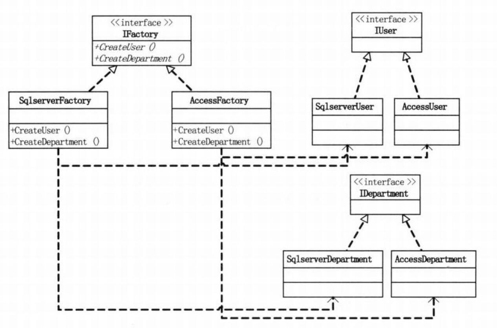
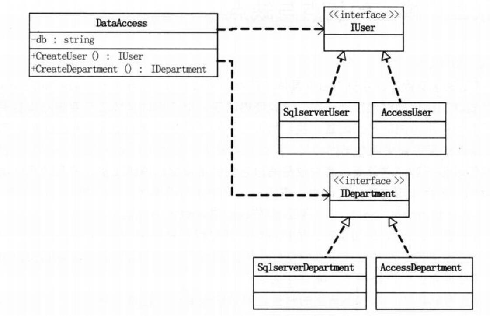

> ---
>
> Title：《设计模式-抽象工厂模式》
>
> Author：Pleione_Plus
>
> StartedDate：September 20th. 2019.
>
> FinishedDate：September 28th. 2019.
>
> ------

# 定义理解

​		抽象工厂模式（Abstract Factory Pattern）属于**类的创建型模式**，是对工厂方法模式的升级。提供一个创建一系列相关或相互依赖对象的接口，而无需指定它们具体的类。

​		工厂方法模式是为了克服简单工厂模式随着产品类的增加需要增加额外的代码的缺点而诞生的，而抽象工厂是针对工厂方法只能针对一个产品等级结构而扩展延伸的。


# 角色与职责

- 抽象产品(AbstractProduct)：

  定义部分具体产品的轮廓，在创建具体产品时使用多态性实现对具体产品的动态声明。

- 具体产品(ConcreteProduct)：

  抽象产品的具体实现，可扩展但在该模式下扩展无效。

- 抽象工厂接口(AbstractFactory)

  定义部分工厂的轮廓，在运行中实现对工厂的动态创建。

- 具体工厂接口(ConcreteFactory)：

  创建某个具体产品的实例，但以抽象产品引用返回实例。


# 实现步骤

- 创建抽象产品类/接口（定义产品的特性、动作等）
- 创建具体产品类（继承自抽象产品，并实现抽象产品中定义的方法）
- 创建抽象工厂类/接口（定义工厂的特性、动作等）
- 创建具体工厂类（继承自抽象工厂，并实现抽象工厂中定义的方法）


# 代码示例

**抽象工厂模式**：

​		屏蔽掉具体类的创建方法。



**实体类**：

User:

```csharp
namespace AbstractFactory
{
    class User
    {
        private int _id;
        public int ID
        {
            get { return _id; }
            set { _id = value; }
        }

        private string _name;
        public string Name
        {
            get { return _name; }
            set { _name = value; }
        }
    }
}
```

Department:

```csharp
namespace AbstractFactory
{
    class Department
    {
        private int _id;
        public int ID
        {
            get { return _id; }
            set { _id = value; }
        }

        private string _deptName;
        public string DeptName
        {
            get { return _deptName; }
            set { _deptName = value; }
        }
    }
}
```

**抽象产品**：

IUser:

```csharp
namespace AbstractFactory
{
    interface IUser
    {
        void Insert(User user);

        User GetUser(int id);
    }
}
```

IDepartment:

```csharp
namespace AbstractFactory
{
    interface IDepartment
    {
        void Insert(Department department);

        Department GetDepartment(int id);
    }
}
```

**具体产品**：

AccessUser：

```csharp
using System;

namespace AbstractFactory
{
    class AccessUser : IUser
    {
        public void Insert(User user)
        {
            Console.WriteLine("在Access中给User表增加一条记录");
        }

        public User GetUser(int id)
        {
            Console.WriteLine("在Access中根据ID得到User表一条记录");
            return null;
        }
    }
}
```

SqlserverUser:

```csharp
using System;

namespace AbstractFactory
{
    class SqlserverUser : IUser
    {
        public void Insert(User user)
        {
            Console.WriteLine("在Sqlserver中给User表增加一条记录");
        }

        public User GetUser(int id)
        {
            Console.WriteLine("在Sqlserver中根据ID得到User表一条记录");
            return null;
        }
    }
}
```

AccessDepartment:

```csharp
using System;

namespace AbstractFactory
{
    class AccessDepartment : IDepartment
    {
        public void Insert(Department department)
        {
            Console.WriteLine("在Access中给Department表增加一条记录");
        }

        public Department GetDepartment(int id)
        {
            Console.WriteLine("在Access中根据ID得到Department表一条记录");
            return null;
        }
    }
}
```

SqlserverDepartment:

```csharp
using System;

namespace AbstractFactory
{
    class SqlserverDepartment : IDepartment
    {
        public void Insert(Department department)
        {
            Console.WriteLine("在Sqlserver中给Department表增加一条记录");
        }

        public Department GetDepartment(int id)
        {
            Console.WriteLine("在Sqlserver中根据ID得到Department表一条记录");
            return null;
        }
    }
}
```

**抽象工厂**：

```csharp
namespace AbstractFactory
{
    interface IFactory
    {
        IUser CreateUser();

        IDepartment CreateDepartment();
    }
}
```

**具体工厂**：

AccessFactory:

```csharp
namespace AbstractFactory
{
    class AccessFactory : IFactory
    {
        public IUser CreateUser()
        {
            return new AccessUser();
        }

        public IDepartment CreateDepartment()
        {
            return new AccessDepartment();
        }
    }
}
```

SqlServerFactory:

```csharp
namespace AbstractFactory
{
    class SqlServerFactory : IFactory
    {
        public IUser CreateUser()
        {
            return new SqlserverUser();
        }

        public IDepartment CreateDepartment()
        {
            return new SqlserverDepartment();
        }
    }
}
```

**测试类**：

```csharp
using System;

namespace AbstractFactory
{
    /// <summary>
    /// 测试类
    /// </summary>
    class Program
    {
        static void Main(string[] args)
        {
            // User实体
            User user = new User();
            // Department实体
            Department dept = new Department();

            // 实例化一个具体工厂的抽象父工厂的对象
            IFactory factory = new AccessFactory();

            // 实例化一个具体类的抽象父类对象
            IUser iu = factory.CreateUser();

            // 具体商品对象的操作
            iu.Insert(user);
            iu.GetUser(1);

            // 抽象父工厂重新赋值
            factory = new SqlServerFactory();

            IDepartment id = factory.CreateDepartment();
            id.Insert(dept);
            id.GetDepartment(1);

            Console.ReadKey();
        }
    }
}
```

**结果展示**:


**业务扩展**：

将程序使用数据库全部换成Mysql数据库。

**具体产品**：

添加MysqlUser类：

```csharp
using System;

namespace AbstractFactory
{
    class MysqlUser : IUser
    {
        public void Insert(User user)
        {
            Console.WriteLine("在Mysql中给User表增加一条记录");
        }

        public User GetUser(int id)
        {
            Console.WriteLine("在Mysql中根据ID得到User表一条记录");
            return null;
        }
    }
}
```

添加MysqlDepartment类：

```csharp
using System;

namespace AbstractFactory
{
    class MysqlDepartment : IDepartment
    {
        public void Insert(Department department)
        {
            Console.WriteLine("在Mysql中给Department表增加一条记录");
        }

        public Department GetDepartment(int id)
        {
            Console.WriteLine("在Mysql中根据ID得到Department表一条记录");
            return null;
        }
    }
}
```

**具体工厂**：

添加MysqlFactory类：

```csharp
namespace AbstractFactory
{
    class MysqlFactory : IFactory
    {
        public IUser CreateUser()
        {
            return new MysqlUser();
        }

        public IDepartment CreateDepartment()
        {
            return new MysqlDepartment();
        }
    }
}
```

**修改测试类**：

```csharp
using System;

namespace AbstractFactory
{
    /// <summary>
    /// 测试类
    /// </summary>
    class Program
    {
        static void Main(string[] args)
        {
            // User实体
            User user = new User();
            // Department实体
            Department dept = new Department();

            // 实例化一个具体工厂的抽象父工厂的对象
            //IFactory factory = new AccessFactory();
            IFactory factory = new MysqlFactory();

            // 实例化一个具体类的抽象父类对象
            IUser iu = factory.CreateUser();

            // 具体商品对象的操作
            iu.Insert(user);
            iu.GetUser(1);

            Console.ReadKey();
        }
    }
}
```

**测试结果**：


**注**：

- 进行业务扩展时，需要添加新的具体产品和具体工厂
- 具体产品和具体工厂必须实现抽象产品和抽象工厂


# 优缺点

优点：

- 客户端与具体类解耦；
- 添加具体类更加方便

缺点：

- 增加代码量和负责程度

# 使用场景

​		通过定义可以了解到，抽象工厂模式就为解决具有相同（或者相似）等级结构的多个产品族中的产品对象的创建问题。所以抽象工厂模式一般用于具有产品树和产品族的场景下。

# 进一步改进

​		虽然抽象工厂模式将**开放-封闭原则**，**依赖倒置原则**发挥到极致，使得在**切换接口**的情况下非常方便，但是当系统中需要**增加功能**时，因功能分散导致需要添加多个新类才能实现。

比如：在上面的代码实例中添加项目表**Project**，至少要增加**IProject、SqlServerProject、AccessProject**，还需要更改**IFactory、SqlServerFactory、AccessFactory**才能完全实现。

## 用简单工厂来改进抽象工厂

​		去除IFactory、SqlServerFactory和AccessFactory三个工厂类，取而代之的是DataAccess类，用一个简单工厂模式来实现。

**代码结构图**：



**实体类**：

**User类**:

```csharp
	class User
    {
        private int _id;
        public int ID
        {
            get { return _id; }
            set { _id = value; }
        }

        private string _name;
        public string Name
        {
            get { return _name; }
            set { _name = value; }
        }
    }
```

**Department类**:

```csharp
    class Department
    {
        private int _id;
        public int ID
        {
            get { return _id; }
            set { _id = value; }
        }

        private string _deptName;
        public string DeptName
        {
            get { return _deptName; }
            set { _deptName = value; }
        }
    }
```

**抽象产品**：

**IUser类**：

```csharp
	interface IUser
    {
        void Insert(User user);

        User GetUser(int id);
    }
```

**IDepartment类**：

```csharp
	interface IDepartment
    {
        void Insert(Department department);

        Department GetDepartment(int id);
    }
```

**具体产品**：

**SqlserverUser类**：

```csharp
	class SqlserverUser : IUser
    {
        public void Insert(User user)
        {
            Console.WriteLine("在Sqlserver中给User表增加一条记录");
        }

        public User GetUser(int id)
        {
            Console.WriteLine("在Sqlserver中根据ID得到User表一条记录");
            return null;
        }
    }
```

**AccessUser类**：

```csharp
    class AccessUser : IUser
    {
        public void Insert(User user)
        {
            Console.WriteLine("在Access中给User表增加一条记录");
        }

        public User GetUser(int id)
        {
            Console.WriteLine("在Access中根据ID得到User表一条记录");
            return null;
        }
    }
```

**SqlserverDepartment类**：

```csharp
	class SqlserverDepartment : IDepartment
    {
        public void Insert(Department department)
        {
            Console.WriteLine("在Sqlserver中给Department表增加一条记录");
        }

        public Department GetDepartment(int id)
        {
            Console.WriteLine("在Sqlserver中根据ID得到Department表一条记录");
            return null;
        }
    }
```

**AccessDepartment类**：

```csharp
    class AccessDepartment : IDepartment
    {
        public void Insert(Department department)
        {
            Console.WriteLine("在Access中给Department表增加一条记录");
        }

        public Department GetDepartment(int id)
        {
            Console.WriteLine("在Access中根据ID得到Department表一条记录");
            return null;
        }
    }
```

**工厂类**：

**DataAccess类**：

```csharp
	class DataAccess
    {
        private static readonly string db = "Sqlserver";
        //private static readonly string db = "Access";

        public static IUser CreateUser()
        {
            IUser result = null;
            switch (db)
            {
                case "Sqlserver":
                    result = new SqlserverUser();
                    break;
                case "Access":
                    result = new AccessUser();
                    break;
            }
            return result;
        }

        public static IDepartment CreateDepartment()
        {
            IDepartment result = null;
            switch (db)
            {
                case "Sqlserver":
                    result = new SqlserverDepartment();
                    break;
                case "Access":
                    result = new AccessDepartment();
                    break;
            }
            return result;
        }
    }
```

**测试类**：

```csharp
	class Program
    {
        static void Main(string[] args)
        {
            User user = new User();
            Department dept = new Department();

            IUser iu = DataAccess.CreateUser();

            iu.Insert(user);
            iu.GetUser(1);

            IDepartment id = DataAccess.CreateDepartment();
            id.Insert(dept);
            id.GetDepartment(1);

            Console.Read();
        }
    }
```

**测试结果**：


**注**：

- 客户端完全不知道后端使用的数据库接口
- 但当增加数据库接口时，就需要在DataAccess类中修改每个方法


## 绝佳改进方案

​		使用简单工厂改进的抽象工厂中，引入switch导致程序耦合，添加后修改程序时需要修改一连串的类，通过某种方式避免这种耦合就可以达到绝佳的改进效果。下面引入：**反射 + 配置文件 + 抽象工厂**

**实体类**：（User 、 Department）

```csharp
	#region 测试基类
    class User
    {
        private int _id;
        public int ID
        {
            get { return _id; }
            set { _id = value; }
        }

        private string _name;
        public string Name
        {
            get { return _name; }
            set { _name = value; }
        }
    }

    class Department
    {
        private int _id;
        public int ID
        {
            get { return _id; }
            set { _id = value; }
        }

        private string _deptName;
        public string DeptName
        {
            get { return _deptName; }
            set { _deptName = value; }
        }
    }
    #endregion
```

**抽象产品**：（IUser、IDepartment）

```csharp
	#region User类的数据操作接口
    interface IUser
    {
        void Insert(User user);

        User GetUser(int id);
    }
    #endregion
    
    #region Department类的数据操作接口
    interface IDepartment
    {
        void Insert(Department department);

        Department GetDepartment(int id);
    }
    #endregion
```

**具体产品**：（SqlserverUser、AccessUser、SqlserverDepartment、AccessDepartment）

```csharp
	#region SqlserverUser类在SQL Server中对User执行相关操作
    class SqlserverUser : IUser
    {
        public void Insert(User user)
        {
            Console.WriteLine("在Sqlserver中给User表增加一条记录");
        }

        public User GetUser(int id)
        {
            Console.WriteLine("在Sqlserver中根据ID得到User表一条记录");
            return null;
        }
    }
    #endregion
    
    #region AccessUser类在Access中对User执行相关操作
    class AccessUser : IUser
    {
        public void Insert(User user)
        {
            Console.WriteLine("在Access中给User表增加一条记录");
        }

        public User GetUser(int id)
        {
            Console.WriteLine("在Access中根据ID得到User表一条记录");
            return null;
        }
    }
    #endregion
    
    #region SqlserverDepartment类在SQL Server中对Department执行相关操作
    class SqlserverDepartment : IDepartment
    {
        public void Insert(Department department)
        {
            Console.WriteLine("在Sqlserver中给Department表增加一条记录");
        }

        public Department GetDepartment(int id)
        {
            Console.WriteLine("在Sqlserver中根据ID得到Department表一条记录");
            return null;
        }
    }
    #endregion
    
    #region AccessDepartment类在Access中对Department执行相关操作
    class AccessDepartment : IDepartment
    {
        public void Insert(Department department)
        {
            Console.WriteLine("在Access中给Department表增加一条记录");
        }

        public Department GetDepartment(int id)
        {
            Console.WriteLine("在Access中根据ID得到Department表一条记录");
            return null;
        }
    }
    #endregion
```

**工厂类**：（DataAccess）

```csharp
	#region 使用反射创建操作数据的接口
    class DataAccess
    {
        //程序集名称
        private static readonly string AssemblyName = "抽象工厂模式";
        //配置文件中链接的数据名称
        private static readonly string db = ConfigurationManager.AppSettings["DB"];

        public static IUser CreateUser()
        {
            string className = AssemblyName + "." + db + "User";

            //使用发射创建指定类的实例
            return (IUser)Assembly.Load(AssemblyName).CreateInstance(className);
        }

        public static IDepartment CreateDepartment()
        {
            string className = AssemblyName + "." + db + "Department";

            //使用反射创建指定类的实例
            return (IDepartment)Assembly.Load(AssemblyName).CreateInstance(className);
        }
    }
    #endregion
```

**app.config**：

```csharp
<?xml version="1.0" encoding="utf-8"?>
<configuration>
	<appSettings>
		<add key="DB" value="Sqlserver"/>
	</appSettings>
<startup><supportedRuntime version="v4.0" sku=".NETFramework,Version=v4.6.1"/></startup></configuration>

```

**测试类**：

```csharp
	class Program
    {
        static void Main(string[] args)
        {
            //实例化对象
            User user = new User();
            Department dept = new Department();

            //创建IUser对象，对User执行相关操作
            IUser iu = DataAccess.CreateUser();

            iu.Insert(user);
            iu.GetUser(1);

            //创建IDepartment对象，对Department执行相关操作
            IDepartment id = DataAccess.CreateDepartment();
            id.Insert(dept);
            id.GetDepartment(1);

            Console.Read();
        }
    }
```

**注**：

- using System.Reflection;                        //使用反射必须要引入的命名空间
- using System.Configuration;                     //拿到配置文件中的字符变量必须要引入的命名空间
- 客户端与后端完全解耦
- 其他类与工厂类解耦
- 添加商品时，只要按模板添加商品类，修改工厂类中的方法即可
- 切换数据库接口时，只需修改app.config配置文件即可


# 附录

**反射 + 配置文件 + 抽象工厂**完整代码：

**Program.cs**:

```csharp
/********************************************************
 * 设计模式：抽象工厂模式，（反射+配置文件+抽象工厂）
 * 
 * 反射：
 *       return (IUser)Assembly.Load(AssemblyName).CreateInstance(className);
 *       AssemblyName：为本程序集名称
 *       className：为程序集中要实例化的类的名称（完整路径）
 *       (IUser)：将创建的对象强制转化为IUser对象
 * 
 * 配置文件信息：
 *       使用<appStrings>节点来设置链接的数据库名称
 * 
 */


using System;
using System.Reflection;                        //使用反射必须要引入的命名空间
using System.Configuration;                     //拿到配置文件中的字符变量必须要引入的命名空间

namespace 抽象工厂模式
{
    class Program
    {
        static void Main(string[] args)
        {
            //实例化对象
            User user = new User();
            Department dept = new Department();

            //创建IUser对象，对User执行相关操作
            IUser iu = DataAccess.CreateUser();

            iu.Insert(user);
            iu.GetUser(1);

            //创建IDepartment对象，对Department执行相关操作
            IDepartment id = DataAccess.CreateDepartment();
            id.Insert(dept);
            id.GetDepartment(1);

            Console.Read();
        }
    }

    #region 测试基类
    class User
    {
        private int _id;
        public int ID
        {
            get { return _id; }
            set { _id = value; }
        }

        private string _name;
        public string Name
        {
            get { return _name; }
            set { _name = value; }
        }
    }

    class Department
    {
        private int _id;
        public int ID
        {
            get { return _id; }
            set { _id = value; }
        }

        private string _deptName;
        public string DeptName
        {
            get { return _deptName; }
            set { _deptName = value; }
        }
    }
    #endregion

    #region User类的数据操作接口
    interface IUser
    {
        void Insert(User user);

        User GetUser(int id);
    }
    #endregion

    #region SqlserverUser类在SQL Server中对User执行相关操作
    class SqlserverUser : IUser
    {
        public void Insert(User user)
        {
            Console.WriteLine("在Sqlserver中给User表增加一条记录");
        }

        public User GetUser(int id)
        {
            Console.WriteLine("在Sqlserver中根据ID得到User表一条记录");
            return null;
        }
    }
    #endregion

    #region AccessUser类在Access中对User执行相关操作
    class AccessUser : IUser
    {
        public void Insert(User user)
        {
            Console.WriteLine("在Access中给User表增加一条记录");
        }

        public User GetUser(int id)
        {
            Console.WriteLine("在Access中根据ID得到User表一条记录");
            return null;
        }
    }
    #endregion

    #region Department类的数据操作接口
    interface IDepartment
    {
        void Insert(Department department);

        Department GetDepartment(int id);
    }
    #endregion

    #region SqlserverDepartment类在SQL Server中对Department执行相关操作
    class SqlserverDepartment : IDepartment
    {
        public void Insert(Department department)
        {
            Console.WriteLine("在Sqlserver中给Department表增加一条记录");
        }

        public Department GetDepartment(int id)
        {
            Console.WriteLine("在Sqlserver中根据ID得到Department表一条记录");
            return null;
        }
    }
    #endregion

    #region AccessDepartment类在Access中对Department执行相关操作
    class AccessDepartment : IDepartment
    {
        public void Insert(Department department)
        {
            Console.WriteLine("在Access中给Department表增加一条记录");
        }

        public Department GetDepartment(int id)
        {
            Console.WriteLine("在Access中根据ID得到Department表一条记录");
            return null;
        }
    }
    #endregion

    #region 使用反射创建操作数据的接口
    class DataAccess
    {
        //程序集名称
        private static readonly string AssemblyName = "抽象工厂模式";
        //配置文件中链接的数据名称
        private static readonly string db = ConfigurationManager.AppSettings["DB"];

        public static IUser CreateUser()
        {
            string className = AssemblyName + "." + db + "User";

            //使用发射创建指定类的实例
            return (IUser)Assembly.Load(AssemblyName).CreateInstance(className);
        }

        public static IDepartment CreateDepartment()
        {
            string className = AssemblyName + "." + db + "Department";

            //使用反射创建指定类的实例
            return (IDepartment)Assembly.Load(AssemblyName).CreateInstance(className);
        }
    }
    #endregion
}
```

**App.config**文件：

```csharp
<?xml version="1.0" encoding="utf-8"?>
<configuration>
	<appSettings>
		<add key="DB" value="Sqlserver"/>
	</appSettings>
<startup><supportedRuntime version="v4.0" sku=".NETFramework,Version=v4.6.1"/></startup></configuration>

```


