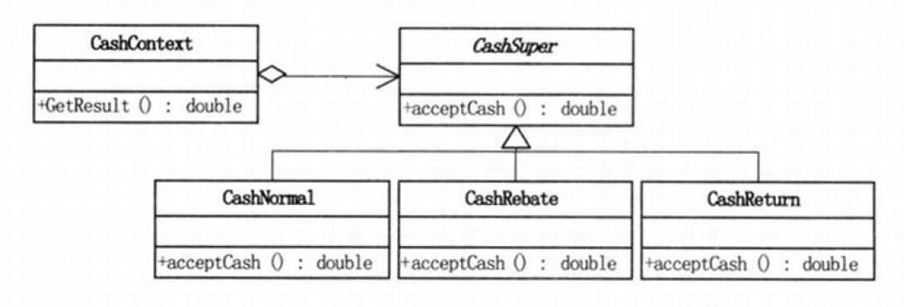
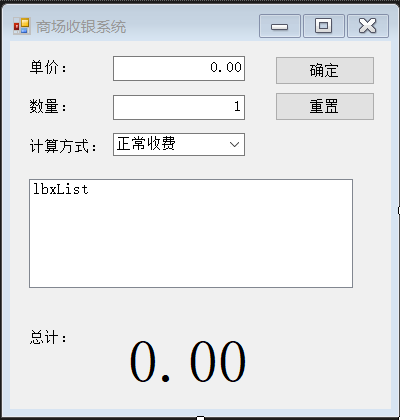
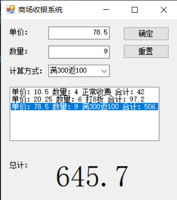
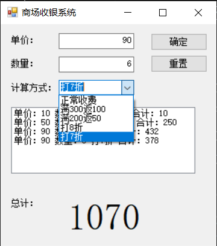

> ---
>
> Title：《设计模式-策略模式》
>
> Author：Pleione_Plus
>
> StartedDate：September 28th. 2019.
>
> FinishedDate：September 28th. 2019.
>
> ------

# 定义理解

​		策略模式时一种**行为型模式**，主要用于需要使用不同的算法来处理不同的数据（对象）时。策略模式是一种定义一系列算法的的方法，从概念上来看，所有这些算法完成的都是相同的工作，只是实现不同，它可以以相同的方式调用所有的算法，减少各种算法类与使用算法类之间的耦合，即**在运行时选择算法**。

​		<font color="blue">定义算法家族，分别封装起来，让它们之间可以相互替换，此模式让算法的变化，不会影响到使用算法的客户 。</font>

# 角色与职责

- **抽象策略角色（Strategy）**：策略类，通常由一个**接口**或者**抽象类**来实现

  ​		定义一个公共接口，各种不同的算法以不同的方式实现这个接口，Context使用这个接口调用不同的算法，一般用接口或抽象类来实现。

- **具体策略角色（ConcreteStrategy）**：包装了相关的**算法和行为**

  ​		实现Strategy定义的接口，提供具体的算法实现。

- **环境角色（Context）**：持有一个**策略类的引用**最终给客户端调用

  - 需要使用ConcreteStrategy提供的算法
  - 内部维护一个Strategy的实例
  - 负责动态设置运行时Strategy具体的实现算法
  - 负责跟Strategy之间的交互和数据传递


# 实现步骤

1. 识别客户端可能需要的各种算法（即功能）（**抽象策略角色**）
2. 在接口中指定该算法的签名（原型）（**具体策略角色**）
3. 在派生类中提供可选择的实现细节（**环境角色**）
4. 将客户端的算法和接口耦合


# 代码示例

**代码结构图**：



**抽象策略角色**：

**CashSuper类**：

```csharp
namespace 商场管理软件
{
    //算法的公共接口
    abstract class CashSuper
    {
        //抽象出来的接口方法
        public abstract double acceptCash(double money);
    }
}
```


**具体策略角色**：

**CashNormal类**：

```csharp
namespace 商场管理软件
{
    //不折扣算法
    class CashNormal : CashSuper
    {
        public override double acceptCash(double money)
        {
            return money;
        } 
    }
}
```

**CashRebate类**：

```csharp
namespace 商场管理软件
{
    //折扣算法
    class CashRebate : CashSuper
    {
        // 几折（默认为1折）
        private double moneyRebate = 1d;

        #region 带参构造函数-设置打折力度
        /// <summary>
        /// 带参构造函数-设置打折力度
        /// </summary>
        /// <param name="moneyRebate">几折</param>
        public CashRebate(string moneyRebate)
        {
            this.moneyRebate = double.Parse(moneyRebate);
        }
        #endregion

        #region 重写acceptCash方法
        /// <summary>
        /// 重写acceptCash方法
        /// </summary>
        /// <param name="money">原始钱数</param>
        /// <returns>返回折后钱数</returns>
        public override double acceptCash(double money)
        {
            return money * moneyRebate;
        }
        #endregion
    }
}
```

**CashReturn类**：

```csharp
using System;

namespace 商场管理软件
{
    //返利算法
    class CashReturn : CashSuper
    {
        // 金额限度
        private double moneyCondition = 0.0d;
        // 返还力度
        private double moneyReturn = 0.0d;

        #region 构造函数-设置金额限度和返还力度
        /// <summary>
        /// 构造函数-设置金额限度和返还力度
        /// </summary>
        /// <param name="moneyCondition">金额限度</param>
        /// <param name="moneyReturn">返还力度</param>
        public CashReturn(string moneyCondition, string moneyReturn)
        {
            this.moneyCondition = double.Parse(moneyCondition);
            this.moneyReturn = double.Parse(moneyReturn);
        }
        #endregion

        #region 重构acceptCash方法
        /// <summary>
        /// 重构acceptCash方法
        /// </summary>
        /// <param name="money">原始金额</param>
        /// <returns>返回实际应付金额</returns>
        public override double acceptCash(double money)
        {
            double result = money;
            if (money >= moneyCondition)
                result = money - Math.Floor(money / moneyCondition) * moneyReturn;

            return result;
        }
        #endregion
    }
}
```

**环境角色**：

**CashContext类**：

```csharp
namespace 商场管理软件
{
    //收费策略Context
    class CashContext
    {
        //声明一个现金收费父类对象
        private CashSuper cs;

        //设置策略行为，参数为具体的现金收费子类（正常，打折或返利）
        public CashContext(CashSuper csuper)
        {
            this.cs = csuper;
        }

        //得到现金促销计算结果（利用了多态机制，不同的策略行为导致不同的结果）
        public double GetResult(double money)
        {
            return cs.acceptCash(money);
        }
    }
}
```

**测试类**：

**测试界面**：



**测试类代码**：

```csharp
using System;
using System.Windows.Forms;

namespace 商场管理软件
{
    public partial class Form1 : Form
    {
        public Form1()
        {
            InitializeComponent();
        }

        double total = 0.0d;//用于总计
        private void btnOk_Click(object sender, EventArgs e)
        {
            CashContext cc = null;
            switch (cbxType.SelectedItem.ToString())
            {
                //直接传策略对象参数进行上下文对象的创建
                case "正常收费":
                    cc = new CashContext(new CashNormal());
                    break;
                case "满300返100":
                    cc = new CashContext(new CashReturn("300", "100"));
                    break;
                case "打8折":
                    cc = new CashContext(new CashRebate("0.8"));
                    break;
            }

            double totalPrices = 0d;
            //计算
            totalPrices = cc.GetResult(Convert.ToDouble(txtPrice.Text) * Convert.ToDouble(txtNum.Text));
            total = total + totalPrices;

            //显示结果
            lbxList.Items.Add("单价：" + txtPrice.Text + " 数量：" + txtNum.Text + " " + cbxType.SelectedItem + " 合计：" + totalPrices.ToString());
            lblResult.Text = total.ToString();
        }

        private void btnClear_Click(object sender, EventArgs e)
        {
            total = 0d;
            txtPrice.Text = "0.00";
            txtNum.Text = "1";
            lbxList.Items.Clear();
            lblResult.Text = "0.00";
        }
    }
}
```

**测试结果**：




# 优缺点

**优点**：

1. 策略模式提供了**管理**相关**算法族**的办法。
2. 策略模式提供了可以**替换继承关系**的办法。
3. 使用策略模式可以**避免使用多重条件转移语句**。

**缺点**：

1. **客户端**必须**知道所有的策略类**，并且**自行决定**使用哪一个策略类
2. 策略模式造成**很多的策略类**，每一个具体的策略类都会产生一个新类


# 使用场景

1. 多个类**只区别在表现行为不同**，可以使用Strategy模式，在运行时动态选择具体要执行的行为；
2. 需要在不同情况下使用不同的策略(算法),或者策略还可能在未来用其他方式来实现；
3. 对客户隐藏具体的策略(算法)的实现细节，彼此完全独立。


# 算法改进

## 策略与简单工厂集合

改造后的环境类：(CashContext.cs)

```csharp
namespace 商场管理软件
{
    //现金收取工厂
    class CashContext
    {
        CashSuper cs = null;

        //根据条件返回相应的对象
        public CashContext(string type)
        {
            switch (type)
            {
                case "正常收费":
                    CashNormal cs0 = new CashNormal();
                    cs = cs0;
                    break;
                case "满300返100":
                    CashReturn cr1 = new CashReturn("300", "100");
                    cs = cr1;
                    break;
                case "打8折":
                    CashRebate cr2 = new CashRebate("0.8");
                    cs = cr2;
                    break;
            }
        }

        public double GetResult(double money)
        {
            return cs.acceptCash(money);
        }
    }
}
```

**客户端测试代码**：

```csharp
using System;
using System.Windows.Forms;

namespace 商场管理软件
{

    //策略对象的的创建在上下文类中完成，即策略对象的创建是对用户保密的
    public partial class Form1 : Form
    {
        public Form1()
        {
            InitializeComponent();
        }

        //客户端窗体程序（主要部分）
        double total = 0.0d;
        private void btnOk_Click(object sender, EventArgs e)
        {
            //利用简单工厂模式根据下拉选择框，生成相应的对象
            CashContext csuper = new CashContext(cbxType.SelectedItem.ToString());
            double totalPrices = 0d;
            
            //通过多态，可以得到收取费用的结果
            totalPrices = csuper.GetResult(Convert.ToDouble(txtPrice.Text) * Convert.ToDouble(txtNum.Text));
            total = total + totalPrices;

            //展示计价结果
            lbxList.Items.Add("单价：" + txtPrice.Text + " 数量：" + txtNum.Text + " "
                + cbxType.SelectedItem + " 合计：" + totalPrices.ToString());
            lblResult.Text = total.ToString();
        }

        private void btnClear_Click(object sender, EventArgs e)
        {
            total = 0d;
            txtPrice.Text = "0.00";
            txtNum.Text = "0";
            lbxList.Items.Clear();
            lblResult.Text = "0.00";
        }
    }
}
```

**注**：

- 策略模式客户端需要认识**CashSuper类**、**CashNormal类**、**CashReturn类**、**CashRebate类**、**CashContext类**；
- 简单工厂模式客户端需要认识**CashSuper类**、**工厂类**；
- 策略与简单工厂集合之后，客户端只需要认识一个**CashContext类**即可，耦合度更加低。


## 策略 + 反射

改造后的环境类：(CashContext.cs)

```csharp
namespace 商场管理软件
{
    class CashContext
    {
        private CashSuper cs;

        //设置上下文中的策略实例对象
        public void setBehavior(CashSuper csuper)
        {
            this.cs = csuper;
        }

        public double GetResult(double money)
        {
            return cs.acceptCash(money);
        }
    }
}
```

**客户端测试代码**：

```csharp
/**********************************
 * 
 * 程序说明：使用反射 + 策略模式  来实现
 * 
 *          反射：下拉列表中的文件数据直接从配置.xml文件中获取，即在程序运行时程序才知道下拉框中会有什么内容
 *          策略：使用能统一调用所有策略对象的上下文对象
 * 
 * 
 */ 

using System;
using System.Data;
using System.Windows.Forms;
using System.Reflection;

namespace 商场管理软件
{
    public partial class Form1 : Form
    {
        public Form1()
        {
            InitializeComponent();
        }

        DataSet ds;//用于存放配置文件信息
        double total = 0.0d;//用于总计


        /// <summary>
        /// 在程序加载时，读取指定文件中的所有内容
        /// </summary>
        /// <param name="sender"></param>
        /// <param name="e"></param>
        private void Form1_Load(object sender, EventArgs e)
        {
            //读配置文件                     --在程序运行的路径下
            ds = new DataSet();
            ds.ReadXml(Application.StartupPath + "\\CashAcceptType.xml");


            //将读取到的记录绑定到下拉列表框中
            foreach (DataRowView dr in ds.Tables[0].DefaultView)
            {
                cbxType.Items.Add(dr["name"].ToString());
            }
            cbxType.SelectedIndex = 0;
        }

        private void btnOk_Click(object sender, EventArgs e)
        {
            //实例化一个上下文对象
            CashContext cc = new CashContext();
            
            //根据用户的选项，查询用户选择项的相关行
            DataRow dr = ((DataRow[])ds.Tables[0].Select("name='" + cbxType.SelectedItem.ToString()+"'"))[0];

            //声明一个参数的对象数组
            object[] args =null;
            //若有参数，则将其分割成字符串数组，用于实例化时所用的参数
            if (dr["para"].ToString() != "")
                args = dr["para"].ToString().Split(',');

            //通过反射实例化出相应的算法对象
            cc.setBehavior((CashSuper)Assembly.Load("商场管理软件").CreateInstance("商场管理软件." + dr["class"].ToString(), false, BindingFlags.Default, null, args, null, null));
            
            double totalPrices = 0d;
            totalPrices = cc.GetResult(Convert.ToDouble(txtPrice.Text) * Convert.ToDouble(txtNum.Text));
            total = total + totalPrices;
            lbxList.Items.Add("单价：" + txtPrice.Text + " 数量：" + txtNum.Text + " "+cbxType.SelectedItem+ " 合计：" + totalPrices.ToString());
            lblResult.Text = total.ToString();
        }

        private void btnClear_Click(object sender, EventArgs e)
        {
            total = 0d;
            txtPrice.Text = "0.00";
            txtNum.Text = "1";
            lbxList.Items.Clear();
            lblResult.Text = "0.00";
        }
    }
}
```

**CashAcceptType.xml**：

```xml
<?xml version="1.0" encoding="utf-8" ?>
<CashAcceptType>
	<type>
		<name>正常收费</name>
		<class>CashNormal</class>
		<para></para>
	</type>
	<type>
		<name>满300返100</name>
		<class>CashReturn</class>
		<para>300,100</para>
	</type>
	<type>
		<name>满200返50</name>
		<class>CashReturn</class>
		<para>200,50</para>
	</type>
	<type>
		<name>打8折</name>
		<class>CashRebate</class>
		<para>0.8</para>
	</type>
	<type>
		<name>打7折</name>
		<class>CashRebate</class>
		<para>0.7</para>
	</type>
</CashAcceptType>
```

**测试结果**：




# 策略模式与简单工厂模式的区别

**从组成对象来说**：

- 简单工厂模式：抽象商品角色、具体商品角色、简单工厂角色

- 策略模式：抽象策略角色、具体策略角色、上下文角色(环境角色)

**从角色之间得关系来说**：

- 抽象策略角色与上下文角色的关系是**聚合关系**
- 抽象商品角色与简单工厂角色之间是**依赖关系**


# 附录

## 参考资料

- 《大话设计模式》
- 《设计模式精解及面试攻略》


## 策略与简单工厂集合完整源码

**CashContext.cs**：

```csharp
namespace 商场管理软件
{
    //现金收取工厂
    class CashContext
    {
        CashSuper cs = null;

        //根据条件返回相应的对象
        public CashContext(string type)
        {
            switch (type)
            {
                case "正常收费":
                    CashNormal cs0 = new CashNormal();
                    cs = cs0;
                    break;
                case "满300返100":
                    CashReturn cr1 = new CashReturn("300", "100");
                    cs = cr1;
                    break;
                case "打8折":
                    CashRebate cr2 = new CashRebate("0.8");
                    cs = cr2;
                    break;
            }
        }

        public double GetResult(double money)
        {
            return cs.acceptCash(money);
        }
    }
}
```

**CashNormal.cs**：

```csharp
namespace 商场管理软件
{
    //正常收费，继承CashSuper
    class CashNormal : CashSuper
    {
        public override double acceptCash(double money)
        {
            return money;
        }
    }
}
```

**CashRebate.cs**：

```csharp
namespace 商场管理软件
{
    //打折收费，继承CashSuper
    class CashRebate : CashSuper
    {
        private double moneyRebate = 1d;
        //初始化时，必需要输入折扣率,如八折，就是0.8
        public CashRebate(string moneyRebate)
        {
            this.moneyRebate = double.Parse(moneyRebate);
        }

        public override double acceptCash(double money)
        {
            return money * moneyRebate;
        }
    }
}
```

**CashReturn.cs**：

````csharp
using System;

namespace 商场管理软件
{
    //返利收费，继承CashSuper
    class CashReturn : CashSuper
    {
        private double moneyCondition = 0.0d;
        private double moneyReturn = 0.0d;
        //初始化时必须要输入返利条件和返利值，比如满300返100，则moneyCondition为300，moneyReturn为100
        public CashReturn(string moneyCondition, string moneyReturn)
        {
            this.moneyCondition = double.Parse(moneyCondition);
            this.moneyReturn = double.Parse(moneyReturn);
        }

        public override double acceptCash(double money)
        {
            double result = money;
            //若大于返利条件，则需要减去返利值
            if (money >= moneyCondition)
                result = money - Math.Floor(money / moneyCondition) * moneyReturn;

            return result;
        }
    }
}
````

**CashSuper.cs**：

```csharp
namespace 商场管理软件
{
    //现金收取父类
    abstract class CashSuper
    {
        //抽象方法：收取现金，参数为原价，返回为当前价
        public abstract double acceptCash(double money);
    }
}
```

**Form1.cs**：

```csharp
using System;
using System.Windows.Forms;

namespace 商场管理软件
{
    //策略对象的的创建在上下文类中完成，即策略对象的创建是对用户保密的
    public partial class Form1 : Form
    {
        public Form1()
        {
            InitializeComponent();
        }

        //客户端窗体程序（主要部分）
        double total = 0.0d;
        private void btnOk_Click(object sender, EventArgs e)
        {
            //利用简单工厂模式根据下拉选择框，生成相应的对象
            CashContext csuper = new CashContext(cbxType.SelectedItem.ToString());
            double totalPrices = 0d;
            
            //通过多态，可以得到收取费用的结果
            totalPrices = csuper.GetResult(Convert.ToDouble(txtPrice.Text) * Convert.ToDouble(txtNum.Text));
            total = total + totalPrices;

            //展示计价结果
            lbxList.Items.Add("单价：" + txtPrice.Text + " 数量：" + txtNum.Text + " "
                + cbxType.SelectedItem + " 合计：" + totalPrices.ToString());
            lblResult.Text = total.ToString();
        }

        private void btnClear_Click(object sender, EventArgs e)
        {
            total = 0d;
            txtPrice.Text = "0.00";
            txtNum.Text = "0";
            lbxList.Items.Clear();
            lblResult.Text = "0.00";
        }
    }
}
```

**CashAcceptType.xml**：

```xml
<?xml version="1.0" encoding="utf-8" ?>
<CashAcceptType>
	<type>
		<name>正常收费</name>
		<class>CashNormal</class>
		<para></para>
	</type>
	<type>
		<name>满300返100</name>
		<class>CashReturn</class>
		<para>300,100</para>
	</type>
	<type>
		<name>满200返50</name>
		<class>CashReturn</class>
		<para>200,50</para>
	</type>
	<type>
		<name>打8折</name>
		<class>CashRebate</class>
		<para>0.8</para>
	</type>
	<type>
		<name>打7折</name>
		<class>CashRebate</class>
		<para>0.7</para>
	</type>
</CashAcceptType>
```


## 策略+反射完整源码

**CashSuper.cs**：

```csharp
namespace 商场管理软件
{
    abstract class CashSuper
    {
        public abstract double acceptCash(double money);
    }
}
```

**CashNormal.cs**：

```csharp
namespace 商场管理软件
{
    class CashNormal : CashSuper
    {
        public override double acceptCash(double money)
        {
            return money;
        } 
    }
}
```

**CashRebate.cs**：

```csharp
namespace 商场管理软件
{
    class CashRebate : CashSuper
    {
        private double moneyRebate = 1d;
        public CashRebate(string moneyRebate)
        {
            this.moneyRebate = double.Parse(moneyRebate);
        }

        public override double acceptCash(double money)
        {
            return money * moneyRebate;
        } 
    }
}
```

**CashReturn.cs**：

```csharp
using System;

namespace 商场管理软件
{
    class CashReturn : CashSuper
    {
        private double moneyCondition = 0.0d;
        private double moneyReturn = 0.0d;
        
        public CashReturn(string moneyCondition,string moneyReturn)
        {
            this.moneyCondition = double.Parse(moneyCondition);
            this.moneyReturn = double.Parse(moneyReturn);
        }

        public override double acceptCash(double money)
        {
            double result = money;
            if (money >= moneyCondition)
                result=money- Math.Floor(money / moneyCondition) * moneyReturn;
                
            return result;
        } 
    }
}
```

**CashContext.cs**：

```csharp
namespace 商场管理软件
{
    class CashContext
    {
        private CashSuper cs;

        //设置上下文中的策略实例对象
        public void setBehavior(CashSuper csuper)
        {
            this.cs = csuper;
        }

        public double GetResult(double money)
        {
            return cs.acceptCash(money);
        }
    }
}
```

**Form1.cs**：

```csharp
using System;
using System.Data;
using System.Windows.Forms;
using System.Reflection;

namespace 商场管理软件
{
    public partial class Form1 : Form
    {
        public Form1()
        {
            InitializeComponent();
        }

        DataSet ds;//用于存放配置文件信息
        double total = 0.0d;//用于总计


        /// <summary>
        /// 在程序加载时，读取指定文件中的所有内容
        /// </summary>
        /// <param name="sender"></param>
        /// <param name="e"></param>
        private void Form1_Load(object sender, EventArgs e)
        {
            //读配置文件                     --在程序运行的路径下
            ds = new DataSet();
            ds.ReadXml(Application.StartupPath + "\\CashAcceptType.xml");


            //将读取到的记录绑定到下拉列表框中
            foreach (DataRowView dr in ds.Tables[0].DefaultView)
            {
                cbxType.Items.Add(dr["name"].ToString());
            }
            cbxType.SelectedIndex = 0;
        }

        private void btnOk_Click(object sender, EventArgs e)
        {
            //实例化一个上下文对象
            CashContext cc = new CashContext();
            
            //根据用户的选项，查询用户选择项的相关行
            DataRow dr = ((DataRow[])ds.Tables[0].Select("name='" + cbxType.SelectedItem.ToString()+"'"))[0];

            //声明一个参数的对象数组
            object[] args =null;
            //若有参数，则将其分割成字符串数组，用于实例化时所用的参数
            if (dr["para"].ToString() != "")
                args = dr["para"].ToString().Split(',');

            //通过反射实例化出相应的算法对象
            cc.setBehavior((CashSuper)Assembly.Load("商场管理软件").CreateInstance("商场管理软件." + dr["class"].ToString(), false, BindingFlags.Default, null, args, null, null));
            
            double totalPrices = 0d;
            totalPrices = cc.GetResult(Convert.ToDouble(txtPrice.Text) * Convert.ToDouble(txtNum.Text));
            total = total + totalPrices;
            lbxList.Items.Add("单价：" + txtPrice.Text + " 数量：" + txtNum.Text + " "+cbxType.SelectedItem+ " 合计：" + totalPrices.ToString());
            lblResult.Text = total.ToString();
        }

        private void btnClear_Click(object sender, EventArgs e)
        {
            total = 0d;
            txtPrice.Text = "0.00";
            txtNum.Text = "1";
            lbxList.Items.Clear();
            lblResult.Text = "0.00";
        }
    }
}
```

