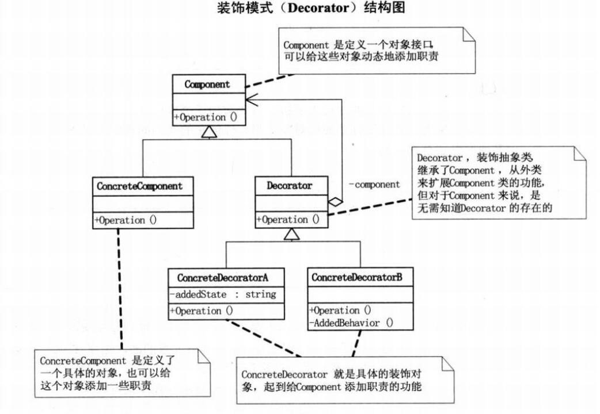
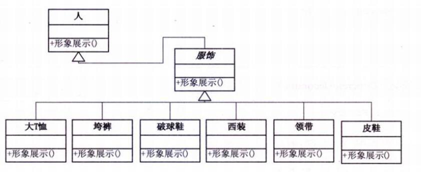
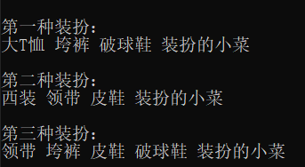

> ---
>
> Title：《设计模式-装饰模式》
>
> Author：Pleione_Plus
>
> StartedDate：September 28th. 2019.
>
> FinishedDate：September 29th. 2019.
>
> ------

# 定义理解

​		装饰模式，动态地给一个对象添加一些额外的职责，就添加功能来说，装饰模式比生成子类更为灵活。


# 角色与职责

- **抽象组件(Component)**：

  ​        定义一个对象接口，可以给这些对象动态地添加职责。

- **具体组件(ConcreteComponent)**：

  ​        定义一个实现组件接口的对象。这是实际需要加以装饰的对象，但其对装饰的过程一无所知。

- **装饰器(Decorator)**：

  ​        维护对组件对象的引用，并定义了与组件对象形式一致的接口。

- **具体装饰器(ConcreteDecorator)**：

  ​        实际上由其负责为抽象组件添加功能。它是从装饰器继承的类，并通过以新的公共方法的形式来添加一些额外的特定功能。


# 实现步骤

1. 创建原始的抽象组件和装饰器之间的继承关系；
2. 在装饰器类中，将抽象组件作为一个字段添加；
3. 将抽象组件传递到装饰器的构造函数中，并初始化抽象组件对象；
4. 在装饰器类中，重定向所有抽象组件的方法到抽象组件对象；
5. 在具体装饰器类中，重写所有抽象组件中需要扩展或修改的方法。



# 代码示例

**结构图**：



**ConcreteComponent角色**：

```csharp
	#region Person类(ConcreteComponent)
    class Person
    {
        public Person()
        { }

        private string name;
        public Person(string name)
        {
            this.name = name;
        }

        public virtual void Show()
        {
            Console.WriteLine("装扮的{0}", name);
        }
    }
    #endregion
```

**Decorator角色**：

```csharp
	#region 服饰类(Decorator)
    class Finery : Person
    {
        protected Person component;

        //打扮
        public void Decorate(Person component)
        {
            this.component = component;
        }

        public override void Show()
        {
            //调用的是父类中的方法
            if (component != null)
            {
                component.Show();
            }
        }
    }
    #endregion
```

**ConcreteDecorator角色**：

```csharp
	#region 具体服饰类(ConcreteDecorator)
    class TShirts : Finery
    {
        public override void Show()
        {
            Console.Write("大T恤 ");
            base.Show();
        }
    }

    class BigTrouser : Finery
    {
        public override void Show()
        {
            Console.Write("垮裤 ");
            base.Show();
        }
    }

    class Sneakers : Finery
    {
        public override void Show()
        {
            Console.Write("破球鞋 ");
            base.Show();
        }
    }

    class Suit : Finery
    {
        public override void Show()
        {
            Console.Write("西装 ");
            base.Show();
        }
    }

    class Tie : Finery
    {
        public override void Show()
        {
            Console.Write("领带 ");
            base.Show();
        }
    }

    class LeatherShoes : Finery
    {
        public override void Show()
        {
            Console.Write("皮鞋 ");
            base.Show();
        }
    }
	#endregion
```

**测试类**：

```csharp
	class Program
    {
        static void Main(string[] args)
        {
            Person xc = new Person("小菜");

            Console.WriteLine("\n第一种装扮：");

            Sneakers pqx = new Sneakers();
            BigTrouser kk = new BigTrouser();
            TShirts dtx = new TShirts();

            //装饰过程          ---里氏替换原则
            pqx.Decorate(xc);                   //破球鞋装扮
            kk.Decorate(pqx);                   //跨库装扮
            dtx.Decorate(kk);                   //大T衫装扮
            dtx.Show();                         //回调方法直至最底层

            Console.WriteLine("\n第二种装扮：");

            LeatherShoes px = new LeatherShoes();           
            Tie ld = new Tie();                            
            Suit xz = new Suit();                          

            //装饰过程
            px.Decorate(xc);                        //皮鞋装扮 
            ld.Decorate(px);                        //领带装扮
            xz.Decorate(ld);                         //西装装扮
            xz.Show();

            Console.WriteLine("\n第三种装扮：");
            Sneakers pqx2 = new Sneakers();
            LeatherShoes px2 = new LeatherShoes();
            BigTrouser kk2 = new BigTrouser();
            Tie ld2 = new Tie();

            //装饰过程
            pqx2.Decorate(xc);
            px2.Decorate(pqx);
            kk2.Decorate(px2);
            ld2.Decorate(kk2);

            ld2.Show();

            Console.Read();
        }
	}
```

**结果展示**：




# 优缺点

**优点**：

- 扩展对象功能，比继承灵活，不会导致类个数的急剧增加
- 可以对一个对象进行多次装饰，创造出不同行为的组合，得到功能更加强大的对象。
- 具体构建类和具体装饰类可以独立变化，用户可以根据需要自己增加新的具体构建子类和具体装饰子类。

**缺点**：

- 产生很多小对象。大量小对象占据内存，一定程度上影响性能。
- 装饰模式容易出错，调试排查比较麻烦。


# 使用场景

1. IO中输入流和输出流的设计
2. Swing包中图形界面的构件功能
3. Servlet API中提供了一个request对象的Decorator设计模式的默认实现类HttpServletRequestWrapper, HttpServletRequestWrapper类，增强了request对象的功能。
4. Struts2 中，request，response，session对象的处理


# 附录

## 参考资料

- 《大话设计模式》
- 《设计模式精解及面试攻略》

## 完整测试代码

```csharp
using System;

namespace 装饰模式
{
    class Program
    {
        static void Main(string[] args)
        {
            Person xc = new Person("小菜");

            Console.WriteLine("\n第一种装扮：");

            Sneakers pqx = new Sneakers();
            BigTrouser kk = new BigTrouser();
            TShirts dtx = new TShirts();

            //装饰过程          ---里氏替换原则
            pqx.Decorate(xc);                   //破球鞋装扮
            kk.Decorate(pqx);                   //跨库装扮
            dtx.Decorate(kk);                   //大T衫装扮
            dtx.Show();                         //回调方法直至最底层

            Console.WriteLine("\n第二种装扮：");

            LeatherShoes px = new LeatherShoes();           
            Tie ld = new Tie();                            
            Suit xz = new Suit();                          

            //装饰过程
            px.Decorate(xc);                        //皮鞋装扮 
            ld.Decorate(px);                        //领带装扮
            xz.Decorate(ld);                         //西装装扮
            xz.Show();

            Console.WriteLine("\n第三种装扮：");
            Sneakers pqx2 = new Sneakers();
            LeatherShoes px2 = new LeatherShoes();
            BigTrouser kk2 = new BigTrouser();
            Tie ld2 = new Tie();

            //装饰过程
            pqx2.Decorate(xc);
            px2.Decorate(pqx);
            kk2.Decorate(px2);
            ld2.Decorate(kk2);

            ld2.Show();

            Console.Read();
        }
    }

    #region Person类(ConcreteComponent)
    class Person
    {
        public Person()
        { }

        private string name;
        public Person(string name)
        {
            this.name = name;
        }

        public virtual void Show()
        {
            Console.WriteLine("装扮的{0}", name);
        }
    }
    #endregion
   
    #region 服饰类(Decorator)
    class Finery : Person
    {
        protected Person component;

        //打扮
        public void Decorate(Person component)
        {
            this.component = component;
        }

        public override void Show()
        {
            //调用的是父类中的方法
            if (component != null)
            {
                component.Show();
            }
        }
    }
    #endregion
    
    #region 具体服饰类(ConcreteDecorator)
    class TShirts : Finery
    {
        public override void Show()
        {
            Console.Write("大T恤 ");
            base.Show();
        }
    }

    class BigTrouser : Finery
    {
        public override void Show()
        {
            Console.Write("垮裤 ");
            base.Show();
        }
    }

    class Sneakers : Finery
    {
        public override void Show()
        {
            Console.Write("破球鞋 ");
            base.Show();
        }
    }

    class Suit : Finery
    {
        public override void Show()
        {
            Console.Write("西装 ");
            base.Show();
        }
    }

    class Tie : Finery
    {
        public override void Show()
        {
            Console.Write("领带 ");
            base.Show();
        }
    }

    class LeatherShoes : Finery
    {
        public override void Show()
        {
            Console.Write("皮鞋 ");
            base.Show();
        }
    }
	#endregion
}
```

## 装饰模式-基本代码

**抽象组件对象**

```csharp
	//对象的接口
    //可以为对象动态添加职责
    abstract class Component
    {
        public abstract void Operation();
    }
```

**具体组件对象**

```csharp
	//定义一个具体的对象
    //可以为该对象添加一些职责
    class ConcreteComponent : Component
    {
        public override void Operation()
        {
            Console.WriteLine("具体对象的操作");
        }
    }
```

**装饰器对象**

```csharp
	//装饰抽象类
    //从外部扩展Component类对象的功能
    abstract class Decorator : Component
    {
        protected Component component;

        public void SetComponent(Component component)
        {
            this.component = component;
        }

        public override void Operation()
        {
            if (component != null)
            {
                component.Operation();
            }
        }
    }
```

**具体装饰器对象**

```csharp
	//具体的装饰对象
    //为Component添加职责的功能
    class ConcreteDecoratorA : Decorator
    {
        private string addedState;

        public override void Operation()
        {
            base.Operation();
            addedState = "New State";
            Console.WriteLine("具体装饰对象A的操作");
        }
    }

    //具体的装饰对象
    //为Component添加职责的功能
    class ConcreteDecoratorB : Decorator
    {

        public override void Operation()
        {
            base.Operation();
            AddedBehavior();
            Console.WriteLine("具体装饰对象B的操作");
        }

        private void AddedBehavior()
        {

        }
    }
```

**测试类**：

```csharp
	class Program
    {
        static void Main(string[] args)
        {
            ConcreteComponent c = new ConcreteComponent();
            ConcreteDecoratorA d1 = new ConcreteDecoratorA();
            ConcreteDecoratorB d2 = new ConcreteDecoratorB();

            d1.SetComponent(c);
            d2.SetComponent(d1);

            d2.Operation();

            Console.Read();
        }
    }
```

