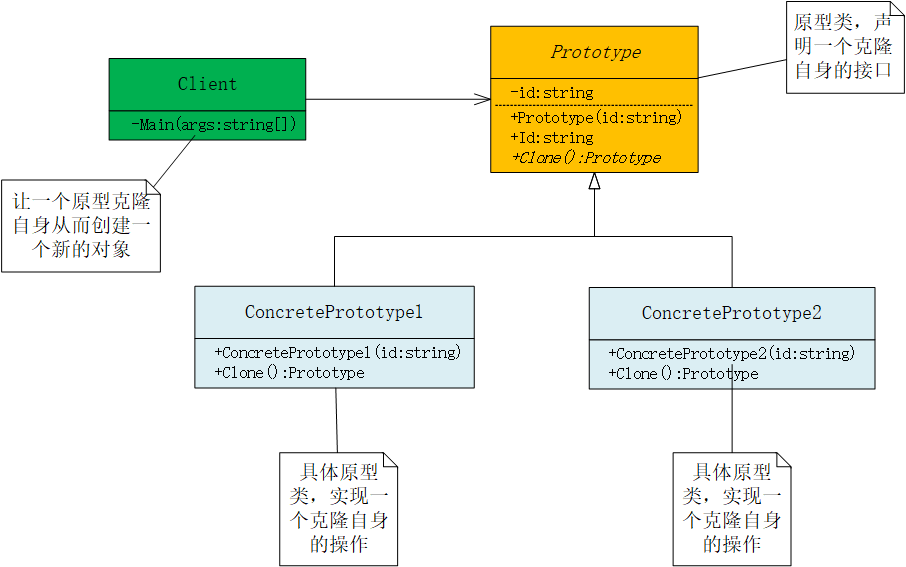
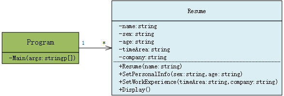
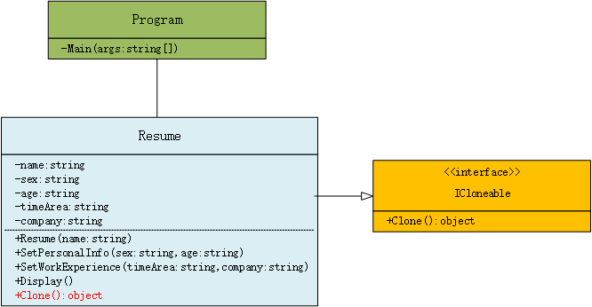
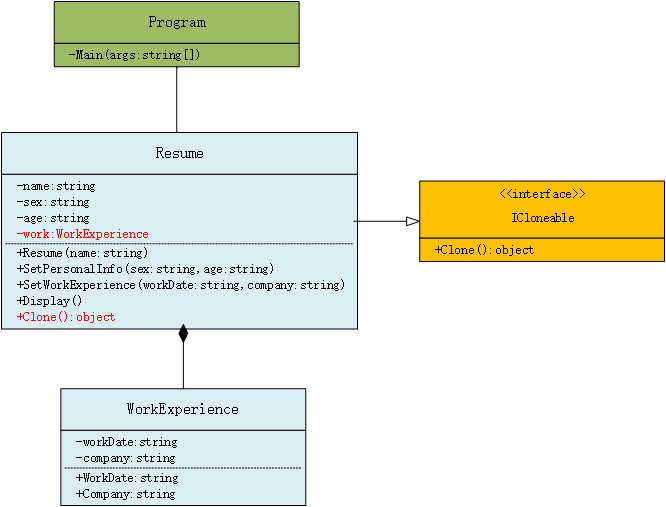
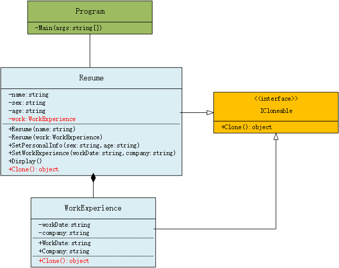

> ---
>
> Title：《设计模式-原型模式》
>
> Author：Pleione_Plus
>
> StartedDate：Nov. 20th. 2019.
>
> FinishedDate：Nov. 20th. 2019.
>
> ------

# 定义理解

​		原型模式(Prototype)是一种创建型设计模式，用原型实例指定创建对象的种类，并且通过拷贝这些原型创建新的对象。

​		<font color="blue">原型模式其实就是从一个对象再创建一个可定制的对象，而且不需知道任何创建的细节。</font>


# 角色与职责

- **客户端(Client)**：通过调用原型类的克隆操作创建一个新对象。
- **原型类(Prototype)**：声明一个接口用于克隆自己。
- **具体原型类(ConcretePrototype)**：实现克隆自己的操作。



# 实现步骤

1. 创建一个原型类，并定义一个克隆自己的接口(或抽象方法)
2. 实现一个具体原型类，在类体中实现原型类中克隆自己的操作
3. 在客户端调用具体原型类的Clone()方法完成对象的克隆操作


# 代码示例

Prototype抽象原型类：

```csharp
/// <summary>
/// 抽象原型类
/// </summary>
abstract class Prototype
{
    private string id;

    // Constructor 
    public Prototype(string id)
    {
         this.id = id;
    }

    // Property 
    public string Id
    {
         get { return id; }
    }

     /// <summary>
     /// 提供的克隆接口
     /// </summary>
     /// <returns>返回值类型是原型类类型</returns>
     public abstract Prototype Clone();
    }
```

ConcretePrototype1具体原型类：

```csharp
/// <summary>
/// 具体原型类
/// </summary>
class ConcretePrototype1 : Prototype
{
    // Constructor 
    public ConcretePrototype1(string id)
         : base(id)
    {
    }


     /// <summary>
     /// 实现原型类中的继承而来的虚方法
     /// </summary>
     /// <returns></returns>
     public override Prototype Clone()
     {
         // Shallow copy 
         return (Prototype)this.MemberwiseClone();
     }
}
```

ConcretePrototype2具体原型类：

```csharp
/// <summary>
/// 具体原型类
/// </summary>
class ConcretePrototype2 : Prototype
{
    // Constructor 
    public ConcretePrototype2(string id)
         : base(id)
    {
    }


     /// <summary>
     /// 实现原型类中的继承而来的虚方法
     /// </summary>
     /// <returns></returns>
     public override Prototype Clone()
     {
         // Shallow copy 
         return (Prototype)this.MemberwiseClone();
     }
}
```

Program客户类：

```csharp
/// <summary>
/// 客户端
/// </summary>
class Program
{
   static void Main(string[] args)
   {
       ConcretePrototype1 p1 = new ConcretePrototype1("I");
       ConcretePrototype1 c1 = (ConcretePrototype1)p1.Clone();
       Console.WriteLine("Cloned: {0}", c1.Id);

       ConcretePrototype2 p2 = new ConcretePrototype2("II");
       ConcretePrototype2 c2 = (ConcretePrototype2)p2.Clone();
       Console.WriteLine("Cloned: {0}", c2.Id);

       // Wait for user 
       Console.Read();
    }
}
```

结果展示：

> Cloned：$\mathbf I$
>
> Cloned：$\mathbf I$$\mathbf I$


# 优缺点

**优点**：

- 隐藏对象创建的细节

- 大大提高程序的性能

**缺点：**

- 使用时较复杂，需要区分**浅复制**和**深复制**


注：

- 浅复制与深复制：

  - **浅复制**只将类中的值类型进行复制，不会对引用类型进行复制，所有对象的引用类型指向最后一个对象对引用类型的赋值。

  - **深复制**可以将类中的引用类型也完成复制。


# 使用场景

​		创建的对象十分耗费空间资源，就创建一个相似的对象，在需要时对其进行克隆操作来创建一个新的对象。


## 投简历引发的思考

​		对于一个普通的应届毕业生来说多投简历可能就意味着有更多被选择的机会，但简历也不能千篇一律，投不同公司或职位都用同一个简历，最好对应不同的职位设计不同的简历。<font color="red">以此为需求编程实现简历复印的功能</font>。

### 普通实现

**程序类图：**



**代码实现：**

```csharp
using System;

namespace 原型模式
{
    class Program
    {
        static void Main(string[] args)
        {
            Resume a = new Resume("小王");
            a.SetPersonalInfo("男", "29");
            a.SetWorkExperience("2010-2019", "XX公司");

            Resume b = new Resume("小王");
            b.SetPersonalInfo("男", "29");
            b.SetWorkExperience("2010-2019", "XX公司");

            Resume c = new Resume("小王");
            c.SetPersonalInfo("男", "29");
            c.SetWorkExperience("2010-2019", "XX公司");

            a.Display();
            b.Display();
            c.Display();

            Console.Read();
        }
    }

    //简历
    class Resume
    {
        private string name;
        private string sex;
        private string age;
        private string timeArea;
        private string company;

        public Resume(string name)
        {
            this.name = name;
        }

        //设置个人信息
        public void SetPersonalInfo(string sex, string age)
        {
            this.sex = sex;
            this.age = age;
        }

        //设置工作经历
        public void SetWorkExperience(string timeArea, string company)
        {
            this.timeArea = timeArea;
            this.company = company;
        }

        //显示
        public void Display()
        {
            Console.WriteLine("{0} {1} {2}", name, sex, age);
            Console.WriteLine("工作经历：{0} {1}", timeArea, company);
        }
    }

}

```

**结果展示：**

> 小王 男 29
> 工作经历：2010-2019 XX公司
> 小王 男 29
> 工作经历：2010-2019 XX公司
> 小王 男 29
> 工作经历：2010-2019 XX公司

​		使用这个方式进行简历复制时会产生三个Resume对象，而且这三个对象存储的字面值完全相同，下面代码也能产生一致的效果但是占用的存储空间仅为上述代码实现的三分之一。

```csharp
	class Program
    {
        static void Main(string[] args)
        {
            Resume a = new Resume("小王");
            a.SetPersonalInfo("男", "29");
            a.SetWorkExperience("2010-2019", "XX公司");

            Resume b = a

            Resume c = a

            a.Display();
            b.Display();
            c.Display();

            Console.Read();
        }
    }
```

​		上述两种代码都实现了简历复制的需求，但就占用存储空间来说的话，第二种实现更加节省空间。而就其扩展性来说，两种实现都没有满足很好的扩展，如：<font color="red">要投递不同职位的简历时，毕业生的基本信息是不会发生变化的，但是各个简历所侧重的工作经历是不同的。</font>要实现这样的需求，对于上面的实现就需要修改代码才能实现。而原型模式则可以在原有对象的基础上进行拷贝得到一个新的对象（<font color="blue">在这个可修改新对象的信息</font>）。

### 原型实现

**程序类图：**



**代码实现：**

```csharp
using System;

namespace 原型模式
{
    class Program
    {
        static void Main(string[] args)
        {
            Resume a = new Resume("小王");
            a.SetPersonalInfo("男", "29");
            a.SetWorkExperience("2010-2014", "XX公司");

            Resume b = (Resume)a.Clone();
            b.SetWorkExperience("2015-2018", "YY企业");

            Resume c = (Resume)a.Clone();
            c.SetPersonalInfo("男", "24");

            a.Display();
            b.Display();
            c.Display();

            Console.Read();
        }
    }

    //简历
    class Resume : ICloneable
    {
        private string name;
        private string sex;
        private string age;
        private string timeArea;
        private string company;

        public Resume(string name)
        {
            this.name = name;
        }

        //设置个人信息
        public void SetPersonalInfo(string sex, string age)
        {
            this.sex = sex;
            this.age = age;
        }
        //设置工作经历
        public void SetWorkExperience(string timeArea, string company)
        {
            this.timeArea = timeArea;
            this.company = company;
        }

        //显示
        public void Display()
        {
            Console.WriteLine("{0} {1} {2}", name, sex, age);
            Console.WriteLine("工作经历：{0} {1}", timeArea, company);
        }

        // 实现接口中的方法
        public Object Clone()
        {
            return (Object)this.MemberwiseClone();
        }
    }
}

```

**结果展示：**

> 小王 男 29
> 工作经历：2010-2014 XX公司
> 小王 男 29
> 工作经历：2015-2018 YY企业
> 小王 男 24
> 工作经历：2010-2014 XX公司

​		上述代码实现了一个人不同工作经历的拷贝，同时也可以对人员的信息进行修改（方便拷贝一波，大家懂的😜）。但上述情况中存在一个问题，原型中字段全部为值类型。<font color="red">MemberwiseClone方法对值类型的字段执行逐位复制，对引用类型字段进行引用复制，也即浅复制。</font>下面的实现方式可能帮助您更好的理解。

### 浅复制实现

**程序类图：**



**代码实现：**

```csharp
using System;

namespace 原型模式
{
    class Program
    {
        static void Main(string[] args)
        {
            Resume a = new Resume("小王");
            a.SetPersonalInfo("男", "29");
            a.SetWorkExperience("2010-2014", "XX公司");

            Resume b = (Resume)a.Clone();
            b.SetWorkExperience("2015-2018", "YY企业");

            Resume c = (Resume)a.Clone();
            c.SetPersonalInfo("男", "24");
            c.SetWorkExperience("1998-2003", "ZZ企业");

            a.Display();
            b.Display();
            c.Display();

            Console.Read();
        }
    }

    //简历            --真实原型类
    class Resume : ICloneable               //直接实现系统提供的ICloneable接口
    {
        private string name;
        private string sex;
        private string age;

        private WorkExperience work;//引用类型

        public Resume(string name)
        {
            this.name = name;
            work = new WorkExperience();
        }

        //设置个人信息
        public void SetPersonalInfo(string sex, string age)
        {
            this.sex = sex;
            this.age = age;
        }
        //设置工作经历
        public void SetWorkExperience(string workDate, string company)
        {
            work.WorkDate = workDate;
            work.Company = company;
        }

        //显示
        public void Display()
        {
            Console.WriteLine("{0} {1} {2}", name, sex, age);
            Console.WriteLine("工作经历：{0} {1}", work.WorkDate, work.Company);
        }

        public Object Clone()
        {
            return (Object)this.MemberwiseClone();
        }

    }

    //工作经历
    class WorkExperience
    {
        private string workDate;
        public string WorkDate
        {
            get { return workDate; }
            set { workDate = value; }
        }
        private string company;
        public string Company
        {
            get { return company; }
            set { company = value; }
        }
    }
}
```

**结果展示：**

> 小王 男 29
> 工作经历：1998-2003 ZZ企业
> 小王 男 29
> 工作经历：1998-2003 ZZ企业
> 小王 男 24
> 工作经历：1998-2003 ZZ企业

​		三个简历输出工作经历是最后一次修改的结果，显然不是我们想要得到的效果。<font color="red">原因：三个Resume对象的work字段都指向最初实例化WorkExperience对象的地址，任何一次修改都会影响到其他两个对象中的work字段</font>。

### 深复制实现

**程序类图：**



**代码实现：**

```csharp
using System;

namespace 原型模式
{
    class Program
    {
        static void Main(string[] args)
        {
            Resume a = new Resume("大鸟");
            a.SetPersonalInfo("男", "29");
            a.SetWorkExperience("1998-2000", "XX公司");

            Resume b = (Resume)a.Clone();
            b.SetWorkExperience("1998-2006", "YY企业");

            Resume c = (Resume)a.Clone();
            c.SetWorkExperience("1998-2003", "ZZ企业");

            a.Display();
            b.Display();
            c.Display();

            Console.Read();
        }
    }

    //简历
    class Resume : ICloneable
    {
        private string name;
        private string sex;
        private string age;

        private WorkExperience work;

        public Resume(string name)
        {
            this.name = name;
            work = new WorkExperience();
        }

        /// <summary>
        /// 对应用的克隆
        /// </summary>
        /// <param name="work"></param>
        private Resume(WorkExperience work)
        {
            this.work = (WorkExperience)work.Clone();
        }

        //设置个人信息
        public void SetPersonalInfo(string sex, string age)
        {
            this.sex = sex;
            this.age = age;
        }
        //设置工作经历
        public void SetWorkExperience(string workDate, string company)
        {
            work.WorkDate = workDate;
            work.Company = company;
        }

        //显示
        public void Display()
        {
            Console.WriteLine("{0} {1} {2}", name, sex, age);
            Console.WriteLine("工作经历：{0} {1}", work.WorkDate, work.Company);
        }

        public Object Clone()
        {
            //使用Resume的构造函数完成对引用对象的克隆
            Resume obj = new Resume(this.work);

            obj.name = this.name;
            obj.sex = this.sex;
            obj.age = this.age;


            return obj;
        }
    }

    //工作经历
    class WorkExperience : ICloneable
    {
        private string workDate;
        public string WorkDate
        {
            get { return workDate; }
            set { workDate = value; }
        }
        private string company;
        public string Company
        {
            get { return company; }
            set { company = value; }
        }

        public Object Clone()
        {
            return (Object)this.MemberwiseClone();
        }
    }
}
```

**结果展示：**

> 小王 男 29
> 工作经历：2010-2014 XX公司
> 小王 男 29
> 工作经历：2015-2018 YY企业
> 小王 男 24
> 工作经历：1998-2003 ZZ企业

# 附录

## 参考资料

- 《大话设计模式》
- 《设计模式精解及面试攻略》