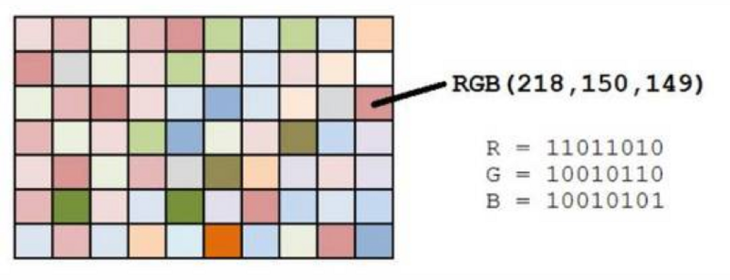
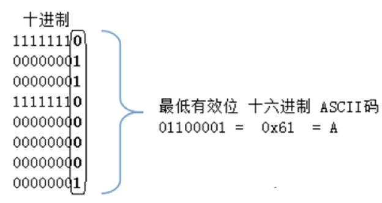
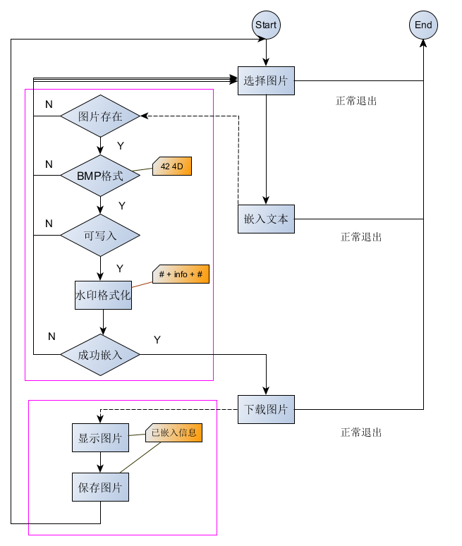
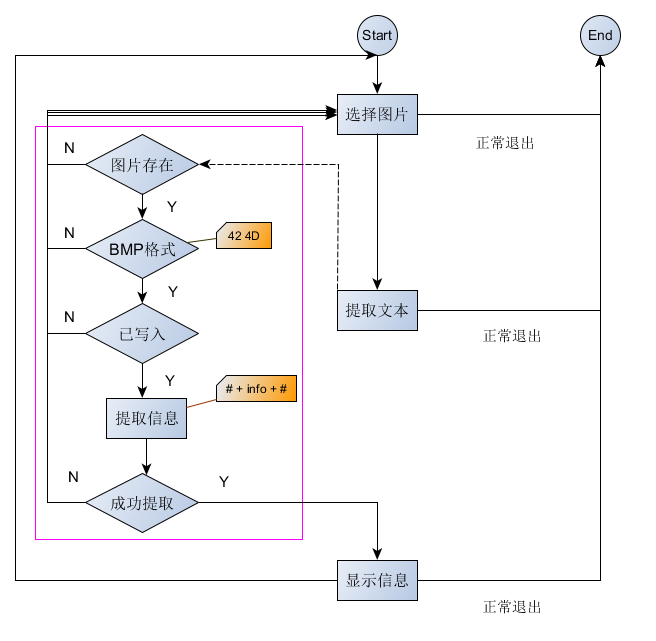
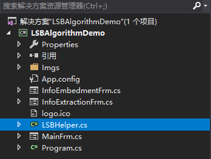
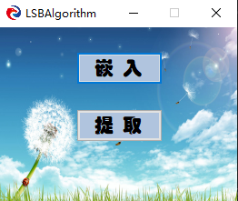
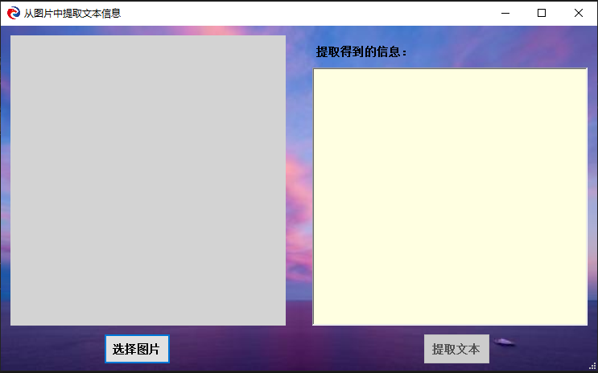
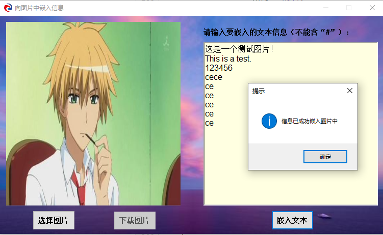
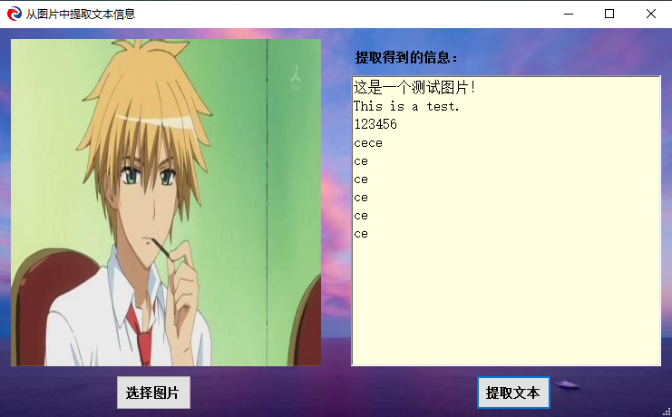

> ---
>
> Title:《LSB算法分析及实现》
>
> Author: Pleione_Plus
>
> Started Date: Oct. 10th. 2019.
>
> Finished Date: Oct. 11th. 2019.
>
> ---

# 数字水印

​		数字水印（Digital Watermark）是一种应用**计算机算法**嵌入载体文件的**保护信息**，数字水印技术是一种基于内容的、非密码机制的计算机信息隐藏技术，它是将一些标识信息（即数字水印）**直接嵌入数字载体**当中（包括多媒体、文档、软件等）或是**间接表示**（修改特定区域的结构），且不影响原载体的使用价值，也不容易被探知和再次修改，但可以被生产方识别和辨认。

​		常用的数字水印有很多种，LSB是其中一种简单的隐写算法。


# LSB简介

​		LSB全称为 Least Significant Bit（最低有效位），是一种常被用做图片隐写的算法（在CTF中经常见到她的身影）。LSB属于空域算法中的一种，是将信息嵌入到图像点中像素位的最低位，以保证嵌入的信息是不可见的，但是由于使用了图像不重要的像素位，算法的鲁棒性差，水印信息很容易为滤波、图像量化、几何变形的操作破坏。


# 算法分析

​		PNG和BMP图片中的图像像素一般是有由RGB三原色组成（如图1所示），每一种颜色占用8位，取值范围为0x00~0xFF，既有$2^{24}$种色值。而人类的眼睛可以区分约1000万种不同的颜色，这就意味着人类眼睛无法区分的颜色还有600多万。



<center>图1</center>
当仅仅更改颜色分量的最低位时，人类的眼睛不能区分这前后的变化，LSB就是在该位置存放信息。如图2所示。




# 实现步骤

1. 将图像文件中的所有像素点以**RGB**形式分隔开，并将各个**颜色分量**转换成**二进制**表示
2. 把每个颜色分量值的**最后一位全部设置成0**，对图像得影响非常细微，不会影响图像的显示格式
3. 信息嵌入：将水印字符转化为二进制字符串，并将这些信息**依次填入颜色分量的最低位上**，即可完成信息的嵌入
4. 信息提取：将图像像素的**最低位依次提取**出来，并进行拼接，即可得到原始信息


# 程序设计

**嵌入信息框图**：



**提取信息框图**：



**文档结构**：



**程序主界面**：



**主界面代码**:

```C#
using System;
using System.Windows.Forms;

namespace LSBAlgorithmDemo
{
    public partial class MainFrm : Form
    {
        #region 定义全局变量
        Form frm;
        #endregion

        #region 构造函数
        public MainFrm()
        {
            InitializeComponent();
        }
        #endregion

        #region 嵌入按钮得Click事件
        private void btnEnbed_Click(object sender, EventArgs e)
        {
            frm = new InfoEmbedmentFrm();
            this.Hide();
            if(frm.ShowDialog() == DialogResult.Cancel)
            {
                this.Show();
            }
            else
            {
                Application.Exit();
            }
        }
        #endregion

        #region 提取按钮的Click事件
        private void btnExtract_Click(object sender, EventArgs e)
        {
            frm = new InfoExtractionFrm();
            this.Hide();
            if (frm.ShowDialog() == DialogResult.Cancel)
            {
                this.Show();
            }
            else
            {
                Application.Exit();
            }
        }
        #endregion
    }
}
```


**嵌入界面**：


**嵌入界面代码**：

```C#
using System;
using System.Drawing;
using System.IO;
using System.Windows.Forms;

namespace LSBAlgorithmDemo
{
    public partial class InfoEmbedmentFrm : Form
    {
        #region 定义全局变量
        private string fileName;
        private LSBHelper lsb;
        private string msg = null;
        private MemoryStream memStream = null;
        #endregion

        #region 构造函数
        public InfoEmbedmentFrm()
        {
            InitializeComponent();
            // 初始化界面
            Form_Init(0);
        }
        #endregion

        #region 设置显示界面
        /// <summary>
        /// 设置显示界面
        /// </summary>
        /// <param name="flag">0:初始化、下载之后;1:图片加载之后;2:图片嵌入之后
        /// </param>
        private void Form_Init(int flag)
        {
            if(flag == 0)//初始化、下载之后
            {
                // 设置界面显示的起始位置
                this.StartPosition = FormStartPosition.CenterScreen;

                // PictureBox控件
                pBoxDisplay.SizeMode = PictureBoxSizeMode.StretchImage;
                // 两个必须都要设置（因两次的加载途径不一样）
                pBoxDisplay.ImageLocation = null;
                pBoxDisplay.Image = null;

                // RichTextBox控件
                rtbInfo.Clear();
                rtbInfo.ReadOnly = true;

                // Button控件
                btnDownloadImage.Enabled = false;
                btnEmbedInfo.Enabled = false;
                btnLoadImage.Enabled = true;
                btnLoadImage.Focus();
            }
            else if(flag == 1)//图片加载之后
            {
                // RichTextBox控件
                rtbInfo.Clear();
                rtbInfo.ReadOnly = false;
                rtbInfo.Focus();

                // Button控件
                btnDownloadImage.Enabled = false;
                btnEmbedInfo.Enabled = true;
                btnLoadImage.Enabled = true;
            }
            else if(flag == 2)//图片嵌入之后
            {
                // Button控件
                btnDownloadImage.Enabled = true;
                btnEmbedInfo.Enabled = true;
                btnLoadImage.Enabled = true;
                btnDownloadImage.Focus();
            }
        }
        #endregion

        #region 加载图片的事件
        private void btnLoadImage_Click(object sender, EventArgs e)
        {
            // 再次单击加载图片按钮时，回到初始化状态
            Form_Init(0);

            // 设置打开对话框的标题
            openImageDialog.Title = "请选择一张位图";
            // 对文件格式进行筛选
            openImageDialog.Filter = "bmp | *.bmp;*.BMP";
            // 默认设置为空
            openImageDialog.FileName = "";

            if (openImageDialog.ShowDialog() == DialogResult.OK)
            {
                // 存储打开文件的全文件名
                fileName = openImageDialog.FileName;
                // 设置显示图片的样式
                pBoxDisplay.SizeMode = PictureBoxSizeMode.StretchImage;
                // 加载要显示的图片
                pBoxDisplay.ImageLocation = fileName;

                // 设置显示界面
                Form_Init(1);
            }
        }
        #endregion

        #region 嵌入文本的事件
        private void btnEmbedInfo_Click(object sender, EventArgs e)
        {
            // 已经在界面设置中代替
            if (string.IsNullOrWhiteSpace(fileName))
            {
                MessageBox.Show("请选择一张位图", "提示", MessageBoxButtons.OK, MessageBoxIcon.Information);
            }
            else if (string.IsNullOrWhiteSpace(rtbInfo.Text))
            {
                MessageBox.Show("请输入要嵌入的文本信息", "提示", MessageBoxButtons.OK, MessageBoxIcon.Information);
            }
            else
            {
                lsb = new LSBHelper();
                if (lsb.EmbedInfo(fileName, rtbInfo.Text, out msg, out memStream))
                {
                    pBoxDisplay.ImageLocation = null;
                    //pBoxDisplay.ImageLocation = "C:\\Users\\ss\\Desktop\\664204.bmp";

                    pBoxDisplay.Image = Image.FromStream(memStream);

                    MessageBox.Show(msg, "提示", MessageBoxButtons.OK, MessageBoxIcon.Information);

                    // 设置显示界面
                    Form_Init(2);
                }
                else
                {
                    MessageBox.Show(msg, "提示", MessageBoxButtons.OK, MessageBoxIcon.Error);
                }
            }
        }
        #endregion

        #region 下载图片按钮触发的事件
        private void btnDownloadImage_Click(object sender, EventArgs e)
        {
            if (memStream != null)
            {
                saveImageDialog.Filter = "位图（*.bmp）|*.bmp";
                if (saveImageDialog.ShowDialog() == DialogResult.OK)
                {
                    FileStream fs = null;
                    BinaryWriter bw = null;
                    try
                    {
                        fs = new FileStream(saveImageDialog.FileName, FileMode.Create, FileAccess.Write);
                        bw = new BinaryWriter(fs);

                        // 指针回位（每次操作之前都要先操作一下）
                        memStream.Position = 0;
                        while (memStream.Position != memStream.Length)
                        {
                            // ReadByte()强制转换成Int32类型
                            byte write = Convert.ToByte(memStream.ReadByte());
                            bw.Write(write);
                        }
                        MessageBox.Show("图片下载成功", "提示", MessageBoxButtons.OK, MessageBoxIcon.Information);

                        //设置显示界面
                        Form_Init(0);
                    }
                    catch (Exception ex)
                    {
                        MessageBox.Show(ex.Message, "提示", MessageBoxButtons.OK, MessageBoxIcon.Information);
                    }
                    finally
                    {
                        fs.Close();
                        bw.Close();
                    }
                }
            }
        }
        #endregion

    }
}
```


**提取界面**：



**提取界面代码**：

```C#
using System;
using System.IO;
using System.Windows.Forms;

namespace LSBAlgorithmDemo
{
    public partial class InfoExtractionFrm : Form
    {
        #region 定义全局变量
        private string fileName;
        private MemoryStream memorystream = null;
        private string info = null;
        private string msg = null;
        #endregion

        #region 构造函数
        public InfoExtractionFrm()
        {
            InitializeComponent();
            // 初始化展示界面
            Form_Init(0);
        }
        #endregion

        #region 界面设置操作
        /// <summary>
        /// 界面设置操作
        /// </summary>
        /// <param name="flag">
        /// 0:初始化
        /// 1:提取之后
        /// </param>
        private void Form_Init(int flag)
        {
            if(flag == 0)
            {
                // 设置界面显示位置
                this.StartPosition = FormStartPosition.CenterScreen;

                // 设置PictureBox控件
                pBoxDisplay.SizeMode = PictureBoxSizeMode.StretchImage;
                pBoxDisplay.ImageLocation = null;

                // 设置RichTextBox控件
                rtbInfo.Clear();
                rtbInfo.ReadOnly = true;

                // 设置Button控件
                btnLoadImage.Enabled = true;
                btnExtractInfo.Enabled = false;
            }
            else if(flag == 1)
            {
                // 设置RichTextBox控件
                rtbInfo.Clear();

                // 设置Button控件
                btnLoadImage.Enabled = true;
                btnExtractInfo.Enabled = true;
            }
            
        }
        #endregion

        #region 加载图片
        private void btnLoadImage_Click(object sender, EventArgs e)
        {
            Form_Init(0);
            // 设置打开对话框的标题
            openImageDialog.Title = "请选择一张已嵌入信息的位图";
            // 对文件格式进行筛选
            openImageDialog.Filter = "bmp | *.bmp;*.BMP";
            openImageDialog.FileName = "";

            if (openImageDialog.ShowDialog() == DialogResult.OK)
            {
                // 存储打开文件的全文件名
                fileName = openImageDialog.FileName;
                // 设置显示图片的样式
                pBoxDisplay.SizeMode = PictureBoxSizeMode.StretchImage;
                // 加载要显示的图片
                pBoxDisplay.ImageLocation = fileName;

                Form_Init(1);
            }
        }
        #endregion

        #region 提取信息
        private void btnExtractInfo_Click(object sender, EventArgs e)
        {
            // 图片是否加载
            if (string.IsNullOrWhiteSpace(fileName))
            {
                MessageBox.Show("请选嵌入文字的位图", "提示", MessageBoxButtons.OK, MessageBoxIcon.Information);
                return;
            }
            else
            {
                try
                {
                    LSBHelper lsb = new LSBHelper();

                    // 将图像存入内存流中
                    using (FileStream fileReadStream = new FileStream(fileName, FileMode.Open, FileAccess.Read))
                    {
                        using (BinaryReader br = new BinaryReader(fileReadStream))
                        {
                            byte write;
                            memorystream = new MemoryStream();
                            for (int i = 1; i <= fileReadStream.Length; i++)
                            {
                                write = br.ReadByte();
                                memorystream.WriteByte(write);
                            }
                            // 回位操作
                            memorystream.Position = 0;
                        }
                    }

                    // 信息提取
                    if (lsb.ExtractInfo(memorystream, out info, out msg))
                    {
                        // 将提取到的信息展示在文本控件中
                        rtbInfo.Text = info;
                    }
                    else
                    {
                        MessageBox.Show(msg, "警告", MessageBoxButtons.OK, MessageBoxIcon.Warning);
                    }
                }
                catch (Exception ex)
                {
                    MessageBox.Show(ex.Message, "警告", MessageBoxButtons.OK, MessageBoxIcon.Warning);
                }
                finally
                {
                    // 释放占用的资源
                    memorystream.Dispose();
                }
            }
        }
        #endregion
    }
}
```


**LSBHelper代码**：

```C#
using System;
using System.IO;

namespace LSBAlgorithmDemo
{
    public class LSBHelper
    {

        #region 定义全局变量
        FileStream fileReadStream = null;
        MemoryStream memStream = null;
        BinaryReader br = null;
        #endregion

        #region 用于判断图片是否为Bitmap格式
        /// <summary>
        /// 用于判断图片是否为Bitmap格式
        /// </summary>
        /// <param name="imgFormat">图片前几个字节</param>
        /// <returns>返回判断结果</returns>
        private bool IsBitmap(byte[] imgFormat)
        {
            // 判断类型表示字节是否为2
            if (imgFormat.Length == 2)
            {
                // 判断标识字节是否为：42 4d
                if (imgFormat[0] == 0x42 && imgFormat[1] == 0x4d)
                {
                    // 是Bitmap
                    return true;
                }
                else
                {
                    return false;
                }
            }
            else
            {
                return false;
            }
        }
        #endregion

        #region 判断文本信息能否写入图片中
        /// <summary>
        /// 判断文本信息能否写入图片中
        /// </summary>
        /// <param name="streamSize">图片流的字节个数</param>
        /// <param name="infoSize">文本信息的字符个数</param>
        /// <returns>返回判断结果</returns>
        private bool CanEmbed(long streamSize, long infoSize)
        {
            if (streamSize < (infoSize * 16 + 54))
            {
                return false;
            }
            else
            {
                return true;
            }
        }
        #endregion

        #region 判断指定文件是否存在
        /// <summary>
        /// 判断指定文件是否存在
        /// </summary>
        /// <param name="fullFileName">文件全名称</param>
        /// <returns>返回判断结果</returns>
        private bool IsFileExists(string fullFileName)
        {
            return File.Exists(fullFileName);
        }
        #endregion

        #region 判断图像中是否写入信息
        private bool IsEmabed(MemoryStream memorystream)
        {
            // 复位
            memorystream.Position = 0;
            memorystream.Seek(54L, 0);

            byte reader;
            char ch;
            int temp = 0;
            int state = 0;
            int index = 0;

            while((index = memorystream.ReadByte()) > 0 && index != memorystream.Length)
            {
                temp = 0;

                for (int k = 0; k < 16; k++)
                {
                    reader = Convert.ToByte(memorystream.ReadByte());
                    temp += (reader & 0x01) << k;
                }
                ch = Convert.ToChar(temp);
                if (ch == '#')
                    state++;
            }

            if (state == 2)
            {
                return true;
            }
            else
            {
                return false;
            }
        }
        #endregion

        #region 将待写入图片的信息转成"# + info + #"的格式并储存在tempChs字符数组中
        /// <summary>
        /// 将待写入图片的信息转成"# + info + #"的格式并储存在tempChs字符数组中
        /// </summary>
        /// <param name="info"></param>
        /// <returns></returns>
        private char[] GetTempChsFromInfo(string info)
        {
            // 将文本信息转成Unicode字符值并存储在char数组中
            char[] infoToChs = new char[info.Length];
            for (int i = 0; i < info.Length; i++)
            {
                infoToChs[i] = Convert.ToChar(info[i]);
            }

            // 将待写入图片的信息转成指定格式并储存在tempChs字符数组中
            char[] tempChs = new char[(info.Length + 2) * 16];
            // 前导符“#”：16位
            for (int n = 0; n < 16; n++)
            {
                tempChs[n] = Convert.ToChar(0x0001 & ('#' >> n));
            }
            // 原主要信息
            int k;
            for (k = 1; k < infoToChs.Length + 1; k++)
            {
                for (int n = 0; n < 16; n++)
                {
                    tempChs[16 * k + n] = Convert.ToChar(0x0001 & infoToChs[k - 1] >> n);
                }
            }
            // 后导符“#”：16位
            for (int n = 0; n < 16; n++)
            {
                tempChs[16 * k + n] = Convert.ToChar(0x0001 & '#' >> n);
            }

            return tempChs;
        }
        #endregion

        #region 向Bitmap中嵌入信息
        public bool EmbedInfo(string fullFileName, string info, out string msg, out MemoryStream memory)
        {
            // 判断指定图片是否存在
            if (!IsFileExists(fullFileName))
            {
                msg = "请确认指定的图片是否存在";
                memory = null;
                return false;
            }

            try
            {
                // 得到图片的字节流读取器
                fileReadStream = new FileStream(fullFileName, FileMode.Open, FileAccess.Read);
                br = new BinaryReader(fileReadStream);

                // 读取图片的标识符
                byte[] imgFormat = new byte[2];
                imgFormat[0] = br.ReadByte();
                imgFormat[1] = br.ReadByte();
                br.BaseStream.Position = 0;

                // 判断指定图片是否为Bitmap格式
                if (!IsBitmap(imgFormat))
                {
                    msg = "请选择Bitmap格式的图片";
                    memory = null;
                    return false;
                }

                // 判断指定图片是否能够写下信息
                if (!CanEmbed(fileReadStream.Length, info.Length))
                {
                    msg = "该图片无法写下指定的全部信息，请选择更大尺寸的Bitmap图片";
                    memory = null;
                    return false;
                }

                // 将待写入图片的信息转成指定格式并储存在tempChs字符数组中
                char[] tempChs = GetTempChsFromInfo(info);

                // 使用LSB算法将整合后的文件流写入内存流中
                memStream = new MemoryStream();
                byte write;
                for (int i = 1, j = 0; i <= fileReadStream.Length; i++)
                {
                    write = br.ReadByte();

                    // 前54字节不能动
                    if (i <= 54)
                    {
                        memStream.WriteByte(write);
                    }
                    else   // 在数据区写入信息
                    {
                        if (j < tempChs.Length)
                        {
                            memStream.WriteByte(Convert.ToByte((write & 0xfe) + tempChs[j]));
                        }
                        else
                        {
                            memStream.WriteByte(write);
                        }
                        j++;
                    }
                }
                memStream.Position = 0;

                msg = "信息已成功嵌入图片中";
                memory = memStream;
                return true;
            }
            catch (Exception ex)
            {
                msg = ex.Message;
                memory = null;
                return false;
            }
            finally
            {
                // 执行完毕之后一定要关闭创建的资源
                fileReadStream.Close();
                //memStream.Close();
                br.Close();
            }
        }
        #endregion

        #region 提取Bitmap中的信息
        public bool ExtractInfo(MemoryStream memorystream, out string info, out string msg)
        {
            #region 读取图片的标识符并判断文件是否为指定类型
            // 读取图片的标识符
            byte[] imgFormat = new byte[2];
            imgFormat[0] = Convert.ToByte(memorystream.ReadByte());
            imgFormat[1] = Convert.ToByte(memorystream.ReadByte());
            memorystream.Position = 0;

            // 判断指定图片是否为Bitmap格式
            if (!IsBitmap(imgFormat))
            {
                info = null;
                msg = "请选择Bitmap格式的图片";
                return false;
            }
            #endregion

            #region 提取信息
            // 回位
            memorystream.Position = 0;
            memorystream.Seek(54L, 0);
            byte reader;
            char ch;
            int temp = 0;
            int state = 0;
            info = "";

            while (Convert.ToChar(temp) != '#' || state != 2)
            {
                temp = 0;

                for (int k = 0; k < 16; k++)
                {
                    reader = Convert.ToByte(memorystream.ReadByte());
                    temp += (reader & 0x01) << k;
                }

                ch = Convert.ToChar(temp);
                if (ch != '#' && state != 1)
                {
                    info = null;
                    msg = "没有嵌入文字信息或者信息已经被破坏";
                    return false;
                }

                if (ch != '#' && state == 1)
                {
                    info += ch.ToString();
                }

                if (ch == '#')
                    state++;
            }
            
            msg = "成功";
            return true;
            #endregion

        }
        #endregion
    }
}
```


**注意点**：

1. 流每次读取一次，位置就向后推进一定的位数，但可以使用Position属性设置开始读取的位置
2. MemoryStream对象的ReadByte()方法将返回的字节强制转换成Int32类型


# 结果展示

**嵌入信息**：



**提取信息**：




# 附录

**参考链接**：

[数字水印](https://mp.weixin.qq.com/s/sgYKbf1VqjF-UvQiIDLzgQ)

[LSB图片隐写](https://segmentfault.com/a/1190000016223897)

[LSB隐写算法](https://blog.csdn.net/qq_28697571/article/details/72353358)