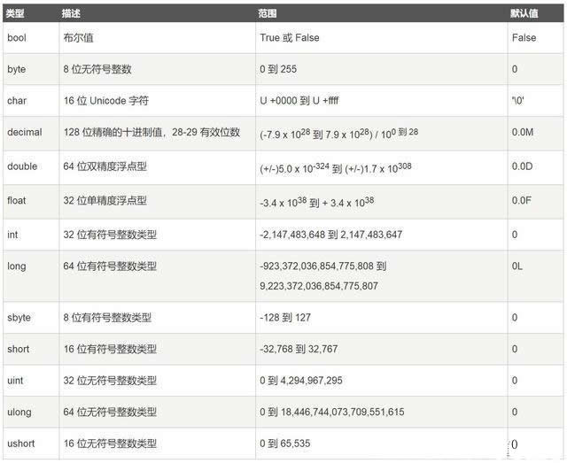

C#基础


# 学习基础

## 编程环境

.net框架与C#的关系：

- .net框架是一个**平台**，**提供**了**应用程序运行所需**要的**环境**。应用程序运行在该平台上
- C#一种完全面向对象的高级编程语言
- C#通过.Net平台来编写、部署、运行.Net应用程序


.Net能干什么：

- 桌面应用程序（WinForm）
- 网站应用程序（ASP.Net 、WebService）
- 专业的游戏开发（XBOX360）
- 嵌入式设备软件开发 （Windows CE）
- 智能手机APP开发（Windows Phone）
- 平板电脑APP开发（Windows 8/10）


.Net核心：

- FCL：框架类库
- CLR：公共语言运行时


**推荐链接**：[通俗易懂，什么是.NET?什么是.NET Framework？什么是.NET Core?](https://www.cnblogs.com/1996V/p/9037603.html) (作者功力深厚)


## 编程工具

### [Visual Studio](https://visualstudio.microsoft.com/zh-hans/downloads/)

- 安装版本：
  - 在线安装：安装需要联网，下载所需组件并完成安装
  - 安装包：无须联网即可完成所需基本组件的安装
- 安装步骤（傻瓜式安装）
  - 做不同开发需要安装与其对应的组件
- 使用技巧
  - 工具窗口（拖动、隐藏等）
  - 快捷键（组合快捷键）
  - 搜索（选项、命令等）
  - 基础设置（字体、常规、启动项等）
- 基本操作
  - 新建项目（控制台程序、桌面应用程序、类库...）
  - 打开项目
  - 新建解决方案
  - 打开解决方案


### Mono

​		[**Mono**](https://www.mono-project.com/download/stable/#download-lin-debian) 是 .NET 框架的一个开源版本，它包含了一个 C# 编译器，且可运行于多种操作系统上，比如各种版本的 Linux 和 Mac OS。Mono 的目的不仅仅是跨平台地运行微软 .NET 应用程序，而且也为 Linux 开发者提供了更好的开发工具。Mono 可运行在多种操作系统上，包括 Android、BSD、iOS、Linux、OS X、Windows、Solaris 和 UNIX。


### .NET Core（文本编辑器）

​		跨平台，软件环境需要手动搭建


**为什么要开发应用程序**：

​		<font color="red">开发应用程序可以为我们解决一些实际的问题。</font>


## C#程序结构

​		C#中的组织结构的关键概念是**程序（program）**、**命名空间（namespace）**、**类型（type）**、**成员（member）**和**程序集（assembly）**。C#程序由一个或多个源文件文件组成。程序中声明类型，类型包含成员，并且可按命名空间进行组织。**类（class）、接口（interface）、枚举（enum）**等就是类型的示例。**字段（field）、方法（method）、属性（attribute）和事件（event）**是成员的示例。在编译C#程序时，它们被物理地打包为程序集。程序集通常具有文件扩展名.exe或.dll，具体取决于它们时实现**应用程序（application）**还是实现库**（library）**。

- 解决方案 $\Rightarrow$ 项目
- 项目包含：源码文件、配置文件、文件夹、图片等


## C#代码结构

```csharp
// 引入命名空间
using System;

// 声明命名空间
namespace Demo
{
    // 声明类
    class Program
    {
        // 声明Main方法（程序出入口）
        static void Main(string[] args)
        {
            Console.WriteLine("Hello word!");
        }
    }
}
```

**C#代码采用分层结构**：

- 第一层：[命名空间](#命名空间)的引入或声明（指示该程序文件所属空间）
- 第二层：类名/接口名/结构体等的声明（对象）
- 第三层：方法/函数/字段/属性/委托/事件等声明或调用（对象的特性和行为）


### C#程序入口点

#### 成为程序入口点的条件

**必要条件**：

- 必须为**静态方法**
- 方法名必须为**Main**

**非必要条件**：

- 方法**返回值**默认为void，也可以返回int
- **参数**默认为args:string[]，也可为空
- **可访问性**默认为private，也可以修改为public

#### 项目中存在多个程序入口点

​		一个项目中若存在多个Main方法，则只能选择其中一个做为程序的入口点。

**代码示例**：

```csharp
using System;

namespace Demo1
{
    class Program
    {
        // 程序入口点
        static void Main(string[] args)
        {
            Console.WriteLine("Hello word!");
        }
    }

    class Test
    {
        // 程序入口点
        public static int Main()
        {
            Console.WriteLine("Test类中的程序入口点");
            return 0;
        }
    }
}
```

- 此时必须在【项目】的属性中指定**启动对象**。


注意：

- C# 是大小写敏感的
- 所有的语句和表达式必须以分号（;）结尾
- 程序的执行从 Main 方法开始
- 与 Java 不同的是，文件名可以不同于类的名称


## 编译原理

1. 编写源代码
2. 将源代码编译成微软中间代码（MSIL）
3. 将中间代码交给CLR的即时编译器（JIT）
4. JIT将中间代码转换成平台对应的CPU指令
5. CPU执行程序

$$
源代码 \Rightarrow 程序集(MSIL) \Rightarrow CLR(JIT) \Rightarrow 二进制指令 \Rightarrow CPU
$$


### 托管代码与非托管代码

- 程序运行时被CLR托管的代码叫做**托管代码**，不被CLR托管的代码叫做**非托管代码**
- <font color="red">在.Net环境下编写、编译的程序集代码是托管代码</font>


# 基本语法


## 命名空间

**为什么要使用命名空间**？

- 使用命名空间是为了防止命名冲突（使用命名空间之后可以在不同命名空间中定义同名对象）


**引入命名空间**：

​		引入命名空间是为了使代码更简化，其中引用的命名空间包括：.**net提供的类库**、**他人编写的类库**、**自己编写的类库**、**其他语言编写的API**等。

- 引入命名空间时，需要使用**using**关键字

- 引入命名空间时，可以命名空间**分配别名**
- 引入空间时使用**static**关键字加**静态类名**，可在代码中直接使用静态类中的方法、属性等

```csharp
// 命名空间分配别名
using IO = System.IO;

string path = Assembly.GetExecutingAssembly().Location;
IO.StreamReader reader = new IO.StreamReader(path,false);

// 引入空间中的静态类
using static System.Console;

WriteLine("引入空间下的静态类");
```


**使用命名空间**：

​		高级语言在进行程序开发时，经常需要调用已经设计好的**基础类库**中的方法或属性等，而C#中通过**“.”**字符来实现逐层调用。

- 引入命名空间其实就是在使用命名空间（引入命名空间后，可以在程序中直接使用命名空间下的类/对象/接口等）
- 定义**别名**后的命名空间，在使用时可以别名实现对齐引用
- 若引入的**多个命名空间中存在相同的类/接口**等，使用时必须注明类/接口等所属命名空间
- <font color="blue">命名空间可以嵌套</font>


## 数据类型

**值类型**（value tvypes）

- 整型：byte、sbyte、short、ushort、int、uint、long、ulong
- 浮点型：float、double、decimal
- 布尔型：bool
- 字符型：char
- 枚举类型：enum
- 结构类型：struct




**引用类型**（reference types）

- 类类型：class
- 接口类型：interface
- 字符串：string
- 数组：数据类型[]


**代码示例**：

```csharp
using System;

namespace Demo1
{
    class Program
    {
        static void Main()
        {
            // 数据类型的声明与赋值
            // 值类型
            byte by;
            by = byte.MaxValue;
            int ii = int.MaxValue;
            long ll = 125L;
            float ff = 12.5F;
            double dd = 1.25D;
            decimal dm = 1122.5M;
            bool bb = true;
            char ch = '子';
            Phone pp = Phone.HUAWEI;
            Books book1 = new Books();
            book1.title = "C Programming";
            book1.author = "Nuha Ali";
            book1.subject = "C Programming Tutorial";
            book1.bookID = 6495407;
            // 得到类型在平台上的精确尺寸
            Console.WriteLine("Size of int:" + sizeof(int));

            // 引用类型
            object obj = new object();

            USB3 usb = new USB3();
            usb.OnLoad();

            string str = "这是一个测试字段";

            int[] nums = { 1, 2, 3, 4, 5, 6, 7 };
            
            // 声明动态数据类型变量，变量的类型检查在运行时发生
            dynamic qq = 3;
        }
    }

    enum Phone
    {
        HUAWEI,
        APPLE,
        MI,
        OPPO,
        VIVO,
        MEIZU
    }

    struct Books
    {
        public string title;
        public string author;
        public string subject;
        public int bookID;
    };

    interface USB
    {
        bool OnLoad();
    }

    class USB3
    {
        public int version = 3;
        public bool OnLoad()
        {
            return true;
        }
    }
}
```


**注**：

- 所有**值类型**变量都直接存储在**栈**中
- 所有**引用类型**的变量开在**栈**中(存储数据地址)，但其真是的数据实体存储在**堆**中


## 变量和常量

**变量**：存储的数据的内存单元

**变量名**：变量的标识符（名称）

**变量类型**：指定存储数据的类型

**变量值**：内存单元中存储的数据


### 变量和常量的区别

#### 变量

- 变量暂存与内存中，当程序退出后会被销毁
- 命名规则（不推荐使用**关键字**来命名）
- 变量的值允许在代码中修改
- 变量的作用域（声明周期）
- <font color="red">只读常量，在编译时，将赋值移至构造函数中</font>
- <font color="red">只读变量只能在构造函数中改变</font>


#### 常量

- 常量接收一个确定的值，且已经赋值的常量**不可被改变**
- 常量一般使用全大写表示（**const关键字**）
- 在给常量赋值时最好**指定其数据类型**
- 常量**不接受变量的赋值**
- 在代码中不能改变常量的值


### 变量和常量的赋值

#### 常量赋值

##### 整型常量

​		二进制、八进制、十进制、十六进制

**直接赋值**：

```csharp
// C语言家族不支持
const int num1 = 01111111;
// C\C++支持、C#不支持该种赋值
const int num2 = 0177;
// C#默认为十进制
const int num3 = 127;
// C语言家族支持此十六进制复制法
const int num4 = 0x7F;

System.Console.WriteLine("num1=" + num1);
System.Console.WriteLine("num2=" + num2);
System.Console.WriteLine("num3=" + num3);
System.Console.WriteLine("num4=" + num4);
```

**转换赋值**：

```csharp
int num5 = Convert.ToInt32("01111111", 2);
int num6 = Convert.ToInt32("0177", 8);
int num7 = Convert.ToInt32("127", 10);
int num8 = Convert.ToInt32("0x7F", 16);

System.Console.WriteLine("num5=" + num5);
System.Console.WriteLine("num6=" + num6);
System.Console.WriteLine("num7=" + num7);
System.Console.WriteLine("num8=" + num8);
```

##### 浮点型常量

```csharp
// 单精度：f/F
const float num10 = 1.2f;
// 双精度：d/D  （默认）
const double num11 = 1.2d;
// 高精度：m/M
const decimal num12 = 1.2m;
// 可以以指数形式进行赋值
const float num13 = 2e-3f;
const double num14 = 5.022e+3d;

System.Console.WriteLine("num10=" + num10);
System.Console.WriteLine("num11=" + num11);
System.Console.WriteLine("num12=" + num12);
System.Console.WriteLine("num13=" + num13);
System.Console.WriteLine("num14=" + num14);
```

##### 字符常量

```csharp
const char ch1 = 'a';
const char ch2 = '1';
const char ch3 = '$';
const char ch4 = '\t';
// Unicode字符集
const char ch5 = '\u4e5d';
const char ch6 = '年';

const string str = "Hello Wrold!";

Console.WriteLine(ch1);
Console.WriteLine(ch2);
Console.WriteLine(ch3);
Console.WriteLine(ch4+"zzz");
Console.WriteLine(ch5);
Console.WriteLine(ch6);
Console.WriteLine(str);
```

##### 布尔常量

```csharp
const bool flag = true;
const bool error = false;

Console.WriteLine(flag);
Console.WriteLine(error);
```


#### 变量赋值

- 和常量赋值类似


### 变量的类型转化

#### 隐式类型转换（自动类型转换）

**条件**：

- 两种数据类型彼此兼容
- 目标类型的取值范围大于源类型的取值范围


**情况**：

- byte $\Rightarrow$ short、int、long
- short、char $\Rightarrow$ int、long
- int $\Rightarrow$ long
- byte、char、short、int $\Rightarrow$ float
- byte、char、short、int、long、float $\Rightarrow$ double
- <font color="red">decimal $\nRightarrow$ double</font>
- char $\Rightarrow$ int


#### 显示类型转换（强制类型转换）

- 两种类型彼此不兼容
- 目标类型的取值范围小于源类型的取值范围

```csharp
// 第一种显示转换
char ch = (char)('a' - 32);
Console.WriteLine(ch);

// 第二种显示转换
int num1 = int.Parse("12.5");
 Console.WriteLine(num1);

// 第三种显示转换
int num2;
int.TryParse("12.5", out num2);
Console.WriteLine(num2);
            
// 第四种显示转换
int index = '九';
string str = Convert.ToString(index, 16);
Console.WriteLine(str);
```


**注意**：

```csharp
int ss = 257;
// 对256取模
byte bb = (byte)ss;
Console.WriteLine(bb);
```


## 标识符

​		程序中定义的一些起标识作用的符号，如：类名、方法名、参数名、变量名等。

### 命名规则

- 由**字母、数字、下划线(_)、@符号**中的一种或多种组成
- <font color="red">不能以数字开头</font>
- <font color="red">最好不要使用系统已经定义的关键字</font>
- 标识符区分大小写


### 命名规范

- 类名、方法名和属性名：大驼峰命名，如：UserName
- 字段名、变量名：小驼峰命名，如：userName
- 常量名中所有字母都大写，如：PI


## 注释

### 分类

- 单行注释：//
- 多行注释：/*  */
- 文档注释：///


### 作用

- 解释程序或代码的意义
- 注释代码，使其不被编译和执行


## 关键字


### 保留关键字

- abstract：用于定义抽象类、抽象方法
- as：用于引用类型转换，转换失败不会报错而是返回null
- base：指定基对象
- bool：布尔数据类型，只有true、false两种取值
- break：
  - 用于结束循环
  - 与switch-case连用，跳出switch的条件判断
- byte：无符号字节数据类型，取值：0-255
- case：与switch连用构成switch-case条件判断结构
- catch：与try连用构成try-catch异常捕获结构
- char：字符数据类型，<font color="red">C#中采用的是Unicode编码</font>
- checked：数值溢出检查，数值计算溢出时会抛出异常，常使用try-catch捕获并处理异常
- class：定义类
- const：声明常量
- continue：结束本次循环
- decimal：浮点数据类型（高精度）
- default：获取指定数据类型的默认值
- delegate：声明委托类型
- do：与while连用构成do-while循环结构
- double：浮点数据类型（双精度）
- else：与if连用构成if-else条件结构
- enum：定义枚举类型
- event：声明事件
- explicit：<font color="blue">显示类型转换</font>
- <font color="red">extern</font>：
  - 声明在外部实现的方法
  - 定义外部程序集别名
- false：布尔类型
- finally：常在try-catch-finally中出现，不管程序是否发生异常finally中的代码都执行
- fixed：
- float：浮点数据类型（单精度）
- for：for循环结构
- foreach：foreach循环结构
- goto：跳转语句
- if：常与else结合使用的条件结构
- implicit：<font color="blue">隐式类型转换</font>
- in：
  - <font color="blue">参数修饰符</font>
  - foreach语句
- int：数据类型（Int32）
- interface：定义接口
- internal：访问修饰符，只能在本程序集中使用
- is：判断对象类型是否兼容，返回为bool值
- lock：锁定资源
- long：数据类型（Int64）
- namespace：定义命名空间
- new：
  - 对象声明
  - 隐藏父类方法
- null：空值，常用在引用类型的对象上
- object：所有对象的基对象
- operator：
- out：参数修饰符，输出参数
- override：重写虚方法
- params：参数修饰符，可变参数
- private：访问修饰符，只能在本类中访问
- protected：访问修饰符，只能在本类及其子类中访问
- public：访问修饰符，无访问限制
- readonly：声明只读成员
- ref：参数修饰符，引用参数
- return
  - 方法返回值
  - 
- sbyte：有符号字节数据类型
- sealed：定义密封类
- short：短整型数据类型（Int16）
- sizeof：返回CLR分配的大小（只能在不安全代码中使用）
- stackalloc
- static：定义静态类或声明静态成员
- string：声明字符串数据类型
- struct：定义结构体数据类型
- switch：与case连用形成switch-case条件判断结构
- this：指向当前对象
- throw：抛出异常
- true：布尔类型
- try：常与catch连通，构成try-catch异常捕获处理结构
- typeof：判断对象类型
- uint：无符号整型
- ulong：无符号长整型
- unchecked：不对计算结果进行溢出检查
- unsafe：不安全代码区域
- ushort：无符号短整型
- using
  - 引入命名空间
  - 自动释放作用域内占用的堆资源
- virtual：定义虚方法、属性等
- void：空值（返回的类型）
- volatile： 一个变量经 volatile修饰后在所有线程中必须是同步的；任何线程中改变了它的值，所有其他线程立即获取到了相同的值 ，比较耗费资源
- while：循环结构


### 上下文关键字

- add
- alias
- ascending
- descending
- dynamic：声明动态数据类型变量，变量的类型检查在运行时发生
- from
- get
- global
- group
- into
- join
- let
- orderby
- partial(type)
- partial(method)
- remove
- select
- set


## 转义字符

​		反斜杠（\）是一个转移字符

| 转义字符 |  特殊含义   |
| :------: | :---------: |
|   `\r`   |    回车     |
|   `\n`   |    换行     |
|   `\t`   |   制表符    |
|   `\b`   |  Backspace  |
|   `\'`   |   单引号    |
|   `\"`   |   双引号    |
|   `\\`   |   反斜杠    |
|    \a    | Alert或bell |
|    \v    | 垂直制表符  |
|    \f    |   换页符    |
|   \ooo   |  八进制数   |
|   \xhh   | 十六进制数  |


## 运算符

### 算术运算符

| 算术运算符 | 运算 |
| :--------: | :--: |
|     +      | 正号 |
|     -      | 负号 |
|     +      |  加  |
|     -      |  减  |
|     *      |  乘  |
|     /      | 整除 |
|     %      | 取模 |
|     ++     | 自增 |
|     --     | 自减 |

**注意**：

```csharp
// 自增运算
int i = 3;
Console.WriteLine(i++ * ++i); //15

// 整除运算
int num1 = 10, num2 = 3;
double res = num1 / num2;
Console.WriteLine(res);

int num3 = 10;
double num4 = 3.0;
double res1 = num3 / num4;
Console.WriteLine(res1);

// 取模运算
int num5 = -5 % 3;
int num6 = 5 % -3;
Console.WriteLine(num5);
Console.WriteLine(num6);
```

### 关系运算符

| 比较运算符 |   运算   |
| :--------: | :------: |
|    `==`    |  相等于  |
|    `!=`    |  不等于  |
|    `<`     |   小于   |
|    `>`     |   大于   |
|    `<=`    | 小于等于 |
|    `>=`    | 大于等于 |

### 逻辑运算符

| 逻辑运算符 |  运算  |
| :--------: | :----: |
|    `&`     |   与   |
|    `|`     |   或   |
|    `^`     |  异或  |
|    `!`     |   非   |
|    `&&`    | 短路与 |
|    `||`    | 短路或 |

### 位运算符

| 位运算符 |   运算   |
| :------: | :------: |
|   `&`    |  按位与  |
|   `|`    |  按位或  |
|   `~`    |   取反   |
|   `^`    | 按位异或 |
|   `<<`   |   左移   |
|   `>>`   |   右移   |

**示例**：

```csharp
byte num1 = 6;
byte num2 = 11;
Console.WriteLine(num1 & num2);
Console.WriteLine(num1 | num2);
Console.WriteLine(num1 ^ num2);
Console.WriteLine(~num1);
Console.WriteLine(num2 << 1);
Console.WriteLine(num2 >> 1);
```

### 赋值运算符

| 赋值运算符 |  运算  |
| :--------: | :----: |
|    `=`     |  赋值  |
|    `+=`    | 加等于 |
|    `-=`    | 减等于 |
|    `*=`    | 乘等于 |
|    `/=`    | 除等于 |
|    `%=`    | 模等于 |

### 三元运算符

```csharp
int a = 1, b = 2;
int res = a > b ? a : b;
Console.WriteLine(res);
```

### 其他运算符

|  运算符  |          运算          |
| :------: | :--------------------: |
| sizeof() |   返回数据类型的大小   |
| typeof() |     返回对象的类型     |
|    &     |     返回变量的地址     |
|    *     |       变量的指针       |
|    is    | 判断对象是否为某以类型 |
|    as    | 强制转换，失败返回null |


### 运算符优先级

| 优先级 |                 运算符                  |
| :----: | :-------------------------------------: |
|   1    |                 . [] ()                 |
|   2    |       ++ -- ~ ! typeof() sizeof()       |
|   3    |                  * / %                  |
|   4    |                   + -                   |
|   5    |                << >> >>>                |
|   6    |                < > <= >=                |
|   7    |                  == !=                  |
|   8    |                    &                    |
|   9    |                    ^                    |
|   10   |                   \|                    |
|   11   |                   &&                    |
|   12   |                  \|\|                   |
|   13   |                   ?:                    |
|   14   | = *= /= %= += -= <<= >>= >>>= &= ^= \|= |

### **练习**

1. 编一个程序，定义常量PI=3.14159265,从键盘上输入半径r,求出圆的面积。
2. 编一个程序，输入一个字符，如果是大写字母，就转换成小写字母，否则不转换.
3. 输入一个字符，判定它是什么类型的字符（大写字母，小写字母，数字或者其它字符）
4. 编一个程序，定义圆周率常量PI=3.1415,要求用户输入这个圆柱的底圆的半径和圆柱的高 求出圆柱的体积。圆柱的体积:PI`*`圆的半径的平方`*`圆柱的高
5. 设a = 15,b = 11，交换变量a,b种的数据
6. 输出100-999之间所有的水仙花数


## 代码执行流程

1. 顺序执行（默认）

2. 选择执行

   - if-else选择

   代码示例：

   ```csharp
   using System;
   
   namespace Demo1
   {
       class Program
       {
           // 程序入口点
           static void Main(string[] args)
           {
               #region 控制台设置
               Console.Title = "if-else选择执行（考试等级评判）";
               Console.TreatControlCAsInput = false;
               Console.BackgroundColor = ConsoleColor.Black;
               Console.ForegroundColor = ConsoleColor.Green;
               #endregion
   
               Console.Write("请输入一个成绩值：->");
               double score = Convert.ToDouble(Console.ReadLine());
   
               if(score >= 0 && score < 60)
               {
                   Console.WriteLine("不及格");
               }
               else if(score < 70)
               {
                   Console.WriteLine("及格");
               }
               else if(score < 80)
               {
                   Console.WriteLine("中等");
               }
               else if(score < 90)
               {
                   Console.WriteLine("良好");
               }
               else if(score <= 100)
               {
                   Console.WriteLine("优秀");
               }
               else
               {
                   Console.WriteLine("输入数值有误");
               }
   
               Console.ReadKey();
           }
       }
   }
   ```

   - switch-case-default选择

   代码示例：

   ```csharp
   using System;
   
   namespace Demo1
   {
       class Program
       {
           // 程序入口点
           static void Main(string[] args)
           {
               #region 控制台设置
               Console.Title = "switch-case-default选择执行（指定月中天数判断）";
               Console.TreatControlCAsInput = false;
               Console.BackgroundColor = ConsoleColor.Black;
               Console.ForegroundColor = ConsoleColor.Green;
               #endregion
   
               Console.Write("请输入一个月份值：->");
               int month = Convert.ToInt32(Console.ReadLine());
   
               switch (month)
               {
                   case 1:
                       Console.WriteLine("该月中有31天");
                       break;
                   case 3:
                       Console.WriteLine("该月中有31天");
                       break;
                   case 5:
                       Console.WriteLine("该月中有31天");
                       break;
                   case 7:
                       Console.WriteLine("该月中有31天");
                       break;
                   case 8:
                       Console.WriteLine("该月中有31天");
                       break;
                   case 10:
                       Console.WriteLine("该月中有31天");
                       break;
                   case 12:
                       Console.WriteLine("该月中有31天");
                       break;
                   case 2:
                       Console.WriteLine("该月中的天数与年份有关");
                       break;
                   default:
                       Console.WriteLine("该月中有30天");
                       break;
               }
   
               Console.ReadKey();
           }
       }
   }
   ```

3. 循环执行

   - for循环：**常用于已知循环次数的执行中**

     代码示例：

```csharp
     using System;
     
     namespace Demo1
     {
         class Program
         {
             // 程序入口点
             static void Main(string[] args)
             {
                 #region 控制台设置
                 Console.Title = "for循环执行（计算10的阶乘）";
                 Console.TreatControlCAsInput = false;
                 Console.BackgroundColor = ConsoleColor.Black;
                 Console.ForegroundColor = ConsoleColor.Green;
                 #endregion
     
                 long result = 1;
                 for(int i = 1;i <= 10;i++)
                 {
                     result *= i;
                 }
     
                 Console.WriteLine("10阶乘的结果为：" + result);
     
                 Console.ReadKey();
             }
         }
     }
```

- foreach循环：**常用于集合、数组等的遍历中**

  代码示例：

  ```csharp
  using System;
  
  namespace Demo1
  {
      class Program
      {
          // 程序入口点
          static void Main(string[] args)
          {
              #region 控制台设置
              Console.Title = "foreach循环执行（数组遍历）";
              Console.TreatControlCAsInput = false;
              Console.BackgroundColor = ConsoleColor.Black;
              Console.ForegroundColor = ConsoleColor.Green;
              #endregion
  
              int[] arr = { 1, 2, 3, 4, 5, 6, 7, 8 };
  
              Console.WriteLine("遍历数组：");
              foreach (int a in arr)
              {
                  Console.Write(a + " ");
              }
  
              Console.ReadKey();
          }
      }
  }
  ```

- while循环：**常用于已知循环的结束条件时**

  代码示例：

  ```csharp
  using System;
  
  namespace Demo1
  {
      class Program
      {
          // 程序入口点
          static void Main(string[] args)
          {
              #region 控制台设置
              Console.Title = "while循环执行（倒计时）";
              Console.TreatControlCAsInput = false;
              Console.BackgroundColor = ConsoleColor.Black;
              Console.ForegroundColor = ConsoleColor.Green;
              #endregion
  
              int num = 5;
              while(num > 0)
              {
                  Console.WriteLine(num--);
              }
  
              Console.ReadKey();
          }
      }
  }
  ```

- do-while循环：**常用于已知循环的结束条件时**，但使用该循环时，循环体至少执行一次

  代码示例：

  ```csharp
  using System;
  
  namespace Demo1
  {
      class Program
      {
          // 程序入口点
          static void Main(string[] args)
          {
              #region 控制台设置
              Console.Title = "do-while循环执行（程序菜单）";
              Console.TreatControlCAsInput = false;
              Console.BackgroundColor = ConsoleColor.Black;
              Console.ForegroundColor = ConsoleColor.Green;
              #endregion
  
              int num;
              do
              {
                  Console.Clear();
                  Console.Write("请输入指令[0:结束程序]：->");
                  num = Convert.ToInt32(Console.ReadLine());
  
              } while (num != 0);
  
              Console.ReadKey();
          }
      }
  }
  ```


## 数组

​		数组是一个存储相同类型元素的固定大小的顺序集合。数组是用来存储数据的集合，通常认为数组是一个同一类型变量的集合。

### 特征

- **连续空间存储**
- 存储单元必须为**相同数据类型**
- 数组元素可通过其**下标(索引)**直接访问

### 数组分类

- 一维数组
- 二维数组
- 多维数组（n维数组、交错数组）

### 数组声明

​		数据类型[] 数组名;

### 数组初始化

​		数组是一个引用类型，需要使用**new**关键字创建数组的示例。

语法：

```csharp
int[] nums = new int[N];
// N可以为常量也可以为变量
```

### 数组赋值

- 初始化数组后，使用索引对数组进行赋值

```csharp
double[] marks = new double[5];
marks[0] = 12.5D;
```

- 声明数组同时给数组赋值

```csharp
double[] balance = { 2340.0, 4523.69, 3421.0};
```

- 初始化数组同时给数组赋值

```csharp
// 指定数组大小
int [] marks = new int[5]  { 99,  98, 92, 97, 95};
// 由赋值个数决定数组大小
int [] marks = new int[]  { 99,  98, 92, 97, 95};
```

- 数组之间进行赋值

```csharp
int [] marks = new int[]  { 99,  98, 92, 97, 95};
int[] score = marks;
```

### 访问数组

​		数组元素通过带索引的数组名称来访问

```csharp
double salary = balance[9];
```

### 遍历数组

​		遍历数组指通过循环将数组中的元素依次取出。常用的由for、foreach两种循环。

```csharp
// 一维数组遍历
foreach (int tmp in a)
{
    Console.WriteLine(tmp + " ");
}

for(int index = 0; index < a.Length; index++)
{
   Console.WriteLine(a[index] + " ");
}

// 二维数组遍历
foreach (int[] items in cc)
{
    foreach (int item in items)
    {
       Console.Write(item + " ");
    }
    Console.WriteLine();
}
```

### 示例代码

```csharp
// 静态声明数组长度
// 一维数组
int[] a = { 1, 2, 3, 4, 5, 6 };
int[] b = new int[] { 1, 2, 3, 4, 5, 6 };
int[] c = new int[6];
c[0] = 1;
c[1] = 2;
c[2] = 3;
c[3] = 4;
c[4] = 5;
c[5] = 6;
// 亦可以使用循环对数组进行赋值

// 二维数组
int[,] aa = { { 0, 1 }, { 1, 1 }, { 2, 1 }, { 3, 1 } };
int[,] bb = new int[2, 2];
bb[0, 0] = 0;
bb[0, 1] = 1;
bb[1, 0] = 1;
bb[1, 1] = 1;

// 交错数组
int[][] cc = new int[3][];
cc[0] = new int[1] { 0 };
cc[1] = new int[2] { 0, 0 };
cc[2] = new int[3] { 0, 0, 0 };

// 多维数组

//动态声明数组长度
int i = 3;
int[] x = new int[3] { 1, 2, 3 };
//int[] y = new int[i] { 1, 2, 3 };
int[] z = new int[i];
```

### 练习

1. 声明1个长度为100的int类型数组. 要求给数组中的元素赋随机值（1-100）.


## 方法

​		对一段代码的重用。

### 声明

```csharp
[访问修饰符] [static] 返回值类型 方法名 ([参数列表])
{
	方法体;
}
```

- 方法需定义在类/接口中
- 根据需要定义参数
- 根据需要定义返回值类型
- 方法参数可以有默认值，有默认值的参数需要靠近方法右侧

### 参数

**可变参数**：params。<font color="red">必须为一维数组</font>

**引用参数**：ref。使用前必须赋值

**输出参数**：out。使用前可以为空

```csharp
// 将接收到的数进行遍历
static void DisplayArray(params int[] aa)
{
	foreach (int a in aa)
    {
    	Console.WriteLine(a);
    }
}

// 使用引用参数交换变量之间的值
static void Swap(ref int num1,ref int num2)
{
	int temp;
    temp = num1;
    num1 = num2;
    num2 = temp;
}

// 使用输出参数，返回操作的提示信息
static void JudgeAdmin(bool flag,out string msg)
{
	if(flag)
    {
    	msg = "是Admin";
    }
    else
    {
    	msg = "不是Admin";
    }
}
```


### 递归调用

一个方法可以自我调用。这就是所谓的 **递归**。

```csharp
using System;

namespace CalculatorApplication
{
    class NumberManipulator
    {
        // 计算一个数的阶乘
        public int factorial(int num)
        {
            /* 局部变量定义 */
            int result;

            if (num == 1)
            {
                return 1;
            }
            else
            {
                result = factorial(num - 1) * num;
                return result;
            }
        }
    
        static void Main(string[] args)
        {
            NumberManipulator n = new NumberManipulator();
            //调用 factorial 方法
            Console.WriteLine("6 的阶乘是： {0}", n.factorial(6));
            Console.WriteLine("7 的阶乘是： {0}", n.factorial(7));
            Console.WriteLine("8 的阶乘是： {0}", n.factorial(8));
            Console.ReadLine();

        }
    }
}
```


### <span name="methodOverload">方法重载</span>

**方法签名**：

- 返回值类型不同
- 参数类型不同
- 参数个数不同

```csharp
// Add求和方法重载
static int Add(int num1,int num2)
{
	return num1 + num2;
}
static int Add(double num1,double num2)
{
    return (int)(num1 + num2);
}
static int Add(int num1)
{
	return num1 + num1;
}
```


### <span name="virtualMethod">虚方法</span>

- 虚方法使用**virtual**关键字来声明
- 虚方法可以在不同的继承类中有不同的实现
- 对虚方法的调用是在运行时发生的

```csharp
using System;
using System.Collections.Generic;

public class Shape
{
    public int X { get; private set; }
    public int Y { get; private set; }
    public int Height { get; set; }
    public int Width { get; set; }
   
    // 虚方法
    public virtual void Draw()
    {
        Console.WriteLine("执行基类的画图任务");
    }
}

class Circle : Shape
{
    public override void Draw()
    {
        Console.WriteLine("画一个圆形");
        base.Draw();
    }
}
class Rectangle : Shape
{
    public override void Draw()
    {
        Console.WriteLine("画一个长方形");
        base.Draw();
    }
}
class Triangle : Shape
{
    public override void Draw()
    {
        Console.WriteLine("画一个三角形");
        base.Draw();
    }
}

class Program
{
    static void Main(string[] args)
    {
        // 创建一个 List<Shape> 对象，并向该对象添加 Circle、Triangle 和 Rectangle
        var shapes = new List<Shape>
        {
            new Rectangle(),
            new Triangle(),
            new Circle()
        };

        // 使用 foreach 循环对该列表的派生类进行循环访问，并对其中的每个 Shape 对象调用 Draw 方法 
        foreach (var shape in shapes)
        {
            shape.Draw();
        }

        Console.WriteLine("按下任意键退出。");
        Console.ReadKey();
    }

}
```


### 抽象方法

- 抽象方法用abstract修饰
- 抽象方法不能有方法体（花括号也不能有）
- 抽象方法必须要在抽象类中
- 抽象类不能实例化
- 子类必须重写父类的抽象方法

### Main方法


# 练习-飞行棋


# 面向对象基础

## 面向过程和面向对象

- 面向过程：执行者，亲历亲为
- 面向对象：指挥者，对象自己做
- 面向对象不是淘汰面向过程的，而是基于面向过程的
- 面向过程的语言主要和系统底层打交道，一般用来编写底层软件
- 面向对象的语言主要写一些应用类型的软件，灵活性高


## 类和对象	

**对象**：具体存在的个体，看得见，摸得着，可以直接使用。

**类**：是对一类事物的统称，是抽象的，看不见摸不着，不能拿来用。


- 类是模板
- 对象是根据类模板创建出来的


### 定义类

```csharp
<access specifier> class  class_name 
{
    // member variables
    <access specifier> <data type> variable1;
    <access specifier> <data type> variable2;
    ...
    <access specifier> <data type> variableN;
    // member methods
    <access specifier> <return type> method1(parameter_list) 
    {
        // method body 
    }
    <access specifier> <return type> method2(parameter_list) 
    {
        // method body 
    }
    ...
    <access specifier> <return type> methodN(parameter_list) 
    {
        // method body 
    }
}
```

类成员包括：字段、属性、方法、函数、事件、委托等

代码示例：

```csharp
using System;
namespace LineApplication
{
   class Line
   {
       // 字段
      private double length;   
       // 构造函数
      public Line()  
      {
         Console.WriteLine("对象已创建");
      }
       //析构函数
      ~Line() 
      {
         Console.WriteLine("对象已删除");
      }
		// 属性（方法）
      public void setLength( double len )
      {
         length = len;
      }
        // 属性（方法）
      public double getLength()
      {
         return length;
      }

      static void Main(string[] args)
      {
         Line line = new Line();
         // 设置线条长度
         line.setLength(6.0);
         Console.WriteLine("线条的长度： {0}", line.getLength());           
      }
   }
}
```


### 部分类

​		同一命名空间中不能定义名称相同的类，除非使用**partial**关键字，将类声明为部分类，但这些类逻辑上是一个类。


使用场景：

- 类过于庞大，将其按一定的功能划分成不同的部分类


### 静态类


### <span name="abstractClass">抽象类</span>

​		使用**abstract**关键字创建的类是抽象类，**抽象类**包含抽象方法，抽象方法可被派生类实现。派生类具有更专业的功能。

- 抽象类不能实例化
- 不能在抽象类外部声明抽象方法

```csharp
using System;
namespace PolymorphismApplication
{
   class Shape 
   {
      protected int width, height;
      public Shape( int a=0, int b=0)
      {
         width = a;
         height = b;
      }
      public virtual int area()
      {
         Console.WriteLine("父类的面积：");
         return 0;
      }
   }
   class Rectangle: Shape
   {
      public Rectangle( int a=0, int b=0): base(a, b)
      {

      }
      public override int area ()
      {
         Console.WriteLine("Rectangle 类的面积：");
         return (width * height); 
      }
   }
   class Triangle: Shape
   {
      public Triangle(int a = 0, int b = 0): base(a, b)
      {
      
      }
      public override int area()
      {
         Console.WriteLine("Triangle 类的面积：");
         return (width * height / 2); 
      }
   }
   class Caller
   {
      public void CallArea(Shape sh)
      {
         int a;
         a = sh.area();
         Console.WriteLine("面积： {0}", a);
      }
   }  
   class Tester
   {
      
      static void Main(string[] args)
      {
         Caller c = new Caller();
         Rectangle r = new Rectangle(10, 7);
         Triangle t = new Triangle(10, 5);
         c.CallArea(r);
         c.CallArea(t);
         Console.ReadKey();
      }
   }
}
```


### 密封类

​		通过在类定义前面放置关键字 **sealed**，可以将类声明为**密封类**。当一个类被声明为 **sealed** 时，它不能被继承。

- 抽象类不能被**sealed**关键字修饰


## 接口

​		接口定义了所有类继承接口时应遵循的语法合同。接口定义了语法合同 **"是什么"** 部分，派生类定义了语法合同 **"怎么做"** 部分。

​		接口定义了属性、方法和事件，这些都是接口的成员。接口只包含了成员的声明。成员的定义是派生类的责任。接口提供了派生类应遵循的标准结构。

​		接口使得实现接口的类或结构在形式上保持一致。

​		抽象类在某种程度上与接口类似，但是，它们大多只是用在当只有少数方法由基类声明由派生类实现时。

### 定义接口

​		接口使用 **interface** 关键字声明，它与类的声明类似。接口声明默认是 public 的

```csharp
interface IMyInterface
{
    void MethodToImplement();
}
```

- 接口内不能有字段变量，构造函数。
- 接口成员不能有 new、static、abstract、override、virtual 修饰符
- 接口内可以定义属性（有get和set的方法）。
- 实现接口时，必须和接口的格式一致。
- 必须实现接口的所有方法。


### 接口继承

如果一个接口继承其他接口，那么实现类或结构就需要实现所有接口的成员。

```csharp
using System;

interface IParentInterface
{
    void ParentInterfaceMethod();
}

interface IMyInterface : IParentInterface
{
    void MethodToImplement();
}

class InterfaceImplementer : IMyInterface
{
    static void Main()
    {
        InterfaceImplementer iImp = new InterfaceImplementer();
        iImp.MethodToImplement();
        iImp.ParentInterfaceMethod();
    }

    public void MethodToImplement()
    {
        Console.WriteLine("MethodToImplement() called.");
    }

    public void ParentInterfaceMethod()
    {
        Console.WriteLine("ParentInterfaceMethod() called.");
    }
}
```

### 接口与抽象类的区别

- 接口用于规范，抽象类用于共性。抽象类是类，所以只能被单继承，但是接口却可以一次实现多个。

- 接口中只能声明方法，属性，事件，索引器。而抽象类中可以有方法的实现，也可以定义非静态的类变量。

- 抽象类可以提供某些方法的部分实现，接口不可以。抽象类的实例是它的子类给出的。接口的实例是实现接口的类给出的。
- 在抽象类中加入一个方法，那么它的子类就同时有了这个方法。而在接口中加入新的方法，那么实现它的类就要重新编写（这就是为什么说接口是一个类的规范了）。
- 接口成员被定义为公共的，但抽象类的成员也可以是私有的、受保护的、内部的或受保护的内部成员（其中受保护的内部成员只能在应用程序的代码或派生类中访问）。
- 此外接口不能包含字段、构造函数、析构函数、静态成员或常量。


## 三大特性

### 封装

- 隐蔽代码实现/复用/修改方便

### 继承

​		继承是面向对象程序设计中最重要的概念之一。继承允许我们根据一个类来定义另一个类，这使得创建和维护应用程序变得更容易。同时也有利于重用代码和节省开发时间。

​		当创建一个类时，程序员不需要完全重新编写新的数据成员和成员函数，只需要设计一个新的类，继承了已有的类的成员即可。这个已有的类被称为的**基类**，这个新的类被称为**派生类**。

​		继承的思想实现了 **属于（IS-A）** 关系。例如，哺乳动物 **属于（IS-A）** 动物，狗 **属于（IS-A）** 哺乳动物，因此狗 **属于（IS-A）** 动物。


**注**：

- 在C#中类之间仅支持单一继承，但可以使用接口来实现多根继承


**代码示例**：

```csharp
using System;
namespace InheritanceApplication
{
   class Shape 
   {
      public void setWidth(int w)
      {
         width = w;
      }
      public void setHeight(int h)
      {
         height = h;
      }
      protected int width;
      protected int height;
   }

   // 基类 PaintCost
   public interface PaintCost 
   {
      int getCost(int area);

   }
   // 派生类
   class Rectangle : Shape, PaintCost
   {
      public int getArea()
      {
         return (width * height);
      }
      public int getCost(int area)
      {
         return area * 70;
      }
   }
   class RectangleTester
   {
      static void Main(string[] args)
      {
         Rectangle Rect = new Rectangle();
         int area;
         Rect.setWidth(5);
         Rect.setHeight(7);
         area = Rect.getArea();
         // 打印对象的面积
         Console.WriteLine("总面积： {0}",  Rect.getArea());
         Console.WriteLine("油漆总成本： ${0}" , Rect.getCost(area));
         Console.ReadKey();
      }
   }
}
```


### 多态

​		多态是同一个行为具有多个不同表现形式或形态的能力。

​		**多态性**意味着有多重形式。在面向对象编程范式中，多态性往往表现为"一个接口，多个功能"。	

​		多态性可以是静态的或动态的。在**静态多态性**中，方法的响应是在编译时发生的。在**动态多态性**中，方法的响应是在运行时发生的。


#### 静态多态

​		在编译时，函数和对象的连接机制被称为早期绑定，也被称为静态绑定。C# 提供了两种技术来实现静态多态性。分别为：

- <a href="#methodOverload">方法重载</a>
- [运算符重载](https://www.runoob.com/csharp/csharp-operator-overloading.html)


#### 动态多态

​		C# 允许您使用关键字 **abstract** 创建抽象类，用于提供接口的部分类的实现。当一个派生类继承自该抽象类时，实现即完成。**抽象类**包含抽象方法，抽象方法可被派生类实现。派生类具有更专业的功能。

<font color="red">动态多态性是通过 <a href="#abstractClass">**抽象类**</a> 和 <a href="#virtualMethod">**虚方法** </a>实现的。</font>


## 访问修饰符

**类成员**：

- **public**：公开
- **internal**：只在本程序集中可访问
- **protected**：子类中可访问
- **private**：本类中可访问（**默认**）

**类**：

- **public**：公开
- **internal**：只在本程序集中可访问（**默认**）


## 构造函数

### 语法

[访问修饰符] 函数名称 (参数列表)

{

​		函数体;

}


### 特征

- 创建类时**自动被调用**

- 构造函数只能被自动调用，不能被手动调用

- **没有返回值**，连void都不行

- **函数名必须和类名一致**

- 构造函数可以调用普通方法，但普通方法不能调用构造函数

- **构造函数之间**可以互相调用

  

注：

- 隐式构造函数：类中默认会创建一个隐式构造函数(无参)，当手动声明构造函数时，不再有隐式构造函数


## 枚举

- 枚举是为了**限制某个数据类型的取值范围**
- 枚举定义在命名空间下**和类平行**
- 枚举里面只能定义枚举成员（**限定的词**）
- 每一个枚举值都有一个与之对应的整型值（**默认从0开始，以一递增**）

### 定义枚举

```csharp
enum Days 
{ 
	Sun, 
	Mon, 
	Tue, 
	Wed, 
	Thu, 
	Fri, 
	Sat 
};
```

### 代码示例

```csharp
using System;

public class EnumTest
{
    enum Day { Sun, Mon, Tue, Wed, Thu, Fri, Sat };

    static void Main()
    {
        // 强制转换
        int x = (int)Day.Sun;
        int y = (int)Day.Fri;
        Console.WriteLine("Sun = {0}", x);
        Console.WriteLine("Fri = {0}", y);
    }
}
```


## 结构体

**定义**：

```csharp
struct Books
{
   public string title;
   public string author;
   public string subject;
   public int book_id;
};
```

- 结构体在命名空间下**和类平行**
- 使用struct关键字定义结构体
- 结构体成员：字段、属性、方法、构造函数等
- 但不能定义析构函数，也不能为结构定义无参构造函数（默认存在不允许再被定义）
- 结构成员不能指定为 abstract、virtual 或 protected。

**结构体与类的区别**：

- 结构中的字段不能有初始值
- 结构中的隐式构造函数无论如何都是存在的
- 结构体的构造函数中必须为每一个字段赋值
- 结构体赋值是将结构体变量中的值挨个复制再赋值
- 结构不能继承其他的结构或类。
- 结构可实现一个或多个接口。

**结构体与类的选择**：

- **轻量级对象**使用结构体声明
- 传值的时候希望**传递拷贝**而不是引用


​	

## 字符串

string 关键字是 **System.String** 类的别名。常用来声明一个字符串变量。

- 字符串是一种特殊的引用类型
- 字符串一旦在**拘留池**中创建就不可更改（<font color="red">字符串的恒定性</font>）
- 字符串的本质是一个只读的字符数组

### 创建String对象

- 通过给 String 变量指定一个字符串
- 通过使用 String 类构造函数
- 通过使用字符串串联运算符（ + ）
- 通过检索属性或调用一个返回字符串的方法
- 通过格式化方法来转换一个值或对象为它的字符串表示形式

```csharp
using System;

namespace StringApplication
{
    class Program
    {
        static void Main(string[] args)
        {
           //字符串，字符串连接
            string fname, lname;
            fname = "Rowan";
            lname = "Atkinson";

            string fullname = fname + lname;
            Console.WriteLine("Full Name: {0}", fullname);

            //通过使用 string 构造函数
            char[] letters = { 'H', 'e', 'l', 'l','o' };
            string greetings = new string(letters);
            Console.WriteLine("Greetings: {0}", greetings);

            //方法返回字符串
            string[] sarray = { "Hello", "From", "Tutorials", "Point" };
            string message = String.Join(" ", sarray);
            Console.WriteLine("Message: {0}", message);

            //用于转化值的格式化方法
            DateTime waiting = new DateTime(2012, 10, 10, 17, 58, 1);
            string chat = String.Format("Message sent at {0:t} on {0:D}", 
            waiting);
            Console.WriteLine("Message: {0}", chat);
            Console.ReadKey() ;
        }
    }
}
```


### 常用属性

- **Chars**：在当前 *String* 对象中获取 *Char* 对象的指定位置。

- **Length**：在当前的 *String* 对象中获取字符数。


### 常用方法

- string.Compare("a","b")：比较两个字符串的大小
- Compare(string)：比较两个字符串的大小
- Contains：判断指定的字符串中是否包含指定的字符或字符串
- EndsWith：判断是否以指定的字符串结尾
- StartsWith：判断是否以指定的字符串开始
- Equals：判断是否和指定的字符串的内容相同
- Format：格式化字符串
- indexOf：返回指定的字符或字符串在字符串中第一次出现的索引值，如果没有则返回-1
- LastindexOf：从后往前查，第一次出现的索引
- Insert：在指定的位置插入字符串
- IsNullOrEmpty：判断指定的字符串是不是空串或空值
- Remove：从字符串中移除指定条件的字符串
- Split：以指定的字符分隔，返回字符串数组
- Substring：按指定条件在字符串中截取字符串
- ToCharArray：将字符串转化为字符数组
- ToLower：将字符串中的字母全部转换为小写
- ToUpper：将字符串中的字母全部转换为大写
- Trim：去除字符串前后的空格
- Repace：字符串替换

```csharp
// 比较字符串
string str1 = "This is test";
string str2 = "This is text";

if (String.Compare(str1, str2) == 0)
{
   Console.WriteLine(str1 + " and " + str2 +  " are equal.");
}
else
{
   Console.WriteLine(str1 + " and " + str2 + " are not equal.");
}

// 包含字符串
string str = "This is test";
if (str.Contains("test"))
{
   Console.WriteLine("The sequence 'test' was found.");
}

// 获取字符串
 string str = "Last night I dreamt of San Pedro"; 
Console.WriteLine(str); 
string substr = str.Substring(23); 
Console.WriteLine(substr);

// 连接字符串
string[] starray = new string[]{"Down the way nights are dark",
         "And the sun shines daily on the mountain top",
         "I took a trip on a sailing ship",
         "And when I reached Jamaica",
         "I made a stop"};

string str = String.Join("\n", starray);
Console.WriteLine(str);
```


### 其他操作

**格式化日期**：

```csharp
// string.Format格式化日期
DateTime dt = new DateTime(2017,4,1,13,16,32,108);
string.Format("{0:y yy yyy yyyy}",dt); //17 17 2017 2017
string.Format("{0:M MM MMM MMMM}", dt);//4  04 四月 四月
string.Format("{0:d dd ddd dddd}", dt);//1  01 周六 星期六
string.Format("{0:t tt}", dt);//下 下午
string.Format("{0:H HH}", dt);//13 13
string.Format("{0:h hh}", dt);//1  01
string.Format("{0:m mm}", dt);//16 16
string.Format("{0:s ss}", dt);//32 32
string.Format("{0:F FF FFF FFFF FFFFF FFFFFF FFFFFFF}", dt);//1 1  108 108  108   108    108
string.Format("{0:f ff fff ffff fffff ffffff fffffff}", dt);//1 10 108 1080 10800 108000 1080000
string.Format("{0:z zz zzz}", dt);//+8 +08 +08:00

string.Format("{0:yyyy/MM/dd HH:mm:ss.fff}",dt);　　//2017/04/01 13:16:32.108
string.Format("{0:yyyy/MM/dd dddd}", dt);　　　　　　//2017/04/01 星期六
string.Format("{0:yyyy/MM/dd dddd tt hh:mm}", dt); //2017/04/01 星期六 下午 01:16
string.Format("{0:yyyyMMdd}", dt);　　　　　　　　　//20170401
string.Format("{0:yyyy-MM-dd HH:mm:ss.fff}", dt);　//2017-04-01 13:16:32.108	

// toString()实现格式化日期
DateTime dt = new DateTime(2017,4,1,13,16,32,108);
dt.ToString("y yy yyy yyyy");//17 17 2017 2017
dt.ToString("M MM MMM MMMM");//4  04 四月 四月
dt.ToString("d dd ddd dddd");//1  01 周六 星期六
dt.ToString("t tt");//下 下午
dt.ToString("H HH");//13 13
dt.ToString("h hh");//1  01
dt.ToString("m mm");//16 16
dt.ToString("s ss");//32 32
dt.ToString("F FF FFF FFFF FFFFF FFFFFF FFFFFFF");//1 1  108 108  108   108    108
dt.ToString("f ff fff ffff fffff ffffff fffffff");//1 10 108 1080 10800 108000 1080000
dt.ToString("z zz zzz");//+8 +08 +08:00

dt.ToString("yyyy/MM/dd HH:mm:ss.fff");　//2017/04/01 13:16:32.108
dt.ToString("yyyy/MM/dd dddd");　　　　　　//2017/04/01 星期六
dt.ToString("yyyy/MM/dd dddd tt hh:mm"); //2017/04/01 星期六 下午 01:16
dt.ToString("yyyyMMdd");　　　　　　　　　//20170401
dt.ToString("yyyy-MM-dd HH:mm:ss.fff");　//2017-04-01 13:16:32.108
```


## 集合

### ArrayList


#### 操作

- 增删查改：

```csharp
ArrayList list = new ArrayList();
int[] arr = { 1, 2, 3, 4 };
// 增
list.Add(arr);//集合中只有一个元素
list.AddRange(arr);//集合中有四个元素
// 删
list.Remove(4);//移除元素为4的元素对象
list.RemoveAt(2);//移除下标为2的元素对象
list.RemoveRange(1, 1);//从下标为1开始移除一个元素对象
// 查
Console.WriteLine(list[0]);
// 改
list[0] = 9;
// 遍历
foreach (object item in list)
{

}
for(int i = 0;i < list.Count;i++)
{

}
```


### Hashtable


#### 操作

- 增删查改遍历

```csharp
Hashtable table = new Hashtable();
// 增
table.Add("name", "Jack");
// 删
table.Remove("name");
// 查
Console.WriteLine(table["name"]);
// 改
table["name"] = "Rose";
// 遍历
foreach (object v in table.Values)
{

}
```


### 泛型集合


#### 操作

```csharp
List<int> list = new List<int>();
// 增
list.Add(1);
list.AddRange(new int[] { 2, 3, 4, 5, 6, 7 });
// 删
list.Remove(1);
// 查
Console.WriteLine(list[0]);
// 改
list[0] = 9;
// 遍历
foreach (int item in list)
{

}
for(int i = 0;i < list.Count;i++)
{

}
```


### 字典集合


#### 操作

```csharp
Dictionary<int, string> dic = new Dictionary<int, string>();
// 增
dic.Add(1, "name");
dic.Add(2, "age");
// 删
dic.Remove(2);
// 查
Console.WriteLine(dic[1]);
// 改
dic[1] = "gender";
// 遍历
foreach (string item in dic)
{

}
```


## 线程


## 委托

​		委托就是一个能存放符合某种格式(方法签名)的方法指针的容器


## 泛型


## 反射


## 预处理命令

- 预处理器指令指导编译器在实际编译开始之前对信息进行预处理。
- 所有的预处理器指令都是以 # 开始。且在一行上，只有空白字符可以出现在预处理器指令之前。
- C# 编译器没有一个单独的预处理器，但是，指令被处理时就像是有一个单独的预处理器一样。在 C# 中，预处理器指令用于在条件编译中起作用。与 C 和 C++ 不同的是，它们不是用来创建宏。

| 预处理器指令 | 描述                                                         |
| :----------: | :----------------------------------------------------------- |
|   #define    | 它用于定义一系列成为符号的字符(可以禁止编译器编译代码的某一部分，debug、release) |
|    #undef    | 它用于取消定义符号                                           |
|     #if      | 它用于测试符号是否为真                                       |
|    #else     | 它用于创建复合条件指令，与 #if 一起使用                      |
|    #elif     | 它用于创建复合条件指令                                       |
|    #endif    | 指定一个条件指令的结束                                       |
|    #line     | 它可以让您修改编译器的行数以及（可选地）输出错误和警告的文件名 |
|    #error    | 它允许从代码的指定位置生成一个错误                           |
|   #warning   | 它允许从代码的指定位置生成一级警告                           |
|   #region    | 它可以让您在使用 Visual Studio Code Editor 的大纲特性时，指定一个可展开或折叠的代码块 |
|  #endregion  | 它标识着 #region 块的结束                                    |


### 代码示例

```csharp
// 定义或取消符号常量
#define DEBUG
#define VC_V10
#define RELEASE
#undef VC_V10

using System;

namespace Demo1
{
    class Program
    {
        static void Main()
        {
            //条件指令
#if (DEBUG && !VC_V10)
            Console.WriteLine("DEBUG is defined");
#elif (!DEBUG && VC_V10)
                Console.WriteLine("VC_V10 is defined");
#elif (DEBUG && VC_V10)
            Console.WriteLine("DEBUG and VC_V10 are defined");
#else
                Console.WriteLine("DEBUG and VC_V10 are not defined");
#endif

            Console.ReadKey();

#if DEBUG && RELEASE
            // 错误指令
#error "You've defined DEBUG and RELEASE simultaneously!"  
#endif
            // 警告指令
#warning "Don't forget to remove this line before the boss tests the code!"
            Console.WriteLine("*I hate this job.*");

            // 折叠代码块
            #region Member Field Declarations
            // 抑制或还原指定的编译警告
#pragma warning disable 169    // 取消编号 169 的警告（字段未使用的警告）
            int x;
            double d;
            Currency balance;
#pragma warning restore 169   // 恢复编号 169 的警告
            #endregion
        }
    }
}
```


## 正则表达式

​		**正则表达式** 是一种匹配输入文本的模式。.Net 框架提供了允许这种匹配的正则表达式引擎。模式由一个或多个字符、运算符和结构组成。


### 定义正则表达式

- 字符转义
- 字符类
- 定位点
- 分组构造
- 限定符
- 反向引用构造
- 备用构造
- 替换
- 杂项构造


#### 字符转义

正则表达式中的反斜杠字符（\）指示其后跟的字符是特殊字符，或应按原义解释该字符。 

下表列出了转义字符：

|   转义字符    |                             描述                             |            模式             |                   匹配                   |
| :-----------: | :----------------------------------------------------------: | :-------------------------: | :--------------------------------------: |
|    **\a**     |                与报警 (bell) 符 \u0007 匹配。                |             \a              |   "Warning!" + '\u0007' 中的 "\u0007"    |
|    **\b**     |              在字符类中，与退格键 \u0008 匹配。              |          [\b]{3,}           |        "\b\b\b\b" 中的 "\b\b\b\b"        |
|    **\t**     |                    与制表符 \u0009 匹配。                    |           (\w+)\t           | "Name\tAddr\t" 中的 "Name\t" 和 "Addr\t" |
|    **\r**     |    与回车符 \u000D 匹配。（\r 与换行符 \n 不是等效的。）     |          \r\n(\w+)          |   "\r\Hello\nWorld." 中的 "\r\nHello"    |
|    **\v**     |                  与垂直制表符 \u000B 匹配。                  |          [\v]{2,}           |          "\v\v\v" 中的 "\v\v\v"          |
|    **\f**     |                    与换页符 \u000C 匹配。                    |          [\f]{2,}           |          "\f\f\f" 中的 "\f\f\f"          |
|    **\n**     |                    与换行符 \u000A 匹配。                    |          \r\n(\w+)          |   "\r\Hello\nWorld." 中的 "\r\nHello"    |
|    **\e**     |                    与转义符 \u001B 匹配。                    |             \e              |          "\x001B" 中的 "\x001B"          |
|   **\ nnn**   |  使用八进制表示形式指定一个字符（nnn 由二到三位数字组成）。  |          \w\040\w           |       "a bc d" 中的 "a b" 和 "c d"       |
|   **\x nn**   |   使用十六进制表示形式指定字符（nn 恰好由两位数字组成）。    |          \w\x20\w           |       "a bc d" 中的 "a b" 和 "c d"       |
| **\c X \c x** | 匹配 X 或 x 指定的 ASCII 控件字符，其中 X 或 x 是控件字符的字母。 |             \cC             |     "\x0003" 中的 "\x0003" (Ctrl-C)      |
|  **\u nnnn**  | 使用十六进制表示形式匹配一个 Unicode 字符（由 nnnn 表示的四位数）。 |         \w\u0020\w          |       "a bc d" 中的 "a b" 和 "c d"       |
|      `\`      |         在后面带有不识别的转义字符时，与该字符匹配。         | \d+[\+-x\*]\d+\d+[\+-x\*\d+ |    "(2+2) * 3*9" 中的 "2+2" 和 "3\*9"    |


#### 字符类

字符类与一组字符中的任何一个字符匹配。

下表列出了字符类：

|         字符类         |                             描述                             |  模式  |                    匹配                    |
| :--------------------: | :----------------------------------------------------------: | :----: | :----------------------------------------: |
| **[character_group]**  | 匹配 character_group 中的任何单个字符。 默认情况下，匹配区分大小写。 |  [mn]  |   "mat" 中的 "m"，"moon" 中的 "m" 和 "n"   |
| **[^character_group]** | 非：与不在 character_group 中的任何单个字符匹配。 默认情况下，character_group 中的字符区分大小写。 | [^aei] |          "avail" 中的 "v" 和 "l"           |
|  **[ first - last ]**  |  字符范围：与从 first 到 last 的范围中的任何单个字符匹配。   | [b-d]  |  [b-d]irds 可以匹配 Birds、 Cirds、 Dirds  |
|         **.**          | 通配符：与除 \n 之外的任何单个字符匹配。  若要匹配原意句点字符（. 或 \u002E），您必须在该字符前面加上转义符 (\.)。 |  a.e   |   "have" 中的 "ave"， "mate" 中的 "ate"    |
|     **\p{ name }**     | 与 *name* 指定的 Unicode 通用类别或命名块中的任何单个字符匹配。 | \p{Lu} |       "City Lights" 中的 "C" 和 "L"        |
|     **\P{ name }**     | 与不在 *name* 指定的 Unicode 通用类别或命名块中的任何单个字符匹配。 | \P{Lu} |        "City" 中的 "i"、 "t" 和 "y"        |
|         **\w**         |                     与任何单词字符匹配。                     |   \w   |    "Room#1" 中的 "R"、 "o"、 "m" 和 "1"    |
|         **\W**         |                    与任何非单词字符匹配。                    |   \W   |             "Room#1" 中的 "#"              |
|         **\s**         |                     与任何空白字符匹配。                     |  \w\s  |            "ID A1.3" 中的 "D "             |
|         **\S**         |                    与任何非空白字符匹配。                    |  \s\S  |           "int __ctr" 中的 " _"            |
|         **\d**         |                    与任何十进制数字匹配。                    |   \d   |             "4 = IV" 中的 "4"              |
|         **\D**         |                 匹配不是十进制数的任意字符。                 |   \D   | "4 = IV" 中的 " "、 "="、 " "、 "I" 和 "V" |


#### 定位点

​		定位点或原子零宽度断言会使匹配成功或失败，具体取决于字符串中的当前位置，但它们不会使引擎在字符串中前进或使用字符。

下表列出了定位点：

|  断言  |                             描述                             |   模式   |                      匹配                       |
| :----: | :----------------------------------------------------------: | :------: | :---------------------------------------------: |
| **^**  |              匹配必须从字符串或一行的开头开始。              |  ^\d{3}  |              "567-777-" 中的 "567"              |
| **$**  | 匹配必须出现在字符串的末尾或出现在行或字符串末尾的 **\n** 之前。 | -\d{4}$  |            "8-12-2012" 中的 "-2012"             |
| **\A** |                 匹配必须出现在字符串的开头。                 | \A\w{4}  |             "Code-007-" 中的 "Code"             |
| **\Z** | 匹配必须出现在字符串的末尾或出现在字符串末尾的 **\n** 之前。 | -\d{3}\Z |           "Bond-901-007" 中的 "-007"            |
| **\z** |                 匹配必须出现在字符串的末尾。                 | -\d{3}\z |             "-901-333" 中的 "-333"              |
| **\G** |             匹配必须出现在上一个匹配结束的地方。             | \G\(\d\) |  "(1)(3)(5)[7](9)" 中的 "(1)"、 "(3)" 和 "(5)"  |
| **\b** |        匹配一个单词边界，也就是指单词和空格间的位置。        |   er\b   | 匹配"never"中的"er"，但不能匹配"verb"中的"er"。 |
| **\B** |                       匹配非单词边界。                       |   er\B   | 匹配"verb"中的"er"，但不能匹配"never"中的"er"。 |


#### 分组构造

​		分组构造描述了正则表达式的子表达式，通常用于捕获输入字符串的子字符串。

下表列出了分组构造：

|               分组构造               |                         描述                         |                             模式                             |                             匹配                             |
| :----------------------------------: | :--------------------------------------------------: | :----------------------------------------------------------: | :----------------------------------------------------------: |
|        **( subexpression )**         | 捕获匹配的子表达式并将其分配到一个从零开始的序号中。 |                            (\w)\1                            |                       "deep" 中的 "ee"                       |
|     **(?< name >subexpression)**     |         将匹配的子表达式捕获到一个命名组中。         |                  (?< double>\w)\k< double>                   |                       "deep" 中的 "ee"                       |
| **(?< name1 -name2 >subexpression)** |                   定义平衡组定义。                   | (((?'Open'\()[^\(\)]*)+((?'Close-Open'\))[^\(\)]*)+)*(?(Open)(?!))$ |          "3+2^((1-3)\*(3-1))" 中的 "((1-3)\*(3-1))"          |
|        **(?: subexpression)**        |                    定义非捕获组。                    |                        Write(?:Line)?                        |            "Console.WriteLine()" 中的 "WriteLine"            |
|   **(?imnsx-imnsx:subexpression)**   |      应用或禁用 *subexpression* 中指定的选项。       |                       A\d{2}(?i:\w+)\b                       |         "A12xl A12XL a12xl" 中的 "A12xl" 和 "A12XL"          |
|        **(?= subexpression)**        |                零宽度正预测先行断言。                |                          \w+(?=\.)                           | "He is. The dog ran. The sun is out." 中的 "is"、 "ran" 和 "out" |
|        **(?! subexpression)**        |                零宽度负预测先行断言。                |                        \b(?!un)\w+\b                         |        "unsure sure unity used" 中的 "sure" 和 "used"        |
|        **(?<=subexpression)**        |                零宽度正回顾后发断言。                |                        (?<=19)\d{2}\b                        |      "1851 1999 1950 1905 2003" 中的 "99"、"50"和 "05"       |
|        `(?<! subexpression)`         |                零宽度负回顾后发断言。                |                         (?<!wo)man\b                         |                 "Hi woman Hi man" 中的 "man"                 |
|        **(?> subexpression)**        |           非回溯（也称为"贪婪"）子表达式。           |                      `[13579](?>A+B+)`                       |      "1ABB 3ABBC 5AB 5AC" 中的 "1ABB"、 "3ABB" 和 "5AB"      |

#### 限定符

​		限定符指定在输入字符串中必须存在上一个元素（可以是字符、组或字符类）的多少个实例才能出现匹配项。 限定符包括下表中列出的语言元素。

下表列出了限定符：

|    限定符     |                          描述                          |    模式    |                             匹配                             |
| :-----------: | :----------------------------------------------------: | :--------: | :----------------------------------------------------------: |
|     *****     |               匹配上一个元素零次或多次。               |  \d*\\.\d  |                   ".0"、 "19.9"、 "219.9"                    |
|     **+**     |               匹配上一个元素一次或多次。               |   "be+"    |             "been" 中的 "bee"， "bent" 中的 "be"             |
|     **?**     |               匹配上一个元素零次或一次。               |  "rai?n"   |                        "ran"、 "rain"                        |
|   **{ n }**   |               匹配上一个元素恰好 n 次。                |  ",\d{3}"  | "1,043.6" 中的 ",043"， "9,876,543,210" 中的 ",876"、 ",543" 和 ",210" |
|  **{ n ,}**   |               匹配上一个元素至少 n 次。                |  "\d{2,}"  |                    "166"、 "29"、 "1930"                     |
| **{ n , m }** |        匹配上一个元素至少 n 次，但不多于 m 次。        | "\d{3,5}"  |           "166"， "17668"，  "193024" 中的 "19302"           |
|    ***?**     |       匹配上一个元素零次或多次，但次数尽可能少。       | \d*?\\.\d  |                   ".0"、 "19.9"、 "219.9"                    |
|    **+?**     |       匹配上一个元素一次或多次，但次数尽可能少。       |   "be+?"   |             "been" 中的 "be"， "bent" 中的 "be"              |
|    **??**     |       匹配上一个元素零次或一次，但次数尽可能少。       |  "rai??n"  |                        "ran"、 "rain"                        |
|   **{n}?**    |                匹配前导元素恰好 n 次。                 | ",\d{3}?"  | "1,043.6" 中的 ",043"， "9,876,543,210" 中的 ",876"、 ",543" 和 ",210" |
|   **{n,}?**   |       匹配上一个元素至少 n 次，但次数尽可能少。        | "\d{2,}?"  |                    "166"、 "29" 和 "1930"                    |
|  **{n, m}?**  | 匹配上一个元素的次数介于 n 和 m 之间，但次数尽可能少。 | "\d{3,5}?" |       "166"， "17668"，  "193024" 中的 "193" 和 "024"        |

#### 反向引用构造

​		反向引用允许在同一正则表达式中随后标识以前匹配的子表达式。

下表列出了反向引用构造：

|  反向引用构造  |                描述                 |         模式          |       匹配       |
| :------------: | :---------------------------------: | :-------------------: | :--------------: |
|  **\ number**  |  反向引用。 匹配编号子表达式的值。  |        (\w)\1         | "seek" 中的 "ee" |
| **\k< name >** | 命名反向引用。 匹配命名表达式的值。 | (?< char>\w)\k< char> | "seek" 中的 "ee" |


#### 备用构造

​		备用构造用于修改正则表达式以启用 either/or 匹配。

下表列出了备用构造：

|            备用构造             |                             描述                             |                 模式                 |                             匹配                             |
| :-----------------------------: | :----------------------------------------------------------: | :----------------------------------: | :----------------------------------------------------------: |
|             **\|**              |           匹配以竖线 (\|) 字符分隔的任何一个元素。           |            th(e\|is\|at)             |           "this is the day. " 中的 "the" 和 "this"           |
| **(?( expression )yes \| no )** | 如果正则表达式模式由 expression 匹配指定，则匹配 *yes*；否则匹配可选的 *no* 部分。 expression 被解释为零宽度断言。 |      (?(A)A\d{2}\b\|\b\d{3}\b)       |              "A10 C103 910" 中的 "A10" 和 "910"              |
|    **(?( name )yes \| no )**    | 如果 name 或已命名或已编号的捕获组具有匹配，则匹配 *yes*；否则匹配可选的 *no*。 | (?< quoted>")?(?(quoted).+?"\|\S+\s) | "Dogs.jpg "Yiska playing.jpg"" 中的 Dogs.jpg 和 "Yiska playing.jpg" |


#### 替换

​		替换是替换模式中使用的正则表达式。

下表列出了用于替换的字符：

|      字符       |                 描述                 |                 模式                 |     替换模式      | 输入字符串 |  结果字符串  |
| :-------------: | :----------------------------------: | :----------------------------------: | :---------------: | :--------: | :----------: |
|   **$**number   |  替换按组 *number* 匹配的子字符串。  |          \b(\w+)(\s)(\w+)\b          |      $3$2$1       | "one two"  |  "two one"   |
| **${**name**}** | 替换按命名组 *name* 匹配的子字符串。 | \b(?< word1>\w+)(\s)(?< word2>\w+)\b | ${word2} ${word1} | "one two"  |  "two one"   |
|     **$$**      |            替换字符"$"。             |            \b(\d+)\s?USD             |       $$$1        | "103 USD"  |    "$103"    |
|     **$&**      |      替换整个匹配项的一个副本。      |        (\$*(\d*(\.+\d+)?){1})        |       **$&        |  "$1.30"   | "**$1.30**"  |
|     **$`**      |  替换匹配前的输入字符串的所有文本。  |                  B+                  |        $`         |  "AABBCC"  |   "AAAACC"   |
|     **$'**      |  替换匹配后的输入字符串的所有文本。  |                  B+                  |        $'         |  "AABBCC"  |   "AACCCC"   |
|     **$+**      |          替换最后捕获的组。          |                B+(C+)                |        $+         | "AABBCCDD" |    AACCDD    |
|     **$_**      |         替换整个输入字符串。         |                  B+                  |        $_         |  "AABBCC"  | "AAAABBCCCC" |


#### 杂项构造

下表列出了各种杂项构造：

|        构造        |                          描述                          |                          实例                          |
| :----------------: | :----------------------------------------------------: | :----------------------------------------------------: |
| **(?imnsx-imnsx)** | 在模式中间对诸如不区分大小写这样的选项进行设置或禁用。 | \bA(?i)b\w+\b 匹配 "ABA Able Act" 中的 "ABA" 和 "Able" |
|    **(?#注释)**    |         内联注释。该注释在第一个右括号处终止。         |             \bA(?#匹配以A开头的单词)\w+\b              |
|    **#** [行尾]    |      该注释以非转义的 # 开头，并继续到行的结尾。       |            (?x)\bA\w+\b#匹配以 A 开头的单词            |


### Regex 类

​		Regex 类用于表示一个正则表达式。

下表列出了 Regex 类中一些常用的方法：

| 序号 | 方法 & 描述                                                  |
| :--: | :----------------------------------------------------------- |
|  1   | **public bool IsMatch( string input )**  <br/>指示 Regex 构造函数中指定的正则表达式是否在指定的输入字符串中找到匹配项。 |
|  2   | **public bool IsMatch( string input, int startat )**  <br/>指示 Regex 构造函数中指定的正则表达式是否在指定的输入字符串中找到匹配项，从字符串中指定的开始位置开始。 |
|  3   | **public static bool IsMatch( string input, string pattern )**  <br/>指示指定的正则表达式是否在指定的输入字符串中找到匹配项。 |
|  4   | **public MatchCollection Matches( string input )**  <br/>在指定的输入字符串中搜索正则表达式的所有匹配项。 |
|  5   | **public string Replace( string input, string replacement )**  <br/>在指定的输入字符串中，把所有匹配正则表达式模式的所有匹配的字符串替换为指定的替换字符串。 |
|  6   | **public string[] Split( string input )**  <br/>把输入字符串分割为子字符串数组，根据在 Regex 构造函数中指定的正则表达式模式定义的位置进行分割。 |


## 异常处理

​		异常是在程序执行期间出现的问题。C# 中的异常是对程序运行时出现的特殊情况的一种响应，比如尝试除以零。

​		异常提供了一种把程序控制权从某个部分转移到另一个部分的方式。C# 异常处理时建立在四个关键词之上的：**try**、**catch**、**finally** 和 **throw**。

- **try**：一个 try 块标识了一个将被激活的特定的异常的代码块。后跟一个或多个 catch 块。
- **catch**：程序通过异常处理程序捕获异常。catch 关键字表示异常的捕获。
- **finally**：finally 块用于执行给定的语句，不管异常是否被抛出都会执行。例如，如果您打开一个文件，不管是否出现异常文件都要被关闭。
- **throw**：当问题出现时，程序抛出一个异常。使用 throw 关键字来完成。


### 语法定义

```csharp
try
{
   // 引起异常的语句
}
catch( ExceptionName e1 )
{
   // 错误处理代码
}
catch( ExceptionName e2 )
{
   // 错误处理代码
}
catch( ExceptionName eN )
{
   // 错误处理代码
}
finally
{
   // 要执行的语句
}
```


### 异常类

C# 异常是使用类来表示的。C# 中的异常类主要是直接或间接地派生于 **System.Exception** 类。**System.ApplicationException** 和 **System.SystemException** 类是派生于 System.Exception 类的异常类。

**System.ApplicationException** 类支持由应用程序生成的异常。所以程序员定义的异常都应派生自该类。

**System.SystemException** 类是所有预定义的系统异常的基类。

下表列出了一些派生自 Sytem.SystemException 类的预定义的异常类：

| 异常类                            | 描述                                           |
| :-------------------------------- | :--------------------------------------------- |
| System.IO.IOException             | 处理 I/O 错误。                                |
| System.IndexOutOfRangeException   | 处理当方法指向超出范围的数组索引时生成的错误。 |
| System.ArrayTypeMismatchException | 处理当数组类型不匹配时生成的错误。             |
| System.NullReferenceException     | 处理当依从一个空对象时生成的错误。             |
| System.DivideByZeroException      | 处理当除以零时生成的错误。                     |
| System.InvalidCastException       | 处理在类型转换期间生成的错误。                 |
| System.OutOfMemoryException       | 处理空闲内存不足生成的错误。                   |
| System.StackOverflowException     | 处理栈溢出生成的错误。                         |


### 异常处理

​		C# 以 try 和 catch 块的形式提供了一种结构化的异常处理方案。使用这些块，把核心程序语句与错误处理语句分离开。

​		这些错误处理块是使用 **try**、**catch** 和 **finally** 关键字实现的。下面是一个当除以零时抛出异常的实例：

```csharp
using System;
namespace ErrorHandlingApplication
{
    class DivNumbers
    {
        int result;
        DivNumbers()
        {
            result = 0;
        }
        public void division(int num1, int num2)
        {
            try
            {
                result = num1 / num2;
            }
            catch (DivideByZeroException e)
            {
                Console.WriteLine("Exception caught: {0}", e);
            }
            finally
            {
                Console.WriteLine("Result: {0}", result);
            }

        }
        static void Main(string[] args)
        {
            DivNumbers d = new DivNumbers();
            d.division(25, 0);
            Console.ReadKey();
        }
    }
}
```

### 自定义异常

可以定义自己的异常。用户自定义的异常类是派生自 **ApplicationException** 类。

```csharp
using System;
namespace UserDefinedException
{
   class TestTemperature
   {
      static void Main(string[] args)
      {
         Temperature temp = new Temperature();
         try
         {
            temp.showTemp();
         }
         catch(TempIsZeroException e)
         {
            Console.WriteLine("TempIsZeroException: {0}", e.Message);
         }
         Console.ReadKey();
      }
   }
}
public class TempIsZeroException: ApplicationException
{
   public TempIsZeroException(string message): base(message)
   {
   }
}
public class Temperature
{
   int temperature = 0;
   public void showTemp()
   {
      if(temperature == 0)
      {
         throw (new TempIsZeroException("Zero Temperature found"));
      }
      else
      {
         Console.WriteLine("Temperature: {0}", temperature);
      }
   }
}
```

### 抛出对象

​		如果异常是直接或间接派生自 **System.Exception** 类，您可以抛出一个对象。您可以在 catch 块中使用 throw 语句来抛出当前的对象，如下所示：

```csharp
Catch(Exception e)
{
   ...
   Throw e
}
```


## 文件的输入与输出

​		一个 **文件** 是一个存储在磁盘中带有指定名称和目录路径的数据集合。当打开文件进行读写时，它变成一个 **流**。

​		从根本上说，流是通过通信路径传递的字节序列。有两个主要的流：**输入流** 和 **输出流**。**输入流**用于从文件读取数据（读操作），**输出流**用于向文件写入数据（写操作）。


### I/O类

​		System.IO 命名空间有各种不同的类，用于执行各种文件操作，如创建和删除文件、读取或写入文件，关闭文件等。

​	下表列出了一些 System.IO 命名空间中常用的非抽象类：

| I/O 类         | 描述                             |
| :------------- | :------------------------------- |
| BinaryReader   | 从二进制流读取原始数据           |
| BinaryWriter   | 以二进制格式写入原始数据         |
| BufferedStream | 字节流的临时存储                 |
| Directory      | 有助于操作目录结构               |
| DirectoryInfo  | 用于对目录执行操作               |
| DriveInfo      | 提供驱动器的信息                 |
| File           | 有助于处理文件                   |
| FileInfo       | 用于对文件执行操作               |
| FileStream     | 用于文件中任何位置的读写         |
| MemoryStream   | 用于随机访问存储在内存中的数据流 |
| Path           | 对路径信息执行操作               |
| StreamReader   | 用于从字节流中读取字符           |
| StreamWriter   | 用于向一个流中写入字符           |
| StringReader   | 用于读取字符串缓冲区             |
| StringWriter   | 用于写入字符串缓冲区             |

### FileStream 类

​		System.IO 命名空间中的 **FileStream** 类有助于文件的读写与关闭。该类派生自抽象类 Stream。

例如，创建一个 FileStream 对象 **F** 来读取名为 **sample.txt** 的文件：

```csharp
using System;
using System.IO;

namespace FileIOApplication
{
    class Program
    {
        static void Main(string[] args)
        {
            FileStream F = new FileStream("test.dat", 
            FileMode.OpenOrCreate, FileAccess.ReadWrite);

            for (int i = 1; i <= 20; i++)
            {
                F.WriteByte((byte)i);
            }

            F.Position = 0;

            for (int i = 0; i <= 20; i++)
            {
                Console.Write(F.ReadByte() + " ");
            }
            F.Close();
            Console.ReadKey();
        }
    }
}
```

| 参数       | 描述                                                         |
| :--------- | :----------------------------------------------------------- |
| FileMode   | **FileMode** 枚举定义了各种打开文件的方法。FileMode 枚举的成员有： **Append**：打开一个已有的文件，并将光标放置在文件的末尾。如果文件不存在，则创建文件。 **Create**：创建一个新的文件。如果文件已存在，则删除旧文件，然后创建新文件。 **CreateNew**：指定操作系统应创建一个新的文件。如果文件已存在，则抛出异常。 **Open**：打开一个已有的文件。如果文件不存在，则抛出异常。 **OpenOrCreate**：指定操作系统应打开一个已有的文件。如果文件不存在，则用指定的名称创建一个新的文件打开。 **Truncate**：打开一个已有的文件，文件一旦打开，就将被截断为零字节大小。然后我们可以向文件写入全新的数据，但是保留文件的初始创建日期。如果文件不存在，则抛出异常。 |
| FileAccess | **FileAccess** 枚举的成员有：**Read**、**ReadWrite** 和 **Write**。 |
| FileShare  | **FileShare** 枚举的成员有： **Inheritable**：允许文件句柄可由子进程继承。Win32 不直接支持此功能。 **None**：谢绝共享当前文件。文件关闭前，打开该文件的任何请求（由此进程或另一进程发出的请求）都将失败。  **Read**：允许随后打开文件读取。如果未指定此标志，则文件关闭前，任何打开该文件以进行读取的请求（由此进程或另一进程发出的请求）都将失败。但是，即使指定了此标志，仍可能需要附加权限才能够访问该文件。 **ReadWrite**：允许随后打开文件读取或写入。如果未指定此标志，则文件关闭前，任何打开该文件以进行读取或写入的请求（由此进程或另一进程发出）都将失败。但是，即使指定了此标志，仍可能需要附加权限才能够访问该文件。  **Write**：允许随后打开文件写入。如果未指定此标志，则文件关闭前，任何打开该文件以进行写入的请求（由此进程或另一进过程发出的请求）都将失败。但是，即使指定了此标志，仍可能需要附加权限才能够访问该文件。  **Delete**：允许随后删除文件。 |

### 文件属性

File类与FileInfo都能实现。静态方法与实例化方法的区别！ 

```csharp
//use File class
Console.WriteLine(File.GetAttributes(filePath));
File.SetAttributes(filePath,FileAttributes.Hidden | FileAttributes.ReadOnly);
Console.WriteLine(File.GetAttributes(filePath));

//user FilInfo class
FileInfo fi = new FileInfo(filePath);
Console.WriteLine(fi.Attributes.ToString());
fi.Attributes = FileAttributes.Hidden | FileAttributes.ReadOnly; //隐藏与只读
Console.WriteLine(fi.Attributes.ToString());

//只读与系统属性，删除时会提示拒绝访问
fi.Attributes = FileAttributes.Archive;
Console.WriteLine(fi.Attributes.ToString());
```


### 文件路径

文件和文件夹的路径操作都在Path类中。另外还可以用Environment类，里面包含环境和程序的信息。 

```csharp
string dirPath = @"D:\TestDir";
string filePath = @"D:\TestDir\TestFile.txt";
Console.WriteLine("<<<<<<<<<<<{0}>>>>>>>>>>", "文件路径");
//获得当前路径
Console.WriteLine(Environment.CurrentDirectory);
//文件或文件夹所在目录
Console.WriteLine(Path.GetDirectoryName(filePath));     //D:\TestDir
Console.WriteLine(Path.GetDirectoryName(dirPath));      //D:\
//文件扩展名
Console.WriteLine(Path.GetExtension(filePath));         //.txt
//文件名
Console.WriteLine(Path.GetFileName(filePath));          //TestFile.txt
Console.WriteLine(Path.GetFileName(dirPath));           //TestDir
Console.WriteLine(Path.GetFileNameWithoutExtension(filePath)); //TestFile
//绝对路径
Console.WriteLine(Path.GetFullPath(filePath));          //D:\TestDir\TestFile.txt
Console.WriteLine(Path.GetFullPath(dirPath));           //D:\TestDir  
//更改扩展名
Console.WriteLine(Path.ChangeExtension(filePath, ".jpg"));//D:\TestDir\TestFile.jpg
//根目录
Console.WriteLine(Path.GetPathRoot(dirPath));           //D:\      
//生成路径
Console.WriteLine(Path.Combine(new string[] { @"D:\", "BaseDir", "SubDir", "TestFile.txt" })); //D:\BaseDir\SubDir\TestFile.txt
//生成随即文件夹名或文件名
Console.WriteLine(Path.GetRandomFileName());
//创建磁盘上唯一命名的零字节的临时文件并返回该文件的完整路径
Console.WriteLine(Path.GetTempFileName());
//返回当前系统的临时文件夹的路径
Console.WriteLine(Path.GetTempPath());
//文件名中无效字符
Console.WriteLine(Path.GetInvalidFileNameChars());
//路径中无效字符
Console.WriteLine(Path.GetInvalidPathChars()); 
```


### 高级文件操作

#### 文本文件的读写

**StreamReader** 和 **StreamWriter** 类用于文本文件的数据读写。这些类从抽象基类 Stream 继承，Stream 支持文件流的字节读写。

##### StreamReader 类

​		**StreamReader** 类继承自抽象基类 TextReader，表示阅读器读取一系列字符。

下表列出了 **StreamReader** 类中一些常用的**方法**：

| 序号 | 方法 & 描述                                                  |
| :--- | :----------------------------------------------------------- |
| 1    | **public override void Close()** 关闭 StreamReader 对象和基础流，并释放任何与读者相关的系统资源。 |
| 2    | **public override int Peek()** 返回下一个可用的字符，但不使用它。 |
| 3    | **public override int Read()** 从输入流中读取下一个字符，并把字符位置往前移一个字符。 |

代码示例：

```csharp
using System;
using System.IO;

namespace FileApplication
{
    class Program
    {
        static void Main(string[] args)
        {
            try
            {
                // 创建一个 StreamReader 的实例来读取文件 
                // using 语句也能关闭 StreamReader
                using (StreamReader sr = new StreamReader("c:/jamaica.txt"))
                {
                    string line;
                   
                    // 从文件读取并显示行，直到文件的末尾 
                    while ((line = sr.ReadLine()) != null)
                    {
                        Console.WriteLine(line);
                    }
                }
            }
            catch (Exception e)
            {
                // 向用户显示出错消息
                Console.WriteLine("The file could not be read:");
                Console.WriteLine(e.Message);
            }
            Console.ReadKey();
        }
    }
}
```

##### StreamWriter 类

​		**StreamWriter** 类继承自抽象类 TextWriter，表示编写器写入一系列字符。

下表列出了 **StreamWriter** 类中一些常用的**方法**：

| 序号 | 方法 & 描述                                                  |
| :--- | :----------------------------------------------------------- |
| 1    | **public override void Close()** 关闭当前的 StreamWriter 对象和基础流。 |
| 2    | **public override void Flush()** 清理当前编写器的所有缓冲区，使得所有缓冲数据写入基础流。 |
| 3    | **public virtual void Write(bool value)** 把一个布尔值的文本表示形式写入到文本字符串或流。（继承自 TextWriter。） |
| 4    | **public override void Write( char value )**  把一个字符写入到流。 |
| 5    | **public virtual void Write( decimal value )**  把一个十进制值的文本表示形式写入到文本字符串或流。 |
| 6    | **public virtual void Write( double value )**  把一个 8 字节浮点值的文本表示形式写入到文本字符串或流。 |
| 7    | **public virtual void Write( int value )**  把一个 4 字节有符号整数的文本表示形式写入到文本字符串或流。 |
| 8    | **public override void Write( string value )**  把一个字符串写入到流。 |
| 9    | **public virtual void WriteLine()** 把行结束符写入到文本字符串或流。 |

代码示例：

```csharp
using System;
using System.IO;

namespace FileApplication
{
    class Program
    {
        static void Main(string[] args)
        {

            string[] names = new string[] {"Zara Ali", "Nuha Ali"};
            using (StreamWriter sw = new StreamWriter("names.txt"))
            {
                foreach (string s in names)
                {
                    sw.WriteLine(s);

                }
            }

            // 从文件中读取并显示每行
            string line = "";
            using (StreamReader sr = new StreamReader("names.txt"))
            {
                while ((line = sr.ReadLine()) != null)
                {
                    Console.WriteLine(line);
                }
            }
            Console.ReadKey();
        }
    }
}
```


#### 二进制文件的读写

**BinaryReader** 和 **BinaryWriter** 类用于二进制文件的读写。

##### BinaryReader 类

​		**BinaryReader** 类用于从文件读取二进制数据。一个 **BinaryReader** 对象通过向它的构造函数传递 **FileStream** 对象而被创建。

下表列出了 **BinaryReader** 类中一些常用的**方法**：

| 序号 | 方法 & 描述                                                  |
| :--- | :----------------------------------------------------------- |
| 1    | **public override void Close()** 关闭 BinaryReader 对象和基础流。 |
| 2    | **public virtual int Read()** 从基础流中读取字符，并把流的当前位置往前移。 |
| 3    | **public virtual bool ReadBoolean()** 从当前流中读取一个布尔值，并把流的当前位置往前移一个字节。 |
| 4    | **public virtual byte ReadByte()** 从当前流中读取下一个字节，并把流的当前位置往前移一个字节。 |
| 5    | **public virtual byte[] ReadBytes( int count )**  从当前流中读取指定数目的字节到一个字节数组中，并把流的当前位置往前移指定数目的字节。 |
| 6    | **public virtual char ReadChar()** 从当前流中读取下一个字节，并把流的当前位置按照所使用的编码和从流中读取的指定的字符往前移。 |
| 7    | **public virtual char[] ReadChars( int count )** 从当前流中读取指定数目的字节，在一个字符数组中返回数组，并把流的当前位置按照所使用的编码和从流中读取的指定的字符往前移。 |
| 8    | **public virtual double ReadDouble()** 从当前流中读取一个 8 字节浮点值，并把流的当前位置往前移八个字节。 |
| 9    | **public virtual int ReadInt32()** 从当前流中读取一个 4 字节有符号整数，并把流的当前位置往前移四个字节。 |
| 10   | **public virtual string ReadString()**  从当前流中读取一个字符串。字符串以长度作为前缀，同时编码为一个七位的整数。 |

##### BinaryWriter 类

​		**BinaryWriter** 类用于向文件写入二进制数据。一个 **BinaryWriter** 对象通过向它的构造函数传递 **FileStream** 对象而被创建。

下表列出了 **BinaryWriter** 类中一些常用的**方法**：

| 序号 | 方法 & 描述                                                  |
| :--- | :----------------------------------------------------------- |
| 1    | **public override void Close()** 关闭 BinaryWriter 对象和基础流。 |
| 2    | **public virtual void Flush()** 清理当前编写器的所有缓冲区，使得所有缓冲数据写入基础设备。 |
| 3    | **public virtual long Seek( int offset, SeekOrigin origin )**  设置当前流内的位置。 |
| 4    | **public virtual void Write( bool value )**  把一个单字节的布尔值写入到当前流中，0 表示 false，1 表示 true。 |
| 5    | **public virtual void Write( byte value )**  把一个无符号字节写入到当前流中，并把流的位置往前移一个字节。 |
| 6    | **public virtual void Write( byte[] buffer )**  把一个字节数组写入到基础流中。 |
| 7    | **public virtual void Write( char ch )**  把一个 Unicode 字符写入到当前流中，并把流的当前位置按照所使用的编码和要写入到流中的指定的字符往前移。 |
| 8    | **public virtual void Write( char[] chars )**  把一个字符数组写入到当前流中，并把流的当前位置按照所使用的编码和要写入到流中的指定的字符往前移。 |
| 9    | **public virtual void Write( double value )**  把一个 8 字节浮点值写入到当前流中，并把流位置往前移八个字节。 |
| 10   | **public virtual void Write( int value )**  把一个 4 字节有符号整数写入到当前流中，并把流位置往前移四个字节。 |
| 11   | **public virtual void Write( string value )**  把一个以长度为前缀的字符串写入到 BinaryWriter 的当前编码的流中，并把流的当前位置按照所使用的编码和要写入到流中的指定的字符往前移。 |

代码示例：

```csharp
using System;
using System.IO;

namespace BinaryFileApplication
{
    class Program
    {
        static void Main(string[] args)
        {
            BinaryWriter bw;
            BinaryReader br;
            int i = 25;
            double d = 3.14157;
            bool b = true;
            string s = "I am happy";
            // 创建文件
            try
            {
                bw = new BinaryWriter(new FileStream("mydata",
                FileMode.Create));
            }
            catch (IOException e)
            {
                Console.WriteLine(e.Message + "\n Cannot create file.");
                return;
            }
            // 写入文件
            try
            {
                bw.Write(i);
                bw.Write(d);
                bw.Write(b);
                bw.Write(s);
            }
            catch (IOException e)
            {
                Console.WriteLine(e.Message + "\n Cannot write to file.");
                return;
            }

            bw.Close();
            // 读取文件
            try
            {
                br = new BinaryReader(new FileStream("mydata",
                FileMode.Open));
            }
            catch (IOException e)
            {
                Console.WriteLine(e.Message + "\n Cannot open file.");
                return;
            }
            try
            {
                i = br.ReadInt32();
                Console.WriteLine("Integer data: {0}", i);
                d = br.ReadDouble();
                Console.WriteLine("Double data: {0}", d);
                b = br.ReadBoolean();
                Console.WriteLine("Boolean data: {0}", b);
                s = br.ReadString();
                Console.WriteLine("String data: {0}", s);
            }
            catch (IOException e)
            {
                Console.WriteLine(e.Message + "\n Cannot read from file.");
                return;
            }
            br.Close();
            Console.ReadKey();
        }
    }
}
```


#### Windows文件系统的操作

​		C# 允许您使用各种目录和文件相关的类来操作目录和文件，比如 **DirectoryInfo** 类和 **FileInfo** 类。

##### DirectoryInfo 类

​		**DirectoryInfo** 类派生自 **FileSystemInfo** 类。它提供了各种用于创建、移动、浏览目录和子目录的方法。该类不能被继承。

下表列出了 **DirectoryInfo** 类中一些常用的**属性**：

| 序号 | 属性 & 描述                                             |
| :--- | :------------------------------------------------------ |
| 1    | **Attributes** 获取当前文件或目录的属性。               |
| 2    | **CreationTime** 获取当前文件或目录的创建时间。         |
| 3    | **Exists** 获取一个表示目录是否存在的布尔值。           |
| 4    | **Extension** 获取表示文件存在的字符串。                |
| 5    | **FullName** 获取目录或文件的完整路径。                 |
| 6    | **LastAccessTime** 获取当前文件或目录最后被访问的时间。 |
| 7    | **Name** 获取该 DirectoryInfo 实例的名称。              |

下表列出了 **DirectoryInfo** 类中一些常用的**方法**：

| 序号 | 方法 & 描述                                                  |
| :--- | :----------------------------------------------------------- |
| 1    | **public void Create()** 创建一个目录。                      |
| 2    | **public DirectoryInfo CreateSubdirectory( string path )**  在指定的路径上创建子目录。指定的路径可以是相对于 DirectoryInfo 类的实例的路径。 |
| 3    | **public override void Delete()** 如果为空的，则删除该 DirectoryInfo。 |
| 4    | **public DirectoryInfo[] GetDirectories()** 返回当前目录的子目录。 |
| 5    | **public FileInfo[] GetFiles()** 从当前目录返回文件列表。    |

##### FileInfo 类

​		**FileInfo** 类派生自 **FileSystemInfo** 类。它提供了用于创建、复制、删除、移动、打开文件的属性和方法，且有助于 FileStream 对象的创建。该类不能被继承。

下表列出了 **FileInfo** 类中一些常用的**属性**：

| 序号 | 属性 & 描述                                       |
| :--- | :------------------------------------------------ |
| 1    | **Attributes** 获取当前文件的属性。               |
| 2    | **CreationTime** 获取当前文件的创建时间。         |
| 3    | **Directory** 获取文件所属目录的一个实例。        |
| 4    | **Exists** 获取一个表示文件是否存在的布尔值。     |
| 5    | **Extension** 获取表示文件存在的字符串。          |
| 6    | **FullName** 获取文件的完整路径。                 |
| 7    | **LastAccessTime** 获取当前文件最后被访问的时间。 |
| 8    | **LastWriteTime** 获取文件最后被写入的时间。      |
| 9    | **Length** 获取当前文件的大小，以字节为单位。     |
| 10   | **Name** 获取文件的名称。                         |

下表列出了 **FileInfo** 类中一些常用的**方法**：

| 序号 | 方法 & 描述                                                  |
| :--- | :----------------------------------------------------------- |
| 1    | **public StreamWriter AppendText()** 创建一个 StreamWriter，追加文本到由 FileInfo 的实例表示的文件中。 |
| 2    | **public FileStream Create()** 创建一个文件。                |
| 3    | **public override void Delete()** 永久删除一个文件。         |
| 4    | **public void MoveTo( string destFileName )**  移动一个指定的文件到一个新的位置，提供选项来指定新的文件名。 |
| 5    | **public FileStream Open( FileMode mode )**  以指定的模式打开一个文件。 |
| 6    | **public FileStream Open( FileMode mode, FileAccess access )**  以指定的模式，使用 read、write 或 read/write 访问，来打开一个文件。 |
| 7    | **public FileStream Open( FileMode mode, FileAccess access, FileShare share )**  以指定的模式，使用 read、write 或 read/write 访问，以及指定的分享选项，来打开一个文件。 |
| 8    | **public FileStream OpenRead()** 创建一个只读的 FileStream。 |
| 9    | **public FileStream OpenWrite()** 创建一个只写的 FileStream。 |

```csharp
using System;
using System.IO;

namespace WindowsFileApplication
{
    class Program
    {
        static void Main(string[] args)
        {
            // 创建一个 DirectoryInfo 对象
            DirectoryInfo mydir = new DirectoryInfo(@"c:\Windows");

            // 获取目录中的文件以及它们的名称和大小
            FileInfo [] f = mydir.GetFiles();
            foreach (FileInfo file in f)
            {
                Console.WriteLine("File Name: {0} Size: {1}",
                    file.Name, file.Length);
            }
            Console.ReadKey();
        }
    }
}
```


## 属性

​		**属性（Property）** 是类（class）、结构（structure）和接口（interface）的命名（named）成员。类或结构中的成员变量或方法称为 **域（Field）**。属性（Property）是域（Field）的扩展，且可使用相同的语法来访问。它们使用 **访问器（accessors）** 让私有域的值可被读写或操作。

​		属性（Property）不会确定存储位置。相反，它们具有可读写或计算它们值的 **访问器（accessors）**。

例如，有一个名为 Student 的类，带有 age、name 和 code 的私有域。我们不能在类的范围以外直接访问这些域，但是我们可以拥有访问这些私有域的属性。

### 访问器

​		属性（Property）的**访问器（accessor）**包含有助于获取（读取或计算）或设置（写入）属性的可执行语句。访问器（accessor）声明可包含一个 get 访问器、一个 set 访问器，或者同时包含二者。例如：

```csharp
// 声明类型为 string 的 Code 属性
public string Code
{
   get
   {
      return code;
   }
   set
   {
      code = value;
   }
}

// 声明类型为 string 的 Name 属性
public string Name
{
   get
   {
     return name;
   }
   set
   {
     name = value;
   }
}

// 声明类型为 int 的 Age 属性
public int Age
{ 
   get
   {
      return age;
   }
   set
   {
      age = value;
   }
}
```


代码示例：

```csharp
using System;
namespace runoob
{
   class Student
   {

      private string code = "N.A";
      private string name = "not known";
      private int age = 0;

      // 声明类型为 string 的 Code 属性
      public string Code
      {
         get
         {
            return code;
         }
         set
         {
            code = value;
         }
      }
   
      // 声明类型为 string 的 Name 属性
      public string Name
      {
         get
         {
            return name;
         }
         set
         {
            name = value;
         }
      }

      // 声明类型为 int 的 Age 属性
      public int Age
      {
         get
         {
            return age;
         }
         set
         {
            age = value;
         }
      }
      public override string ToString()
      {
         return "Code = " + Code +", Name = " + Name + ", Age = " + Age;
      }
    }
    class ExampleDemo
    {
      public static void Main()
      {
         // 创建一个新的 Student 对象
         Student s = new Student();
            
         // 设置 student 的 code、name 和 age
         s.Code = "001";
         s.Name = "Zara";
         s.Age = 9;
         Console.WriteLine("Student Info: {0}", s);
         // 增加年龄
         s.Age += 1;
         Console.WriteLine("Student Info: {0}", s);
         Console.ReadKey();
       }
   }
}
```

### 抽象属性

抽象类可拥有抽象属性，这些属性应在派生类中被实现。下面的程序说明了这点：

```csharp
using System;
namespace runoob
{
   public abstract class Person
   {
      public abstract string Name
      {
         get;
         set;
      }
      public abstract int Age
      {
         get;
         set;
      }
   }
   class Student : Person
   {

      private string code = "N.A";
      private string name = "N.A";
      private int age = 0;

      // 声明类型为 string 的 Code 属性
      public string Code
      {
         get
         {
            return code;
         }
         set
         {
            code = value;
         }
      }
   
      // 声明类型为 string 的 Name 属性
      public override string Name
      {
         get
         {
            return name;
         }
         set
         {
            name = value;
         }
      }

      // 声明类型为 int 的 Age 属性
      public override int Age
      {
         get
         {
            return age;
         }
         set
         {
            age = value;
         }
      }
      public override string ToString()
      {
         return "Code = " + Code +", Name = " + Name + ", Age = " + Age;
      }
   }
   class ExampleDemo
   {
      public static void Main()
      {
         // 创建一个新的 Student 对象
         Student s = new Student();
            
         // 设置 student 的 code、name 和 age
         s.Code = "001";
         s.Name = "Zara";
         s.Age = 9;
         Console.WriteLine("Student Info:- {0}", s);
         // 增加年龄
         s.Age += 1;
         Console.WriteLine("Student Info:- {0}", s);
         Console.ReadKey();
       }
   }
}
```


注：

- 属性是类的成员
- 属性是对字段的封装
- 属性的本质是get和set方法
- 只读属性：只有get
- 只写属性：只有set
- 自动属性：{get;set;}
- <font color="red">属性不能存值</font>


## 特性

​		**特性（Attribute）**是用于在运行时传递程序中各种元素（比如类、方法、结构、枚举、组件等）的行为信息的声明性标签。您可以通过使用特性向程序添加声明性信息。一个声明性标签是通过放置在它所应用的元素前面的方括号（[ ]）来描述的。

​		特性（Attribute）用于添加元数据，如编译器指令和注释、描述、方法、类等其他信息。.Net 框架提供了两种类型的特性：*预定义*特性和*自定义*特性。


### 声明特性

声明特性语法如下：

```csharp
[attribute(positional_parameters, name_parameter = value, ...)]
element
```

特性（Attribute）的名称和值是在方括号内规定的，放置在它所应用的元素之前。positional_parameters 规定必需的信息，name_parameter 规定可选的信息。

### 预定义特性

.Net 框架提供了三种预定义特性：

- AttributeUsage
- Conditional
- Obsolete

#### AttributeUsage

​		预定义特性 **AttributeUsage** 描述了如何使用一个自定义特性类。它规定了特性可应用到的项目的类型。

规定该特性的语法如下：

```csharp
[AttributeUsage(
   validon,
   AllowMultiple=allowmultiple,
   Inherited=inherited
)]
```

其中：

- 参数 validon 规定特性可被放置的语言元素。它是枚举器 *AttributeTargets* 的值的组合。默认值是  *AttributeTargets.All*。
- 参数 *allowmultiple*（可选的）为该特性的 *AllowMultiple* 属性（property）提供一个布尔值。如果为 true，则该特性是多用的。默认值是 false（单用的）。
- 参数 *inherited*（可选的）为该特性的 *Inherited* 属性（property）提供一个布尔值。如果为 true，则该特性可被派生类继承。默认值是 false（不被继承）。

例如：

```csharp
[AttributeUsage(AttributeTargets.Class |
AttributeTargets.Constructor |
AttributeTargets.Field |
AttributeTargets.Method |
AttributeTargets.Property, 
AllowMultiple = true)]
```

#### Conditional

这个预定义特性标记了一个条件方法，其执行依赖于指定的预处理标识符。

它会引起方法调用的条件编译，取决于指定的值，比如 **Debug** 或  **Trace**。例如，当调试代码时显示变量的值。

规定该特性的语法如下：

```csharp
[Conditional(
   conditionalSymbol
)]
```

例如：

```csharp
[Conditional("DEBUG")]
```

代码示例：

```csharp
#define DEBUG
using System;
using System.Diagnostics;
public class Myclass
{
    [Conditional("DEBUG")]
    public static void Message(string msg)
    {
        Console.WriteLine(msg);
    }
}
class Test
{
    static void function1()
    {
        Myclass.Message("In Function 1.");
        function2();
    }
    static void function2()
    {
        Myclass.Message("In Function 2.");
    }
    public static void Main()
    {
        Myclass.Message("In Main function.");
        function1();
        Console.ReadKey();
    }
}
```

#### Obsolete

 

​		这个预定义特性标记了不应被使用的程序实体。它可以让您通知编译器丢弃某个特定的目标元素。例如，当一个新方法被用在一个类中，但是您仍然想要保持类中的旧方法，您可以通过显示一个应该使用新方法，而不是旧方法的消息，来把它标记为 obsolete（过时的）。

规定该特性的语法如下：

```csharp
[Obsolete(
   message
)]
[Obsolete(
   message,
   iserror
)]
```

其中：

- 参数 *message*，是一个字符串，描述项目为什么过时以及该替代使用什么。
- 参数 *iserror*，是一个布尔值。如果该值为 true，编译器应把该项目的使用当作一个错误。默认值是 false（编译器生成一个警告）。

```csharp
using System;
public class MyClass
{
   [Obsolete("Don't use OldMethod, use NewMethod instead", true)]
   static void OldMethod()
   { 
      Console.WriteLine("It is the old method");
   }
   static void NewMethod()
   { 
      Console.WriteLine("It is the new method"); 
   }
   public static void Main()
   {
      OldMethod();
   }
}
```


### 自定义特性

​			Net 框架允许创建自定义特性，用于存储声明性的信息，且可在运行时被检索。该信息根据设计标准和应用程序需要，可与任何目标元素相关。

创建并使用自定义特性包含四个步骤：

- 声明自定义特性
- 构建自定义特性
- 在目标程序元素上应用自定义特性
- 通过反射访问特性

​		最后一个步骤包含编写一个简单的程序来读取元数据以便查找各种符号。元数据是用于描述其他数据的数据和信息。该程序应使用反射来在运行时访问特性。我们将在下一章详细讨论这点。

#### 声明自定义特性

一个新的自定义特性应派生自 **System.Attribute** 类。例如：

```csharp
// 一个自定义特性 BugFix 被赋给类及其成员
[AttributeUsage(AttributeTargets.Class |
AttributeTargets.Constructor |
AttributeTargets.Field |
AttributeTargets.Method |
AttributeTargets.Property,
AllowMultiple = true)]

public class DeBugInfo : System.Attribute
```

在上面的代码中，我们已经声明了一个名为 *DeBugInfo* 的自定义特性。

#### 构建自定义特性

让我们构建一个名为 *DeBugInfo* 的自定义特性，该特性将存储调试程序获得的信息。它存储下面的信息：

- bug 的代码编号
- 辨认该 bug 的开发人员名字
- 最后一次审查该代码的日期
- 一个存储了开发人员标记的字符串消息

我们的 *DeBugInfo* 类将带有三个用于存储前三个信息的私有属性（property）和一个用于存储消息的公有属性（property）。所以 bug 编号、开发人员名字和审查日期将是 DeBugInfo 类的必需的定位（ positional）参数，消息将是一个可选的命名（named）参数。

每个特性必须至少有一个构造函数。必需的定位（ positional）参数应通过构造函数传递。下面的代码演示了 *DeBugInfo* 类：

``` csharp 
// 一个自定义特性 BugFix 被赋给类及其成员
[AttributeUsage(AttributeTargets.Class |
AttributeTargets.Constructor |
AttributeTargets.Field |
AttributeTargets.Method |
AttributeTargets.Property,
AllowMultiple = true)]

public class DeBugInfo : System.Attribute
{
  private int bugNo;
  private string developer;
  private string lastReview;
  public string message;

  public DeBugInfo(int bg, string dev, string d)
  {
      this.bugNo = bg;
      this.developer = dev;
      this.lastReview = d;
  }

  public int BugNo
  {
      get
      {
          return bugNo;
      }
  }
  public string Developer
  {
      get
      {
          return developer;
      }
  }
  public string LastReview
  {
      get
      {
          return lastReview;
      }
  }
  public string Message
  {
      get
      {
          return message;
      }
      set
      {
          message = value;
      }
  }
}
```

#### 应用自定义特性

通过把特性放置在紧接着它的目标之前，来应用该特性：

```csharp
[DeBugInfo(45, "Zara Ali", "12/8/2012", Message = "Return type mismatch")]
[DeBugInfo(49, "Nuha Ali", "10/10/2012", Message = "Unused variable")]
class Rectangle
{
  // 成员变量
  protected double length;
  protected double width;
  public Rectangle(double l, double w)
  {
      length = l;
      width = w;
  }
  [DeBugInfo(55, "Zara Ali", "19/10/2012",
  Message = "Return type mismatch")]
  public double GetArea()
  {
      return length * width;
  }
  [DeBugInfo(56, "Zara Ali", "19/10/2012")]
  public void Display()
  {
      Console.WriteLine("Length: {0}", length);
      Console.WriteLine("Width: {0}", width);
      Console.WriteLine("Area: {0}", GetArea());
  }
}
```


## 反射

​		反射指程序可以访问、检测和修改它本身状态或行为的一种能力。

​		程序集包含模块，而模块包含类型，类型又包含成员。反射则提供了封装程序集、模块和类型的对象。

​		您可以使用反射动态地创建类型的实例，将类型绑定到现有对象，或从现有对象中获取类型。然后，可以调用类型的方法或访问其字段和属性

### 优缺点

优点：

- 1、反射提高了程序的灵活性和扩展性。 
- 2、降低耦合性，提高自适应能力。 
- 3、它允许程序创建和控制任何类的对象，无需提前硬编码目标类。

缺点：

-  1、性能问题：使用反射基本上是一种解释操作，用于字段和方法接入时要远慢于直接代码。因此反射机制主要应用在对灵活性和拓展性要求很高的系统框架上，普通程序不建议使用。 
- 2、使用反射会模糊程序内部逻辑；程序员希望在源代码中看到程序的逻辑，反射却绕过了源代码的技术，因而会带来维护的问题，反射代码比相应的直接代码更复杂。

### 用途

反射（Reflection）有下列用途：

- 它允许在运行时查看特性（attribute）信息。
- 它允许审查集合中的各种类型，以及实例化这些类型。
- 它允许延迟绑定的方法和属性（property）。
- 它允许在运行时创建新类型，然后使用这些类型执行一些任务。

### 查看元数据

我们已经在上面的章节中提到过，使用反射（Reflection）可以查看特性（attribute）信息。

**System.Reflection** 类的 **MemberInfo** 对象需要被初始化，用于发现与类相关的特性（attribute）。为了做到这点，您可以定义目标类的一个对象，如下：

```csharp
System.Reflection.MemberInfo info = typeof(MyClass);
```

代码示例：

```csharp
using System;

[AttributeUsage(AttributeTargets.All)]
public class HelpAttribute : System.Attribute
{
   public readonly string Url;

   public string Topic  // Topic 是一个命名（named）参数
   {
      get
      {
         return topic;
      }
      set
      {

         topic = value;
      }
   }

   public HelpAttribute(string url)  // url 是一个定位（positional）参数
   {
      this.Url = url;
   }

   private string topic;
}
[HelpAttribute("Information on the class MyClass")]
class MyClass
{
}

namespace AttributeAppl
{
   class Program
   {
      static void Main(string[] args)
      {
         System.Reflection.MemberInfo info = typeof(MyClass);
         object[] attributes = info.GetCustomAttributes(true);
         for (int i = 0; i < attributes.Length; i++)
         {
            System.Console.WriteLine(attributes[i]);
         }
         Console.ReadKey();

      }
   }
}
```


### 应用实例

```csharp
using System;
using System.Reflection;
namespace BugFixApplication
{
   // 一个自定义特性 BugFix 被赋给类及其成员
   [AttributeUsage(AttributeTargets.Class |
   AttributeTargets.Constructor |
   AttributeTargets.Field |
   AttributeTargets.Method |
   AttributeTargets.Property,
   AllowMultiple = true)]

   public class DeBugInfo : System.Attribute
   {
      private int bugNo;
      private string developer;
      private string lastReview;
      public string message;

      public DeBugInfo(int bg, string dev, string d)
      {
         this.bugNo = bg;
         this.developer = dev;
         this.lastReview = d;
      }

      public int BugNo
      {
         get
         {
            return bugNo;
         }
      }
      public string Developer
      {
         get
         {
            return developer;
         }
      }
      public string LastReview
      {
         get
         {
            return lastReview;
         }
      }
      public string Message
      {
         get
         {
            return message;
         }
         set
         {
            message = value;
         }
      }
   }
   [DeBugInfo(45, "Zara Ali", "12/8/2012",
        Message = "Return type mismatch")]
   [DeBugInfo(49, "Nuha Ali", "10/10/2012",
        Message = "Unused variable")]
   class Rectangle
   {
      // 成员变量
      protected double length;
      protected double width;
      public Rectangle(double l, double w)
      {
         length = l;
         width = w;
      }
      [DeBugInfo(55, "Zara Ali", "19/10/2012",
           Message = "Return type mismatch")]
      public double GetArea()
      {
         return length * width;
      }
      [DeBugInfo(56, "Zara Ali", "19/10/2012")]
      public void Display()
      {
         Console.WriteLine("Length: {0}", length);
         Console.WriteLine("Width: {0}", width);
         Console.WriteLine("Area: {0}", GetArea());
      }
   }//end class Rectangle  
   
   class ExecuteRectangle
   {
      static void Main(string[] args)
      {
         Rectangle r = new Rectangle(4.5, 7.5);
         r.Display();
         Type type = typeof(Rectangle);
         // 遍历 Rectangle 类的特性
         foreach (Object attributes in type.GetCustomAttributes(false))
         {
            DeBugInfo dbi = (DeBugInfo)attributes;
            if (null != dbi)
            {
               Console.WriteLine("Bug no: {0}", dbi.BugNo);
               Console.WriteLine("Developer: {0}", dbi.Developer);
               Console.WriteLine("Last Reviewed: {0}",
                                        dbi.LastReview);
               Console.WriteLine("Remarks: {0}", dbi.Message);
            }
         }
         
         // 遍历方法特性
         foreach (MethodInfo m in type.GetMethods())
         {
            foreach (Attribute a in m.GetCustomAttributes(true))
            {
               DeBugInfo dbi = (DeBugInfo)a;
               if (null != dbi)
               {
                  Console.WriteLine("Bug no: {0}, for Method: {1}",
                                                dbi.BugNo, m.Name);
                  Console.WriteLine("Developer: {0}", dbi.Developer);
                  Console.WriteLine("Last Reviewed: {0}",
                                                dbi.LastReview);
                  Console.WriteLine("Remarks: {0}", dbi.Message);
               }
            }
         }
         Console.ReadLine();
      }
   }
}
```


# 附录

## 参考资料

[C#编程指南](https://docs.microsoft.com/zh-cn/dotnet/csharp/programming-guide/index)

[C#教程|菜鸟教程](https://www.runoob.com/csharp/csharp-tutorial.html)