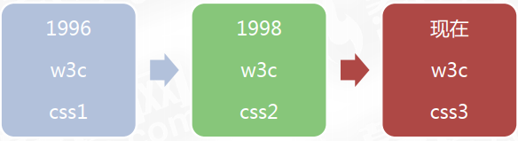
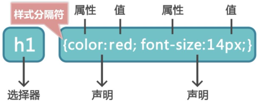
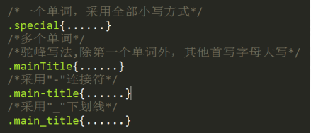
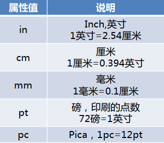
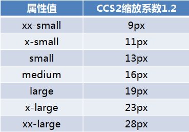
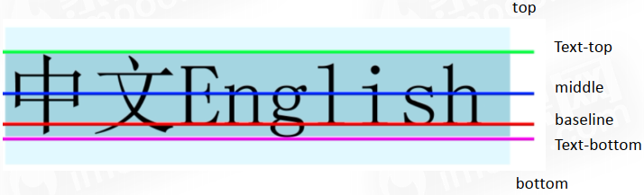
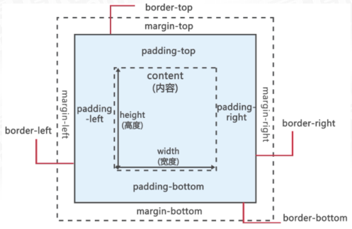

> ---
>
> +Title:《CSS总结》
>
> +Author:Pleione_Plus
>
> +Started Date:August 14th. 2019.
>
> +Finished Date:
>
> ---

# 一、HTML、CSS、Javascript关系

- HTML是网页内容的**载体**
- CSS是网页表现的**外观**
- Javascript是网页特效的**行为**

# 二、CSS概述

&emsp;&emsp;CSS（Cascading Style Sheets），即层叠样式表，用于定义HTML内容在浏览器内的显示样式。

# 三、CSS发展



# 四、CSS优点

- CSS**简化**HTML相关**标签**，网页体积小，下载快
- 实现**内容与表现分离**
- 更好的维护网页，**提高工作效率**

# 五、CSS基础

## 1、CSS基础语法

### 1.1、样式规则

&emsp;&emsp;CSS样式规则由两部分构成：**选择器&nbsp;{声明;...}（声明=属性:值）**



**注**：

- 声明之间使用“;”隔开，最后一个声明建议也添加一个";"
- 值与其单位之间不能有空格,否则失效
- CSS一般不区分大小写
- 所有的符号必须是半角符号

### 1.2、命名规则

- 采用**英文字母**、**数字**以及**"_"**和**"-"**命名

- 以小写字母开头，不能以**数字和"-"、"_"**开头

- 命名形式：小写单词、连字符、下划线、驼峰

  

- 使用有意义的命名

- ID不要滥用，谨慎使用；适当使用class

### 1.3、常用的CSS样式命名

#### 1.3.1、页面结构

- 页头：			header
- 页面主体：	main
- 页尾：			footer
- 内容：			content / container
- 容器：			container
- 导航：			nav
- 侧栏：			sidebar
- 栏目：			column
- 页面外围控制：	wrapper
- 左右中：		left right center

#### 1.3.2、导航

- 导航：			nav
- 主导航：		mainnav
- 子导航：		subnav
- 顶导航：		topnav
- 边导航：		sidebar
- 左导航：		leftsidebar
- 右导航：		rightsidebar
- 菜单：			menu
- 子菜单：		submenu
- 标题：			title
- 摘要：			summary

#### 1.3.3、功能

- 标志：			logo
- 广告：			banner
- 登录：			login
- 登录条：		loginbar
- 注册：			register
- 搜索：			search
- 功能区：		shop
- 标题：			title

### 1.4、注释

**语法**：

```CSS
/* 这是CSS的注释 */
```

**注**：

- 注释内容在网页中不显示
- **可以进行单行或多行注释**
- HTML中的注释：<span style="color:red">```<!-- ... -->```</span>
- JavaScript中的注释：
  - 单行注释：<span style="color:red">//</span>
  - 多行注释：<span style="color:red">/* ... */</span>


## 2、CSS使用方法(四种)

### 2.1、行内样式(内联样式)

**语法**：在**开始标签**内添加**style样式属性**

```HTML
<!-- 行内样式 -->
<p style="color:red;">段落内容</p>
```


### 2.2、内部样式表(嵌入样式)

**语法**：使用**```<style>```标签**来定义样式，且```<style```>标签要放在**``<head>``标签**之内

```HTML

<!DOCTYPE html>
<html>
    <head>
    	<title>内部样式表(嵌入样式)</title>
        
        <!-- 内部样式表 -->
		<style type="text/css">
        	p{color:red;}
		</style>
	</head>
    <body>
        
    </body>
</html>
```

**注**：

- 在低版本中可能不识别```<style>```标签，可以使用**HTML注释**将样式包裹起来，以防止在页面上显示定义的嵌入样式。

  ```HTML
  <!DOCTYPE html>
  <html>
      <head>
      	<title>...</title>
      
      	<!-- 内部样式表 -->
  		<style type="text/css">
        	  <!-- HTML注释，兼容性
         		 p{color:red;}
        	  -->
  		</style>
  	</head>
      <body>
          
      </body>
  </html>
  ```

  

### 2.3、外部样式表(Link链入)

**语法**：

&emsp;&emsp;把CSS样式代码写在**独立**的一个**文件**(常以.css为后缀名)中，在**```<head>```标签**中使用**```<link>```标签**来引入该样式

**CSS文件：CSS.css**

```CSS
p{color:red;}
h1{font-size:20px;}
```

**HTML文件：**

```html
<!DOCTYPE html>
<html>
    <head>
        <title>外部样式表(Link链入)</title>
        <meta http-equiv="Content" contect="text/html;charset=utf-8"/>
        
        <!-- link外部样式表 -->
        <link href="CSS.css" rel="stylesheet" type="text/css"/>
    </head>
    <body>
        
    </body>
</html>
```


### 2.4、导入式

**语法**：

&emsp;&emsp;使用**@import**来导入外部CSS样式，@import放在**```<style>```标签最开始的位置**。

**CSS文件：CSS.css**

```CSS
p{color:red;}
h1{font-size:20px;}
```

**HTML文件：**

```html
<!DOCTYPE html>
<html>
    <head>
        <title>导入外部样式表</title>
        <meta http-equiv="Content" contect="text/html;charset=utf-8"/>
        
        <!-- 导入外部样式表 -->
        <style type="text/css">
			/* 两种方式指示文件路径
			@import "CSS.css"
			*/
			@import url(CSS.css)
		</style>
    </head>
    <body>
        
    </body>
</html>
```

### 2.5、CSS四种使用的方法的区别

|          类别           |            引入方法             |                位置                |            加载             |
| :---------------------: | :-----------------------------: | :--------------------------------: | :-------------------------: |
|        行内样式         |         开始标签内style         |             html文件内             |            同时             |
|        内部样式         |  ```<head>```中```<style>```内  |             html文件内             |            同时             |
|        外部样式         | ```<head>```中```<link>```引用  | - CSS样式文件<br/>- 与html文件分离 | 页面加载时，同时加载CSS样式 |
| 导入式<br>```@import``` | 在```<style>```样式代码最开始处 | - CSS样式文件<br/>- 与html文件分离 |  在读取完html文件之后加载   |


## 3、CSS选择器(六种)

### 3.1、标签选择器

&emsp;&emsp;以**HTML标签**作为选择器

**eg：**

```html
<!DOCTYPE html>
<html>
    <head>
        <title>标签选择器</title>
        <meta http-equiv="Content" contect="text/html;charset=utf-8"/>
        
        <!-- 内部样式 -->
        <style type="text/css">
            p{color:red;}
		</style>
    </head>
    <body>
        <p>这是一个段落，使用标签选择器定义其字体为红色。</p>
    </body>
</html>
```


### 3.2、类选择器

&emsp;&emsp;为HTML标签添加**class属性**，以**.class的值**作为样式选择器的名称。

**eg1:**

```html
<!DOCTYPE html>
<html>
    <head>
        <title>类选择器</title>
        <meta http-equiv="Content" contect="text/html;charset=utf-8"/>
        
        <!-- 内部样式 -->
        <style type="text/css">
            /*
            .special{color:red;}
            */
            
            /* 标签+类选择器
            	为设置class属性值为special的<p>标签设置指定的样式 */
            p.special{color:red;}
		</style>
    </head>
    <body>
        <p class="special">这是一个段落，使用类选择器定义其字体为红色。</p>
    </body>
</html>
```


### 3.3、ID选择器

&emsp;&emsp;为HTML标签添加**id属性**，以**#id值**作为样式选择器的名称。

**eg:**

```html
<!DOCTYPE html>
<html>
    <head>
        <title>ID选择器</title>
        <meta http-equiv="Content" contect="text/html;charset=utf-8"/>
        
        <!-- 内部样式 -->
        <style type="text/css">
            #special{color:red;}
		</style>
    </head>
    <body>
        <p id="special">这是一个段落，使用ID选择器定义其字体为红色。</p>
    </body>
</html>
```

**注**：

- ID值全局唯一
- ID值区分大小写

### 3.4、群组选择器

&emsp;&emsp;**集体统一的设置样式**，将多个标签（类/ID等）的相同属性值放在一起。

**eg：**

```html
<!DOCTYPE html>
<html>
    <head>
        <title>群组选择器</title>
        <meta http-equiv="Content" contect="text/html;charset=utf-8"/>
        
        <!-- 内部样式 -->
        <style type="text/css">
            p,h1,.special,#special{color:red;}
		</style>
    </head>
    <body>
        <p>群组选择器</p>
		<h1>群组选择器</h1>
		<p class="special">群组选择器</p>
		<p id="special">群组选择器</p>
    </body>
</html>
```

**注**：

- 各个选择器之间用","隔开

### 3.5、全局选择器

&emsp;&emsp;对**所有标签**的样式进行设置。

**eg:**

```html
<!DOCTYPE html>
<html>
    <head>
        <title>全局选择器</title>
        <meta http-equiv="Content" contect="text/html;charset=utf-8"/>
        
        <!-- 内部样式 -->
        <style type="text/css">
            *{color:red;}
		</style>
    </head>
    <body>
        <p>这是一个段落</p>
		<h1>这是一个一级标题</h1>
		<p class="special">这是带有class的段落</p>
		<p id="special">这是带有id的段落</p>
    </body>
</html>
```

**注**：

- 属性值对所有标签都适用
- 常被用来清楚标签的一些默认属性值

### 3.6、后代选择器

&emsp;&emsp;HTML是一种层级结构，利用后代选择器可快速为层级结构中的下层标签设置统一的样式。

**eg：**

```html
<!DOCTYPE html>
<html>
    <head>
        <title>后代选择器</title>
        <meta http-equiv="Content" contect="text/html;charset=utf-8"/>
        
        <!-- 内部样式 -->
        <style type="text/css">
            div p{
                color:red;
            }
		</style>
    </head>
    <body>
        <div>
        	<p>
                这是一个后代选择器的演示例子
            </p>
        </div>
    </body>
</html>
```

**注**：

- 各个选择器之间用"&nbsp;"(空格隔开)

## 4、CSS伪类

### 4.1、链接伪类

- **:link{}**：未访问状态
- **:visited{}**：已访问状态
- **:hover{}**：鼠标悬停状态
- **:active{}**：激活状态

**eg：**

```html
<!DOCTYPE html>
<html>
    <head>
        <title>CSS伪类</title>
        <meta http-equiv="Content" contect="text/html;charset=utf-8"/>
        
        <!-- 内部样式 -->
        <style type="text/css">
            a:link{color:blue;}		/* 未访问状态 */
			a:visited{color:gray;}	/* 已访问状态 */
			a:hover{color:green;}	/* 鼠标悬停状态 */
			a:active{color:orange;} /* 激活状态 */
		</style>
    </head>
    <body>
        <a href="http://www.baidu.com" target="_blank">百度一下</a>
    </body>
</html>
```

**注**：

- :hover 和 :active 可用于多种标签

- IE6及更早版本，支持```<a>```标签的4种状态；IE6浏览器不支持其他元素的:hover 和 :active

- 在```<a>```标签中使用伪类要注意定义的顺序：

  <center><font color="red">a:link > a:visited > a:hover > a:active</font></center>

- 伪类名称对大小写不敏感

## 5、CSS继承和层叠

### 5.1、继承

&emsp;&emsp;在HTML中的层级结构中，子标签(后代标签)从父标签(祖先标签)**继承到部分属性**，有利于简化CSS。

**eg1:**

```html
<!DOCTYPE html>
<html>
    <head>
        <title>CSS继承</title>
        <meta http-equiv="Content" contect="text/html;charset=utf-8"/>
        
        <!-- 内部样式 -->
        <style type="text/css">
            p{color:red;}
		</style>
    </head>
    <body>
        <p>
			<span>CSS继承</span>	<!-- 最终显示为：红色 -->
		</p>
    </body>
</html>
```

**eg2:**

```html
<!DOCTYPE html>
<html>
    <head>
        <title>CSS继承</title>
        <meta http-equiv="Content" contect="text/html;charset=utf-8"/>
        
        <!-- 内部样式 -->
        <style type="text/css">
            div{border:1px solid red;}
		</style>
    </head>
    <body>
        <div>
			<p>
				<span>CSS继承</span>	<!-- 最终显示为：无边框(<p>标签也没有继承) -->
			</p>
		</div>
    </body>
</html>
```

**eg3:**

```html
<!DOCTYPE html>
<html>
    <head>
        <title>CSS继承</title>
        <meta http-equiv="Content" contect="text/html;charset=utf-8"/>
        
        <!-- 内部样式 -->
        <style type="text/css">
            body{font-size:12px;}
		</style>
    </head>
    <body>
        <table border="1">				<!-- IE6之前的版本<table>标签不继承body属性 -->
			<tr>
				<td>CSS继承</td>
				<td>CSS层叠</td>
			</tr>
		</table>
    </body>
</html>
```

**注**：

- 部分属性**可**以通过**继承**得到，有一部分属性**无法继承**
- 继承有时会存在**错误**
- 继承的**优先级比较低**

### 5.2、层叠

&emsp;&emsp;对同一标签可以定义多个样式，在不冲突时，多个样式可以层叠为一个；在冲突时，按不同样式规则优先级来应用样式(如：就近原则等)。

**eg:**

```html
<!DOCTYPE html>
<html>
    <head>
        <title>CSS层叠</title>
        <meta http-equiv="Content" contect="text/html;charset=utf-8"/>
        
        <!-- 内部样式 -->
        <style type="text/css">
            p{color:red;}
			p{color:blue;}		/* 最终显示为：蓝色 */
				
			h1{color:red;}
			h1{font-size:30px;}	/* 最终显示为：红色 + 30px */
		</style>
    </head>
    <body>
        <p>CSS层叠</p>
		<h1>CSS层叠样式</h1>
    </body>
</html>
```

**注**：

- 可以定义多个样式
- 不冲突时，多个样式可层叠为一个
- 冲突时，按不同样式规则优先级来应用样式

## 6、CSS优先级

### 6.1、使用方法优先级

<center><font color="red">行内样式 > 内部样式(外部样式) > 导入样式</font></center>
- **链入外部样式表**与**内部样式表**之间的优先级取决于所处**位置的先后**
- 最后定义的优先级最高（<font color="blue">样式覆盖、就近原则</font>）

### 6.2、选择器优先级

<center><font color="red">ID选择器 > 类选择器 > 标签选择器 > 通配符</font></center>
- 同类样式多次引用，样式表中后定义的优先级高（<font color="blue">覆盖</font>）

### 6.3、权值规则

&emsp;&emsp;**判断派生选择器的优先级**

- 同一样式表中，权值相同，就近原则；权值不同，使用权值高的样式(<font color="blue">权值不同看大小，权值相同看位置</font>)
  - 通配符选择器的权值为：<font color="blue">0</font>
  - 标签选择器的权值为：<font color="blue">1</font>
  - 类选择器和伪类的权值为：<font color="blue">10</font>
  - ID选择器的权值为：<font color="blue">100</font>
  - 行内样式的权值为：<font color="blue">1000</font>
- 选择器权值计算步骤：
  - 统计不同选择器的个数
  - 每类选择器的个数乘以相应权值
  - 把所有的值相加得出选择器的权值

### 6.4、声明最高优先级

- 使用<font color="red" font-weight="bold">!important</font>声明最高优先级
- 添加在样式规则之后，中间用空格隔开

**eg:**

```html
<!DOCTYPE html>
<html>
    <head>
        <title>声明最高优先级</title>
        <meta http-equiv="Content" contect="text/html;charset=utf-8"/>
        
        <style type="text/css">
			p{color:red !important;}
		</style>
    </head>
    <body>
        <p style="color:blue;">行内样式</p>	<!-- 最终显示为：红色 -->
    </body>
</html>
```


# 六、CSS字体和文本样式

## 1、CSS字体样式

### 1.1、属性

#### font-family属性

&emsp;&emsp;定义元素内文字以什么字体来显示。

**语法：**

```CSS
font-family:[字体1][,字体2][,...]
font-family:具体字体名,字体集
```

**说明**：

- 含空格字体名和中文，用英文引号括起来
- 多个字体，用英文逗号隔开
- 引号嵌套，外使用双引号，内使用单引号
- 字体集：
  - Serif：字角有修饰
  - Sans-serif：字角无修饰
  - Monospace
  - Cursive
  - Fantasy
- 定义多种字体按顺序与主机中的字体库进行匹配，若全没有则采用浏览器默认字体

#### font-size属性

&emsp;&emsp;定义元素内文字大小。

**语法：**

```CSS
font-size:绝对单位 | 相对单位
```

**注：**

绝对单位：





相对单位：

- px：像素
- em ：倍数（相对父元素）
- %：百分比（相对父元素）
- large：相对父元素变大
- samll：相对父元素变小

#### color属性

&emsp;&emsp;定义元素内文字颜色。

**语法：**

```CSS
color:colorname | #xxxxxx | RGB(x,x,x)
```

**说明：**

- colorname:颜色名称
- #xxxxxx:十六进制
- RGB(x,x,x):RGB数值
  - 数字：0~255，超出自动修正
  - 百分比：0%~100%，超出自动修正

#### font-weight属性

&emsp;&emsp;为元素内文字设置粗细。

**语法：**

```CSS
font-weight:normal | bold | bolder | light | 100~900
```


#### font-style属性

&emsp;&emsp;为元素内文字设置样式。

**语法：**

```CSS
font-style:normal | italic | oblique
```

**说明：**

- normal:正常展示
- italic:斜体展示
- oblique:倾斜展示


#### font-variant属性

&emsp;&emsp;设置元素中文本为小型大写字母。

**语法：**

```CSS
font-variant:normal | small-caps
```

**说明：**

- normal：正常显示
- small-caps：小型大写字母显示

### 1.2、举例

**eg:**

```html
<!DOCTYPE html>
<html>
    <head>
        <title>CSS字体样式举例</title>
        <meta http-equiv="Content" contect="text/html;charset=utf-8"/>
        
        <!-- 内部样式 -->
        <style type="text/css">
            .head1{
				font-family:"Times New Roman",serif;
				font-size:1.2em;
				color:blue;
				font-weight:bolder;
				font-style:normal;
				font-variant:normal;
			}
			.p1{
				font-family:"微软雅黑","宋体","黑体",sans-serif;
				font-size:15px;
				color:#2c2c2c;
				font-weight:normal;
				font-style:italic;
				font-variant:small-caps;
			}
		</style>
    </head>
    <body>
        <!-- font标签对字体进行设置 -->
		<!-- <font>在HTML 4.0中不再被使用，XHTML1.0中不支持 -->
		<font face="宋体" color="red" size="20px">
			CSS样式表
		</font>
		
		<p class="head1">CSS样式表
		<br/>(使用字体：Times New Roman字体和serif字体集，字体大小：1.2em，字体颜色：blue，字体重量：加粗，字体风格：正常，小型大写字母：正常显示)</p>
		<p class="p1">CSS目前最新版本为CSS3.this is a test.
		<br/>（使用字体：微软雅黑字体和sans-serif字体集，字体大小：1.5px，字体颜色：#2c2c2c，字体重量：正常，字体风格：斜体，小型大写字母显示）</p>
    </body>
</html>
```


## 2、CSS文本样式

### 2.1、属性

#### text-align属性

&emsp;&emsp;设置元素内文本的水平对齐方式。

**语法：**

```CSS
text-align:left | right | center | justify
```

**说明：**

- left:左对齐
- right:右对齐
- center:居中对齐
- justify:两端对齐

**注：**

-  <font color="red">只对块级元素有效</font>

#### vertical-align属性

&emsp;&emsp;设置元素内容的垂直方式。

**语法：**

```CSS
vertical-align:sub | super | baseline | top | text-top | middle | bottom | text-bottom | 长度 | 百分比
```

**说明：**

- sub:下标
- super:上标
- top:顶端对齐
-  text-top:顶线对齐
- middle:中线
- baselin:基线
- text-bottom:底线对齐
- bottom:底部对齐

**注：**

- 文字基线

  

#### line-height属性

&emsp;&emsp;设置元素中文本行高。

**语法：**

```CSS
line-height:px | em | %
```

#### line-indent属性

&emsp;&emsp;设置元素中文本的缩进值。

**语法：**

```CSS
line-indent:em | px 
```

#### word-spacing属性

​		设置元素内单词之间间距	(单词判断以空格为准)

**语法：**

```CSS
word-spacing:px | em
```

#### letter-spacing属性

​		设置元素内字母之间间距

**语法：**

```CSS
letter-spacing:px | em
```

#### text-transform属性

​		设置元素内文本的大小写.

**语法：**

```CSS
text-transform:capitalize | uppercase | lowercase | none
```

**说明：**

- capitalize:设置首字母大写
- uppercase:设置大写
-  lowercase:设置小写
- none:采用默认设置

#### text-decoration属性

​		设置元素内文本的装饰

**语法：**

```CSS
text-decoration:underline | overline | line-through | blink | none
```

**说明：**

- underline:下划线
- overline:上划线
- line-through:贯穿线（效果等效于删除线）
- blink:闪烁效果(存在兼容性问题)
- none:没有任何的装饰效果

**注：**

- 应用于所有元素（块内、行内）

### 2.2、举例

**eg:**

```html
<!DOCTYPE html>
<html>
    <head>
        <title>CSS文本样式举例</title>
        <meta http-equiv="Content" contect="text/html;charset=utf-8"/>
        
        <!-- 内部样式 -->
        <style type="text/css">
            .text1{
				text-align:left;
				vertical-align:top;
				line-height:1em;
				line-indent:2em;
				word-spacing:1.25em;
				letter-spacing:1em;
				text-transform:capitalize;
				text-decoration:underline;
			}
			.text2{
				text-align:center;
				vertical-align:middle;
				line-height:2em;
				line-indent:2em;
				word-spacing:1.25em;
				letter-spacing:1em;
				text-transform:uppercase;
				text-decoration:overline;
			}
			.text3{
				text-align:right;
				vertical-align:baseline;
				line-height:150%;
				line-indent:2px;
				word-spacing:5px;
				letter-spacing:1px;
				text-transform:lowercase;
				text-decoration:line-through;
			}
			.text4{
				text-align:justify;
				vertical-align:text-bottom;
				line-height:15px;
				line-indent:2px;
				word-spacing:5px;
				letter-spacing:1px;
				text-transform:none;
				text-decoration:blink;
			}
			.text{
				color:blue;
			}
		</style>
    </head>
    <body>
        <p class="text1"> 
			文本左对齐：HTML 指的是超文本标记语言 (Hyper Text Markup Language),
        HTML 不是一种编程语言，而是一种标记语言 (markup language),
		</p>
		<p class="text">（左对齐、顶端对齐、一倍行高、两倍缩进、1.25倍单词间距、1倍字母间距、首字母大写、下划线）</p>
		
		<p class="text2"> 
			文本居中对齐：HTML 指的是超文本标记语言 (Hyper Text Markup Language),
        HTML 不是一种编程语言，而是一种标记语言 (markup language),
		</p>
		<p class="text">（居中对齐、中线对齐、两倍行高、两倍缩进、1.25倍单词间距、1倍字母间距、设置大写、上划线）</p>
		
		<p class="text3"> 
			文本右对齐：HTML 指的是超文本标记语言 (Hyper Text Markup Language),
        HTML 不是一种编程语言，而是一种标记语言 (markup language),
		</p>
		<p class="text">（右对齐、基线对齐、150%行高、两像素缩进、5像素单词间距、1像素字母间距、设置小写、删除线）</p>
		
		<p class="text4"> 
			文本两端对齐：HTML 指的是超文本标记语言 (Hyper Text Markup Language),
        HTML 不是一种编程语言，而是一种标记语言 (markup language),
		</p>
		<p class="text">（两端对齐、底线对齐、15像素行高、两像素缩进、5像素单词间距、1像素字母间距、无装饰、闪烁效果(存在兼容性不起作用)）</p>
    </body>
</html>
```


# 七、CSS背景与列表

## 1、CSS背景样式

### 1.1、属性

#### background-color属性

​		设置元素的背景颜色。

**语法**：

```CSS
background-color:colorname | RGB(x,x,x) | #xxxxxx | transparent
```

**说明**：

- transparent是全透明黑色

**注**：

- 背景区包括**content、padding、border**，而不包括**margin**

#### background-image属性

​		把图像设置为背景。

**语法**：

```CSS
background-image:URL | none
```

**说明**：

- URL可以是相对地址也可以是绝对地址

**注**：

- 元素的背景占据了元素的全部尺寸，包括内边距和边框，但不包括外边距
- 默认地，背景图像位于元素的左上角，并在水平和垂直方向上重复
- 同时设置背景颜色和背景图像之后，背景图像会覆盖背景颜色

#### background-position属性

​		设置背景图像的起始位置。

**语法**：

```CSS
background-position:百分比 | 值 | top | right | bottom | left | center
```

**说明**：

- 长度值(x,y)：相对于左上角的位置
- 百分比(x%,y%)：相对于左上角的百分比位置
- top：顶部显示，相当于垂直方向0
- right：右边显示，相当于水平方向100%
- lefth：左边显示，相当于水平方向0
- bottom：底部显示，相当于垂直方向100%
- center：居中显示，相当于水平方向50%或者垂直方向50%

#### background-attachment属性

​		背景图像是否固定或者随着页面的其余部分滚动。

**语法**：

```CSS
background-attachment:scroll | fixed
```

**说明**：

- scroll：背景图片随滚动条滚动（默认值）
- fixed：当页面的其余部分滚动时，背景图片不会移动

#### background-repeat属性

​		设置背景图像是否重复及如何重复。

**语法**：

```CSS
background-repeat:repeat | no-repeat | repeat-x | repeat-y
```

**说明**：

- repeat：重复（默认值）
- no-repeat：不重复
- repeat-x：水平重复
- repeat-y：垂直重复

**注**：

- 该属性只有在设置了背景图像的元素中有效

#### background属性

​		简写属性，作用是将背景属性设置在一个声明中。

**语法**：

background:*[background-color] [background-image] [background-position] [background-attachment] [background-repeat]*

**注**：

- 无序

### 1.2、举例


## 2、CSS列表样式

### 2.1、属性

#### list-style-type属性

​		设置列表项标志的类型。

**语法**：

```CSS
list-style-type:关键字 | none
```

**说明**：

- 无序列表

- |   值   |    说明    |
  | :----: | :--------: |
  |  none  |   无标记   |
  |  disc  | 实心的圆点 |
  | circle | 空心的圆点 |
  | square | 实心的方块 |

- 有序列表

- |     值      |     说明      |
  | :---------: | :-----------: |
  |    none     |    无标记     |
  |   decimal   | 从1开始的整数 |
  | lower-roman | 小写罗马数字  |
  | upper-roman | 大写罗马数字  |
  | lower-alpha | 小写英文字母  |
  | upper-alpha | 大写英文字母  |

#### list-style-image属性

​		将图像设置为列表项标志。

**语法**：

```CSS
list-style-image:URL | none
```

**说明**：

- URL：绝对地址或相对地址

#### list-style-position属性

​		设置列表中列表项标志的位置。

**语法**：

```CSS
list-style-position:inside |  outside
```

**说明**：

- inside:列表项目标记放置在文本以内，且环绕文本根据标记对齐
- outside:默认值，列表项目标记防止在文本以外，且环绕文本不根据标记对齐

#### list-style属性

​		简写属性，用于把所有列表的属性设置于一个声明中。

**语法**：

list-style:*list-style-image list-style-position list-style-type*

**注**：

- 值之间用空格分隔
- 无序
- list-style-image会覆盖list-style-type的设置

### 2.2、举例


# 八、CSS盒子模型

## 1、盒子模型的概念

- 盒子模型用来“放”网页中的各种元素
- 网页设计中内容，如**文字、图片等元素**，都可是盒子（DIV嵌套）

## 2、标准盒子模型



## 3、高和宽设置

**语法**：

```CSS
height | widht:px | em
```

**注**：

- height和width属性设置时**内容**的高和宽
- height和width属性对**块级元素和替换元素**有效
- max[min]-height[width]有兼容性问题，IE不支持

## 4、边框设置

### border-width属性

**语法**：

```CSS
border-[left | right | top | bottom]-width:thin | medium | thick | px
```

**说明：**

- thin：细
- medium：中
- thick：厚
- px


### border-color属性

**语法**：

```CSS
border-[left | right | top | bottom]-color:colorname | RGB | #xxxxx | transparent
```

**说明：**

- transparent：透明


### border-style属性

**语法**：

```CSS
border-[left | right | top | bottom]-style:值 | none | hidden | dotted | dashed | solid | double | groove | ridge | inset | outset | inherut
```

**说明：**

- none：定义**无边框**，**默认值**
- hidden：与"none"相同。除非在表格元素中解决边框冲突时
- dotted：定义**点状框**。在大多数浏览器中呈现实线
- dashed：定义**虚线**。在大多数浏览器中呈现实线
- solid：定义**实线**
- double：定义**双线**
- groove：定义**3D凹槽边框**
- ridge：定义**3D垄状边框**
- inset：定义**3Dinset边框**
- outset：定义**3Doutset边框**
- inherit：规定应该**从父元素继承边框样式**


### border属性

**语法**：

```CSS
border-[top | left | right | bottom]:[宽度] | [样式] | [颜色]
```

**说明：**

- 宽度：设置表格呈现的**厚度**
- 样式：设置边框以何种样式显示
- 颜色：设置边框实现的颜色


## 5、内边距设置

**语法**：

```CSS
padding-[top | right | bottom | left]:长度值 | 百分比
padding:值1;	//4个方向都为值1
padding:值1 值2;//上下=值1 左右=值2
padding:值1 值2 值3;//上=值1 左右=值2 下=值3
padding:值1 值2 值3 值4;上=值1 右=值2 下=值3 左=值4
```

**注**：

- 值不能为负值
- 盒子在网页中占的空间，不单单与width和height属性有关，还与padding有关


## 6、外边距设置

**语法**：

```CSS
margin-[top | right | bottom | left]:长度值 | 百分比 | auto
margin:值1;	//4个方向都为值1
margin:值1 值2;//上下=值1 左右=值2
margin:值1 值2 值3;//上=值1 左右=值2 下=值3
margin:值1 值2 值3 值4;上=值1 右=值2 下=值3 左=值4
```

**注：**

- margin:auto时，实现水平方向居中显示效果
- 垂直方向，两个相邻元素都设置外边距，外边距会发生合并（<font color="red">合并后外边距高度=两个发生合并外边距的高度中最大值</font>）
- 值不能为负值
- 默认情况下，相应**HTML块级元素存在边距**

## 7、盒子模型计算

- 盒子在页面中所占的宽度=**左边距**+**左边框**+**左填充**+**内容宽度**+**右填充**+**右边框**+**右边距**
- 盒子在页面中所占的高度=**上边距**+**上边框**+**上填充**+**内容高度**+**下填充**+**下边框**+**下边距**

**注**：

- 盒子模型分为标准盒子模型和IE盒子模型，在文档的首行声明```<doctype>```指示浏览器以何种方式来解析盒子，若不进行该声明，则浏览器会按自己的方式来进行盒子的解析

## 8、盒子应用

### display属性

```CSS
display:inline | block | inline-block | none
```

**说明**：

- inline：元素将显示为内联元素，元素前后没有换行符
- 元素将显示为块级元素，元素前后会带有换行符
- 行内块元素，元素呈现为inline，具有block相应特性
- 此元素不会被显示

**注**：

- 相应内联元素及使用display:inline设置成内联元素的元素width和height属性无效。水平方向margin(padding)-left(right)有效，垂直方向margin(padding)-top(bottom)无效。
- 块级元素及使用display:block设置成块级元素的元素width/height/margin/padding属性都生效。

# 九、CSS中的定位机制(3种)

## 1、float浮动

​		定义元素在哪个方向进行浮动

语法**：

```CSS
float:left | right | none | inherit
```

**说明：**

- left：左浮动
- right：右浮动
- none：不浮动（默认）
- inherit：继承

**注**：

- 在HTML中任何元素都是可以浮动的

**浮动的真正原因以及副作用**：

- 使得元素脱离了标准流
- 浮动的元素不占有原空间
- 父元素塌陷及其他元素异位

**浮动副作用的解决**：

1. 手动给父元素添加高度
   - 弊病：当浮动元素超出设置的高度时，将暴漏展示
2. 通过clear清除内部和外部浮动
3. 给父元素添加overfloat属性并结合zoom:1使用
   - 弊病：超出部分被截取
4. 给父元素添加浮动
   - 弊病：仅仅解决了这个，但还会影响到其他元素

## 2、position定位

### 2.1、属性

​		决定元素将如何让定位

**语法：**

```CSS
position:static | relative | absolute | fixed | inherit
```

**说明**：

- static：**没有定位**（默认值）
  - 不脱离文档流
  - 忽略 top, bottom, left, right 或者 z-index 声明
- relative：生成**相对定位**元素
  - 不脱离文档流
  - 可以使用top right bottom left进行定位
  - 为子定位划分作用域
  - 移动区域为**整个网页**
- absolute：生成**绝对定位**的元素，**相对于static定位以外的第一个父元素进行定位**
  - 脱离文档流
  - 可以利用top right bottom left进行定位
  - 为子定位划分作用域
  - 移动区域为**整个网页**
- fixed：生成**绝对定位**的元素
  - 脱离文档流
  - 可以利用top right bottom left进行定位
  - 为子定位划分作用域
  - 移动区域为**整个浏览器窗口**
- inherit：规定应该从父元素继承position属性的值

**注**：

- 通过top、right、bottom、left实现位置的改变

### 2.2、定位中的层级

- 通过顺序插入，越后添加的定位元素层级越大
- z-index改变层级
- 不同父元素中的子元素的层级各不相干

### 2.3、z-index属性值

**语法**：

```CSS
z-index:auto | inherit | number
```

**说明**：

- auto：默认值
- inherit：继承父元素
- number：指具体数值（越大层级越高）

**注**：

- 可以设置元素的叠加顺序，但依赖定位属性
- z-index大的元素会覆盖z-index小的元素
- z-index为auto的元素不参与层级比较
- z-index为负值，元素被普通流中的元素覆盖