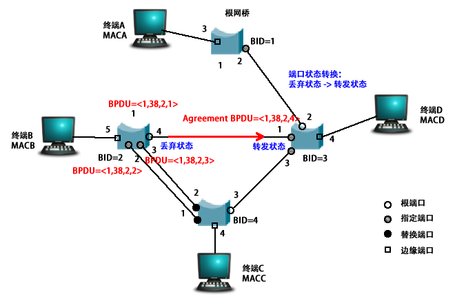
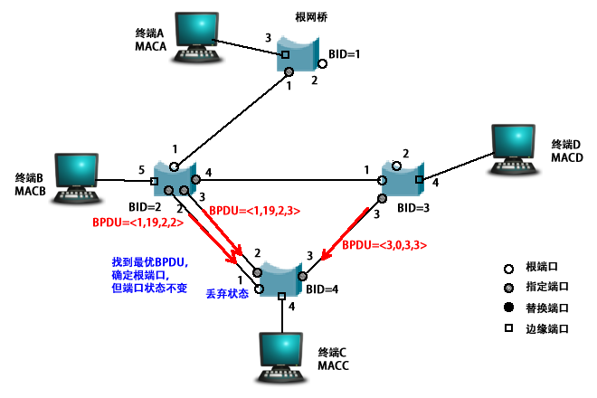

# RSTP应用实例

​		存在某网络拓扑如图1所示，各个网桥端口传输速率均为100Mbps，所有连接均无故障.

图1

​	则使用RSTP协议构建的生成树如图2所示。

图2

# 定期维护网络拓扑结构

​		RSTP成功构建生成树后，每当**间隔时间定时器**溢出时，网桥每一个**指定端口**发送各自的端口BPDU（如图3所示）。由于每个端口的最优BPDU的**溢出定时器**初值是3×（Hello Time），因此，只要在3×（Hello Time）时间内接收到该端口最优BPDU，该端口最优BPDU就保持有效，网络拓扑就维持不变。

.png)

图3

# 拓扑结构改变时端口状态迁移过程

## BID=1与BID=2连接断开

​		如果图3的生成树中互连BID=1网桥和BID=2网桥之间的链路发生故障（如图4所示），BID=2网桥由于持续3×（Hello Time）时间没有接收到网桥最优BPDU，导致BID=2网桥回到初始状态，将自己作为根网桥，此时BID=2网桥各个端口BPDU如图4中所示。

图4

​		每当间隔时间定时器溢出时，BID=2网桥的每一个端口就发送各自的端口BPDU。

**BID=2网桥与BID=3网桥**：

​		当BID=3网桥端口1接收到**BPDU=<2,0,2,4>**时，由于端口1的端口**BPDU=<1,19,3,1>**优于收到的BPDU，该端口角色转换为**指定端口**，端口状态仍为**丢弃状态**，如图5所示。

图5

​		由于BID=3端口1的端口角色转变为指定端口，但端口状态仍为丢弃状态，此时端口1会向BID=2的端口4发送**Proposal BPDU=<1,19,3,1>**。当BID=2网桥端口4收到该Proposal BPDU后，确定该BPDU为网桥最优BPDU，则指定端口4为**根端口**，如图6所示。

图6

​		BID=2网桥确定端口4为根端口后，确定端口4的开销为38，且其**BPDU=<1,38,2,4>**,此时BID=2网桥其他端口的BPDU如图7所示。

图7

​		由于BID=2网桥端口4是根端口，且各个端口状态为丢弃状态，BID=2网桥通过端口4发送**Agreement BPDU**。BID=3网桥端口1接收到Agreement BPDU后，将端口状态转变为**转发状态**。（如图8所示）

图8

​		每当间隔时间定时器溢出时，BID=3网桥端口1发送标志位**Forwarding置位的BPDU**。BID=2网桥端口4接收到该BPDU后，将端口状态转变为**转发状态**。（如图9所示）

图9

**BID=2网桥与BID=4网桥**：

​		当BID=4网桥通过端口1接收到**BPDU=<2,0,2,2>**,通过端口2接收到**BPDU=<2,0,2,3>**，通过端口3接收到**BPDU=<1,19,3,3>**时，确根端口3为**根端口**，端口3状态**直接转变为转发状态**（如图10所示），由此得到BID=4网桥的根路径开销为38，以此推到出BID=4网桥其他端口的端口BPDU如图11所示。

图10

图11

​		每当间隔时间定时器溢出时，BID=4网桥的端口1发送**Proposal BPDU=<1,38,4,1>**，端口2发送**Proposal BPDU=<1,38,4,2>**，如图12所示。

图12

​		当BID=2网桥通过端口2接收到**Proposal BPDU=<1,38,4,1>**时，由于端口2的端口**BPDU=<1,38,2,2>**优于接收到的BPDU，端口2维持指定端口角色不变，发送**Proposal BPDU=<1,38,2,2>**。端口3同样维持指定角色不变，发送**Proposal BPDU=<1,38,2,3>**，如图13所示。

图13

​		当BID=4网桥通过端口1接收到**Proposal BPDU=<1,38,2,2>**时，由于该BPDU优先于端口**BPDU=<1,38,4,1>**，端口1的端口角色转变为**替换端口**（如图14所示），由于该端口为替换端口，且其他指定端口状态为丢弃状态，BID=4网桥通过端口1发送**Agreement BPDU**。当BID=4网桥通过端口2接收到**Proposal BPDU=<1,38,2,3>**时，端口2的端口角色同样转变为**替换端口**，并通过端口2发送**Agreement BPDU**。（如图15所示）

图14

图15

​		当BID=2网桥分别通过端口2和端口3接收到Agreement BPDU时，两个端口的状态转换为**转发状态**，如图16所示。

图16

​		完成上述过程后，重新构建的生成树即完成（如图17所示）

图17

## 扩展：BID=1与BID=3连接断开

​		如果生成树中互连BID=1网桥和BID=3网桥之间的链路发生故障（如图18所示），BID=3网桥由于持续3×（Hello Time）时间没有接收到网桥最优BPDU，导致BID=3网桥回到初始状态，将自己作为根网桥，此时BID=3网桥各个端口BPDU如图18中所示。

图18

​		每当间隔时间定时器溢出时，BID=3网桥的每一个端口就发送各自的端口BPDU。

**BID=3网桥与BID=2网桥**：

​		当BID=2网桥端口4接收到**BPDU=<3,0,3,1>**时，由于端口4的端口**BPDU=<1,19,2,4>**优于收到的BPDU，该端口角色仍为**指定端口**，端口状态仍为**转发状态**，如图19所示。

图19

​		BID=2的端口4会向BID=3的端口1发送**proposal BPDU=<1,19,2,4>**。当BID=3网桥端口1收到该Proposal BPDU后，确定该BPDU为网桥**最优BPDU**，则执行端口1为**根端口**，而端口状态仍为**丢弃状态**，如图20所示。

图20

​		BID=3网桥确定端口1为根端口后，确定端口1的开销为38，且其**BPDU=<1,38,3,1>**,此时BID=3网桥其他端口的BPDU如图21所示。

图21

​		由于BID=3网桥端口1是根端口，且各个端口状态为丢弃状态，BID=3网桥通过端口1发送**Agreement BPDU**。BID=2网桥端口4接收到Agreement BPDU后，端口状态仍为**转发状态**（如图22所示）并向BID=3端口1发送一个**Agreement BPDU**。当BID=3端口1接收到该Agreement BPDU后，将端口状态转变为**转发状态**。（如图23所示）

图22

图23

**BID=4网桥**：

​		当BID=4网桥通过端口1接收到**BPDU=<1,19,2,2>**,通过端口2接收到**BPDU=<1,19,2,3>**，通过端口3接收到**BPDU=<3,0,3,3>**时，确根端口1为**根端口**，端口3角色**转变为根端口**，端口状态仍为**丢弃状态**（如图24所示），由此得到BID=4网桥的根路径开销为38，以此推到出BID=4网桥其他端口的端口BPDU如图25所示。

图24

图25

​		由于BID=4网桥端口1是根端口，且各个端口状态均为丢弃状态，BID=4网桥通过端口1发送Agreement BPDU。BID=2网桥端口2接收到Agreement BPDU后，端口状态仍为**转发状态**，如图26所示。

图26

​		每当间隔时间定时器溢出时，BID=2网桥端口2发送置位标志位Forwarding置位的BPDU。BID=4网桥端口1接收到该BPDU后，将端口状态转变为**转发状态**。（如图27所示）

图27

​		BID=4网桥通过端口2向BID=2发送Proposal BPDU，通过端口3向BID=3发送Proposal（如图28所示）。当BID=2端口3接收到Proposal BPDU后，判断本端口BPDU更优，端口角色保持不变，端口状态仍为转发状态（如图29所示）。当BID=3端口3接收到Proposal BPDU后，判断本端口BPDU更优，端口角色保持不变，端口状态转变为转发状态（如图29所示）。

图28

图29

​		当BID=4端口2接收到Proposal BPDU后，由于该BPDU优于端口BPDU=<1,38,4,2>，端口角色转变为替换角色，端口状态仍为丢弃状态（如图30所示）。当BID=4端口3接收到Proposal BPDU后，由于该BPDU优于端口BPDU=<1,38,4,3>，端口角色转变为替换角色，端口状态转变仍为丢弃状态（如图30所示）。

图30

​		完成上述过程后，重新构建的生成树即完成（如图31所示）

图31

# 附录

**参考资料**：

《路由和交换技术(第2版)》