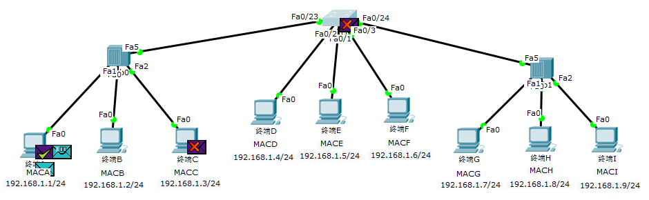
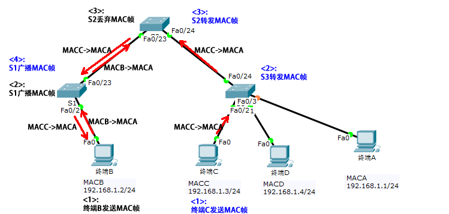
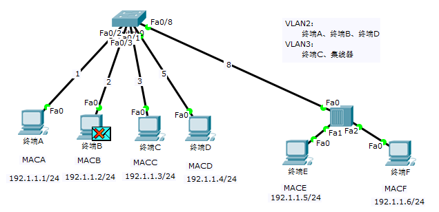
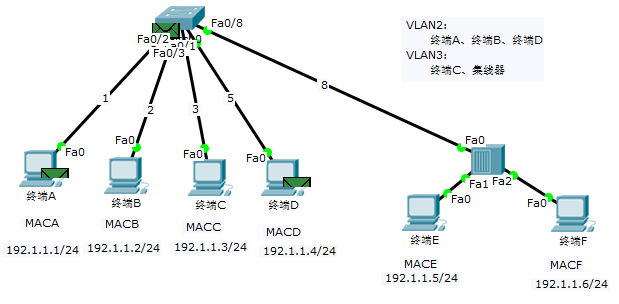
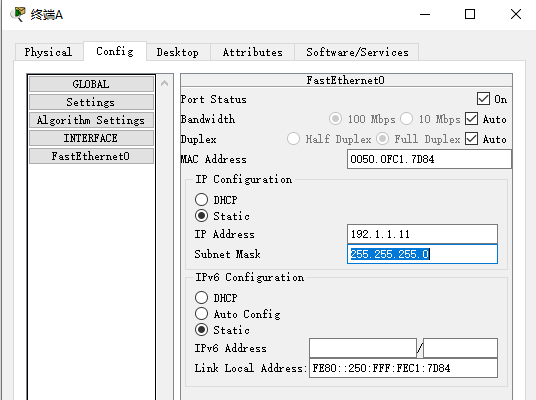

> ----
>
> Title:《Cisco Packet Tracer实验及实训》
>
> Author：Pleione_Plus
>
> StartedDate：Oct. 10th. 2019
>
> FinishedDate：Oct. 24th. 2019
>
> Erratum：<a href="#Erratum">Erratum</a>
>
> ---

# 第1章 实验基础

​		Ciscp Packet Tracer是一个非常理想的虚拟网络软件实验平台，可以完成各种规模校园网和企业网的设计、配置和调试过程，可以基于具体网络环境，分析各种网络协议运行过程中网络设备之间交换的报文类型、报文格式及报文处理流程，可以直接了解IP分组端到端传输过程中交换机、路由器等网络设备对IP分组的作用过程。除了不能实际物理接触外，Cisco Packet Tracer提供了和实际实验环境几乎一样的仿真环境。


## 用户界面

​		用户界面及功能说明如图1-1所示。


<center>图1-1 用户界面</center>
**菜单栏**：显示或配置软件参数、 	保存或打开工程文件等

- File（文件）菜单给出工作区新建、打开和存储文件命令
- Edit（编辑）菜单给出复制、粘贴和撤销输入命令
- Options（选项）菜单给出PT的一些配置选项
- View（视图）菜单给出放大、缩小工作区中某个设备的命令
- Tools（工具）菜单给出几个分组处理命令
- Extensions（扩展）菜单给出有关PT扩展功能的子菜单
- Help（帮助）参数给出PT详细的使用说明

**主工具栏**：给出PT常用命令，这些命令通常包含在各个菜单中

**公共工具栏**：给出对工作区中构件进行操作的工具

- **选择工具**用于在工作区中移动某个指定区域。通过拖动鼠标指定工作区的某个区域，然后再工作区中移动该区域。当需要**从其他工具中退出时**，单击选择工具
- **注释工具**：用于在工作区中任意位置添加注释
- **删除工具**：用于在工作区中删除某个网络设备
- **查看工具**：用于检查网络设备生成的控制信息，如路由器路由表、交换机转发表等
- **绘图工具**：用于在工作区中绘制各种图形，如直线、正方形、长方形和椭圆等
- **调整图形大小工具**：用于任意调整通过绘图工具绘制的图形的大小
- **简单报文工具**：用于在选中的发送终端与接受终端之间启动一次ping操作
- **复杂报文工具**：用于在选中的发送终端与接受终端之间启动一次报文传输过程，报文类型和格式可以由用户设定

**工作区**：软件进行网络模拟时主要使用的区域

- 逻辑工作区：用于设计网络拓扑结构、配置网络设备、检测端到端连通性等。
- 物理工作区：给出城市布局、城市内建筑物布局和建筑物内配线间布局等。

**物理和逻辑工作区栏**：可以通过工作区选择按钮选择物理工作区和逻辑工作区

- 物理工作区栏工具：
  - NC（创建城市）
  - NB（创建建筑物）
  - NG（创建通用柜子）
  - NW（创建配线间）
  - Move（移动对象）
  - Grid（配置栅格）
  - Set Background（设置背景）
- 逻辑工作区栏工具：
  - New Cluster（创建新集群）
  - Move Object（移动对象）
  - Set Tiled Background（设置工作区背景）
  - Viewport（视窗）

**模式选择栏**：（实时操作模式和模拟操作模式）

- **实时操作模式**可以验证网络任何两个终端之间的连通性
- **模拟操作模式**可以给出分组端到端传输过程中得分每一个步骤，及每一个步骤涉及的报文类型、报文格式和报文处理流程

**设备类型选择框**：用于选择网络设备的类型

- Routers（路由器）
- Switches（交换机）
- Hubs（集线器）
- Wireless Devices（无线设备）
- Connections（连接线）
- End Devices（终端设备）
- Security（安全设备）
- Wan Emulation（广域网仿真设备）
- Custom Made Devices（定制设备）

**设备选择框**：用于选择指定类型的网络设备型号，可以通过设备选择框选择Cisco各种型号的路由器

- **设备类型**：路由器、交换机、集线器、无线设备、连接线、终端设备、安全设备、广域网仿真设备等
- **配置方式**：
  - 物理配置：添加、去掉、修改网络设备插槽中的模块
  - 图形接口配置：可以对网络设备进行一些基本的配置
  - 命令行接口配置：功能最全的配置方式，也是最接近实际情况的配置方式

**其他命令按钮**：

- **Power Cycle Devices**：使所有设备重新加电
- **Fast Forward Time**：加快设备的推进速度


## 操作模式

**实时操作模式**
		实时操作模式为仿真网络实际运行过程，用户可以检查网络设备，转发表、路由表等控制信息，通过发送分组检测端到端连通性。实时操作模式下，完成网络配置过程后，网络设备自动完成相关协议执行过程。
**模拟操作模式**
		模拟操作模式是仿真网络软件提供的学习工具，用户可以了解网络中报文或分组的传输过程，同时可以查看以PDU形式传输的报文内容和格式。模拟操作模式下，完成网络配置过程后，可能需要用户完成多个推进步骤后，才能看到协议执行结果。
		(通常情况下，实验操作以实时操作模式为主，在理解报文传输过程、解析报文格式、排除链路故障时才会使用模拟操作模式)


## IOS命令模式

**用户模式**(User Mode)
		用户模式是权限最低的命令行模式，用户只能通过命令查看网络设备的一些状态，没有配置网络设备的权限，也不能修改网络设备状态和控制信息。用户登录网络设备之后，立即进入用户模式。
**特权模式**(Privileged Mode)
		特权模式下不仅可以执行部分查询命令，还可以对网络设备中的文件进行操作。<font color="blue">(从用户模式进入特权模式需要使用enable命令)</font>
**全局模式**(Global Mode)

​		全局模式下，用户可以完成对整个网络设备有效的配置。<font color="blue">(从特权模式进入全局模式需要输入configure terminal)</font>

**帮助工具**

- 查找工具：可使用“？”查询可键入命令
- 命令简写：允许键入命令不完整，但必须保证已键入命令在命令库中有唯一匹配

**取消命令**

​		使用"no"关键字可取消已经完成的配置

​		eg:(取消设置的端口)

​			Router(config)# int f0/0

​			Router(config-if)# no ip add 192.168.1.1 255.255.255.0


## 网络设备连接选择

- 不同类型的设备，用于发送、接受信号的两对引脚的编号有可能是不同的，对于用不同编号的两对引脚发送、接受信号的两端设备，需要通过**直通线(Copper Straight-Trough)**连接；
- 同一类型的设备，用于发送、接受信号的两对引脚的编号是相同的，需要通过**交叉线(Copper Cross-Over)**连接；
- 路由器与路由器之间需要使用Serial模块和**串行(Serial)线**连接；
- Console线用在PC端对交换机或路由器的直接配置时。

 

## 网络设备配置方式

### 控制台端口配置方式

​		交换机和路由器出厂时，只有默认配置，如果需要对交换机和路由器进行配置，最直接的配置方式是采用控制台端口配置方式，用串行口连接线互连**PC的RS-232串行口**和**网络设备的Console端口**，启动PC的**超级终端程序**，完成超级终端程序参数配置，按Enter键进入网络设备的命令行接口配置界面。

**实现过程**：

1. 互连网络设备和终端设备，如图1-2所示。

   

   <center>图1-2 互连网络设备和终端设备</center>

2. 配置超级终端连接参数，如图1-3所示。

   

   <center>图1-3 配置超级终端连接参数</center>

3. 进入命令行接口配置界面，如图1-4所示。

   

<center>图1-4 接口配置界面</center>
### Telnet配置方式

​		Telnet配置是一种不受地理位置限制的配置方式，经常使用该方式进行网络的后期维护工作，但使用Telnet配置方式的前提条件是网络中的设备已经完成基本的配置（IP地址、子网掩码、网关、路由协议）。

**实现过程**：

1. **网络设备互连基本配置<font color="blue">（IP地址、子网掩码、默认网关、RIP协议）</font>，如图1-5所示。**

   

   <center>图1-5 网络设备互连基本配置</center>

2. **Telnet配置，如图1-6所示。**

   

   <center>图1-6 Telnet配置</center>

3. **终端PC通过Telnet远程登录路由器，如图1-7所示。**

   
   
   <center>图1-7 终端PC通过Telnet远程登录路由器</center>


# 第2章 交换式以太网实验

## 影响交换机实验的因素

1. **CDP干扰**[^1]

   Cisco交换机默认状态下，启动**Cisco发现协议(Cisco Discovery Protocol，CDP)**，CDP能够检测到与交换机直接连接的设备，因此，即使终端不发送MAC帧，交换机也能检测到各个端口连接的终端，并**在转发表中创建相应的转发项**。为防止CDP干扰交换机实验，应该在交换机中停止运行CDP。

   eg:

   Switch(config)# no cdp run

2. **地址解析过程**[^1]

   PT无法通过给出源和目的终端的MAC地址直接构建MAC帧，并启动MAC帧源终端至目的终端的传输过程，需要通过给出源和目的终端的IP地址构建IP分组，然后启动IP分组源终端至目的终端的传输过程。通过ARP协议解析报文，并在交换机的转发表中创建源和目的终端MAC地址对应的转发项。一旦终端完成某个IP地址的地址解析过程，该IP地址与对应的MAC地址之间的绑定项将在ARP缓冲区中保持一段时间，在该段时间内，终端无须再对该IP地址进行地址解析过程。


## 集线器和交换机工作原理验证实验

### 实验内容

​		网络结构如图2-1所示，查看交换机连接集线器端口和连接终端端口的通信方式。在假定加环己初始MAC表为空的前提下，依次进行①~⑤MAC帧传输过程，并观察每一次MAC帧传输过程中，该MAC帧所达到的终端。


<center>图2-1 网络结构</center>
① 终端A $\rightarrow$ 终端B

② 终端B $\rightarrow$ 终端A

③ 终端D $\rightarrow$ 终端E

④ 终端E $\rightarrow$ 终端D

⑤ 终端G $\rightarrow$ 终端A

### 实验目的

1. 验证交换机端口通信方式与所连接的网段之间的关系
2. 验证集线器广播MAC帧过程
3. 验证交换机地址学习过程
4. 验证交换机转发、广播和丢弃收到的MAC帧的条件
5. 验证交换机端口采用不同通信方式的条件
6. 验证以太网端到端数据传输过程

### 实验原理

​		当交换机端口连接一个冲突域时(eg:交换机与Hub相连)，该交换机端口采用**半双工通信**方式。当交换机端口只连接一个终端时，该交换机端口采用**全双工通信**方式，交换机端口与终端之间不再构成冲突域。

**① 终端A $\rightarrow$ 终端B**，**如图2-2所示。**


<center>图2-2 终端A到终端B</center>
**② 终端B $\rightarrow$ 终端A**，**如图2-3所示。**


<center>图2-3 终端B到终端A</center>
**③ 终端D $\rightarrow$ 终端E**，**如图2-4所示。**


<center>图2-4 终端D到终端E</center>
**④ 终端E $\rightarrow$ 终端D**，**如图2-5所示。**


<center>图2-5 终端E到终端D</center>
**⑤ 终端G $\rightarrow$ 终端A**，**如图2-6所示。**


<center>图 2-6 终端G到终端A</center>
### 实验步骤

1. **按实验要求构建网络拓扑**，**如图2-7所示。**

   

   <center> 图2-7 构建网络拓扑</center>

2. **网络设备基本配置**（**IP地址、子网掩码），如图2-8所示。**

   

   <center>图2-8 终端A-IP配置</center>
(<font color="blue">上图为终端A的IP配置，其他终端IP配置与其类似</font>)
   
3. **查看ARP缓冲区**

   使用工具栏中的**查看工具**单击指定网络设备后选择菜单中的**ARP Table选项**，即可展示此设备的ARP缓冲区中的数据，如图2-9所示。

   

   <center>图2-9 ARP Table for 终端A</center>
使用同样的操作方式可查看交换机或路由器的**MAC Table**，如图2-10所示。
   


<center>图2-10 MAC Table for Switch0</center>
4. **停止运行CDP并清空MAC表** 

   为了消除实验过程中可能存在的干扰，通常使用**no cdp run**命令使交换机**停止运行CDP**，并且还需要使用**clear mac-address-table**命令**清空交换机转发表**，操作命令如图2-11所示：

   

   <center> 图2-11 停止CDP和清空MAC表</center>

5. **设置通信方式**

   交换机与Hub相连的端口设置成半双工(如图2-12所示。)，交换机与终端相连的端口设置成全双工，设置操作(如图2-13所示)

   

   <center>图2-12 Switch与Hub相连端口设置</center>

   
<center>图2-13 Switch与终端相连端口设置</center>
6. **设置过滤报文类型**

   进入模拟操作模式，单击Edit Filter按钮，在弹出的报文类型过滤框中选择ICMP报文类型，如图2-14所示。

   

   <center>图2-14 设置过滤报文类型</center>

7. **终端Aping终端B**

   - 终端A将ICMP报文传送到Hub0，如图2-15所示

     

     <center>图2-15 终端Aping终端B1</center>

   - Hub0广播该ICMP报文，如图2-16所示

     

     <center>图2-16 终端Aping终端B2</center>

   - Switch收到报文后，先创建至MACA的转发表项，再广播该ICMP报文，如图2-17所示

     

     <center>图2-17 终端Aping终端B3</center>

   - Hub1接收到Switch广播的ICMP报文后，继续广播，如图2-18所示

     

     <center>图2-18 终端Aping终端B4</center>

   - 终端B收到Hub0广播的ICMP报文后，发送回应ICMP报文至Hub0，如图2-19所示

     

     <center>图2-19 终端Aping终端B5</center>

   - Hub0接收接收到终端B发给终端A的报文后，继续广播发送。当Switch接收到Hub0广播的ICMP，先在转发表中创建至MACB对应的转发项，再丢弃该报文；当终端A接收到Hub0广播的ICMP包，一次ping测试完成，操作过程如图2-20所示

     

     <center>图2-20 终端Aping终端B6</center>

   - 一次测试完毕之后Switch的转发表如图2-21所示

     
     
     <center> 图2-21 Switch转发表1</center>

8. **终端Bping终端A**

   - 终端B将ICMP报文发送至Hub0，Hub0广播该报文，Switch和终端C接收到报文后进行丢弃，终端A接收到报文后发送回应报文，操作如图2-22所示。

     

     <center>图2-22 终端Bping终端A</center>

   - 测试完成之后Switch的转发表如图2-23所示

     
     
     <center>图2-23 Switch转发表1</center>

9. **终端Dping终端E**

   - 终端D向Switch发送ICMP报文，Switch接收报文后，先创建一条至MACD的表项，再广播该报文；Hub接收到报文后继续广播，直至终端将报文丢弃；终端E接收到报文后，发送回应ICMP报文，Switch接收到报文后，先创建一条至MACE的变项，再将报文冲F0/1端口转发出去给终端D，操作过程如图2-24所示。

     

     <center>图2-24 终端Dping终端E</center>

   - 测试完成之后Switch的转发表如图2-25所示

     
     
     <center>图2-25 Switch转发表2</center>

10. **终端Eping终端D**

    - 终端E向Switch发送ICMP报文，Switch将报文从f0/1端口转发给终端D，操作如图2-26所示

      

      <center> 图2-26 终端Eping终端D</center>

    - 测试完成之后Switch的转发表如图2-27所示

      
      
      <center> 图2-27 Switch转发表2</center>

11. **终端Gping终端A**

    - 终端G向Hub1发送ICMP报文，Hub1广播该报文；Switch接收到报文后，先创建一条至MACG的表项，再将该报文从f0/23端口转发给Hub0；Hub0接收到报文后广播给域内所有终端；终端A接收到报文后发送应答报文，其余终端作丢弃操作；报文按源路线回到终端G。

    - 测试完成之后Switch的转发表如图2-28所示

      
      
      <center>图2-28 Switch转发表3</center>


## 交换式以太网实验

### 实验内容

​		构建如图3-1所示的交换式以太网结构，在三个交换机的初始转发表为空的情况下，分别完成终端A与终端B、终端C和终端D之间的MAC帧传输过程，查看三个交换机的MAC表。清空交换机S1的MAC表，查看终端A与终端B之间的MAC帧传输过程。将终端A转接到交换机S3，查看终端B至终端A，终端C至终端A的MAC帧传输过程。


<center>图3-1 网络拓扑图</center>
### 实验目的

1. 验证交换式以太网的连通性，证明连接在交换式以太网上的任何两个分配了相同网络号、不同主机号的IP地址的终端之间能够实现IP分组传输过程。
2. 验证转发表建立过程。
3. 验证交换机MAC帧转发过程，重点验证交换机过滤MAC帧的功能，即如果交换机接收MAC帧的端口与该MAC帧匹配的转发项中的转发端口相同，交换机丢弃该MAC帧。
4. 验证转发项与交换式以太网拓扑结构一致性的重要性。

### 实验原理

​		当三个交换机初始状态为空的情况下，终端A到终端B的MAC帧传输过程中，经过三个交换机的广播。所以三个交换机都存在MAC地址为MACA的转发项，而S1中还存在MAC地址为MACB的转发项，具体执行过程如图3-2所示。


<center>图3-2 终端A至终端B</center>
​		据此类推，再经过终端A到终端C、终端D的传递过程后，S1中存在到MACA、MACB、MACC、MACD的转发项；S2中存在到MACA、MACC、MACD的转发项；S3中存在到MACA、MACC、MACD的转发项。

​		当清除交换机S1中的转发表后，终端B至终端A的MAC帧传输过程中，S1缺失到MACA的转发表项，因此S1广播接收到的MAC帧，此过程使S2和S3中也获得至MACB的转发表项，具体操作过程如图3-3所示。


<center>图3-3 终端B至终端A</center>
​	在三个交换机的转发表中均存在终端A对应的转发项的前提下，断开终端A与交换机S1之间的连接，并重新将终端A连接到交换机S3中，并启动终端B至终端A的MAC帧传输过程。（如图3-4所示）

- 由于S1的f0/1端口关闭，则到MACA的转发项变成无效转发项，当S1收到终端B的MAC帧后，广播该帧；
- 由于S2中仍存在原转发项并认为其有效，当S2收到S1广播的MAC帧时，识别后将其丢弃；
- 由于S2中仍存在原转发项并认为其有效，当终端C发送至MACA的帧时，会将其转发给S2，S2再转发给S1，S1广播该帧。



<center>图3-4 终端A切换位置</center>
​		<font color="blue">解决上述问题的方法有两个：</font>

1. <font color="blue">终端A广播一MAC帧，即发送一帧以终端A的MAC地址为源地址，以广播地址为目的地址的MAC帧；</font>
2. <font color="blue">等到所有交换机的转发表中与终端A的MAC地址匹配的转发项过时。</font>


### 实验步骤

1. **按照实验要求构建网络拓扑，如图3-5所示**

   

   <center>图3-5 构建网络拓扑图</center>

2. **网络设备基本配置**（IP地址、子网掩码）

   终端A的基本配置，如图3-6所示。

   

   <center>图3-6 终端A基本配置</center>
<font color="blue">其他终端也依据终端A进行类似配置</font>
   
3. **关闭CDP并清空MAC表**

   在三个交换机中执行关闭CDP命令和清空MAC表命令，如图3-7所示。

   

   <center>图3-7 停止CDP</center>

4. **终端A到终端B、终端C、终端D的MAC帧传输过程**

   终端A发送MAC帧到S1，如图3-8所示

   

   <center>图3-8 终端A到S1</center>
S1创建表项并广播MAC帧，如图3-9所示
   


<center>图3-9 S1广播MAC帧</center>
   S2创建表型并广播MAC帧，当S3接收到MAC帧后，创建表项并广播MAC帧，如图3-10所示

   

   <center>图3-10 S3广播MAC帧</center>
操作完成之后交换机中的MAC表分别为，如图3-11、图3-12、图3-13所示


<center>图3-11 S1MAC表1</center>
   

   <center>图3-12 S2MAC表1</center>


<center>图3-13 S3MAC表1</center>
5. **清空S1的转发表**，**如图3-14所示**

   

   <center>图3-14 清空S1交换表</center>

6. **终端B向终端A发送MAC帧**

   S1接收到终端B发送的MAC帧后，先创建至MACB的表项再广播该MAC帧；S2和S3接收到MAC帧后，先创建至MACB的表项再广播该MAC帧（如下图所示）；终端A接收到该MAC帧后，应答该MAC帧，如图3-15所示

   

   <center>图3-15 终端B向终端A发送MAC帧</center>
完成上述过程后，各个交换机中的MAC表，如图3-16、图3-17、图3-18所示
   


<center>图3-16 S1MAC表2</center>
   

   <center>图3-17 S2MAC表2</center>


<center>图3-18 S3MAC表2</center>
7. **将终端A重新连接至S3上**，**如图3-19所示**

   

   <center>图3-19 终端A重新连接</center>

8. **终端B向终端A发送MAC帧**

   S2接收到MAC帧后丢弃该帧，如图3-20所示

   

   <center>图3-20 S2丢弃MAC帧</center>

9. **终端C向终端A发送MAC帧**，**如图3-21所示**

   
   
   <center>图3-21 S3转发MAC帧</center>


## 交换机远程配置实验

### 实验内容

​		构建如图4-1所示的网络结构，实现PC远程配置交换机S1和S2的功能。实际网络环境下，一般首先通过控制台端口完成网络设备基本信息配置过程，如交换机管理接收地址及建立PC与交换机管理接收之间传输通路相关的信息。然后，由PC统一对网络设备实施远程配置。


<center>图4-1 网络拓扑</center>
### 实验目的

1. 验证建立PC与交换机S1和S2之间的Telnet报文传输通路的过程
2. 验证通过Telnet对交换机S1和S2实施远程配置的过程

### 实验原理

​		通常情况下，远程登录过程中，交换机需要鉴别远程登录用户的身份，因此需要在交换机中配置鉴别信息，交换机通过配置的鉴别信息对用户的身份和配置权限进行鉴别，只有具有配置权限的用户才能对交换机进行远程配置。配置的鉴别信息包括用户名、口令和enable口令。用户名和口令用于鉴别授权用户，enable空灵用于管制用户远程登录配置的权限，如是否允许使用全局模式下的所有配置命令。

**注**：

1. 需要为每一个交换机定义管理接口，并为管理接口分配IP地址；
2. 需要保证PC与每一个交换机的管理接口之间的连通性；
3. 需要启动交换机远程登录功能。

### 实验步骤

1. **按照实验要求构建网络拓扑，如图4-2所示。**

   

   <center>图4-2 构建网络拓扑</center>

2. **对PC进行基本配置（IP地址、子网掩码、默认网关），如图4-3所示。**

   

   <center>图4-3 对PC进行基本配置</center>

3. **对S1交换机进行配置，如图4-4所示。**

   

   <center>图4-4 S1配置过程</center>
命令脚本：
   
```sql
   en
   conf t
   hostname S1
   username aaa1 pass bbb1
   enable pass ccc1
   int vlan 1
   ip add 192.1.1.7 255.255.255.0
   no shut
   exit
   ip default-gateway 192.1.1.254
   line vty 0 4
   login local
   exit
```


4. **对R路由器进行配置，如图4-5所示。**

   

   <center>图4-5 R配置过程</center>
命令脚本：
   
```sql
   en
   conf t
   hostname R
   nt g0/0
   p add 192.1.1.254 255.255.255.0
   no shut
   exit
   int g0/1
   ip add 192.1.2.254 255.255.255.0
   no shut
   exit
```


5. **对S2交换机进行配置，如图4-6所示。**

   

   <center>图4-6 S2配置过程</center>
命令脚本：
   
```sql
   en
   conf t
   hostname S2
   username aaa2 pass bbb2
   enable pass ccc2
   int vlan 1
   ip add 192.1.2.7 255.255.255.0
   no shut
   exit
   ip default-gateway 192.1.2.254
   line vty 0 4
   login local
   exit
```


6. **PC远程登录S1，如图4-7所示。**

   

   <center>图4-7 PC远程登录S1</center>

7. **PC远程登录S2，如图4-8所示。**

   
   
   <center>图4-8 PC远程登录S2</center>

### 关键命令说明

1. **配置路由器接口命令，如图4-9所示。**

   

   <center>图4-9 配置路由器接口命令</center>
路由器的接口默认时2关闭状态，所以当启动路由器的端口是需要使用**no shutdown**命令。
   
2. **配置交换机管理地址命令，如图4-10所示**。

   

   <center>图4-10 配置管理地址命令</center>
二层交换机的接口不支持配置IP地址，而远程管理交换机就必须使用IP地址，VLAN支持定义IP地址，所以交换机的管理地址即为VLAN 1定义IP接口。
   
3. **配置默认网关地址命令，如图4-11所示。**

   

   <center>图4-11 配置默认网关地址命令</center>
当PC与交换机的管理接口不属于同一个网络时，需要为交换机配置默认网关地址来指示报文传输方向。
   
4. **配置用户鉴别信息命令**

   - 配置用户名和口令，如图4-12所示。

     

     <center>图4-12 配置用户名和口令</center>
username aaa2 pass bbb2命令，在本地创建一个用户名为aaa2，密码为bbb2的用户
     

enable pass ccc2命令，设置进入特权模式的密码为：ccc2
     
- 配置鉴别授权用户方式，如图4-13所示。
  
  
  
     <center>图4-13 配置鉴别授权用户方式</center>
     允许同时建立5个会话；指定用本地创建的用户名和口令来鉴别登录用户身份。


# 第3章 虚拟局域网实验

​		虚拟局域网即(VLAN)，是一种在逻辑上划分广播域的技术。集线器和交换机通过中继器理论上可以实现无限远的通信连接，但随着网络的扩大广播域也将扩大(由集线器和中继器相连的区域属于同一个广播域)，无限的广播使得大量的带宽资源被浪费，物理上划分的广播域不能满足网络拓扑结构的变化，因此具有很大的限制性。VLAN在逻辑上对广播域进行划分，得到了更优的解决方案。

## 单交换机VLAN配置实验

### 实验内容

​		交换机连接终端和集线器的方式及端口分配给各个VALN的情况如图5-1所示。初始状态下各个VLAN对应的转发表内容为空，依次进行一下①~⑥MAC帧传输过程，，针对每一次MAN帧传输过程，记录下转发表的变化过程及MAC帧达到的终端。


<center>图5-1 网络拓扑</center>
① 终端A $\rightarrow$ 终端B

② 终端B $\rightarrow$ 终端A

③ 终端E $\rightarrow$ 终端B

④ 终端B $\rightarrow$ 终端E

⑤ 终端B发送广播帧

⑥ 终端F $\rightarrow$ 终端E


### 实验目的

1. 验证交换机VLAN配置过程
2. 验证属于同一个VLAN的终端之间的通信过程
3. 验证每一个VLAN为独立的广播域
4. 验证属于不同VLAN的两个终端之间不能相互通信
5. 验证转发项与VLAN之间的对应关系


### 实验原理

​		默认情况下，交换机所有端口属于默认VLAN—VLAN1，因此，交换机的所有端口属于同一个广播域，任何终端发送的以广播地址为目的的MAC地址的MAC帧到达连接在交换机上的所有终端。由于与计算机端口8连接的是集线器，因此，从端口8输出的MAC帧到达连接在集线器上的所有终端。下表为各MAC帧到达的终端：

|       MAC帧传输过程       | 到达终端 |
| :-----------------------: | :------: |
| 终端A $\rightarrow$ 终端B | 终端B、D |
| 终端B $\rightarrow$ 终端A |  终端A   |
| 终端E $\rightarrow$ 终端B | 终端F、C |
| 终端B $\rightarrow$ 终端E | 终端A、D |
|      终端B发送广播帧      | 终端A、D |
| 终端F $\rightarrow$ 终端E |  终端E   |


### 实验步骤

1. **按照实验要求构建网络拓扑，如图5-2所示。**

   

   <center>图5-2 构建网络拓扑</center>

2. **对终端进行基本配置（IP地址、子网掩码），如图5-3所示。**

   

   <center>图5-3 终端A基本配置</center>

3. **整个网络在一个广播域中**

   - 在终端A上创建复杂报文，如图5-4所示。

     

     <center>图5-4 构造终端A发送的广播报文</center>

   - 报文广播域，如图5-5所示。

     

     <center>图5-5 报文广播域</center>

   - 广播报文的MAC帧，如图5-6所示。

     
     
     <center>图5-6 广播报文的MAC帧</center>

4. **创建并划分VLAN，如图5-7所示。**

   

   <center>图5-7 创建并划分VLAN</center>
**命令脚本**:
   
```sql
   en
   conf t
   vlan 2
   name vlan2
   exit
   vlan 3
   name vlan3
   exit
   int range f0/1-2,f0/5
   switchport mode access
   switchport access vlan 2
   exit
   int range f0/3,f0/8
   switchport mode access
   switchport access vlan 3
   exit
   end
```


5. **终端A $\rightarrow$ 终端B**

   由于Switch转发表为空，当Switch接收到终端A发送的MAC帧时，将广播至该VLAN中的其他终端（终端B和终端D），如图5-8所示。

   

   <center>图5-8 终端A到终端B过程中的广播</center>

6. **终端B $\rightarrow$ 终端A**

   由于Switch中存在至MACA的表项，所以当Switch接收到MAC帧时，将单播发送至终端A，如图5-9所示。

   

   <center>图5-9 终端B至终端A</center>

7. **终端E $\rightarrow$ 终端B**

   MAC帧不能发送，如图5-10所示。

   

   <center>图5-10 终端E至终端B</center>

8. **终端B $\rightarrow$ 终端E**

   MAC帧不能发送，如图5-11所示。

   

   <center>图5-11 终端B至终端E</center>

9. **终端B发送广播帧**

   终端A和终端D接收到MAC帧，如图5-12所示。

   

   <center>图5-12 终端B广播</center>

10. **终端F $\rightarrow$ 终端E**

    终端E和终端C接收到MAC帧，如图5-13所示。

    
    
    <center>图5-13 终端F至终端E</center>


## 跨交换机VLAN配置实验

### 实验内容

​		构建如图6-1所示的物理以太网，将物理以太网划分为三个VLAN，分别是VLAN２、VLAN３和VLAN４，其中终端A、终端B和终端G属于VLAN２，终端E、终端F和终端H属于VLAN３，终端C和终端D属于VLAN４.为了保证属于同一VLAN的终端之间能够相互通信，要求做到以下两点：一是为属于同一VLAN的终端配置有着相同网络号的IP地址；二是建立属于同一VLAN的终端之间的交换路径。


<center>图6-1 网络拓扑</center>
### 实验目的

1. 完成复杂交换式以太网设计过程
2. 实现跨交换机VLAN划分
3. 验证接入端口和标记端口之间的区别
4. 验证IEEE802.1q标准MAC帧格式
5. 验证属于同一VLAN的终端之间的通信过程
6. 验证属于不同VLAN的两个终端之间不能相互通信

### 实验原理

1. 创建VLAN和为VLAN分配交换机端口过程

   - **端口分配原则**

     如果仅仅只有属于单个VLAN的交换路径经过某个交换机端口，将该交换机端口作为接入端口分配给该VLAN；

     如果有属于不同VLAN的多条交换路径经过某个交换机端口，将该交换机端口配置为被这些VLAN共享的共享端口。

   - **创建VLAN原则**

     如果某个交换机直接连接属于某个VLAN的终端，该交换机中需要创建该VLAN；

     如果某个交换机虽然没有直接连接属于某个VLAN的终端，但有属于该VLAN的交换路径经过该交换机中的端口，该交换机也需要创建该VLAN。

2. 端口模式与MAC帧格式之间的关系

   从接入端口输入输出的MAC帧不携带VLAN ID，是普通的MAC帧格式。从共享端口输入输出的MAC帧，携带该MAC帧所属VLAN的VLAN ID。MAC帧格式是802.1q标准MAC帧格式。

### 实验步骤

1. **按照实验要求构建网络拓扑，如图6-2所示。**

   

   <center>图6-2 构建网络拓扑</center>

2. **对终端设备进行基本配置（IP地址、子网掩码），如图6-3所示。**

   

   <center>图6-3 终端A的基本配置</center>
对终端A的基本配置如上图所示，其他终端也进行类似配置。
   
3. **S1配置，如图6-4所示。**

   

   <center>图6-4 S1配置</center>
**命令脚本**：
   
```sql
   en
   conf t
   hostname S1
   vlan 2
   name vlan2
   exit
   vlan 4
   name vlan4
   exit
   int range f0/1-2
   switchport mode access
   switchport access vlan 2
   int f0/3
   switchport mode access
   switchport access vlan 4
   int f0/4
   switchport mode trunk
   switchport trunk allowed vlan 2,4
   end
```


4. **S2配置，如图6-5所示。**

   

   <center>图6-5 S2配置</center>
**命令脚本**：
   
```sql
   en
   conf t
   hostname S2
   vlan 2
   name vlan2
   exit
   vlan 3
   name vlan3
   exit
   vlan 4
   name vlan4
   exit
   int f0/1
   switchport mode trunk
   switchport trunk allowed vlan 2,4
   int f0/2
   switchport mode trunk
   switchport trunk allowed vlan 3,4
   int f0/3
   switchport mode access
   switchport access vlan 2
   int f0/4
   switchport mode access
   switchport access vlan 3
   end
```

5. **S3配置，如图6-6所示。**

   

   <center>图6-6 S3配置</center>
**命令脚本**：
   
```sql
   en
   conf t
   hostname S3 
   vlan 3
   name vlan3
   exit
   vlan 4
   name vlan4
   exit
   int f0/1
   switchport mode access
   switchport access vlan 4
   int range f0/2-3
   switchport mode access
   switchport access vlan 3
   int f0/4
   switchport mode trunk
   switchport trunk allowed vlan 3,4
   end
```

6. **终端C至终端D的传输**

   由于交换机S1的f0/4端口是被VLAN2和VLAN4共享的共享端口，因此，该帧经过交换机S1的f0/4端口输出时，携带VLAN4对应的VLAN ID(4)，其数据帧格式如图6-7所示。

   
   
   <center>图6-7 终端C至终端D（VLAN ID）</center>


## 交换机VLAN远程配置实验

### 实验内容

​		交换机可以定义任何VLAN对应的IP接口，并把该IP接口作为管理接口。为该IP接口配置的IP地址自然作为该交换机的管理地址。终端实现对该交换机远程配置的前提是，存在该终端与交换机管理接口之间的传输通路。如图7-1所示的网络结构，可以分别为交换机S1，S2和S3定义VLAN4对应的IP接口，并将该IP接口作为这三个交换机的管理接口。由于只有终端C和终端D属于VLAN4，因此，只有终端C和终端D能够实现对这三个交换机的远程配置过程。为三个交换机中VLAN4对应的IP接口分配与终端C和终端D有着相同网络号的IP地址。


<center>图7-1 网络拓扑</center>
### 实验目的

1. 验证交换机管理接口定义过程
2. 验证实施交换机远程配置的条件
3. 验证控制允许实施远程配置过程的终端范围的方法

### 实验原理

- 需要为每一个交换机定义管理接口，并为管理接口分配IP地址；
- 需要保证允许实施远程配置的终端与每一个交换机的管理接口之间的连通性；
- 需要启动交换机远程登录功能。通常情况下，远程登录过程中，交换机需要鉴别远程登录用户的身份，因此，需要在交换机中配置鉴别信息，交换机通过配置的鉴别信息对用户的身份和配置权限进行鉴别；
- 通过VLAN划分，限制允许建立与每一个交换机的管理接口之间的传输通路的终端范围。

### 实验步骤

1. **按照实验要求构建网络拓扑，如图7-2所示。**

   

   <center>图7-2 构建的网络拓扑</center>

2. **完成网络基本配置（IP地址、子网掩码、VLAN配置），如图7-3所示。**

   

   <center>图7-3 终端A基本配置</center>
其他终端与终端A做类似操作，如图7-4所示。
   


<center>图7-4 S1基本配置</center>
   其他交换机按要求进行类似配置

3. **S1远程管理配置，如图7-5所示。**

   

   <center>图7-5 S1远程管理配置</center>
**命令脚本**：
   
```sql
   en
   conf t 
   username aaa1 password bbb1
   line vty 0 4
   login local 
   exit
   enable password ccc1
   int vlan 4
   ip add 192.168.1.17 255.255.255.0
   exit
```

4. **S2远程管理配置，如图7-6所示。**

   

   <center>图7-6 S2远程管理配置</center>
**命令脚本**：
   
```sql
   en
   conf t 
   username aaa2 password bbb2
   line vty 0 4
   login local 
   exit
   enable password ccc2
   int vlan 4
   ip add 192.168.1.27 255.255.255.0
   exit
```

5. **S3远程管理配置，如图7-7所示。**

   

   <center>图7-7 S3远程管理配置</center>
**命令脚本**：
   
```sql
   en
   conf t 
   username aaa3 password bbb3
   line vty 0 4
   login local 
   exit
   enable password ccc3
   int vlan 4
   ip add 192.168.1.37 255.255.255.0
   exit
```

6. **终端C-Telnet-交换机S3，如图7-8所示。**

   
   
   <center>图7-8 终端C-Telnet-S3</center>


## RSPAN配置实验

### 实验内容

​		该实验在**跨交换机VLAN配置实验**的基础上进行，在交换机S3上连接一个嗅探器，要求该嗅探器可嗅探到终端A发送的ICMP报文，即嗅探器可以复制下所有由终端A发送的ICMP报文，网络拓扑如图8-1所示。


<center>图8-1 网络拓扑</center>
### 实验目的

1. 验证端口映射原理
2. 验证Cisco实现远程端口映射的过程
3. 验证RSPAN VLAN配置过程
4. 验证RSPAN VLAN的作用和工作过程
5. 验证嗅探器实现远程嗅探的过程

### 实验原理

​		交换机S1连接终端A的端口为源端口，交换机S3连接嗅探器的端口为目的端口，创建一个用于建立交换机S1至交换机S3传输通道的RSPAN VLAN。交换机S1接收到终端A发送的MAC帧后，将MAC帧映射到一个反射端口，由反射端口将该MAC帧发送带RSPAN VLAN，该MAC帧通过RSPAN VLAN到达交换机S3，由交换机S3将该MAC帧映射到目的端口。因此，实现远程端口映射后，端口A发送的MAC帧存在两种独立的传输路径：

- 正常的传输路径，该传输路径由该MAC帧的目的MAC地址和该传输路径经过的交换机的转发表确定
- 通过RSPAN VLAN实现的源端口至目的端口的传输路径

### 实验步骤

1. **按要求构建网络拓扑，如图8-2所示。**

   

   <center>图8-2 构建网络拓扑</center>

2. **对网络设备进行基本配置（IP配置，子网掩码，基本VLAN）**

   对终端A的基本配置（其他终端也进行类似配置），如图8-3所示。

   

   <center>图8-3 终端A基本配置</center>
对交换机S1的基本配置（其他交换机也需要安装网络连接要求进行配置），如图8-4所示。
   


<center>图8-4 S1基本配置</center>
3. **S1的RSPAN VLAN配置，如图8-5所示。**

   

   <center>图8-5 S1RSPAN配置</center>
**命令脚本**：
   
```sql
   en
   ccc1
   conf t 
   vlan 5
   remote-span
   name rspan
   exit
   no monitor session all 
   monitor session 1 source interface f0/1 rx
   monitor session 1 destination remote vlan 5 reflector-port f0/17
   int f0/17
   shutdown
   exit
   int f0/4
   switchport mode trunk 
   switchport trunk allowed vlan 1-10
   end
```

4. **S2的RSPAN VLAN配置，如图8-6所示。**

   

   <center>图8-6 S2RSPAN配置</center>
**命令脚本**：
   
```sql
   en
   ccc2
   conf t 
   vlan 5
   remote-span
   name rspan
   exit
   int f0/1
   switchport mode trunk
   switchport trunk allowed vlan 1-10
   exit
   int f0/2
   switchport mode trunk 
   switchport trunk allowed vlan 1-10
   end
```

5. **S3的RSPAN VLAN配置，如图8-7所示。**

   

   <center>图8-7 S3RSPAN配置</center>
**命令脚本**：
   
```sql
   en
   ccc3
   conf t 
   vlan 5
   remote-span
   name rspan
   exit
   no monitor session all
   monitor session 1 source remote vlan 5
   monitor session 1 destination int f0/5
   int f0/5
   switchport mode access
   switchport access vlan 5
   exit
   int f0/4
   switchport mode trunk
   switchport trunk allowed vlan 1-10
   end
```

6. 进入模拟模式，启动终端A至终端B的ICMP报文传输过程，发现终端A发送的ICMP报文同时沿着两条传输路径传输：一是终端A至终端B传输路径；二是交换机S1连接终端A端口至交换机S3连接嗅探器（Sniffer）端口传输路径，如图8-8所示。

   

   <center>图8-8 终端A至终端B</center>
   

### 关键命令说明

1. **创建RSPAN VLAN**

   RSPAN VLAN是一种特殊的VLAN，用于构建源端口所在交换机至目的端口所在交换机之间的交换路径，操作命令如图8-9所示。

   

   <center>图8-9 创建RSPAN VLAN</center>

2. **源端口所在交换机配置过程**

   源端口所在交换机需要完成以下配置：一是指定源端口；二是通过源端口接收到的MAC帧映射到一个反射端口，并由发射端口将该MAC帧发送到RSPAN VLAN，操作命令如图8-10所示。

   

   <center>图8-10 源端口所在交换机配置</center>
注：
   
- no monitor session all ：清除所有已经配置的映射
   - monitor session 1 source interface f0/1 rx：指定f0/1为源端口；指定需要嗅探的MAC帧，且只嗅探源端口得到的MAC帧
   - monitor session 1 destination remote vlan 5 reflector-port f0/17：指定vlan 5为RSPAN VLAN；指定f0/17端口为反射端口
   - 相同的会话号1(session 1)将源端口和RSPAN VLAN绑定在一起，将通过f0/1接收到的MAC帧映射到发射端口f0/17，并通过发射端口f0/17将该MAC帧发送到VLAN 5。
   
3. **目的端口所在交换机配置过程**

   操作命令如图8-11所示

   

   <center>图8-11 目的端口所在交换机配置过程</center>
   

## VTP配置实验

### 实验内容

​		网络结构如图9-1所示，六个交换机构成的交换式以太网被分成两个VLAN主干协议（VLAN Trunking Protocol，VTP）域；

- 其中域名为abc的VTP域包含交换机S1、S2和S3，域名为bcd的VTP域包含交换机S4、S5和S6；

- 域名为abc的VTP域中，将交换机S2的VTP模式设置成服务器模式，将其他两个交换机的VTP模式设置成客户端模式。
- 域名为bcd的VTP域中，将交换机S5的VTP模式设置成服务器模式，将其他两个交换机的VTP模式设置成客户端模式。

每一个VT篇域，只需要在VTP模式为服务器的交换机中配置VLAN其他交换机自动创建与该交换机一致的VLAN。


<center>图9-1 网络拓扑</center>
### 实验目的

1. 验证交换式以太网VLAN VTP域划分过程
2. 验证交换机VTP配置过程
3. 验证交换机通过VTP自动创建VLAN的过程
4. 验证VTP域之间的连通性

### 实验原理

​		VTP自动创建VLAN的前提是，所有互连交换机的端口都是被所有VLAN共享的共享端口，因此，所有交换机中用于连接交换机的端口必须被配置成所属有VLAN共享的共享端口。

​		必须通过手工配置将作为接入端口的交换机端口分配给各个VLAN，因此，必须根据下表中所示的终端和VLAN之间的关系，以手工配置的方式将所有交换机中连接终端的端口分配给对应的VLAN，如表9-1所示。

<center>表9-1 VALN对应的端口</center>
|  VLAN  |            终端            |
| :----: | :------------------------: |
| VLAN 2 | 终端A，终端C，终端E，终端G |
| VLAN 3 | 终端B，终端D，终端F，终端H |

​		VTP域的划分只和交换机自动创建VLAN过程有关，即一旦在某个VTP模式为服务器的交换机上创建编号为X、名为Y的VLAN，所有处于同一个VTP域中VTP模式为服务器或客户端的交换机自动创建编号为X、名为Y的VLAN。通过域名区分不同的VTP域，但VTP模式为服务器的交换机上配置的域名能够自动扩散到同一域中的其他交换机，因此，必须在处于不同域的两个域边界交换机上配置各自的域名。VTP域的划分与属于同一个VLAN的两个终端之间的通信过程无关，两个属于不同的VTP域但属于编号相同的VLAN的终端之间可以相互通信。

### 实验步骤

1. **按照实验要求构建网络拓扑，如图9-2所示。**

   

   <center>图9-2 构建网络拓扑</center>

2. **终端基本配置（IP地址、子网掩码），如图9-3所示。**

   

   <center>图9-3 终端A的基本配置</center>
其他终端也做类似操作
   
3. **S1配置命令，如图9-4所示。**

   

   <center>图9-4 S1配置</center>
**命令脚本**：
   
```sql
   en
   conf t 
   hostname S1
   vtp version 2
   vtp domain abc
   vtp mode client
   vtp password 123456
   int f0/3
   switchport mode trunk
   exit
   
   int f0/1
   switchport mode access
   switchport access vlan 2
   exit
   int f0/2
   switchport mode access
   switchport access vlan 3
   end
```

4. **S2配置命令，如图9-5所示。**

   

   <center>如图9-5所示</center>
**命令脚本**：
   
```sql
   en 
   conf t 
   hostname S2
   vtp version 2
   vtp mode server
   vtp domain abc
   vtp password 123456
   int range f0/1-2
   switchport mode trunk
   exit
   int f0/3
   switchport mode trunk
   switchport nonegotiate
   exit
   vlan 2
   name vtpabc2
   exit
   vlan 3
   name vtpabc3
   exit
```

5. **S3配置命令，如图9-6所示。**

   

   <center>图9-6 S3配置</center>
**命令脚本**：
   
```sql
   en
   conf t 
   hostname S3
   vtp version 2
   vtp domain abc
   vtp mode client
   vtp password 123456
   int f0/3
   switchport mode trunk
   exit
   
   int f0/1
   switchport mode access
   switchport access vlan 2
   exit
   int f0/2
   switchport mode access
   switchport access vlan 3
   end
```

6. **S4配置命令，如图9-7所示。**

   

   <center>图9-7 S4配置</center>
**命令脚本**：
   
```sql
   en
   conf t 
   hostname S4
   vtp version 2
   vtp domain bcd
   vtp mode client
   vtp password 123456
   int f0/3
   switchport mode trunk
   exit
   
   int f0/1
   switchport mode access
   switchport access vlan 2
   exit
   int f0/2
   switchport mode access
   switchport access vlan 3
   end
```

7. **S5配置命令，如图9-8所示。**

   

   <center>图9-8 S5配置</center>
**命令脚本**：
   
```sql
   en
   conf t 
   hostname S5
   vtp version 2
   vtp mode server
   vtp domain bcd
   int range f0/1-2
   switchport mode trunk
   exit
   int f0/3
   switchport mode trunk
   switchport nonegotiate
   exit
   vlan 2
   name vtpbcd2
   exit
   vlan 3
   name vtpbcd3
   exit
```

8. **S6配置命令，如图9-9所示。**

   

   <center>图9-9 S6配置</center>
**命令脚本**：
   
```sql
   en
   conf t 
   hostname S6
   vtp version 2
   vtp domain bcd
   vtp mode client
   vtp password 123456
   int f0/3
   switchport mode trunk
   exit
   
   int f0/1
   switchport mode access
   switchport access vlan 2
   exit
   int f0/2
   switchport mode access
   switchport access vlan 3
   end
```

9. **终端A与终端G的连通性测试，如图9-10所示。**

   

   <center>图9-10 终端A与终端G的连通性测试</center>


### 关键命令说明

1. **配置域名，如图9-11所示。**

   

   <center>图9-11 配置域名</center>
- vtp domain abc：为交换机配置域名abc
  
2. **配置交换机VTP模式，如图9-12所示。**

   

   <center>图9-12 配置交换机VTP模式</center>
- vtp mode server：为服务器或客户端交换机自动创建相同的VLAN；将域名扩散到没有配置域名的交换机中
   - vtp mode cilent：只能同步VTP模式为服务器的交换机上的VLAN
   - vtp mode transparent：只能转发VTP报文；VTP模式的服务器对齐没有影响；它对其他交换机没有任何影响
   
3. **配置VTP版本号，如图9-13所示。**

   

   <center>图9-13 配置VTP版本号</center>

4. **配置域管理密码，如图9-14所示。**

   

   <center>图9-14 配置域管理密码</center>
- VTP密码用于验证发送VTP通告的交换机的身份
  
5. **禁止发送DTP协商报文，如图9-15所示。**

   
   
   <center>图9-15 禁止发送DTP协商报文</center>
   注：
   
   两个共享端口之间通过动态中继协议（Dynamic Trunking Protocol,DTP）协商端口属性。如果两个共享端口分别属于不同的VTP域，那么会使协商过程出错，因此，需要在域边界交换机中用于连接其他域边界交换机的共享端口上禁止DTP协商过程。


# 第4章 生成树实验

​		生成树协议用于在一个存在冗余路径的以太网中为终端之间构建没有环路的交换路径，由于可以基于VLAN构建生成树，因此，可以通过网络设计和生成树协议同时实现容错和负载均衡功能。

## 容错实验

### 实验内容

​		构建如图10-1(a)所示的有着冗余路径的以太网结构，通过生成树协议生成如图10-1(b)所示的以交换机S4为根的生成树。为了验证生成树协议的容错性，删除交换机S4与交换机S5之间、交换机S5与交换机S7之间的物理链路，如图10-1(c)所示。生成树协议通过重新构建生成树保证网络的连通性，如图10-1(d)所示。

 原始网络结构.png)

<center>图10-1(a) 原始网络结构</center>
 生成树协议阻塞的端口.png)

<center>图10-1(b) 生成树协议阻塞的端口</center>
 删除物理链路1.png)

<center>图10-1(c) 删除物理链路</center>
生成树协议重新调整阻塞端口.png)

<center>图10-1(d) 生成树协议重新调整阻塞端口</center>
### 实验目的

1. 掌握交换机生成树协议配置过程
2. 验证生成树协议建立生成树过程
3. 验证BPDU报文内容和格式
4. 验证生成树协议实现容错的机制

### 实验原理

​		为了生成如图10-1(b)所示的以交换机S4为根网桥的生成树，需要将交换机S4的优先级设置为最高，同时保证其他交换机优先级满足：S2>S3>S5>S6。因此，S2、S3、S4、S5、S6的优先级配置分别为：8192，12288，4096，16384，20480，其余交换机采用默认值。在图10-1(b)所示的生成树中，橘色指示灯所在的端口是被生成树协议阻塞的端口，通过阻塞这些端口，该生成树既保持了交换机之间的连通性，又消除了交换机之间的环路。一旦如图10-1(c)所示，删除交换机S4和S5之间、交换机S5和S7的物理链路，将导致交换机S5和S7与其他交换机之间的连通性遭到破坏。生成树协议能过自动检测到网络拓扑结构发生的变化，通过调整阻塞端口，重新构建的生成树既保证了交换机之间的连通性，又保证交换机之间不存在环路。

### 实验步骤

1. **按照实验构建网络拓扑，根据默认设置构建的生成树如图10-2所示。**

    原始网络结构.png)

   <center>图10-2 构建网络结构</center>

2. **S1配置命令，如图10-3所示。**

   

   <center>图10-3 S1配置</center>
**命令配置**：
   
```sql
   en
   conf t 
   hostname S1
   spanning-tree mode pvst
   end
```

3. **S2配置命令，如图10-4所示。**

   

   <center>图10-4 S2配置</center>
**命令配置**：
   
```sql
   en
   conf t 
   hostname S2
   spanning-tree mode pvst
   spanning-tree vlan 1 priority 8192
   end
```

4. **S3配置命令，如图10-5所示。**

   

   <center>图10-5 S3配置</center>
**命令配置**：
   
```sql
   en
   conf t 
   hostname S3
   spanning-tree mode pvst
   spanning-tree vlan 1 priority 12288
   end
```

5. **S4配置命令，如图10-6所示。**

   

   <center>图10-6 S4配置</center>
**命令配置**：
   
```sql
   en
   conf t 
   hostname S4
   spanning-tree mode pvst
   spanning-tree vlan 1 priority 4096
   end
   
```

6. **S5配置命令，如图10-7所示。**

   

   <center>图10-7 S5</center>
**命令配置**：
   
```sql
   en
   conf t 
   hostname S5
   spanning-tree mode pvst
   spanning-tree vlan 1 priority 16384
   end
```

7. **S6配置命令，如图10-8所示。**

   

   <center>图10-8 S6配置</center>
**命令配置**：
   
```sql
   en
   conf t 
   hostname S6
   spanning-tree mode pvst
   spanning-tree vlan 1 priority 20480
   end
```

8. **S7配置命令，如图10-9所示。**

   

   <center>图10-9 S7配置</center>
**命令配置**：
   
```sql
   en
   conf t 
   hostname S7
   spanning-tree mode pvst
   end
```

9. **根据配置构建的生成树如图10-10所示**

    生成树协议阻塞的端口.png)

   <center>图10-10 生成树协议阻塞的端口</center>

10. **删除交换机S4和S5之间、交换机S5和S7的物理链路后，网络拓扑如图10-11所示**

     删除物理链路1.png)

    <center>图10-11 删除物理链路1</center>

11. **生成树重新调整阻塞端口后，构建的网络拓扑如图10-12所示**

    生成树协议重新调整阻塞端口.png)
    
    <center>图10-12 生成树协议重新调整阻塞端口</center>

### 关键命令说明

1. **选择生成树工作模式，如图10-13所示。**

   

   <center>图10-13 选择生成树工作模式</center>
- spanning-tree mode pvst：将交换机生成树协议的工作模式指定为基于VLAN的生成树（Per-Vlan Spanning Tree，PVST）模式。
   - spanning-tree mode rapid-pvst：将交换机生成树协议的工作模式指定为快速收敛模式。
   
2. **配置交换机优先级，如图10-14所示。**

   

   <center>图10-14 配置交换机优先级</center>
- spanning-tree vlan 1 priority 4096：将交换机在构建基于VLAN1的生成树中所有具有的优先级指定为4096。
   - spanning-tree vlan 1 root primary：将交换机设置成基于VLAN 1的生成树的根网桥。
   
3. **设置快速转换端口，如图10-15所示。**

   

   <center>图10-15 设置快速转换端口</center>
   - spanning-tree portfast default：一旦交换机执行该命令，交换机端口中不是阻塞端口，且是接入端口的那些端口的状态立即转换成转发状态，无须经过侦听和学习这两个中间状态。(该命令作用于交换机中所有接入端口)。
   - spanning-tree portfast disable：用于取消spanning-tree portfast default命令对该交换机接入端口的作用。
   - spanning-tree portfast trunk：该命令使得spanning-tree portfast default命令对该交换机共享端口也起作用。


## 负载均衡实验

### 实验内容

​		由于可以基于每一个VLAN单独构建生成树，且这些生成树可以有不同的的根交换机和起作用的物理链路。因此，可以通过配置，一是使得每一个VLAN存在冗余路径，且可以通过生成树协议实现容错功能；二是使得不同VLAN对应的生成树有着不同的根交换机和起作用的物理链路，从而使得以太网中不存在所有生成树中都不起作用的物理链路。

​		以太网结构如图11-1(a)所示，在该以太网上分别生成基于VLAN 2和VLAN 3的生成树，且通过配置使得基于VLAN 2的生成树如图11-1(b)所示，基于VLAN 3的生成树如图11-1(c)所示。

 原始网络结构.png)

<center>图11-1(a) 原始网络结构</center>
 基于VLAN2的生成树.png)

<center>图11-1(b) 基于VLAN 2的生成树</center>
 基于VLAN3的生成树.png)

<center>图11-1(c) 基于VLAN 3的生成树</center>
### 实验目的

1. 掌握交换机生成树协议配置过程
2. 验证生成树协议建立生成树过程
3. 验证实现负载均衡的过程
4. 验证生成树协议实现容错的机制

### 实验原理

​		终端与VLAN之间的关系如表11-1所示。如果仅仅为了解决负载均衡问题，只需根据表11-2所示内容为每一个VLAN配置端口，就可保证每一个交换机端口至少在一颗生成树中不是阻塞端口，且该端口连接的物理链路至少在一颗生成树中起作用。但这种端口配置方式没有容错功能，除了互连交换机S1和S2的物理链路，其他任何物理链路发生故障都将影响属于同一个VLAN的终端之间的连通性。

<center>表11-1 终端与VLAN之间的关系</center>
|  VLAN  |     终端     |
| :----: | :----------: |
| VLAN 2 | 终端A、终端C |
| VLAN 3 | 终端B、终端D |

<center>表11-2 VLAN与交换机端口映射表</center>
|  VLAN  |          接入端口(Access)          | 共享端口 |
| :----: | :--------------------------------: | :------: |
| VLAN 2 | S1.1、S1.2、S3.1、S3.4、S4.1、S4.4 |          |
| VLAN 3 | S2.1、S2.2、S3.2、S3.3、S4.2、S4.3 |          |

​		为了实现负载均衡，要求不同VLAN对应的生成树中的阻塞端口是不同的，即某个端口如果在基于VLAN 2的生成树中是阻塞端口，在基于VLAN 3的生成树中不再是阻塞端口。为了做到这一点，对图11-1(a)所示的网络结构，通过配置，使得交换机S1和S2分别成为基于VLAN 2和VLAN 3的生成树的根网桥。对于基于VLAN 2的生成树，通过配置使得交换机S2的优先级大于交换机S3和S4。对于基于VLAN 3的生成树，通过配置使得交换机S1的优先级大于交换机S3和S4。为了使网络的容错性达到最大化，将所有交换之间的链路配置成被VLAN 2和VLAN 3共享的共享链路，VLAN与交换机端口之间映射如表11-3所示。这种情况下，基于VLAN 2的生成树如图11-1(b)所示，交换机S3端口3和交换机S4端口3成为阻塞端口；基于VLAN3的生成树如图11-1(c)所示，交换机S3端口4和交换机S4端口4成为阻塞端口。对于这两颗分别基于VLAN 2和VLAN 3的生成树，一是由于不同生成树的阻塞端口是不同的，使得所有链路都有可能承载某个VLAN内的流量；二是对应每一个VLAN，属于同一VLAN的终端之间存在多条传输路径，在其中一条或多条物理链路发生故障的情况下，仍能保证属于同一VLAN的终端之间的连通性。

<center>表11-3 VLAN与交换机端口映射</center>
|  VLAN  |  接入端口  |                          共享端口                          |
| :----: | :--------: | :--------------------------------------------------------: |
| VLAN 2 | S3.1、S4.1 | S1.1、S1.2、S1.3、S2.1、S2.2、S2.3、S3.3、S3.4、S4.3、S4.4 |
| VLAN 3 | S3.2、S4.2 | S1.1、S1.2、S1.3、S2.1、S2.2、S2.3、S3.3、S3.4、S4.3、S4.4 |


### 实验步骤

1. **按照实验要求构建网络拓扑，如图11-2所示。**

    原始网络结构.png)

   <center>图11-2 构建网络结构</center>

2. **按照表4.2所示内容在各个交换机中创建VLAN，并为VLAN分配交换机端口，完成生成树构建后，所有交换机端口都处于转发状态，网络实现了负载均衡，如图11-3所示。**

   

   <center>图11-3 无容错负载均衡</center>

3. **通过ping操作验证属于同一VLAN的终端之间的连通性，如图11-4所示。**

   

   <center>图11-4 终端A至终端C1</center>

4. **删除交换机S1与交换机S4之间链路后，通过ping操作验证终端A和终端C之间无法相互通信，如图11-5所示。**

   

   <center>图11-5 终端A至终端C2</center>

5. **为S1配置有容错功能的负载均衡，如图11-6所示。**

   

   <center>图11-6 S1配置</center>
**命令脚本**：
   
```sql
   en
   conf t 
   hostname S1
   vlan 2
   name vlan2
   vlan 3
   name vlan3
   exit
   int range f0/1-3
   switchport mode trunk 
   exit
   spanning-tree mode pvst
   spanning-tree vlan 2 priority 4096
   spanning-tree vlan 3 priority 8192
   end
```

6. **为S2配置有容错功能的负载均衡，如图11-7所示。**

   

   <center>图11-7 S2配置</center>
**命令脚本**：
   
```sql
   en
   conf t 
   hostname S2
   vlan 2
   name vlan2
   vlan 3
   name vlan3
   exit
   int range f0/1-3
   switchport mode trunk 
   exit
   spanning-tree mode pvst
   spanning-tree vlan 2 priority 4096
   spanning-tree vlan 3 priority 8192
   end
```

7. **为S3配置有容错功能的负载均衡，如图11-8所示。**

   

   <center>图11-9 S3配置</center>
**命令脚本**：
   
```sql
   en
   conf t 
   hostname S3 
   vlan 2
   name vlan2
   vlan 3
   name vlan3
   exit
   int f0/1
   switchport mode access
   switchport access vlan 2
   int f0/2
   switchport mode access
   switchport access vlan 3
   int range f0/3-4
   switchport mode trunk
   exit
   spanning-tree mode pvst
   end
```

8. **为S4配置有容错功能的负载均衡，如图11-9所示。**

   

   <center>图11-9 S4配置</center>
**命令脚本**：
   
```sql
   en
   conf t 
   hostname S4
   vlan 2
   name vlan2
   vlan 3
   name vlan3
   exit
   int f0/1
   switchport mode access
   switchport access vlan 2
   int f0/2
   switchport mode access
   switchport access vlan 3
   int range f0/3-4
   switchport mode trunk
   exit
   spanning-tree mode pvst
   end
```

9. **通过ping操作验证属于同一VLAN的终端之间的连通性，如图11-10所示。**

   

   <center>图11-10 终端A至终端C3</center>

10. **删除交换机S1与交换机S4之间链路后，通过ping操作验证终端A和终端C之间的连通性。网络的容错功能得到验证，如图11-11所示。**

    
    
    <center>图11-11 终端A至终端C4</center>


# 第5章 链路聚合实验

​		链路集合技术可以将多条物理链路聚合为单条逻辑链路，且使得该逻辑链路的带宽是这些物理链路的带宽之和，链路集合技术主要用于提高互连交换机的逻辑链路的带宽，因此，常常与VLAN、生成树和RSPAN一起使用。

## 链路聚合配置实验

### 实验内容

​		如图12-1所示，交换机S1与S2之间用三条物理链路相连，这三条物理链路通过链路聚合技术为单条逻辑链路，这条逻辑链路的带宽是三条物理链路的带宽，对于交换机S1和S2，连接这三条物理链路的三个交换机端口聚合为三个逻辑端口。实现MAC帧转发时，逻辑端口的功能等同于物理端口。


<center>图12-1 网络拓扑</center>
### 实验目的

1. 掌握链路聚合配置过程
2. 了解链路聚合控制协议（Link Aggregation Control Protocol，LACP）的协商过程
3. 了解MAC帧分发算法

### 实验原理

​		在PT中，连接聚合为逻辑链路的一组物理链路的一组端口称为**端口通道**。不同的聚合链路对应不同的端口通道，用端口通道号唯一标识每一个端口通道。对于交换机而言，端口通道等同于单个端口，对所有通过端口通道接收到的MAC帧，转发表中创建用于指明该MAC帧源MAC地址与该端口通道之间关联的转发项。

### 实验步骤

1. **按照实验要求构建网络拓扑，如图12-2所示。**

   

   <center>图12-2 构建网络拓扑</center>

2. **对终端进行基本配置（IP地址、子网掩码），如图12-3所示。**

   

   <center>图12-3 对终端A的基本配置</center>
其他终端按照终端A进行类似配置
   
3. **交换机S1的配置，如图12-4所示。**

   

   <center>图12-4 S1配置</center>
**命令脚本**：
   
```sql
   en
   conf t 
   hostname S1
   port-channel load-balance src-dst-mac
   int range f0/3-5
   channel-protocol lacp
   channel-group 1 mode active 
   end
```

4. **交换机S2的配置，如图12-5所示。**

   

   <center>图12-5 S2配置</center>
**命令脚本**：
   
```sql
   en
   conf t 
   hostname S2
   port-channel load-balance src-dst-mac
   int range f0/3-5
   channel-protocol lacp
   channel-group 1 mode active 
   end
```

5. **终端A至终端C，如图12-6所示。**

   

   <center>图12-6 终端A至终端C</center>

6. **交换机S1MAC表，如图12-7所示。**

   

   <center>图12-7 S1的MAC表</center>

7. **交换机S2MAC表，如图12-8所示。**

   

   <center>图12-8 S2的MAC表</center>

### 关键命令说明

1. 创建并分配端口给端口通道，如图12-9所示。

   

   <center>图12-9 创建并分配端口给端口通道</center>
- channel-group 1 mode active：创建编号为1的端口通道；将一组特定的交换机端口分配给端口通道；指定active为分配给该端口通道的交换机端口的激活模式。
  
- 激活模式与链路聚合协议之间的关系，如表12-1所示。
  
  <center>表12-1 激活模式与链路聚合协议之间的关系</center>
  |   模式    |                       链路聚合控制协议                       |
  | :-------: | :----------------------------------------------------------: |
  |  active   | 通过LACP协商过程激活端口，物理链路另一端模式或是active，或是passive |
  |  passive  |     通过LACP协商过程激活端口，物理链路另一端必须是active     |
  |   auto    | 通过PAgP协商过程激活端口，物理链路另一端的模式必须是desirable |
  | desirable | 通过PAgP协商过程激活端口，物理链路另一端的模式或是desirable或是auto |
  |    on     |             手工激活，物理链路两端模式必须都是on             |
  
     
  
2. **指定使用的链路聚合控制协议，如图12-10所示。**

   

   <center>图12-10 指定使用的链路聚合控制协议</center>
- channel-protocol lacp：指定LACP为这一组端口使用的链路聚合控制协议
  
3. **指定MAC帧分发策略，如图12-11所示。**

   

   <center>图12-11 指定MAC帧分发策略</center>
   - port-channel load-balance src-dst-mac：指定根据MAC帧的源和目的MAC地址确定用于传输该MAC帧的物理链路的分发策略。
   - 分发策略：
     - dst-ip：根据MAC帧封装的IP分组的目的IP地址确定用于传输该NAC帧的物理链路
     - dst-mac：根据MAC帧的目的MAC地址确定用于传输该MAC帧的物理链路
     - src-dst-ip：根据MAC帧封装的IP分组的源和目的IP地址确定用于传输该MAC帧的物理路径
  - src-ip：根据MAC帧封装的IP分组的源IP地址确定用于传输该MAC帧的物理链路
     - src-mac：根据MAC帧的源MAC地址确定用于传输该MAC帧的物理链路

   

## 链路聚合与VLAN配置实验

### 实验内容 

​		网络结构及终端与VLAN之间关系如13-1图所示。互连交换机的多条物理链路聚合为单条逻辑链路，不同VLAN内的交换路径共享交换机之间的逻辑链路。


<center>图13-1 网络拓扑</center>
### 实验目的

1. 掌握链路聚合配置过程
2. 了解MAC帧发送算法
3. 掌握端口通道的配置过程
4. 掌握VLAN与链路聚合之间的相互作用过程

### 实验原理

​		分别在三个交换机创建VLAN 2和VLAN 3，对于交换机S1，VLAN与端口之间的映射如表13-1所示，将端口1作为接入端口分配给VLAN 2，将端口2作为作为接入端口分配给VLAN 3，将连接逻辑链路的一组端口定义为编号为1 的端口通道，并将端口通道prot-channel 1作为被VLAN 2和VLAN 3共享的共享端口通道。对于交换机S2和S3，VLAN与端口之间映射分别如表13-2和表13-3所示。交换机S2将连接与交换机S1之间逻辑链路的一组端口定义为编号为1的端口通道，将连接与交换机S3之间逻辑链路的一组端口定义为编号为2的端口通道。三个交换机中端口通道与端口之间的关系如表13-4所示。

<center>表13-1 交换机S1 VLAN与端口映射表</center>
|  VLAN  | 接入端口 |   共享端口·    |
| :----: | :------: | :------------: |
| VLAN 2 |    1     | port-channel 1 |
| VLAN 3 |    2     | port-channel 1 |


<center>表13-2 交换机S2 VLAN与端口映射表</center>
|  VLAN  | 接入端口 |    共享端口    |
| :----: | :------: | :------------: |
| VLAN 2 |          | port-channel 1 |
| VLAN 3 |          | port-channel 2 |


<center>表13-3 交换机S3 VLAN与端口映射表</center>
|  VLAN  | 接入端口 |    共享端口    |
| :----: | :------: | :------------: |
| VLAN 2 |    1     | port-channel 1 |
| VLAN 3 |    2     | port-channel 1 |


<center>表13-4 端口通道配置表</center>
|  交换机  |             端口通道              |             物理端口              |
| :------: | :-------------------------------: | :-------------------------------: |
| 交换机S1 |          port-channel 1           |          f0/3,f0/4,f0/5           |
| 交换机S2 | port-channel 1<br/>port-channel 2 | f0/1,f0/2,f0/3<br/>f0/4,f0/5,f0/6 |
| 交换机S3 |          port-channel 1           |          f0/3,f0/4,f0/5           |


### 实验步骤

1. **按照实验要求构建网络拓扑，如图13-2所示。**

   

   <center>图13-2 构建网络拓扑</center>

2. **对终端的基本配置（IP地址、子网掩码），如图13-3所示。**

   

   <center>图13-3 对终端A进行基本配置对终端A进行基本配置</center>
其他终端进行类似配置
   
3. **交换机S1配置，如图13-4所示。**

   

   <center>图13-4 S1配置</center>
**命令脚本**：
   
```sql
   en
   conf t 
   hostname S1 
   vlan 2
   name vlan2
   vlan 3
   name vlan3
   exit
   int range f0/3-5
   channel-group 1 mode on
   exit
   port-channel load-balance src-dst-mac
   int f0/1
   switchport mode access
   switchport access vlan 2
   exit
   int f0/2
   switchport mode access
   switchport access vlan 3
   int port-channel 1
   switchport mode trunk
   end
   
```

4. **交换机S2配置，如图13-5所示。**

   

   <center>图13-5 S2配置</center>
**命令脚本**：
   
```sql
   en
   conf t 
   hostname S2
   vlan 2
   name vlan2
   vlan 3
   name vlan3
   exit
   int range f0/1-3
   channel-group 1 mode on
   exit
   int range f0/4-6
   channel-group 2 mode on
   exit
   port-channel load-balance src-dst-mac
   int port-channel 1
   switchport mode trunk
   exit
   int port-channel 2
   switchport mode trunk
   end
```

5. **交换机S3配置，如图13-6所示。**

   

   <center>图13-6 S3配置</center>


   **命令脚本**：

   ```sql
   en
   conf t 
   hostname S3 
   vlan 2
   name vlan2
   vlan 3
   name vlan3
   exit
   int range f0/3-5
   channel-group 2 mode on
   exit
   port-channel load-balance src-dst-mac
   int f0/1
   switchport mode access
   switchport access vlan 2
   exit
   int f0/2
   switchport mode access
   switchport access vlan 3
   int port-channel 2
   switchport mode trunk
   end
   ```

6. **终端A与终端C的连通性测试，如图13-7所示。**

   

   <center>图13-7</center>

7. **交换机S1的MAC表，如图13-8所示。**

   

   <center>图13-8 S1的MAC表</center>

8. **交换机S2的MAC表，如图13-9所示。**

   

   <center>图13-9 S2的MAC表</center>

9. **交换机S3的MAC表，如图13-10所示。**

   
   
   <center>图13-10 S3的MAC表</center>


## 链路聚合与生成树配置实验

### 实验内容

​		网络结构如图14-1所示。该网络结构具有以下两个特点：一是实现交换机之间互连的是由多条物理链路聚合而成的逻辑电路；二是交换机之间存在冗余链路，需要用生成树协议消除交换机之间的环路。

​		图14-1中的终端分配到两个不同的VLAN，其中终端A和终端C分配给VLAN2，终端B和终端D分配给VLAN3，为了实现负载均衡，基于VLAN2的生成树以交换机S2为根交换机，基于VLAN3的生成树以交换机S3为根交换机。


<center>图14-1 网络拓扑</center>
### 实验目的

1. 掌握VLAN划分过程
2. 运用生成树协议，完成具有容错和负载均衡功能的交换式以太网的设计和测试过程
3. 运用链路聚合技术，完成具有容错功能并满足交换机之间带宽要求的交换式以太网的设计和调试过程

### 实验原理

​		分别在四个交换机中创建VLAN 2和VLAN 3，对于交换机S1，VLAN与端口之间映射如表14-1所示，将端口1作为接入端口分配给VLAN 2，将端口2作为接入端口分配给VLAN 3.将端口通道port-channel1和port-channel2作为被VLAN 2和VLAN 3共享的共享端口通道。其他交换机VLAN与端口之间映射分别如表14-2~表14-4所示。四个交换机端口通道与端口之间的关系如表14-5所示。将交换机S2构建基于VLAN 2的生成树时的优先级设置为最高，将交换机S3构建基于VLAN 3的生成树的优先级是个设置为最高，从而使得交换机S2和S3分别成为基于VLAN 2和VLAN 3的生成树的根交换机。

<center>表14-1 交换机S1 VLAN与端口映射表</center>
|  VLAN  | 接入端口(Access) |       共享端口(Trunk)        |
| :----: | :--------------: | :--------------------------: |
| VLAN 2 |        1         | port-channel1、port-channel2 |
| VLAN 3 |        2         | port-channel1、port-channel2 |

<center>表14-2 交换机S2 VLAN与端口映射表</center>
|  VLAN  | 接入端口(Access) |               共享端口(Trunk)               |
| :----: | :--------------: | :-----------------------------------------: |
| VLAN 2 |                  | port-channel1、port-channel2、port-channel3 |
| VLAN 3 |                  | port-channel1、port-channel2、port-channel3 |

<center>表14-3 交换机S3 VLAN与端口映射表</center>
|  VLAN  | 接入端口(Access) |               共享端口(Trunk)               |
| :----: | :--------------: | :-----------------------------------------: |
| VLAN 2 |                  | port-channel1、port-channel2、port-channel3 |
| VLAN 3 |                  | port-channel1、port-channel2、port-channel3 |

<center>表14-4 交换机S4 VLAN与端口映射表</center>
|  VLAN  | 接入端口(Access) |       共享端口(Trunk)        |
| :----: | :--------------: | :--------------------------: |
| VLAN 2 |        1         | port-channel1、port-channel2 |
| VLAN 3 |        2         | port-channel1、port-channel2 |

<center>表14-5 端口通道配置表</center>
|  交换机  |                     端口通道                      |                          物理端口                          |
| :------: | :-----------------------------------------------: | :--------------------------------------------------------: |
| 交换机S1 |          port-channel1<br/>port-channel2          |           f0/3、f0/4、f0/5<br/>f0/6、f0/7、f0/8            |
| 交换机S2 | port-channel1<br/>port-channel2<br/>port-channel3 | f0/1、f0/2、f0/3<br/>f0/4、f0/5、f0/6<br/>f0/7、f0/8、f0/9 |
| 交换机S3 | port-channel1<br/>port-channel2<br/>port-channel3 | f0/1、f0/2、f0/3<br/>f0/4、f0/5、f0/6<br/>f0/7、f0/8、f0/9 |
| 交换机S4 |          port-channel1<br/>port-channel2          |           f0/3、f0/4、f0/5<br/>f0/6、f0/7、f0/8            |


### 实验步骤

1. **按照实验要求构建网路拓扑，如图14-2所示。**

   

   <center>图14-2 构建网络拓扑</center>

2. **对终端进行基本配置（IP地址、子网掩码），如图14-3所示。**

   

   <center>图14-3 对终端A的基本配置</center>

3. **交换机S1配置，如图14-4所示。**

   

   <center>图14-4 交换机S1配置</center>

4. **交换机S2配置，如图14-5所示。**

   

   <center>图14-5 交换机S2配置</center>

5. **交换机S3配置，如图14-6所示。**

   

   <center>图14-6 交换机S3配置</center>

6. **交换机S4配置，如图14-7所示。**

   

   <center>图14-7 交换机S4配置</center>

7. **终端A至终端C的连通性测试，如图14-8所示。**

   

   <center>图14-8 终端A至终端C连通性测试</center>

8. **交换机S1的MAC表，如图14-9所示。**

   

   <center>图14-9 交换机S1MAC表</center>

9. **交换机S2的MAC表，如图14-10所示。**

   

   <center>图14-10 交换机S2MAC表</center>

10. **交换机S3的MAC表，如图14-11所示。**

    

    <center>图14-11 交换机S3MAC表</center>

11. **交换机S4的MAC表，如图14-12所示。**

    
    
    <center>图14-12 交换机S4MAC表</center>


## 链路聚合与RSPAN配置实验

### 实验内容

​		网络结构如图15-1所示。终端A和终端C属于VLAN 2，终端B和终端D属于VLAN 3，终端E和终端F属于VLAN 4.交换机S2和S3之间通过由多条物理链路聚合而成的逻辑链路进行连接。嗅探器可以嗅探终端A发送的所有ICMP报文。


<center>图15-1 网络拓扑</center>
### 实验目的

- 掌握链路聚合配置过程
- 了解MAC帧分算法
- 掌握端口通道的配置过程
- 掌握VLAN与链路聚合之间的相互作用过程
- 验证端口映射原理
- 验证RSPAN VLAN配置过程
- 验证嗅探器实现远程嗅探的过程
- 掌握VLAN与链路聚合之间的相互作用过程

### 实验原理

​		在交换机中创建VLAN，在为每一个VLAN分配端口时，不但需要建立VLAN内终端之间的传输路径，还需要建立RSPAN VLAN内终端A与嗅探器之间的传输路径，因此，三个交换机中创建的VLAN，及VLAN与端口之间映射分别入表15-1~表15-3所示。交换机端口通道与端口之间的关系入表14-4所示。

<center>表15-1 交换机S1 VLAN与端口映射</center>
|  VLAN  | Access | Trunk |
| :----: | :----: | :---: |
| VLAN 2 |   1    |   3   |
| VLAN 3 |   2    |   3   |
| VLAN 5 |        |   3   |

<center>表15-2 交换机S2 VLAN与端口映射表</center>
|  VLAN  | Access |      Trunk       |
| :----: | :----: | :--------------: |
| VLAN 2 |   1    |        4         |
| VLAN 3 |   2    |        4         |
| VLAN 4 |   3    |  port-channel 1  |
| VLAN 5 |        | 4,port-channel 1 |

<center>表15-3 交换机S3 VLAN与端口映射表</center>
|  VLAN  | Access |     Trunk      |
| :----: | :----: | :------------: |
| VLAN 4 |   1    | port-channel 1 |
| VLAN 5 |        | port-channel 1 |

<center>表15-4 端口通道配置表</center>
|  交换机  |    端口通道    |    物理端口    |
| :------: | :------------: | :------------: |
| 交换机S2 | port-channel 1 | f0/5,f0/6,f0/7 |
| 交换机S3 | port-channel 1 | f0/5,f0/6,f0/7 |


### 实验步骤

1. **按实验要求构建网络拓扑，如图15-2所示。**

   

   <center>图15-2 构建网络拓扑</center>

2. **对终端设备进行基本配置（IP地址、子网掩码），如图15-3所示。**

   

   <center>图15-3 对终端A进行基本配置</center>
其他终端也进行类似的配置
   
3. **对交换机S1进行配置，如图15-4所示。**

   

   <center>图15-4 S1配置</center>
**命令脚本**：
   
```sql
   en
   conf t 
   hostname S1
   vlan 2
   name vlan2
   vlan 3
   name vlan3
   vlan 5
   name vlan5
   name rspan
   remote-span
   exit
   int f0/1
   switchport mode access
   switchport access vlan 2
   int f0/2
   switchport mode access
   switchport access vlan 3
   int f0/3
   switchport mode trunk 
   exit
   no monitor session all
   monitor session 1 source int f0/1 rx
   monitor session 1 destination remote vlan 5 reflector-port f0/17
   int f0/17
   shutdown
   end
```

4. **对交换机S2进行配置，如图15-5所示。**

   

   <center>图15-5 S2配置</center>
   **命令脚本**：
   
   ```sql
   en
   conf t 
   hostname S2 
   vlan 2
   name vlan2 
   vlan 3
   name vlan3
   vlan 4
   name vlan4
   vlan 5
   name rspan
   remote-span
   exit
   int f0/1
   switchport mode access
   switchport acces vlan 2
   int f0/2
   switchport mode access
   switchport access vlan 3
   int f0/3
   switchport mode access
   switchport access vlan 4
   int range f0/5-7
   channel-group 1 mode on
   exit
   port-channel load-balance src-dst-mac
   int f0/4
   switchport mode trunk
   exit
   int port-channel 1
   switchport mode trunk
   end
   ```
   
5. **对交换机S3进行配置，如图15-6所示。**

   

   <center>图15-6 S3配置</center>
   **命令脚本**：
   
   ```sql
   en 
   conf t 
   hostname S3 
   vlan 4
   name vlan4
   vlan 5
   name rspan
   remote-span
   exit
   int f0/1
   switchport mode access
   switchport access vlan 4
   int range f0/5-7
   channel-group 1 mode on
   exit
   port-channel load-balance src-dst-mac
   int port-channel 1
   switchport mode trunk
   exit
   no monitor session all
   monitor session 1 source remote vlan 5
   monitor session 1 destination int f0/2
   end
   ```
   
6. **终端A至终端C的ping测试，如图15-7所示。**

   

   <center>图15-7 终端A至终端C的ping测试</center>

7. **终端A发出的ICMP报文，如图15-8所示。**

   
   
   <center>图15-8 终端A发送的ICMP报文</center>


# 附录

**脚注**：

[^1]:出自路由和交换技术实验及实训（第2版）——基于Cisco Packet Tracer


**参考资料**：

- 路由和交换技术实验及实训（第二版）
- Packet Tracer软件使用教程深入浅出
- Cisco交换机配置命令
- Cisco路由器配置命令


<span name="Erratum">**勘误**：</span>

1. 不同层设备之间常使用直通线连接；同层设备之间常使用交叉线连接。（交换机与交换机之间使用交叉线）