> ---
>
> Title:《Packet Tracer网络模拟实验实记》
>
> Author：Pleione_Plus
>
> Started Date：August 15th.2019.
>
> Finished Date：August 16th.2019.
>
> ---

# 实验拓扑

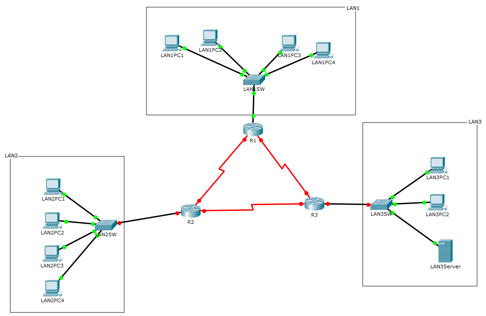

# 实验要求

**分配的IP地址：**

- LAN1分配地址段为202.196.1.0/24，LAN1PC1和LAN1PC2属于vlan 10，LAN1PC3和LAN1PC4属于vlan 20

- LAN2分配私有地址段:192.168.1.0/24

- LAN3分配外部地址段:202.196.2.0/24

**各个LAN配置要求：** 

- 在LAN1中完成地址动态分配，LAN1PC1，LAN1PC2，LAN1PC3，LAN1PC4能够互相访问
- 在LAN2中完成NAT，使其中的计算机能够把地址转换成公网IP访问外面网络
- 在LAN3中配置LAN3Server服务器，为全网络提供Web服务，并配置DNS，网络中所有计算机可以通过域名访问该网站；配置FTP服务，全网计算机可使用该服务
- 路由器之间运行RIP协议生成动态路由
- 使LAN2中的计算机可以ping通外面的计算机，外面的计算机不能够ping通里面的机器，以达到保护LAN2中计算机不受外面攻击（实现方案不限）

# 技术分析

- VLAN配置
- VLAN间通信
- DHCP配置
- NAT技术
- RIP路由配置
- 浮动路由配置
- HTTP服务器配置
- DNS服务器配置
- FTP服务器配置

# 操作环境

网络模拟器：

- Cisco Packet Tracer v7.0

测试系统：

- Windows 10

# 操作步骤

1. 网络基础架构在Packet Tracer中复现，复现拓扑如图1所示。

   

   <center>图1</center>

2. IP地址分配及设备功能性标注，如图2所示。

   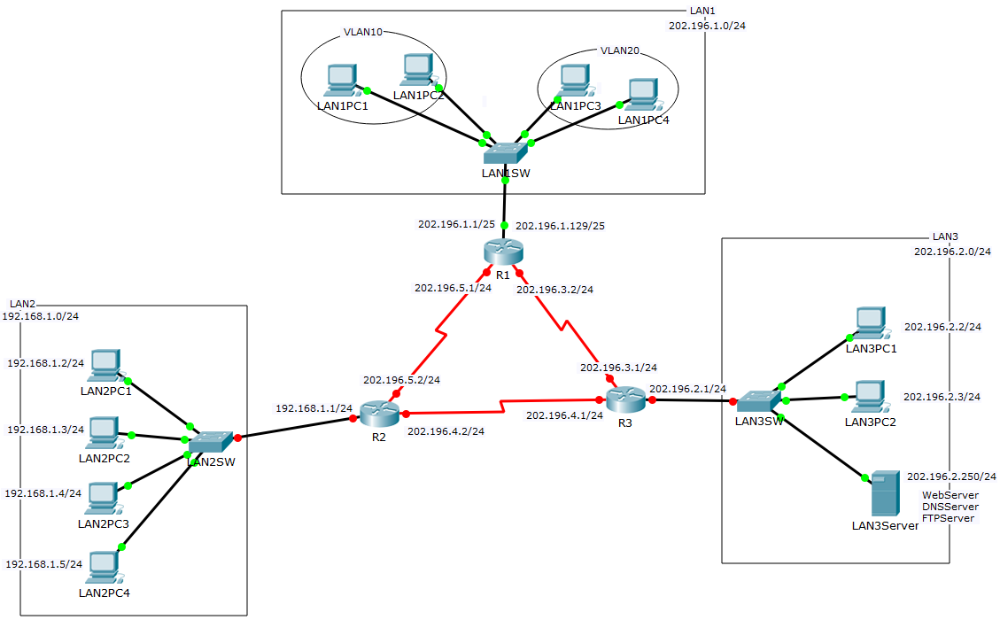

   <center>图2</center>

3. 在LAN1SW交换机中进行基于端口的VLAN配置操作，将LAN1PC1和LAN1PC2划分到VLAN10中，将LAN1PC3和LAN1PC4划分到VLAN20中，配置命令如图3所示。

   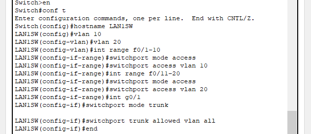

   <center>图3</center>

4. 在R1路由器中配置DHCP服务，将202.196.1.2~202.196.1.127和202.196.1.130~202.196.1.254网段内的IP分别分配给VLAN10和VLAN20，配置命令如图4所示。

   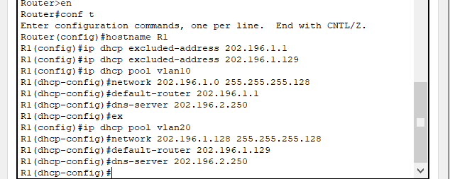

   <center>图4</center>
DHCP服务配置完成之后LAN1PC1和LAN1PC3通过DHCP获得的IP分别为图5和图6所示。
   

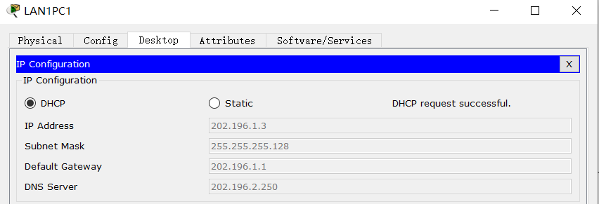

<center>图5</center>
   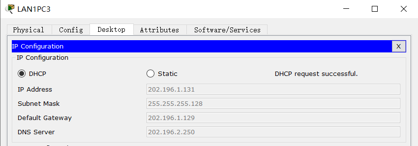

   <center>图6</center>
5. 在R1路由器的G0/0端口配置单臂路由，以实现VLAN10和VLAN20之间的通信，配置 命令如图7所示。

   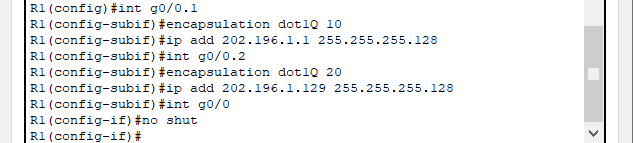

   <center>图7</center>
单臂路由配置完成之后，LAN1PC1和LAN1PC3之间的连通性如图8所示。
   

.png)

<center>图8</center>
6. 配置R1路由器端口的IP地址，配置命令如图9所示。

   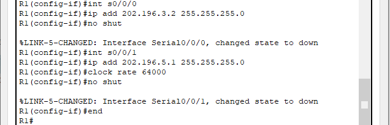

   <center>图9</center>

7. 配置R2路由器端口的IP地址，配置命令如图10所示。

   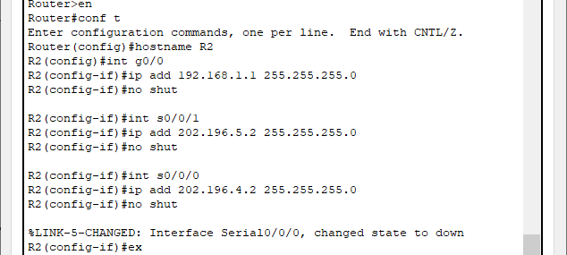

   <center>图10</center>

8. 在R2路由器上进行基于端口的NAT配置，使LAN2中的主机可以访问Internet，配置命令如图11所示。

   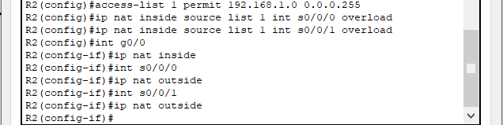

   <center>图11</center>

9. 配置R3路由器端口的IP地址，配置命令如图12所示。

   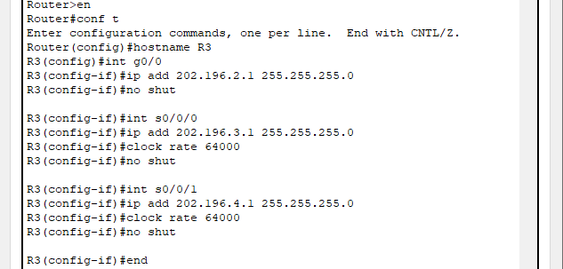

   <center>图12</center>

10. 在LAN3Server上配置Web服务

- 开启HTTP服务如图13所示

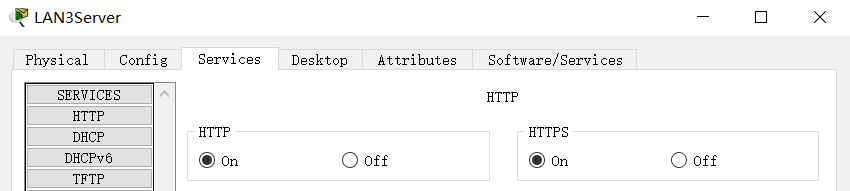

<center>图13</center>
- 编辑index.html页面如图14所示
  

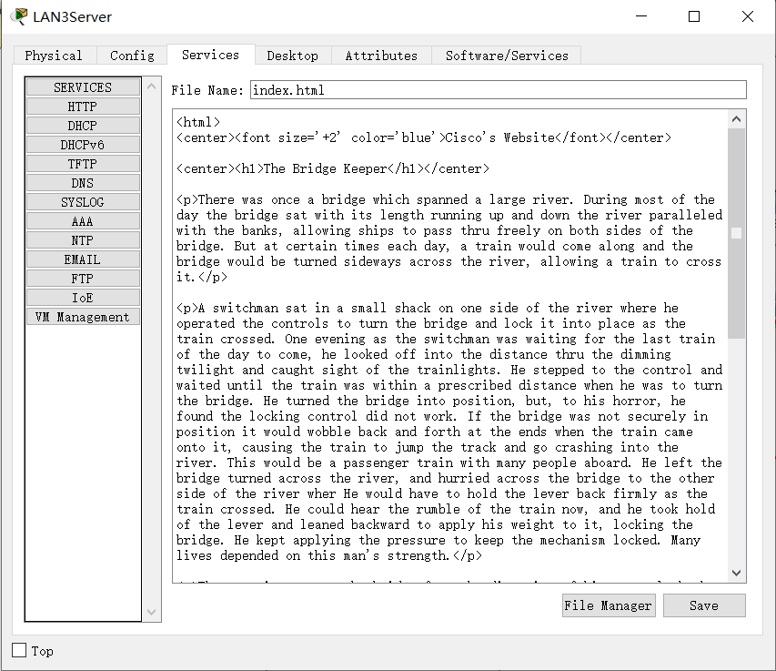

<center>图14</center>
- 在LAN3PC1主机上测试Web服务器配置结果如图15所示


<center>图15</center>
11. 在LAN3Server上配置DNS服务

- 开启DNS服务并为LAN3Server的HTTP服务配置一天记录，如图16所示

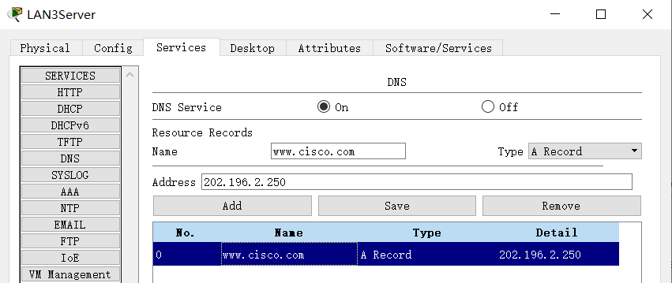

<center>图16</center>
- 在LAN3PC1主机上测试DNS服务器的配置结果，如图17所示


<center>图17</center>
12. 在LAN3Server上配置FTP服务

- 开启FTP服务并添加一个FTP用户，如图18所示

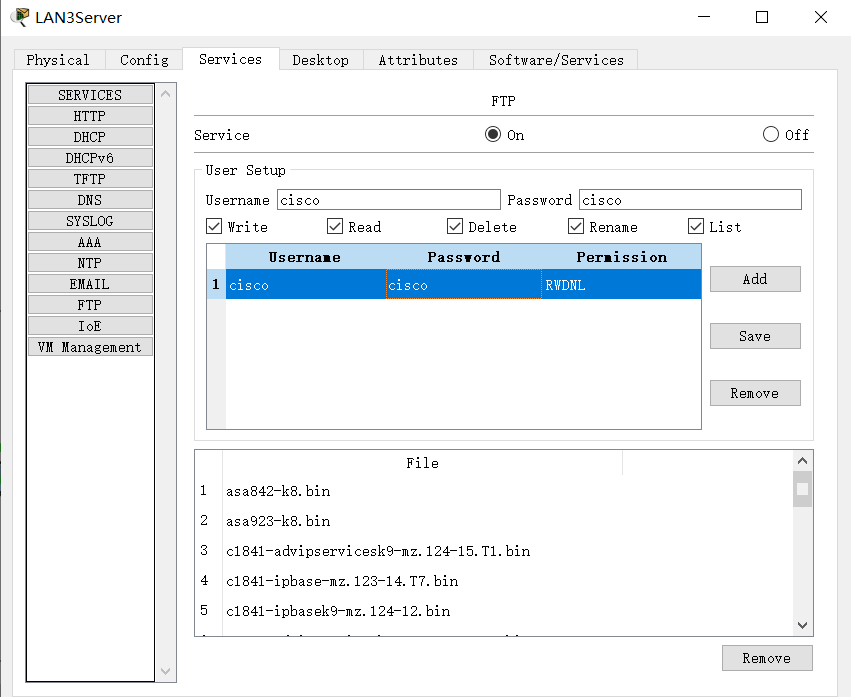

<center>图18</center>
- 在LAN3PC1主机上测试FTP服务的配置结果，如图19所示


<center>图19</center>
13. RIP动态路由配置。

- R1路由器的RIP配置命令如图20所示


<center>图20</center>
- R2路由器的RIP配置命令如图21所示


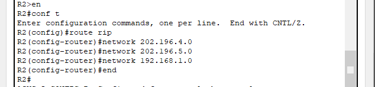

<center>图21</center>
- R3路由器的RIP配置命令如图22所示

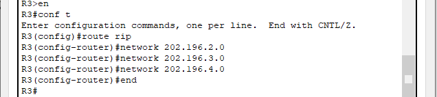

<center>图22</center>
- RIP配置完成之后LAN3PC2主机去pingLAN2PC1主机，测试结果如图23所示。


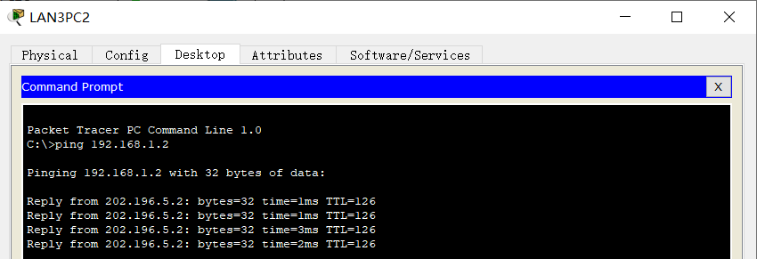

<center>图23</center>
<font color="red">LAN3内部主机可以ping通LAN2内部主机，在配置RIP时把私有IP当作共有IP来使用了，这个结果也不满足实验的要求，所以需要进行第14条操作。</font>

14. 在R2路由器上配置浮动路由，在配置浮动路由之前需要把之前多余的RIP配置删除掉。

- 在R2上删除多余的RIP配置，操作命令如图24所示

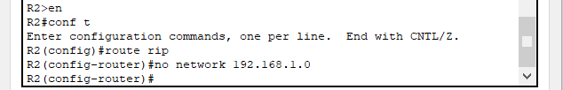

<center>图24</center>
- 清除路由器的路由缓存，操作命令如图25所示。


<center>图25</center>
- 在R2上配置浮动路由，配置命令如图26所示。

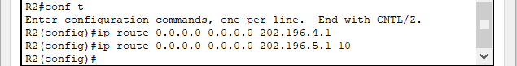

<center>图26</center>
# 操作结果

- LAN1PC2与LAN1PC4的连通性测试结果如图27所示。

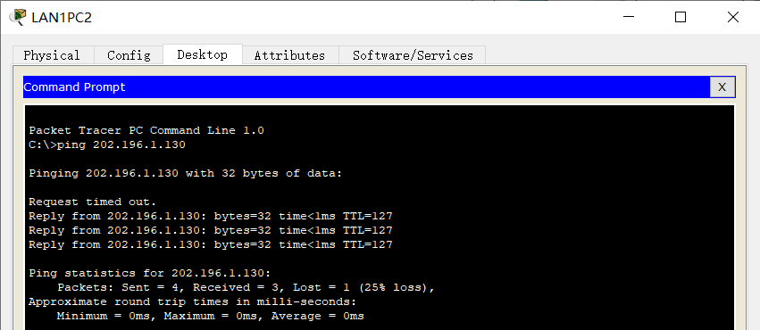

<center>图27</center>
- LAN1PC2与LAN2PC1的连通性测试结果如图28所示。

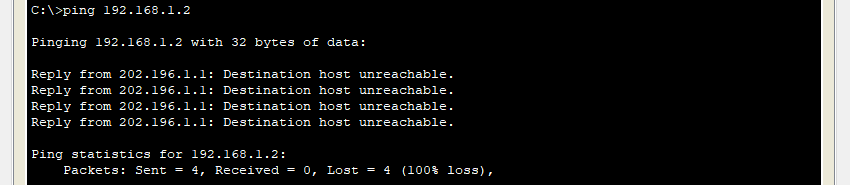

<center>图28</center>
- LAN1PC2访问WebServer测试结果如图29所示。


<center>图29</center>
- LAN2PC1与LAN1PC1的连通性测试结果如图30所示。

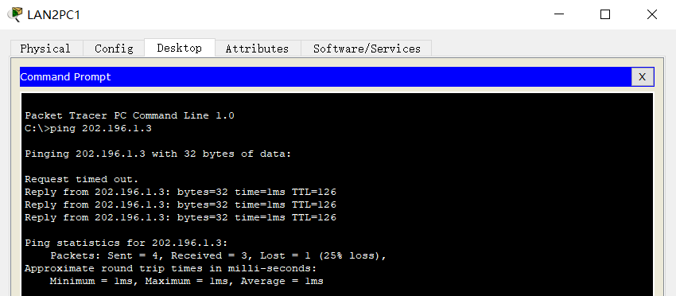

<center>图30</center>
- LAN2PC1与LAN3PC 1的连通性测试结果如图31所示。

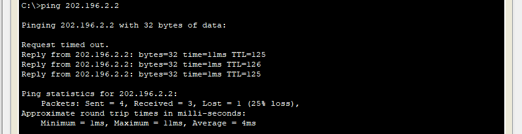

<center>图31</center>
- LAN2PC1到LAN3PC1的ping测试中，R2到R3时截获的ICMP报文如图32所示。

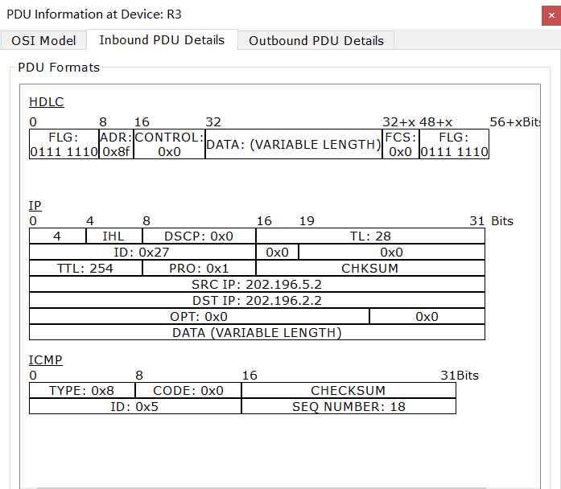

<center>图32</center>
- LAN2PC1访问WebServer测试结果如图33所示。

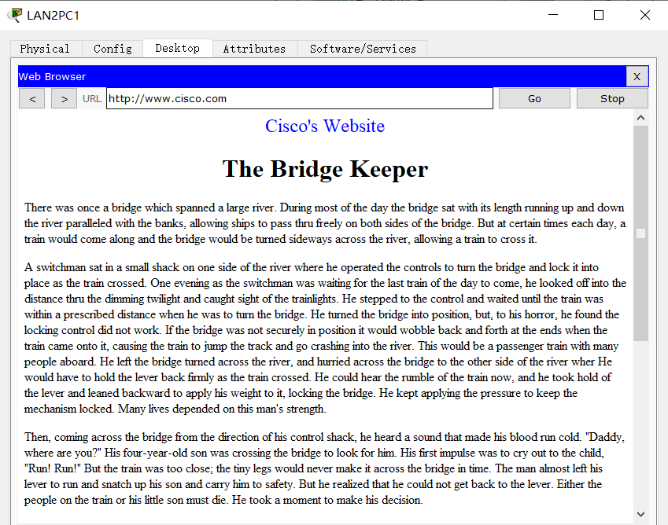

<center>图33</center>
- LAN3PC1与LAN1PC3的连通性测试结果如图34所示。

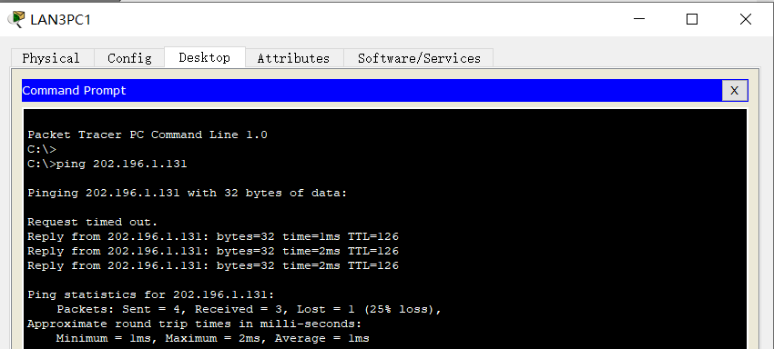

<center>图34</center>
- LAN3PC1与LAN2PC1的连通性测试结果如图35所示。

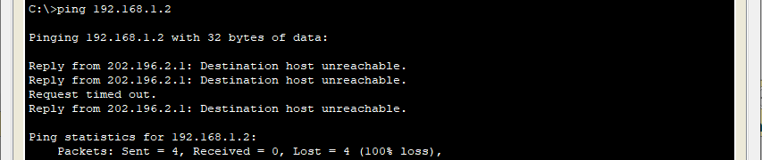

<center>图35</center>
- LAN1PC1访问FTPServer测试结果如图36所示。

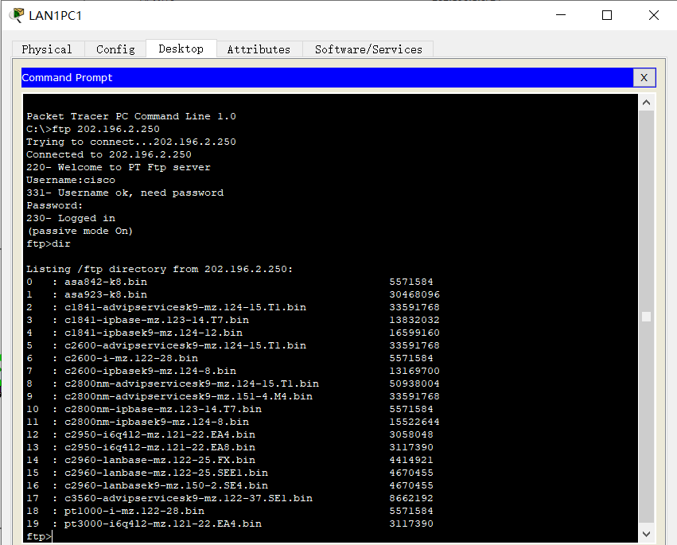

<center>图36</center>
- LAN2PC4访问FTPServer测试结果如图37所示。

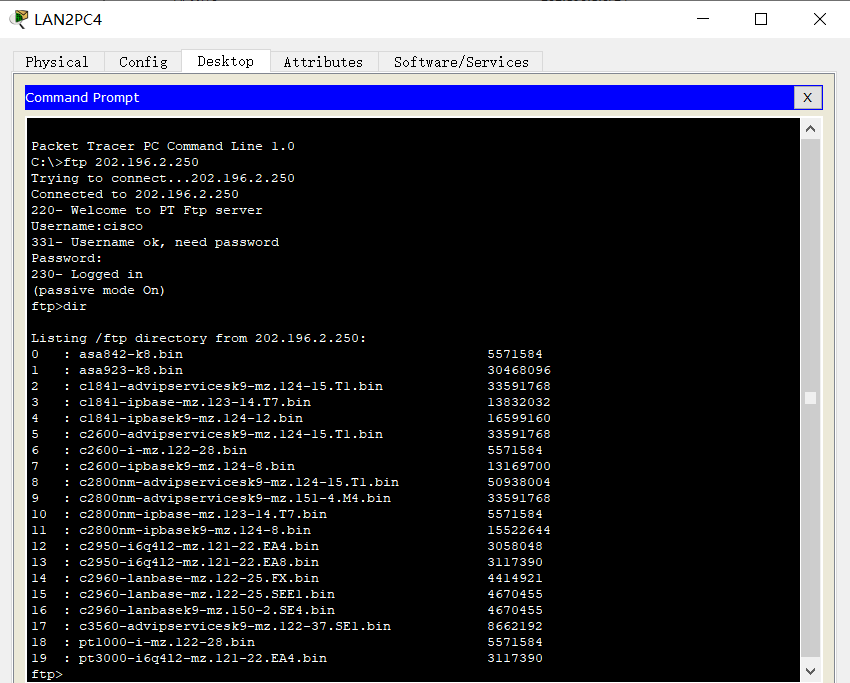

<center>图37</center>
# 附录

## 配置命令脚本

LAN1部分配置：

- LAN1SW上的VLAN配置

  ```sql
  en
  conf t
  hostname LAN1SW
  vlan 10
  vlan 20
  int range f0/1-10
  switchport mode access
  switchport access vlan 10
  int range f0/11-20
  switchport mode access
  switchport access vlan 20
  int g0/1
  switchport mode trunk
  switchport trunk allowed vlan all
  end
  ```

  

- R1上的DHCP配置

  ```sql
  en
  conf t
  hostname R1
  ip dhcp excluded-address 202.196.1.1 
  ip dhcp excluded-address 202.196.1.129
  ip dhcp pool vlan10 
  network 202.196.1.0 255.255.255.128
  default-router 202.196.1.1
  dns-server 202.196.2.250
  ex
  ip dhcp pool vlan20
  network 202.196.1.128 255.255.255.128
  default-router 202.196.1.129 
  dns-server 202.196.2.250
  end
  ```

  

- R1上的单臂路由配置

  ```sql
  en
  conf t
  int g0/0.1 
  encapsulation dot1Q 10
  ip add 202.196.1.1 255.255.255.128
  int g0/0.2
  encapsulation dot1Q 20
  ip add 202.196.1.129 255.255.255.128
  int g0/0
  no shut
  end
  ```

  

- R1其他端口IP配置

  ```sql
  en
  conf t
  int s0/0/0
  ip add 202.196.3.2 255.255.255.0
  no shut
  int s0/0/1
  ip add 202.196.5.1 255.255.255.0
  clock rate 64000
  no shut
  end
  ```

  

LAN2部分配置：

- R2上的IP配置

  ```sql
  en
  conf t
  hostname R2
  int g0/0
  ip add 192.168.1.1 255.255.255.0
  no shut
  int s0/0/1
  ip add 202.196.5.2 255.255.255.0
  no shut
  int s0/0/0
  ip add 202.196.4.2 255.255.255.0
  no shut
  end
  ```

  

- R2上的NAT配置

  ```sql
  en
  conf t
  access-list 1 permit 192.168.1.0 0.0.0.255 
  ip nat inside source list 1 int s0/0/0 overload
  ip nat inside source list 1 int s0/0/1 overload
  int g0/0
  ip nat inside
  int s0/0/0
  ip nat outside
  int s0/0/1
  ip nat outside
  end
  ```

  

- R2上的浮动路由配置

  ```sql
  en
  conf t
  ip route 0.0.0.0 0.0.0.0 202.196.4.1
  ip route 0.0.0.0 0.0.0.0 202.196.5.1 10
  end
  ```

  

LAN3部分配置：

- R3上的IP配置

  ```sql
  en
  conf t
  hostname R3
  int g0/0
  ip add 202.196.2.1 255.255.255.0
  no shut
  int s0/0/0
  ip add 202.196.3.1 255.255.255.0
  clock rate 64000
  no shut
  int s0/0/1
  ip add 202.196.4.1 255.255.255.0
  clock rate 64000
  no shut
  end
  ```

  

全局RIP配置：

- R1的RIP配置

  ```sql
  en
  conf t
  route rip
  network 202.196.1.0
  network 202.196.3.0
  network 202.196.5.0
  end
  ```

  

- R2的RIP配置

  ```sql
  en
  conf t
  route rip
  network 202.196.4.0
  network 202.196.5.0
  end
  ```

  

- R3的RIP配置

  ```sql
  en
  conf t
  route rip
  network 202.196.2.0
  network 202.196.3.0
  network 202.196.4.0
  end
  ```

## 其他相关命令

- [#]<font color="red">clear ip route *</font>：清除生成的路由表
- [#]<font color="red">show run</font>：查看系统当前配置
- [#]<font color="red">copy run start</font>：保存系统当前配置
- [#]<font color="red">reload</font>：重启系统

## 操作思路

```html
1、网络拓扑设计
	-> 网络设备的放置
	-> 网络设备的命名
	-> IP地址的划分
	
2、基础配置
	-> PC的静态IP地址
	-> Server的静态IP配置
	
3、LAN1配置
	-> LAN1SW配置：
		-> 基于端口的VLAN配置：
		
	-> 配置R1的DHCP功能
	
	-> 单臂路由实现VLAN之间的通信
	
	-> R1基本IP配置
	
	
4、LAN2配置：
	-> R2配置
		-> 基本IP配置
		
		-> 浮动路由配置
		
		-> NAT配置
		
		-> ACL配置（不适用ACL完成要求）


5、LAN3配置：
	-> LAN3Server配置：
		-> 关闭无用服务
			-> 关闭DHCP、DHCPv6、AAA、EMAIL、IoE、VM Management服务
		-> 配置HTTP服务（重写网页信息）
		-> 配置DNS服务
		-> 配置FTP服务
		-> PC端测试
		
	-> R3基本IP配置
	
6、RIP动态路由配置
```


## 网站文本

```html
<center><h1>The Bridge Keeper</h1></center>

<p>There was once a bridge which spanned a large river. During most of the day the bridge sat with its length running up and down the river paralleled with the banks, allowing ships to pass thru freely on both sides of the bridge. But at certain times each day, a train would come along and the bridge would be turned sideways across the river, allowing a train to cross it.</p>

<p>A switchman sat in a small shack on one side of the river where he operated the controls to turn the bridge and lock it into place as the train crossed. One evening as the switchman was waiting for the last train of the day to come, he looked off into the distance thru the dimming twilight and caught sight of the trainlights. He stepped to the control and waited until the train was within a prescribed distance when he was to turn the bridge. He turned the bridge into position, but, to his horror, he found the locking control did not work. If the bridge was not securely in position it would wobble back and forth at the ends when the train came onto it, causing the train to jump the track and go crashing into the river. This would be a passenger train with many people aboard. He left the bridge turned across the river, and hurried across the bridge to the other side of the river wher He would have to hold the lever back firmly as the train crossed. He could hear the rumble of the train now, and he took hold of the lever and leaned backward to apply his weight to it, locking the bridge. He kept applying the pressure to keep the mechanism locked. Many lives depended on this man's strength.</p>

<p>Then, coming across the bridge from the direction of his control shack, he heard a sound that made his blood run cold. "Daddy, where are you?" His four-year-old son was crossing the bridge to look for him. His first impulse was to cry out to the child, "Run! Run!" But the train was too close; the tiny legs would never make it across the bridge in time. The man almost left his lever to run and snatch up his son and carry him to safety. But he realized that he could not get back to the lever. Either the people on the train or his little son must die. He took a moment to make his decision.</p>

<p>The train sped safely and swiftly on its way, and no one aboard was even aware of the tiny broken body thrown mercilessly into the river by the onrushing train. Nor were they aware of the pitiful figure of the sobbing man, still clinging tightly to the locking lever long after the train had passed. They did not see him walking home more slowly than he had ever walked: to tell his wife how their son had brutally died.</p>

<p>Now if you comprehend the emotions which went this man's heart, you can begin to understand the feelings of our Father in Heaven when He sacrificed His Son to bridge the gap between us and eternal life. Can there be any wonder that He caused the earth to tremble and the skies to darken when His Son died? How does He feel when we speed along thru life without giving a thought to what was done for us thru Jesus Christ?</p>
```

