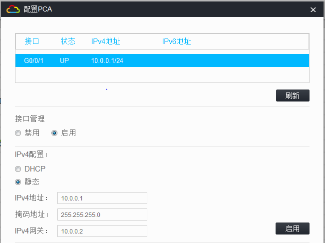

> ---
>
> +Title：《H3C-OSPF》
>
> +Author：Pleione_Plus
>
> +Started Date：August 13th. 2019.
>
> +Finished Date：August 13th. 2019.
>
> ---

# 实验目的

- 掌握单区域OSPF配置方法
- 掌握OSPF优先级的配置方法
- 掌握OSPF Cost的配置方法
- 掌握OSPF路由选择的方法
- 掌握多区域OSPF的配置方法

# 实验内容

&emsp;&emsp;配置多区域的OSPF，实现不同区域中的PC之间可以相互连通(PCA与PCB之间连通)。

# 实验拓扑


# 实验编址

| 设备 | 接口 |  IP地址  |   子网掩码    | 默认网关 |
| :--: | :--: | :------: | :-----------: | :------: |
| PCA  | g0/1 | 10.0.0.1 | 255.255.255.0 | 10.0.0.2 |
| PCB  | g0/1 | 10.1.0.1 | 255.255.255.0 | 10.1.0.2 |
| RTA  | g0/1 | 10.0.0.2 | 255.255.255.0 |   N/A    |
|      | g0/0 | 20.0.0.1 | 255.255.255.0 |   N/A    |
| RTB  | g0/0 | 20.0.0.2 | 255.255.255.0 |   N/A    |
|      | g0/1 | 30.0.0.2 | 255.255.255.0 |   N/A    |
| RTC  | g0/0 | 30.0.0.1 | 255.255.255.0 |   N/A    |
|      | g0/1 | 10.1.0.2 | 255.255.255.0 |   N/A    |

# 实验步骤

## 配置PCA主机IP地址



## 配置PCB主机IP地址


## 配置RTA路由器


命令脚本：

```sql
system-view
sysname RTA 
int g0/1
ip add 10.0.0.2 24
int g0/0
ip add 20.0.0.1 24
int loopback 0
ip add 1.1.1.1 32
quit
route id 1.1.1.1
ospf 1
area 0
network 1.1.1.1 0.0.0.0
network 10.0.0.0 0.0.0.255
network 20.0.0.0 0.0.0.255
end
save
y
```

## 配置RTB路由器


命令脚本：

```sql
system-view
sysname RTB 
int g0/1
ip add 30.0.0.2 24
int g0/0
ip add 20.0.0.2 24
int loopback 0
ip add 2.2.2.2 32
quit
route id 2.2.2.2
ospf 1
area 0
network 2.2.2.2 0.0.0.0
network 20.0.0.0 0.0.0.255
area 1
network 30.0.0.0 0.0.0.255
end
save
y
```

## 配置RTC路由器


命令脚本：

```sql
system-view
sysname RTA 
int g0/1
ip add 10.1.0.2 24
int g0/0
ip add 30.0.0.1 24
int loopback 0
ip add 3.3.3.3 32
quit
route id 3.3.3.3
ospf 1
area 1
network 3.3.3.3 0.0.0.0
network 10.1.0.0 0.0.0.255
network 30.0.0.0 0.0.0.255
end
save
y
```


## 结果测试


# 附录

## 完整命令脚本(带注释版)：

RTA命令脚本：

```sql
--从用户视图进入系统视图
system-view
--设置路由器的名称
sysname RTA 
--从系统视图进入接口视图
int g0/1
--设置端口的IP地址
ip add 10.0.0.2 24
--跳转到g0/0接口视图
int g0/0
--设置端口的IP地址
ip add 20.0.0.1 24
--进入回环接口
int loopback 0
--设置端口的IP地址
ip add 1.1.1.1 32
--回退到系统视图
quit
--设置路由器的Route-ID
route id 1.1.1.1
--配置OSPF
ospf 1
--设置区域
area 0
--指示路由器的相邻网段
network 1.1.1.1 0.0.0.0
network 10.0.0.0 0.0.0.255
network 20.0.0.0 0.0.0.255
--回退到用户视图
end
--保存当前配置
save
y
```

RTB命令脚本：

```sql
--从用户视图进入系统视图
system-view
--设置路由器的名称
sysname RTB 
--从系统视图进入接口视图
int g0/1
--设置端口的IP地址
ip add 30.0.0.2 24
--跳转到g0/0接口视图
int g0/0
--设置端口的IP地址
ip add 20.0.0.2 24
--进入回环接口
int loopback 0
--设置端口的IP地址
ip add 2.2.2.2 32
--回退到系统视图
quit
--设置路由器的Route-ID
route id 2.2.2.2
--配置OSPF
ospf 1
--设置区域
area 0
--指示路由器的相邻网段
network 2.2.2.2 0.0.0.0
network 20.0.0.0 0.0.0.255
--设置区域
area 1
--指示路由器的相邻网段
network 30.0.0.0 0.0.0.255
--回退到用户视图
end
--保存当前配置
save
y
```

RTC命令脚本：

```sql
--从用户视图进入系统视图
system-view
--设置路由器的名称
sysname RTA 
--从系统视图进入接口视图
int g0/1
--设置端口的IP地址
ip add 10.1.0.2 24
--跳转到g0/0接口视图
int g0/0
--设置端口的IP地址
ip add 30.0.0.1 24
--进入回环接口
int loopback 0
--设置端口的IP地址
ip add 3.3.3.3 32
--回退到系统视图
quit
--设置路由器的Route-ID
route id 3.3.3.3
--配置OSPF
ospf 1
--设置区域
area 1
--指示路由器的相邻网段
network 3.3.3.3 0.0.0.0
network 10.1.0.0 0.0.0.255
network 30.0.0.0 0.0.0.255
--回退到用户视图
end
--保存当前配置
save
y
```


## 完整命令脚本(无注释，可直接粘贴)：

RTA命令脚本：

```sql
system-view
sysname RTA 
int g0/1
ip add 10.0.0.2 24
int g0/0
ip add 20.0.0.1 24
int loopback 0
ip add 1.1.1.1 32
quit
route id 1.1.1.1
ospf 1
area 0
network 1.1.1.1 0.0.0.0
network 10.0.0.0 0.0.0.255
network 20.0.0.0 0.0.0.255
end
save
y
```

RTB命令脚本：

```sql
system-view
sysname RTB 
int g0/1
ip add 30.0.0.2 24
int g0/0
ip add 20.0.0.2 24
int loopback 0
ip add 2.2.2.2 32
quit
route id 2.2.2.2
ospf 1
area 0
network 2.2.2.2 0.0.0.0
network 20.0.0.0 0.0.0.255
area 1
network 30.0.0.0 0.0.0.255
end
save
y
```

RTC命令脚本：

```sql
system-view
sysname RTA 
int g0/1
ip add 10.1.0.2 24
int g0/0
ip add 30.0.0.1 24
int loopback 0
ip add 3.3.3.3 32
quit
route id 3.3.3.3
ospf 1
area 1
network 3.3.3.3 0.0.0.0
network 10.1.0.0 0.0.0.255
network 30.0.0.0 0.0.0.255
end
save
y
```

