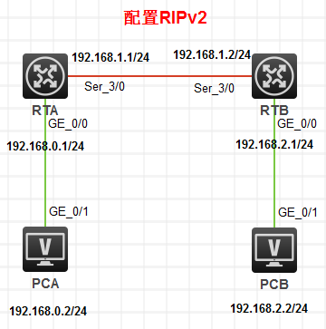
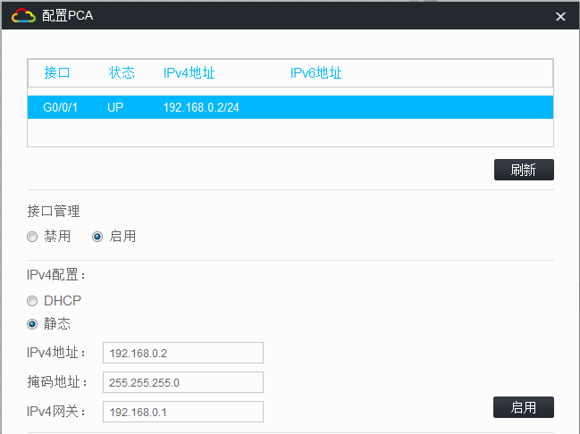
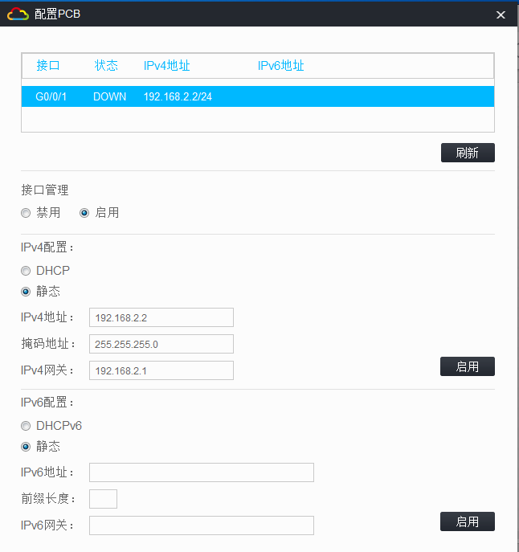
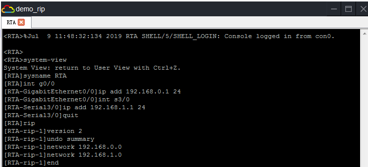
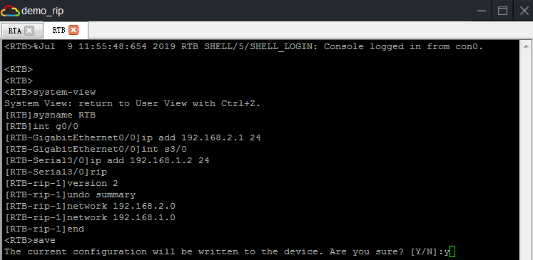
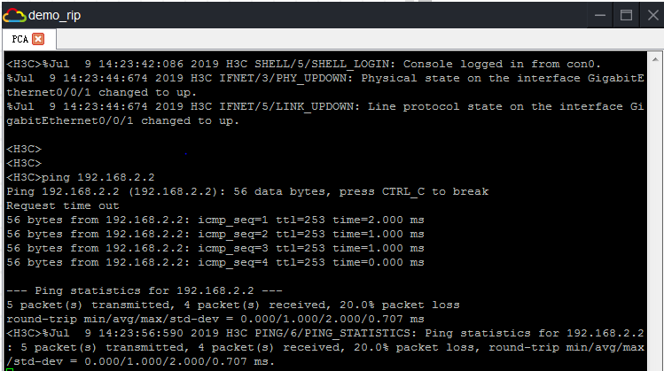

> ---
>
> +Title：《H3C-RIP》
>
> +Author：Pleione_Plus
>
> +Started Date：August 13th. 2019.
>
> +Finished Date：August 13th. 2019.
>
> ---


# 实验目的

- 加深RIP协议原理的理解
- 了解RIP实现运行机制
- 熟悉RIP静态路由配置
- 熟悉RIP路由维护

# 实验内容

&emsp;&emsp;在一个连通区域内配置动态路由——RIP，实现PCA与PCB之间互通。

# 实验拓扑



# 实验编址

| 设备 | 接口 |   IP地址    |   子网掩码    |  默认网关   |
| :--: | :--: | :---------: | :-----------: | :---------: |
| PCA  | g0/1 | 192.168.0.2 | 255.255.255.0 | 192.168.0.1 |
| PCB  | g0/1 | 192.168.2.2 | 255.255.255.0 | 192.168.2.1 |
| RTA  | g0/0 | 192.168.0.1 | 255.255.255.0 |     N/A     |
|      | s3/0 | 192.168.1.1 | 255.255.255.0 |     N/A     |
| RTB  | g0/0 | 192.168.2.1 | 255.255.255.0 |     N/A     |
|      | s3/0 | 192.168.1.2 | 255.255.255.0 |     N/A     |

# 实验步骤

## 配置PCA主机IP地址



## 配置PCB主机IP地址



## 配置RTA路由器



命令脚本：

```sql
system-view
sysname RTA 
int g0/0
ip add 192.168.0.1 24
int s3/0
ip add 192.168.1.1 24
quit
rip
version 2
undo summary
network 192.168.0.0
network 192.168.1.0
end
```

## 配置RTB路由器



命令脚本：

```sql
system-view
sysname RTB
int g0/0
ip add 192.168.2.1 24
int s3/0
ip add 192.168.1.2 24
rip
version 2
undo summary
network 192.168.2.0
network 192.168.1.0
end
```


## 结果测试



# 附录

## 完整命令脚本(带注释版)：

RTA命令脚本：

```sql
--从用户视图进入系统视图
system-view
--设置路由器的名称
sysname RTA 
--从系统视图进入接口视图
int g0/0
--设置端口的IP地址
ip add 192.168.0.1 24
--跳转到s3/0接口视图
int s3/0
--设置端口的IP地址
ip add 192.168.1.1 24
--回退到系统视图
quit
--配置RIP协议
rip
--设置RIP协议版本
version 2
--关闭链路聚合功能
undo summary
--指示路由器的相邻网段
network 192.168.0.0
network 192.168.1.0
--回退到用户视图
end
--保存当前配置
save
y
```

RTB命令脚本：

```sql
--从用户视图进入系统视图
system-view
--设置路由器的名称
sysname RTB
--从系统视图进入接口视图
int g0/0
--设置端口的IP地址
ip add 192.168.2.1 24
--跳转到s3/0接口视图
int s3/0
--设置端口的IP地址
ip add 192.168.1.2 24
--配置RIP协议
rip
--设置RIP协议版本
version 2
--关闭链路聚合功能
undo summary
--指示路由器的相邻网段
network 192.168.2.0
network 192.168.1.0
--回退到用户视图
end
--保存当前配置
save
y
```


## 完整命令脚本(无注释，可直接粘贴)：

RTA命令脚本：

```sql
system-view
sysname RTA 
int g0/0
ip add 192.168.0.1 24
int s3/0
ip add 192.168.1.1 24
quit
rip
version 2
undo summary
network 192.168.0.0
network 192.168.1.0
end
save
y
```

RTB命令脚本：

```sql
system-view
sysname RTB
int g0/0
ip add 192.168.2.1 24
int s3/0
ip add 192.168.1.2 24
rip
version 2
undo summary
network 192.168.2.0
network 192.168.1.0
end
save
y
```

