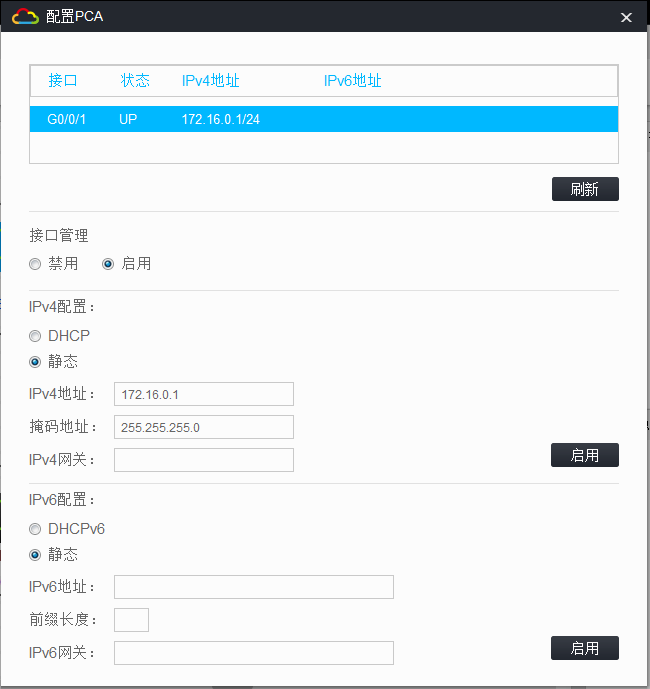
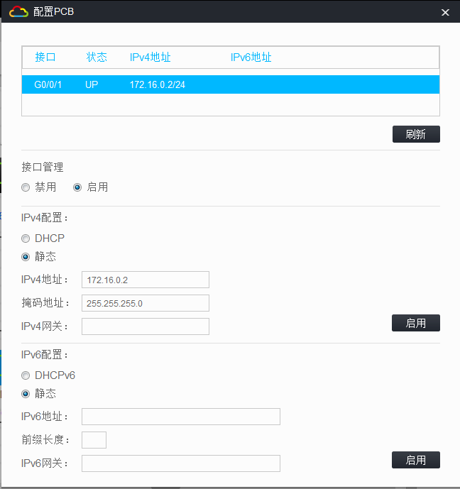
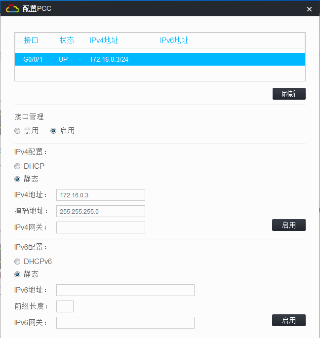
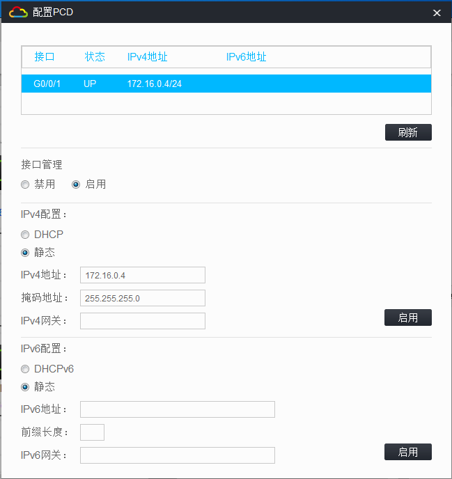
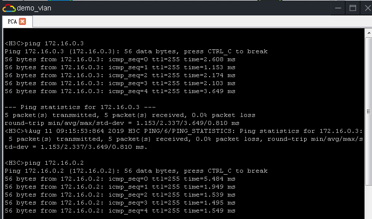
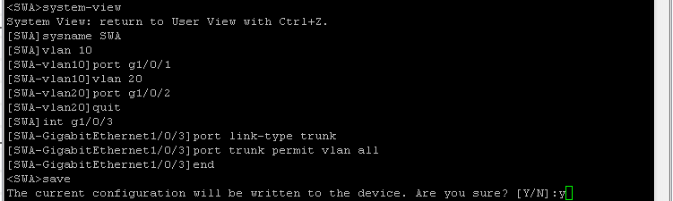
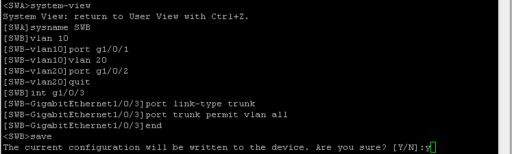
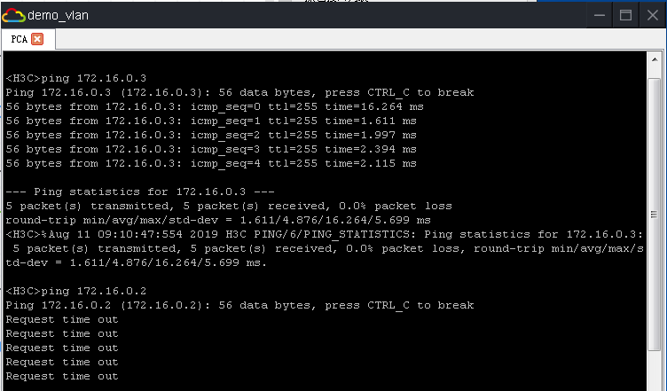

+++++++++++++++++++++++++++++++++++++++++++++++++++

+Title:H3C-VLAN

+Author:Pleione_Plus

+Finished Date:August 11th. 2019

+++++++++++++++++++++++++++++++++++++++++++++++++++

# 原理概述

​		早期的局域网是基于总线型结构的。总线型拓扑结构是由一根单电缆连接着所有主机，这种局域网技术存在着冲突域问题，即所有用户都在一个冲突域中，那么同一时间内只有一台主机能发送消息，从任意设备发出的消息都会被其他所有主机接收到，用户可能收到大量不需要的报文；而且所有主机共享一条传输通道，任意主机之间都可以直接互相访问，无法控制信息的安全。

​		为了避免冲突域，同时扩展传统局域网以接入更多计算机，可以在局域网中使用二层交换机。交换机能有效隔离冲突域，但是由于所有计算机仍处于同一个广播域，任意设备都能接收到所有报文，不但降低了网络的效率，而且降低了安全性，即广播域和信息安全问题依旧存在。为了能减少广播，提高局域网安全性，人们使用虚拟局域网即VLAN技术把一个物理的LAN在逻辑上划分成多个广播域。VLAN内的主机间可以直接通信，而VLAN间不能直接互通。不同的VLAN使用不同的VLAN ID区分，VLAN ID的范围是0~4095，可配置的值为1~4094，0和4095为保留值。

​		Access接口是交换机上用来连接用户主机的接口。当Access接口从主机收到一个不带VLAN标签的数据帧时，会给该数据帧加上与PVID一致的VLAN标签（PVID可手工配置，默认是1，即所有交换机上的接口默认都属于VLAN1）。当Access接口要发送一个带VLAN标签的数据帧给主机时，首先检查该数据帧的VLAN ID是否与自己的PVID相同，若相同，则去掉VLAN标签后发送该数据帧给主机；若不相同，直接丢弃该数据帧。

# 实验目的

- 掌握VLAN的基本工作原理
-  掌握Access链路端口和Trunk链路端口的基本配置

# 实验内容

​		将PCA与PCC划分到VLAN10内，将PCB与PCD划分到VLAN20内，相同VLAN内的PC之间可以ping通，不同VLAN的PC之间不能ping通。

# 实验拓扑


# 实验编址

| 设备 |                 接口                 |   IP地址   |   子网掩码    | 默认网关 |
| :--: | :----------------------------------: | :--------: | :-----------: | :------: |
| PCA  |                 g0/1                 | 172.16.0.1 | 255.255.255.0 |   N/A    |
| PCB  |                 g0/1                 | 172.16.0.2 | 255.255.255.0 |   N/A    |
| PCC  |                 g0/1                 | 172.16.0.3 | 255.255.255.0 |   N/A    |
| PCD  |                 g0/1                 | 172.16.0.4 | 255.255.255.0 |   N/A    |
| SWA  | g1/0/1<br />g1/0/2<br />g1/0/3<br /> |    N/A     |      N/A      |   N/A    |
| SWB  | g1/0/1<br />g1/0/2<br />g1/0/3<br /> |    N/A     |      N/A      |   N/A    |

# 实验步骤

## 基本配置 ##

### 配置PCA主机的IP地址



### 配置PCB主机的IP地址



### 配置PCC主机的IP地址



### 配置PCD主机的IP地址



### 测试PCA与PCB、PCC的连通性



## VLAN配置

### SWA的VLAN配置



命令脚本：

```sql
system-view
sysname SWA
vlan 10
port g1/0/1 
vlan 20
port g1/0/2
quit
int g1/0/3
port link-type trunk
port trunk permit vlan all
end
save
y
```

### SWB的VLAN配置



命令脚本：

```sql
system-view
sysname SWB
vlan 10
port g1/0/1 
vlan 20
port g1/0/2
quit
int g1/0/3
port link-type trunk
port trunk permit vlan all
end
save
y
```


## 结果测试



# 附录

## 完整命令脚本(带注释版)：

SWA命令脚本：

```sql
--从用户视图进入系统视图
system-view
--设置交换机的名称
sysname SWA
--创建VLAN 10
vlan 10
--添加VLAN 10的成员端口
port g1/0/1 
--创建VLAN 20
vlan 20
--添加VLAN 20的成员端口
port g1/0/2
--退出到系统视图
quit
--从系统视图进入接口视图
int g1/0/3
--设置端口的类型为trunk
port link-type trunk
--设置可通过该端口的VLAN
port trunk permit vlan all
--回退到用户视图
end
--保存当前配置
save
y
```

SWB命令脚本：

```sql
--从用户视图进入系统视图
system-view
--设置交换机的名称
sysname SWB
--创建VLAN 10
vlan 10
--添加VLAN 10的成员端口
port g1/0/1 
--创建VLAN 20
vlan 20
--添加VLAN 20的成员端口
port g1/0/2
--退出到系统视图
quit
--从系统视图进入接口视图
int g1/0/3
--设置端口的类型为trunk
port link-type trunk
--设置可通过该端口的VLAN
port trunk permit vlan all
--回退到用户视图
end
--保存当前配置
save
y
```


## 完整命令脚本(无注释，可直接粘贴)：

SWA命令脚本：

```sql
system-view
sysname SWA
vlan 10
port g1/0/1 
vlan 20
port g1/0/2
quit
int g1/0/3
port link-type trunk
port trunk permit vlan all
end
save
y
```

SWB命令脚本：

```sql
system-view
sysname SWB
vlan 10
port g1/0/1 
vlan 20
port g1/0/2
quit
int g1/0/3
port link-type trunk
port trunk permit vlan all
end
save
y
```