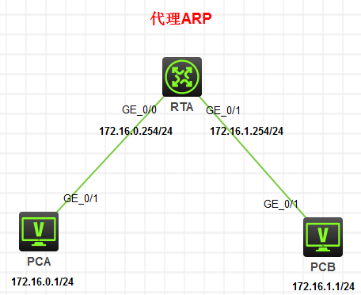
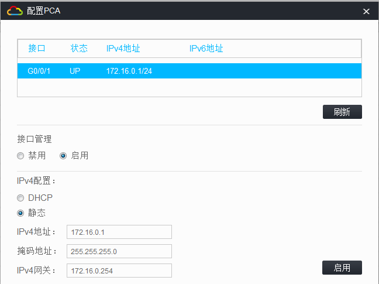
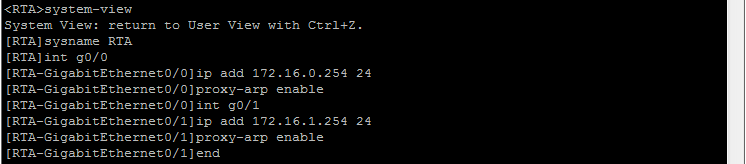
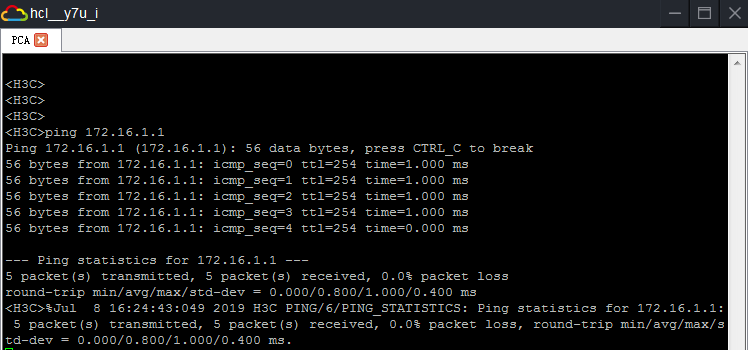

> ---
>
> +Title：《H3C-代理ARP》
>
> +Author：Pleione_Plus
>
> +Started Date：August 13th. 2019.
>
> +Finished Date：August 13th. 2019.
>
> ---

# 实验目的

- 掌握ARP的工作机制
- 掌握ARP代理的工作原理及配置方法

# 实验内容

​	&emsp;&emsp;正常情况下两台主机之间是不能直接进行通信的，添加RTA路由器并将其配置成为代理ARP路由器，则可实现主机之间的正常连同。

# 实验拓扑



# 实验编址

| 设备 |     接口      |    IP地址    |   子网掩码    |   默认网关   |
| :--: | :-----------: | :----------: | :-----------: | :----------: |
| PCA  |     g0/1      |  172.16.0.1  | 225.255.255.0 | 172.16.0.254 |
| PCB  |     g0/1      |  172.16.1.1  | 255.255.255.0 | 172.16.1.254 |
| RTA  | g0/0<br/>g0/1 | 172.16.0.254 | 255.255.255.0 |     N/A      |

# 实验步骤

## 配置PCA主机的IP地址



## 配置PCB主机的IP地址

与PCA配置类似

## 配置RTA路由器



命令脚本：

```sql
system-view
sysname RTA
int g0/0
ip add 172.16.0.254 24
proxy-arp enable
int g0/1
ip add 172.16.1.254 24
proxy-arp enable 
end
```

## 结果测试



# 附录

## 完整命令脚本(带注释版)：

RTA命令脚本：

```sql
--从用户视图进入系统视图
system-view
--设置路由器的名称
sysname RTA
--从系统视图进入接口视图
int g0/0
--设置端口的IP地址
ip add 172.16.0.254 24
--启用端口的代理ARP功能
proxy-arp enable
--跳转到g0/1接口配置视图
int g0/1
--设置接口的IP地址
ip add 172.16.1.254 24
--启用端口的代理ARP功能
proxy-arp enable 
--回退到用户视图
end
--保存当前配置
save
y
```

## 完整命令脚本(无注释，可直接粘贴)：

RTA命令脚本：

```sql
system-view
sysname RTA
int g0/0
ip add 172.16.0.254 24
proxy-arp enable
int g0/1
ip add 172.16.1.254 24
proxy-arp enable 
end
save
y
```


