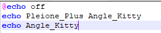
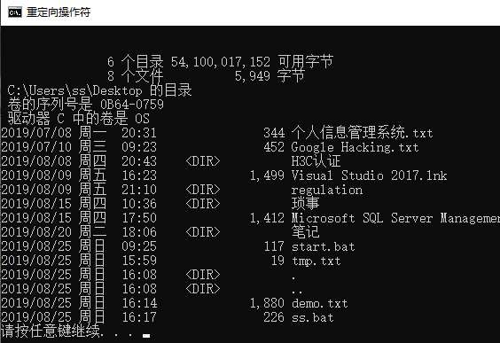

> ---
>
> Title:《批处理笔记》
>
> Author:Pleione_Plus
>
> Started Date:August 20th. 2019.
>
> Finished Date:August 25th. 2019.
>
> ---

# 批处理文件

## 简介

- 批处理文件也称**批处理程序**或**脚本**，使用它可以**简化日常或重复性任务**
- 批处理文件中常见是**DOS批处理**和**PS批处理等**（文中的批处理指的的DOS批处理）
- DOS批处理文件是**DOS命令**的批量和技巧性的应用，体现了DOS的精华
- 批处理文件是无格式的**文本文件**，包含**一条或多条命令**，文件扩展名为**.bat或.cmd**
- 批处理文件在被**DOS**或**cmd**执行时，会按照该文件中各个命令出现的**顺序**来逐个**运行**

## 编写

### copy命令

​		copy命令是实现**文件复制**的命令，它可以将文件从某个目录复制到另外的目录。

**语法**：

```bat
copy con 批处理文件名称.bat
```

**说明**：

- con：是指字符输入设备，通常指键盘

**步骤**：


注：

- 以**【Ctrl + Z】**组合键完成批处理文件的创建

**结果**：


### edit命令

​		Edit是**DOS系统**中的文本文件编辑程序，可以快速编辑批处理文件。

### 记事本程序

- 新建一个文本文件
- 用记事本打开文本文件，并在其中编写批处理命令
- 以**.bat**的后缀名的形式保存此文件

### 其他

- 其他批处理命令编辑器主要指的是其他文本编辑器，如**notepad++**、**EditPlus**等等，他们类似于记事本程序，可以直接以文本的形式编辑批处理命令。如下图所示：




# 批处理命令

## 批处理基础命令

### echo

​		打开或关闭**命令回显**功能或**显示消息**

**语法**：

```bat
echo [{on | off}] [message]
```

**说明**：

- { on | off }：指定是否打开命令回显功能
- message：指定要在屏幕上显示的文本信息

**eg**：

```bat
:: 关闭回显功能
@echo off
:: 在命令提示符窗口显示"Pleione_Plus"
echo By Pleione_Plus
:: 显示一个空行
echo.
:: 显示一个变量
echo %windir%
:: 显示重定向到文件中
echo "this is a demo!" > tmp.txt
```

**结果展示**：


### pause

​		**暂停**批处理程序，直到有一个按键**被触发**

**语法**：

```bat
pause
```

**结果展示**：


### rem

​		注释该行，可回显，但不执行[^1]:

**语法**：

```bat
rem [comment]
```

- comment：指定要作为注释的任何字符串

**eg**：

```bat
rem 这是一个内容注释
:: 这也是一个内容注释，但该行执行时相当于不存在
```

**结果展示**：


### call

​		从一个批处理程序**调用**另一个批处理程序，而**不终止父批处理程序**

- 调用子函数
- 调用子批处理
- <font color="red">以命令行方式解析字符串变量</font>

**语法**：

```bat
call [[Drive:] [Path] Filename [BatchParameters]] [:Label [Arguments]]
```

- [Drive:] [Path] Filename：指定要调用的批处理程序的位置和名称。
  - Filename参数必须有.bat或.cmd扩展名
- BatchParameters：指定批处理程序所需的任何命令行信息，包括命令行选项、文件名、批处理参数或变量
- :Label：调用文本文件内命令段，以:Label开头，以goto :eof结尾
- Arguments：指定要传递给其新实例的所有命令行信息

**eg**：

```bat
:: 调用另一个批处理程序
call 1.bat

:: 以命令方式解析变量值
set aa=123456
set cmdstr=echo %aa%
call %cmdstr%
```

**结果展示**：


### cls

​		**清屏**命令，但不清除历史记录


### start

​		**调用外部程序**，所有的**DOS命令**和**命令行程序**都可以由`start`命令来调用

**语法**：

```bat
start [/min | /max] [parameters]
```

- /min：以最小化方式启动窗口（必须在parameters之前）
- /max：以最大化方式启动窗口（必须在parameters之前）
- parameter：传递给程序的参数，（为空时默认打开一个新的命令提示符窗口）

**eg1**：

```bat
start /max calc.exe
:: 调用计算器程序，以最大状态展示
```

**结果展示**：


**eg2**：

```bat
start "" "C:\Program Files (x86)\Tencent\TIM\Bin\TIM.exe"
:: 中间的引号不能省略，否则将以CUI方式打开
```

**结果展示**：


## 批处理高级命令

### goto

​		指定跳转到标签，找到标签后，程序将处理从下一行开始的命令

**语法**：

```bat
goto label
```

- label：指定所要转向的批处理程序中的行

**eg**：

```bat
@echo off

:start
rem 如果var值小于3则输出
set /a var+=1
echo %var%
if %var% leq 3 goto start

pause
```

**结果展示**：


### if

​		在批处理程序中执行条件处理

**语法**：

```bat
if [not] errorlevel Number Command [else Expression]
if [not] String1==String2 Command [else Expression]
if [not] exist FileName Command [else Expression]
if [/i] String1 ComoareOp String2 Command [else Expression]
if defined Variable Command [else Expression]
if cmdextversion Number Command [else Expression]
```

- not：指定只有当条件为假时才执行该命令
- <span name="iferrorlevel">errorlevel Number</span>：只有当有cmd运行的前一个程序返回等于或大于Number的退出码时，才能指定真条件
- Command：指定只有满足当前的条件时才应执行的命令
- Expression：指定将传递给else子句中命令的命令行命令和任何参数
- String1==String2：只有当String1和String2相同时才能指定真条件
- exist FileName：如果FileName文件存在，则指定条件真
- <a href="#ComoareOp">ComoareOp</a>：指定三个字母的比较运算符来做串比较
- /i：强制字符串忽略大小写
- cmdextversion Number：只有当与cmd的“命令扩展”功能相关的内部版本号等于或大于Number时，才指定真条件
- defined Variable：如果定义了Variable，则指定条件为真

**注**：

- if语句多行书写的要求
  - Command的左括号必须和if在同行
  - else必须和Command的右括号在同行
  - Expression的左括号必须和else在同行
  - Command和Expression可以是命令集

**eg**：<span name="strCompare"> </span>

```bat
:: 字符串比较
@echo off
set str1=abcd1234
set str2=ABCD1234
set str3=abcd1233
:: 是否忽略大小写
if %str1%==%str2% (echo %str1%与%str2%相同!) else (echo %str1%与%str2%不同!)
if /i %str1% EQU %str2% (echo %str1%与%str2%相同!) else (echo %str1%与%str2%不同!)
echo.
:: 字符串中数值大小比较
if %str1% LSS %str2% (echo %str1% ^< %str2%) else (echo %str1% ^> %str2%)
if %str1% LSS %str3% (echo %str1% ^< %str3%) else (echo %str1% ^> %str3%)
echo.
:: 选择是否显示当前系统时间
set /p choice=是否显示当前系统时间?(y/n)
if /i not %choice% EQU n (echo 当前系统的时间是: %data% %time%)
echo.
pause>nul

:: 存在判断（判断文件或文件夹是否存在）
@echo off
:: 判断文件是否存在
if exist %0 echo 文件%0是存在的！
echo.
:: 判断文件夹是否存在
if not exist %~df0 (
	echo 文件夹%~df0不存在！
)else (
	echo 文件夹%~df0存在！
)
pause>nul

:: 定义判断
@echo off
:: 定义变量
set var=111;
:: 判断变量是否被定义
if defined var (echo var=%var%) else (echo var尚未定义！)
:: 删除变量
set var=
:: 判断变量是否被定义
if defined var (echo var=%var%) else (echo var尚未定义！)
pause>nul
```

**结果展示**：


### choice

​		在批处理程序中，通过显示提示信息并暂停批处理程序，用户可以从一组选项键中进行选择

**语法**：

```bat
choice [/c [Choices]] [/n] [/cs] [/t Timeout /d Choice] [/m text]
```

- /c Choices：指定用户选项键。显示时，选项键用逗号分隔，出现在【】内，后面跟着问号。默认情况下只有【Y,N】
- /n：
- /cs：指定用户选项键必须区分大小写。默认情况不区分大小写
- /t Timeout：指定在默认为指定键之前choice暂停指定的秒数
-  /d Choice：指定默认选择，必须和/t一起使用
- /m text：指定要在提示符之前显示的文字

**eg**：

```bat
@echo off
choice /c dme /m "dir,mem,end"
if errorlevel 3 goto end
if errorlevel 2 goto mem
if errorlevel 1 goto dir

:dir
dir
goto end

:mem
mem
goto end

:end
echo goodbye
pause
```

**结果展示**：


### for

​		对一组文件中的每个文件运行指定的命令

**语法**：

```bat
for {%Variable | %%Variable} in (Set) do Command [CommandLineOptions]
for /l {%Variable | %%Variable} in (start,step,end) do Command [CommandLineOptions]
for /f ["options"] {%Variable | %%Variable} in (Set) do Command [CommandLineOptions]
for {/d | /r} {%Variable | %%Variable} in (Set) do Command [CommandLineOptions]
```

- %Variable | %%Variable：代表可替换的参数，%Variable通过命令提示符执行for命令；%%Variable在批处理文件中执行for命令。（必须，变量区分大小写）
- (Set)：指定要用指定命令处理的一个或多个文件、目录、数值范围以及文本字符串。（必须，需要括号）
- Command：指定要对包括在指定的（set）中每个文件、目录、数值范围或文本字符串所执行的命令
- CommandLineOptions：指定要与所执行命令一起使用的任何命令行选项
- /l：设置计数循环
- /f：能对字符串进行操作，也能对命令的返回值进行操作，还可以访问磁盘中的ASCII文件。
  - options：eol=c、skip=n、delims=xxx、tokens=x,y,m-n、usebackq
    - delims：指定字符串的分隔符
    - tokens：提取分隔后的块，默认只提取第一块
  - set："string"、'command'、file-set
- /d | /r：与文件和目录有关

**eg**：

```bat
rem 循环结构
:: 基础循环结构
@echo off
echo 对集合遍历有：
for %%i in (1,2,3,4,5,6) do echo %%i
pause>nul
cls

:: /l开关
:: 计数循环
echo 计算1-100的和：
set sum=
set sum=0
for /l %%i in (1,1,100) do (set /a sum += %%i)
echo 之和为:%sum%
pause>nul

echo 计算1-100的和：
setlocal enabledelayedexpansion
set sum=
set sum=0
for /l %%i in (1,1,100) do (set /a sum = !sum! + %%i)
echo 之和为:%sum%
pause>nul
cls
:: /a 等号右边的字符串做数值计算
:: setlocal enabledelayedexpansion 与 !sum!的组合使用

:: /f开关
:: (delims、tokens、skip、eol、userbackq、变量延迟)
:: 字符串
@echo off
echo No options:
:: 展示文本文件内容
for /f %%a in (demo.txt) do echo a=%%a
:: 展示字符串内容
for /f %%a in ("1,2,10") do echo a=%%a
echo.
echo Options tokens ^& delims
for /f "tokens=1-3 delims=," %%a in ("1,2,10") do echo a=%%a b=%%b c=%%c
pause>nul
cls
:: 命令
@echo off
echo 本文件夹里面的文件有：
for /f "skip=5 tokens=4-5 delims= " %%a in ('dir') do (
	if not "%%a"=="<DIR>" if not "%%a"=="字节" if not "%%a"=="可用字节" echo %%b
)
pause>nul
cls

:: /D 或 /r开关
:: 遍历出D盘下的所有文件夹（完整路径信息）
@echo off
setlocal enabledelayedexpansion
FOR /R d: %%i IN (.) DO (
set dd=%%i
set "dd=!dd:~0,-1!"
echo !dd!
)
pause
exit
```

**结果展示**：


### set

​		用于显示、设置或删除变量、做数值计算、获取用户输入、字符串截取、字符串替换

**eg1**：<span name="varDisplay">显示变量</span>

```bat
:: 显示变量
set					//显示所有定义的变量
set s				//显示定义的以"s"开头的变量(无效)
```

**结果展示**：


**eg2**：<span name="varSet">设置变量</span>

```bat
:::::::::::::::::::::::::::::::::::::::::::::
:: 设置和调用变量
set aa="123"		//bat中变量不区分类型
echo %aa%			//调用变量时前后需要加上"%"
```

**结果展示**：


**eg3**：<span name="varDel">删除变量</span>

```bat
:::::::::::::::::::::::::::::::::::::::::::::
:: 删除变量，在设置变量之前先删除一下，若之前没有定义，则此句无任何意义
@echo off
title 删除变量
set aa=
if defined aa ( 
	echo aa未被删除
) else ( 
	echo aa已被删除 )  
pause
```

**结果展示**：


**eg4**：<span name="varCalculate">数值计算</span>

```bat
:: 算数运算
set aa=1
set bb=0
set /a aa=%aa% + 1,bb+=%aa%
echo %aa%
echo %bb%
```

- /a：等号右边按数值计算

**结果展示**：


**eg5**：<span name="varInput">获取用户输入</span>

```bat
:::::::::::::::::::::::::::::::::::::::::::::
:: 获取用户输入
set /p msg=请输入信息:
echo %msg%
```

- /p：获取用户输入

**结果展示**：


**eg6**：<span name="strSplit">字符串截取</span>

```bat
@echo off
title 字符串截取
:: 字符串截取
set var=%str:~偏移量,长度%

rem 截取字符串

@echo off
set str=1234567890
echo %str%

set var=%str:~1,1%
echo 偏移为：1，长度为1：%var%

set var=%str:~1,4%
echo 偏移为：1，长度为4：%var%

set var=%str:~-3%
echo 截取后三位：%var%

set var=%str:~3%
echo 偏移为3，截取剩余：%var%

set var=%str:~-5,4%
echo 偏移为：-5，长度为4：%var%

set var=%str:~0,-4%
echo 弃掉后四位：%var%

set var=%str:~-0,1%
echo %var%

set var=%str:~+0,1%
echo %var%
:: -0 = +0 = 0

set var=%str:~-5,-8%
echo 偏移为：-5，长度为-8：%var%
pause>nul
cls

:: 格式化显示时间
@echo off
echo 当前时间是：%time% 即 %time:~0,2%点%time:~3,2%分%time:~6,2%秒%time:~9,2%厘秒
```

- 截取串获取：`%str:~偏移量,长度%`
  - 偏移量和长度可正可负。
    - 偏移量为正，相对左端第一位偏移；偏移量为负，相对于右端第0位偏移。(<font color="red">-0=+0=0</font>)
    - 长度为正，表示截取字符个数；长度为负，表示从右端抛弃字符个数。
  - 如果只有一个数字，则其表示偏移量，<font color="red">长度为偏移量之后所有位的个数</font>

**结果展示**：


**eg7**：<span name="strReplace">字符串替换</span>

```bat
:::::::::::::::::::::::::::::::::::::::::::::
:: 替换字符串
@echo off
set aa=伟大的中国！我为你自豪！
echo 替换前：%aa%
echo 替换后：%aa:中国=中华人民共和国%
:: 获取第一次赋的值
echo aa=%aa%
set "aa=%aa:中国=中华人民共和国%"
echo aa=%aa%
pause>nul
```

**结果展示**：


### setx

​		设置永久变量

```bash
:: 将D:\添加到PATH变量中
setx PATH "%path%;D:\"
```


### setlocal

​		启动批处理文件中环境变量的本地化，本地化将持续到出现匹配的endlocal命令活着到达批处理文件结尾为止。

**语法**：

```bat
setlocal {enableextension | disableextension} {enabledelayedexpansion | disabledelayedexpansion}
```

- enableextension：启用命令扩展，直到出现endlocal命令
- disableextension：禁用命令扩展，直到出现endlocal命令
- enabledelayedexpansion：<span name="enabledelayedexpansion">启用延迟的环境变量扩展</span>，直到出现endlocal命令
- disabledelayedexpansion：<span name="disabledelayedexpansion">禁用延迟的环境变量扩展</span>，直到出现endlocal命令

**语法**：

```bat
setlocal enableextension
setlocal disableextension
setlocal enabledelayedexpansion
setlocal disabledelayedexpansion
```

### 使用参数

​		可以在批处理文件内任何的地方使用批处理参数，以提取有关环境设置的信息。

​		cmd提供批处理参数扩展变量（%0~%9）,%0将批处理文件名替换，而%1-%9将由命令行键入的参数替换。

**eg**:

```bat
@echo off

rem 将echo回显重定向到tep.txt文件中
Echo 产生一个临时文件 > tmp.txt

Rem 下行先保存当前目录，再将c:\windows设为当前目录
pushd c:\windows

@rem 调用文件内部的子程序
Call :sub tmp.txt

Rem 下行恢复前次的当前目录
Popd

rem 再次调用
Call :sub tmp.txt

pause

rem 删除创建的临时文件
Del tmp.txt

exit

:sub
Echo 删除引号： %~1
Echo 扩充到路径： %~f1
Echo 扩充到一个驱动器号： %~d1
Echo 扩充到一个路径： %~p1 
Echo 扩充到一个文件名： %~n1
Echo 扩充到一个文件扩展名： %~x1
Echo 扩充的路径指含有短名： %~s1 
Echo 扩充到文件属性： %~a1 
Echo 扩充到文件的日期/时间： %~t1 
Echo 扩充到文件的大小： %~z1 
Echo 扩展到驱动器号和路径：%~dp1
Echo 扩展到文件名和扩展名：%~nx1
Echo 扩展到类似 DIR 的输出行：%~ftza1
Echo.
Goto :eof
```

**结果展示**：


**注**：

- 批脚本里的 %* 指出所有的参数(如 %1 %2 %3 %4 %5 ...)
- 批参数(%n)的替代已被增强。您可以使用以下语法:
           %~1           - 删除引号(")，扩充 %1
           %~f1          - 将 %1 扩充到一个完全合格的路径名
           %~d1         - 仅将 %1 扩充到一个驱动器号
           %~p1         - 仅将 %1 扩充到一个路径
           %~n1         - 仅将 %1 扩充到一个文件名
           %~x1         - 仅将 %1 扩充到一个文件扩展名
           %~s1         - 扩充的路径指含有短名
           %~a1         - 将 %1 扩充到文件属性
           %~t1          - 将 %1 扩充到文件的日期/时间
           %~z1         - 将 %1 扩充到文件的大小
           %~path:1  -查找列在**PATH环境变量**的目录里查找 %1，并扩展到找到的第一个文件的驱动器号和路径
           %~ftza1     - 将 %1 扩展到类似 DIR 的输出行。
- 在上面的例子中，%1 和 PATH 可以被其他有效数值替换。%~ 语法被一个有效参数号码终止。%~ 修定符不能跟 %*使用注意：
        参数扩充时不理会参数所代表的文件是否真实存在，均以当前目录进行扩展要理解上面的知识，上面的例子很关键。

#### 直接传递参数

​		直接传递参数，即在使用`call`命令时，不使用任何参数，在**子函数**或**子批处理**里面**直接对父批处理里面的变量进行修改**。

**eg**：

```bat
:: 乱序重排
@echo off
setlocal enabledelayedexpansion
set var=aCdehiM,?mnrstW y
echo %var%
:: 调用子函数
call :deal
setlocal disabledelayedexpansion
:: 串替换
set var=%var:?=!%
echo %var%
pause>nul
exit

:deal
set tm=!var!
set var=
:: 串截取与拼接
for %%i in (6,3,11,11,16,15,1,4,11,5,12,13,9,0,12,7,15,14,5,10,2,16,18,8) do (
set var=!var!!tm:~%%i,1!
)
goto :eof
```

- goto :eof为子程序返回命令，若子函数本身就在批处理文件的末尾的话，此命令可省略

**结果展示**：


#### 间接传递参数

​		间接传递参数，即在使用call命令时，在其后面添加参数。

**语法**：

```bat
call {[:label] | [ChildBatch]} Parameter1 Parameter2 ... ParameterN
```

- 调用可是子函数，也可以是子批处理
- 子函数或子批处理中不需要定义形参及其个数
- 子函数或子批处理接受的参数依次存储在%1-%9中

**eg**：

```bat
@echo off
call :deal aaa bbb "c c" ddd eee
pause>nul
exit

:deal
echo %%0 = %0
echo %%1 = %1
echo %%2 = %2
echo %%3 = %3
echo %%4 = %4
echo %%5 = %5
```

- %0显示的是子函数的标号，而不是父批处理的文件名全程

**结果展示**：


### 使用变量

#### 用户变量

​		编写批处理程序时，用户根据需要自己定义的变量称为用户变量。	用户变量使用set命令来设置。	

#### 系统变量

​		系统变量是**操作系统提前定义**好的一组变量，可以适用于任何批处理，主要包括：硬件类、操作系统类、文件路径类、系统时间类等。

**常用系统变量**：

|   系统变量   |              说明              |
| :----------: | :----------------------------: |
| ComputerName |            计算机名            |
|   ComSpec    |       cmd.exe完整路径名        |
|  HomeDrive   |     系统分区盘符(一般为C)      |
|     Path     |     可执行文件默认搜索路径     |
| ProgramFiles |        软件默认安装路径        |
|    Prompt    |    个性化设置cmd的必备武器     |
| SystemDrive  |      包含系统根目录的分区      |
|  SystemRoot  | 系统根目录路径(默认C:\Windows) |
|  Temp、Tmp   | 程序等可使用的临时目录(可修改) |
|   UserName   |           当前用户名           |
| UserProfile  |       当前用户的配置目录       |
|    WinDir    |          操作系统路径          |
|     date     |              日期              |
|     time     |              时间              |

- 系统变量可以使用`set`命令来显示

#### 变量引用

​		变量应用指直接用变量名来操作变量。

- 通常使用"%"和"!"来获取变量的值。
- 在**for循环**中重复对同一变量多次赋值时需要使用"!"，使用"!"调用变量时，要首先“<a href="#enabledelayedexpansion">启用延迟环境变量扩充</a>”
- 开启延时环境变量扩充之后，所有的"!"都被视为特殊符号，即使使用"^!"也不可以输出"!"，要输出"!"必须要“<a href="#disabledelayedexpansion">停用延迟环境变量扩充</a>”

### 使用筛选器

​		命令筛选器与命令重定向竖线(|)联合使用，它实际上是一个命令，包含在可读取命令的输入、可转换输入并写入输出的命令中，筛选器命令可以帮助排序、查看和选择部分命令输出。

**eg**:

```bat
@echo off
:: more查看C中目录
tree C:\ | more

:: 查找指定文件中的指定字符串，并将结果显示
find "more" < demo.bat
:: 查找指定文件中的指定字符串，并将存储在demo.txt文件中
find "more" < demo.bat > demo.txt
pause
del demo.txt
```

**结果展示**：


### 使用命令重定向操作符

​		使用重定向操作符将命令输入和输出的数据流从默认位置重定向到其他位置。输入或输出数据流的位置被称为句柄。

**语法**：

```bat
:: 重定向输入
sort < demo.txt
:: 重定向输出
dir > demo.txt
:: 重定向附加输出
dir >> demo.txt
:: 使用管道操作符
dir | sort
:: 自动格式化A盘(无效)
echo y|format a: /s /q /v:system
```

**结果展示**：





## 字符串操作

​		对字符串的操作。包括：串拷贝、串拼接、串比较、串替换、串截取等。

### 串拷贝

​		在DOS批处理中，串拷贝可以通过set的赋值操作来实现。（批处理中变量不区分类型）

### 串拼接

​		DOS批处理中，串拼接的操作也很简单，可以使用如下的语法来实现：

```bat
@echo off
set aa=伟大的中国！
set bb=我为你自豪！
:: 连续输出
echo %aa%%bb%
echo aa=%aa%
echo bb=%bb%
:: 拼接后赋给变量
set aa=%aa%%bb%
echo aa=%aa%
pause>nul
```

**结果展示**：


### 串比较

​		DOS批处理中没有专门命令来组织串操作，所以串的比较需要通过<a href="#strCompare">**条件语句**</a>来实现

### 串替换

​		DOS批处理中的<a href="#strReplace">串替换</a>是通过set命令来实现的

### 串截取

​		DOS批处理中的<a href="#strSplit">串截取</a>是通过set命令来实现的

### 串扩充

​		DOS批处理中独有。

​		“扩充”这个词来自于Microsoft自己的翻译，意思就是对表示文件路径的字符串进行特殊的处理，具体功能罗列如下：

|  字符串   |              说明              |
| :-------: | :----------------------------: |
| ~I(大写i) |     s删除任何引号，扩充%I      |
|   %~fI    | 将%I扩充到一个完全合格的路径名 |
|   %~dI    |   仅将%I扩充到一个驱动器号    |
|   %~pI    |  仅将%I扩充到一个路径 |
|   %~nI    |    仅将%I扩充到一个文件名    |
|   %~xI    | 仅将%I扩充到一个文件扩展名 |
|   %~sI    | 扩充的路径只含有短名 |
|   %~aI    | 将%I扩充到文件的文件属性 |
|   %~tI    | 将%I扩充到文件的日期/时间 |
|   %~zI    | 将%I扩充到文件的大小 |
| %~PATH:I  | 查找列在路径环境变量的目录，并将%I扩充到找到的第一个驱动器号和路径 |
|  %~tfzaI  | 将%I扩充到类似输出线路的DIR |

- 字符串扩充的条件
  - 该字符串代表一个文件路径
  - 变量要用% x来表示，x可取a-zA-Z0-9共62个字符中的任意一个

**eg1**：

```bat
@echo off
echo 正在运行的这个批处理：
echo 完全路径：%0
echo 去掉引号：%~0
echo 所在分区：%~d0
echo 所处路径：%~p0
echo 文件名：%~n0
echo 扩展名：%~x0
echo 文件属性：%~a0
echo 修改时间：%~t0
echo 文件大小：%~z0
pause>nul
```

**结果展示**：


**eg2**：

```bat
@echo off
set aa=C:\Windows\PPP\a.btx
call :deal aaa %aa% "c c" ddd eee
pause>nul
exit

:deal
echo %%0 = %0
echo %%1 = %1
echo %%2 = %2
echo %%3 = %3
echo %%4 = %4
echo %%5 = %5
```

- 其中，变量aa在之前是不可以扩充的，通过call命令并将aa作为参数传递给子函数:deal，将aa变量转换成了变量%1，即符合%x格式，从而可以进行字符串扩充。
- 至于%x中x取a-z A-Z的形式，可以复习一下for语句，for语句里面的变量就是用%x来表示的，因而可以直接进行扩充。

**结果展示**：


## 数值计算

​		批处理里面的数值计算功能较弱，只能进行整型计算，忽略浮点数的小数部分；同时数值计算的范围也受限于系统位数，对于目前较为常见的32位机来说，数值计算能处理的数值范围为0x80000000h-0x7FFFFFFFh，即-2147483648-+2147483647。

**语法**：

```bat
set /a expression
```

- expressio：代表计算的表达式，可以跟多个需要用逗号(",")隔开

**数值运算符**

|               运算符               |               说明               |
| :--------------------------------: | :------------------------------: |
|                 ()                 |               分组               |
|               ! ~ -                | 一元运算符(逻辑非、按位非、取负) |
|               * / %                |    算数运算符(乘、取商、取余)    |
|                + -                 |        算数运算符(加、减)        |
|               << >>                |   逻辑移位(左移一位、右移一位)   |
|                 &                  |              按位与              |
|                 ^                  |              按位非              |
|                 \|                 |              按位或              |
| = *= /= %= += -= &= ^= \|= <<= >>= |               赋值               |
|                 ,                  |           表达式分隔符           |

**eg**：

<a href="#varCalculate">详细实例</a>


## 特殊符号

|   特殊符号    |                             说明                             |
| :-----------: | :----------------------------------------------------------: |
|       @       |        <font color="red">不回显当前行</font>中的命令         |
| `> filename`  |                       重定向输出，覆盖                       |
| `>> filename` |   重定向输出但<font color="red">不覆盖</font>(在末尾追加)    |
|      `<`      |                          重定向输入                          |
|      \|       |            <font color="red">管道</font>传输命令             |
|       ^       |              <font color="red">转义字符</font>               |
|       &       | 允许在一行中使用两个以上不同命令(<font color="red">命令之间独立</font>) |
|      &&       | 允许在一行中使用两个以上不同命令<br/>(<font color="red">前面命令执行的结果将影响到后边的命令是否执行</font>) |
|      ""       |   双引号允许在字符串中<font color="red">可包含空格</font>    |
|       ,       |     某些情况下可以<font color="red">当作空格来用</font>      |
|       ;       | 命令相同时，<font color="red">参数</font>之间可以使用分号隔开 |
|      ::       |                    注释该行(直接跳过该行)                    |

<span name="ComoareOp">**比较运算符**</span>

| 比较运算符 |    描述    |
| :--------: | :--------: |
|     ==     |    等于    |
|    EQU     |    等于    |
|    NEQ     |   不等于   |
|    LSS     |    小于    |
|    LEQ     | 小于或等于 |
|    GTR     |    大于    |
|    GEQ     | 大于或等于 |


## 返回值

​		有些命令在执行之后将会返回一定的错误值(errorlevel)，可以通过errorlevel的值<a href="#iferrorlevel">判断命令</a>执行的情况。

**eg**：

```bat
@echo off
reg add HKCU /v try /f>nul
reg delete HKCU /v try /f
if errorlevel 0 (echo 删除成功！ ) else (echo 删除失败！)
reg delete HKCU /v try /f
if %errorlevel%==0 (echo 删除成功！ ) else (echo 删除失败！)
pause>nul
```

- 一般情况下，程序或命令成功执行时，返回的errorlevel是0，错误时返回1或更高的值。
- 逻辑判断也是根据命令的返回值(errorlevel)进行判断的

**结果展示**：


## 视窗设置

​		DOS中提供对视窗进行设置的一些命令，如：title、color、mode、msg等

- title：设置窗体显示的标题
- color：设置窗口背景颜色和字体颜色(xx)
- mode：设置窗体大小。**cols设置宽度，lines设置高度**。
- msg：GUI交互窗口

**语法**：

```bat
:: 设置颜色
color [xx]
:: 设置宽度和高度
mode con [cols=c] [lines=n]
:: 信息交互
msg username /w /time:seconds message
```

- [xx]：x为一个十六进制数值，第一个x应用于背景，第二个x应用于前景
  - 0 = 黑色      
  - 1 = 蓝色      
  - 2 = 绿色      
  - 3 = 浅绿色     
  - 4 = 红色       
  - 5 = 紫色       
  - 6 = 黄色       
  - 7 = 白色       
  -  8 = 灰色
  -  9 = 淡蓝色
  -  A = 淡绿色
  - B = 淡浅绿色
  - C = 淡红色
  - D = 淡紫色
  - E = 淡黄色
  - F = 亮白色
- clos：设置宽度
- lines：设置高度
- username：设置用户名
- /w：等待用户响应
- /time:seconds：等待接收器确认消息的时间延迟
- message：要发送的信息

**eg**：

```bat
@echo off
set a=10
set b=0

:tex
set /a a+=3
set /a b+=1
:: 设置窗体大小
mode con cols=%a% lines=%b%
if %a% lss 60 goto :tex

echo O(∩_∩)O 圣诞快乐 O(∩_∩)O
set a=15,a6,2e,d0,34,8b,4f,9d,5e
:: 改变窗口颜色
for %%i in (%a%) do (
:: ping自己
ping -n 2 127.1>nul
color %%i
)
::for %%i in (%a%,%a%) do (
::ping -n 1 127.1>nul
::color %%i
::)

:: 重定向
>>ms.txt echo          */.    .   .    *      .
>>ms.txt echo          .\*    .    []           * __
>>ms.txt echo          */ .   ./\~~~~~~~~~~~~'\. ^|◆
>>ms.txt echo           \*   ,/,..,\,...........,\.◆
>>ms.txt echo           ^|^| ..▎# ▎田 田 ▎ ^| ▎◆
>>ms.txt echo           ^|^| ^&^&▎   ▎       ▎'^|'▎ o
>>ms.txt echo           ^|^| ##■■■■■■■■■■〓
:: msg
msg %username% /w /time:3600 <ms.txt
del ms.txt
pause
```

**结果展示**：


## 声音设置

​		批处理中还能以语音的形式展示信息。

**eg**：

```bat
@echo off
echo 做好准备，响了啊！！
pause
cls

:: 强大，支持英文、中文，不支持日语
mshta vbscript:createobject("sapi.spvoice").speak("Merry Christmas and Happy New Year! 新年快乐!すみません!")(window.close)
pause
cls

echo.
echo 怎么样？呵呵，刺激吧~
pause
```

## ASCII


**eg**：

```bat
@echo off&mode con cols=80

:begin
cls
set/p file=请输入要处理的文件(Q 键直接退出此脚本):
        if /i "%file%"=="Q" goto :eof
        if "%file%"=="" goto error
set new=%random%
for %%a in (%file%) do set size=%%~za
        if "%size%"=="0" goto error
cls&fsutil file createnew %new% %size% >nul
echo=&&echo=文件内容所对应的ASCII码的十六进制形式依次为:&echo==========================================================
for /f "skip=1 tokens=3" %%a in ('fc /B %new% %file%') do (
        set /p=%%a <nul
)
echo=&echo==========================================================&echo=&echo=&echo=文件内容所对应的ASCII码的十进制形式依次为:&echo==========================================================
setlocal EnableDelayedExpansion
for /f "skip=1 tokens=3" %%a in ('fc /B %new% %file%') do (
        set num=%%a
        set /a num=0x!num!
        set /p=!num! <nul
)
del %new%
endlocal&echo;&echo==========================================================&echo;&pause
exit /b 0

:error
        cls&echo;&echo;
        echo         “输入错误” OR “文件大小为零”，请重新输入……
        del %new% >nul 2>nul
        set file=
        set new=
        pause>nul&goto :beginl
```

**结果展示**：


## 常用DOS命令

### 文件夹管理

#### cd

​	(<font color="blue">change directory</font>)跳转到指定目录下

**语法**：

```bat
cd [绝对路径]
::跳转到指定的绝对路径下
cd ..
::跳转到当前目录的父目录
cd \
::跳转到根目录
```


#### md

​	(<font color="blue">make directory</font>)创建目录

**语法**：

```bat
md [绝对路径] | [相对路径]
::在指定位置创建文件夹
md [文件夹名称]
:: 在当前路径下创建文件夹
```

**注**：

- 路径中的文件夹不存在时会自动创建该文件夹


#### rd

​	(<font color="blue">remove directory</font>)删除目录

**语法**：

```bat
rd [相对路径] | [绝对路径] | [文件夹名称]
```

**注**：

- 删除的目录不能有子文件夹
- 要删除的目录下不能有文件
- 不能删除当前目录
- 根目录不能被删除
- <font color="red">创建容易删除很难</font>


#### dir

​	(<font color="blue">directory</font>)展示当前目录下的文件和文件夹

**语法**：

```bat
::展示目录下的文件和文件夹
dir [目录] [/p] [/w] [/ad] [/a] [/s]
```

**说明**：

- /p：分屏显示文件夹内容
- /w：宽屏显示文件夹内容（文件夹以[*dirName*]形式显示，文件以文件名显示）
- /ad：只显示文件夹而不显示文件
- /a：显示隐藏文件
- /s：显示指定目录和所有子目录中的文件


#### tree

​	展示指定启动器的目录子树

**语法**：

```bat
tree [盘符] [/f] [/a]
```

**说明**：

- 盘符：显示所有的目录子树
- /f：显示目录同时显示文件名（默认只显示目录）
- /a：以ASCII码显示目录树


#### path


#### xcopy

​		复制文件或目录到指定目录下

**语法**：

```bat
:: 拷贝文件
xcopy [源目录] [目的目录]
:: 拷贝目录
xcopy [源文件名] [目的目录]
:: 拷贝文件和目录
xcopy *.* [目的目录] {/s | /e} /v
```

- /s：拷贝非空子目录
- /e：拷贝所有目录
- /v：拷贝后检验，会影响速度

### 文件管理

#### copy

​		复制源文件到到指定位置

**语法**：

```bat
copy [源文件] [目的文件]
copy con 目标文件名
```

**注**：

- 源文件与目标文件不能相同
- 目标文件省略时，复制到当前文件夹下
- 不能复制只读属性的文件
- 结合通配符可复制多个文件


#### type

​		在命令行中显示**文本文件**的内容

**语法**：

```bat
type [文本文件名称]
```


#### del

​		删除一个或数个文件

**语法**：

```bat
del {[文件名] | [*.后缀名]} [/p] [/q] [/f] [/s]
```

- /p：删除每个文件之前提示确认信息
- /q：<font color="red">安静模式</font>，删除全局通配符时，不要求确认
- /f：强制删除只读文件
- /s：从所有子目录删除指定文件


#### move

​		移动文件或更改目录名

**语法**：

```bat
:: 将文件移动到新的目录下
move [文件名] [目的目录]
:: 更改目录的名称
move [目录名] [目录名] 
```


#### ren

​		重命名文件

**语法**：

```bat
ren [源文件名] [新的文件名]
```


#### replace

​		替换文件

#### find

​		搜索文件内容

**语法**：

```bat
find "string" filename
```

**说明**：

- string：待查找的字符串
- filename：文件名(或文件路径)
- 当找到时，回显字符串所在行的全部内容；否则，回显空行


#### fc

​		比较两个文件或文件集并展示它们之间的不同


#### attrib

​		显示或更改文件属性

**语法**：

```bat
ATTRIB [+R | -R] [+A | -A] [+S | -S] [+H | -H] [+O | -O] [+I | -I] [+X | -X] [+P | -P] [+U | -U]
       [drive:][path][filename] [/S [/D]] [/L]
```

- +/-R：设置或清除文件的只读属性
- +/-A：设置或清除文件的存档属性
- +/-S：设置或清除文件的系统属性
- +/-H：设置或清除文件的隐藏属性
- drive:path filename:指示文件的位置
- /s：处理当前文件夹及其所有子文件夹中的匹配文件

**eg**：

```bat
:: 将D盘下demo文件夹中的1.txt文件设置为只读
attrib +r D:\demo\1.txt /s

:: 将D盘下demo文件夹中的1.txt文件的属性设置为“存档”
attrib +a D:\demo\1.txt /s

:: 将D盘下demo文件夹中的1.txt文件的属性设置为“系统”属性
attrib +s D:\demo\1.txt /s

:: 将D盘下demo文件夹中的1.txt文件的属性设置为“隐藏”
attrib +h D:\demo\1.txt /s

:: 清除D盘下demo文件夹中的1.txt文件的“隐藏”属性
attrib -h D:\demo\1.txt /s
```


#### openfiles

​		允许管理员列出系统上已打开的文件和文件夹或与其断开连接。

**语法**：

```bat
openfiles /parameter [arguments]
```

- parameter：
  - disconnect：中断至少一个打开的文件的连接
  - query：显示所有从本地或从共享文件夹打开的文件
  - local：启用/禁用本地打开文件的显示

**eg**：

```bat
:: 断开IP地址为192.168.1.12的远程计算机中所有被打开的共享文件
openfiles /disconnect /s 192.168.1.12 /id *
:: 断开用户名为Guest、IP为192.168.1.12的远程计算机中所有被打开的文件
openfiles /disconnect /s 192.168.1.12 /a Guest
:: 断开IP为192.168.1.12的远程计算机中所有以“读/写”方式打开的文件
openfiles /disconnect /s 192.168.1.12 /o read/write
:: 显示IP为192.168.1.12的计算机的已经打开的远程文件
openfiles /query /s 192.168.1.12
:: 以Table格式显示IP为192.168.1.12的远程计算机中被打开的文件的基本信息
openfiles /query /s 192.168.1.12 /fo table /v
```


#### takeown

​		该工具以重新分配文件所有权的方式允许管理员重新获取先前被拒绝访问的文件访问权。

**语法**：

```bat
TAKEOWN [/S system [/U username [/P [password]]]]
        /F filename [/A] [/R [/D prompt]]
```

- /f：指定文件或目录名模式
- /a：将所有权给予管理员组，而不是当前用户
- /r：递归，指示工具运行于指定的目录和子目录的文件上

**eg**：

```bat
:: 设置IP为192.168.1.12远程计算机为demo文件夹中的1.txt的访问权限由计算机的管理员所拥有
takeown /f \\192.168.1.12\d:\demo\1.txt

:: 设置本地管理员组拥有IP为192.168.1.12的远程计算机的demo文件或文件夹的访问权限
takeown /f \\192.168.1.12\d:\demo\1.txt /a

:: 设置管理员拥有IP为192.168.1.12远程计算机的demo文件夹（包括其子文件）的访问权限
:: takeown /f \\192.168.1.12\d:\demo /r

```


#### assoc

​		显示或修改文件扩展名关联

**语法**：

```bat
ASSOC [.ext[=[fileType]]]
```

- 不带参数时，显示当前文件关联
- .ext：指定跟文件类型关联的文件扩展名
- fileType：指定跟文件扩展名关联的文件类型

**eg**：

```bat
:: 显示当前文件关联
assoc

:: 修改扩展名为.wsz的关联类型为wszfile
assoc .wsz=wszfile

:: 显示文件扩展名为.txt的关联
assoc .txt

```


#### bootcfg

​		用来在 BOOT.INI 文件中配置、查询、更改或删除启动项目设置。

**语法**：

```bat
BOOTCFG /parameter [arguments]
BOOTCFG /Copy [/S system [/U user [/P [password]]]] [/D description] /ID bootid
BOOTCFG /Delete [/S system [/U user [/P [password]]]] /ID bootid
BOOTCFG /Query [/S system [/U user [/P [password]]]]
BOOTCFG /Raw osoptions [/S system [/U user [/P [password]]]] /ID bootid [/A]
BOOTCFG /Timeout value [/S system [/U user [/P [password]]]]
BOOTCFG /Default [/S system [/U user [/P [password]]]] /ID bootid
BOOTCFG /Addsw [/S system [/U user [/P [password]]]] 
                  { [/MM val] [/BV] [/SO] [/NG] } /ID bootid
BOOTCFG /Rmsw [/S system [/U user [/P [password]]]]
                  { [/MM] [/BV] [/SO] [/NG] } /ID bootid
```

- parameter：
  - copy：生成一个现有启动项目的副本
  - delete：从BOOT.INI文件中删除现有的启动项
  - query：显示当前启动项目和它们的设置
  - /raw：允许用户指定要添加的任务任何开关
  - /timeout：允许用户更改超时值
  - /default：允许用户更改默认启动项目
  - /addsw：允许用户添加预定义开关
  - /rmsw：允许用户删除预定义开关

**eg**：

```bat
:: 生成启动项目为“1”的副本
bootcfg /copy /d "Windows With Debug" /ID 1

:: 删除启动项目“1”
bootcfg /delete /id 1

:: 显示所有当前启动项目和设置
bootcfg /query

:: 在boot.ini文件中的操作系统目录"2"添加开关
bootcfg /raw "/debug/sos" /a /id /2

:: 将boot.ini文件中的超时值更改为“36”
bootcfg /timeout 36

:: 将boot.ini文件中的启动项目“2”设置为默认的启动项目
bootcfg /default /id 2

:: 为boot.ini文件中的启动项目“2”添加开关
bootcfg /addsw /so /id 2

:: 从boot.ini文件中删除启动项目“2”的开关
bootcfg /rmsw /so /id 2

```


#### cacls

​		显示或者修改文件的访问控制列表(ACL)

**语法**：

```bat
CACLS filename [/T] [/M] [/L] [/S[:SDDL]] [/E] [/C] [/G user:perm]
        [/R user [...]] [/P user:perm [...]] [/D user [...]]
```

- /e：编辑 ACL 而不替换。

**eg**：

```bat
:: 显示D:\demo\1.txt文件的访问控制列表
cacls D:\demo\1.txt

:: 编辑D:\demo\1.txt文件的ACL
cacls D:\demo\1.txt /e
```


#### compact

​		显示或改变 NTFS 分区上文件的压缩。

**语法**：

```bat
COMPACT [/C | /U] [/S[:dir]] [/A] [/I] [/F] [/Q] [/EXE[:algorithm]]
        [/CompactOs[:option] [/WinDir:dir]] [filename [...]]
```


**eg**：

```bat
:: 将D:\demo\1.txt文件压缩
compact /c D:\demo\1.txt

:: 将D:\demo\1.txt文件解压缩
compact /u D:\demo\1.txt
```


### 磁盘管理

#### format

​		格式化磁盘

#### label

​		用于创建、修改或删除磁盘卷标

**语法**：

```bat
label [f:备份分区]
:: 将F驱动器设置为“备份分区”卷标
```


#### chkdsk

​		检查磁盘并显示状态报告

**语法**：

```bat
chkdsk [盘符] [文件路径] [/f] [/r] [/x] [/c]
```

**说明**：

- /f：修复磁盘上的错误（必须锁定磁盘）
- /r：找到坏扇区并恢复可读取的信息（必须锁定磁盘）
- /x：仅在NTFS上使用。如果必要，首先强制卸载卷。
- /c：仅随NTFS使用。跳过文件夹结构中的周期检查，减少运行chkdsk所需的时间量

**eg**：

```bat
chkdsk D: /f
:: 检查驱动器D，并修复错误
```


#### recover

​		从损坏的磁盘中恢复可读取的信息。

**语法**：

```bat
recover [盘符] [文件路径][文件名]
```

**eg**：

```bat
recover D:/readme.txt
:: 恢复驱动器D中的文件readme.txt
```


### 网络管理

#### ping

​		进行网络连接测试、名称解析

**语法**：

```bat
ping [-t] [-a] [-n count] [-l length] [-f] [-i ttl] [-v tos] [-r count] [-s count] [-j -Host-list] | [-k Host-list] [-w timeout] destination-list 
```

- -t：向目的主机持续发送ICMP包，知道按下【Ctrl+C】才停止
- -a：解析主机的NETBIOS主机名
- -n count：定义用来测试所发出的ICMP包的个数，缺省值为4，其常被用来衡量网速
- -l length：定义所发送缓冲区的数据包的大小，在默认情况下Windows的ping发送的数据包的大小为32Byte，使用该参数可以自己定义数据包的大小，但其最大限制为65500Byte，超出这个数时，接受方可能因为接受的数据包太大了死机，所以Microsoft为解决该安全漏洞限制了ping的数据包大小
- -f：在数据包中设置“不要分段标识”，通常发送的数据包都会由路由分段再发送给接受方，使用该参数后路由不会进行分段操作
- -i ttl：指定TTL值在对方系统里停留的时间
- -v tos：将“服务类型”字段设置为“tos”指定的值
- -r count：在“记录路由”字段中记录传出和返回数据包的路由。一般情况下你发送的数据包是通过一个个路由才到达对方的，但到底是经过了哪些路由呢？通过此参数就可以设定你想探测经过的路由的个数，不过限制在了9个，也就是说你只能跟踪到9个路由。
- -s count：指定“count” 指定的跃点数的时间戳，此参数和-r差不多，只是这个参数不记录数据包返回所经过的路由，最多也只记录4个。
- -j Host-list：利用“ computer-list” 指定的计算机列表路由数据包。连续计算机可以被中间网关分隔IP 允许的最大数量为 9。
- -k Host-list：利用 “computer-list” 指定的计算机列表路由数据包。连续计算机不能被中间网关分隔IP 允许的最大数量为 9。
- -w timeout：指定超时间隔，单位为毫秒。 
- destination-list：是指要测试的主机名或IP地址或网址

**eg**：

```bat
:: 连通测试
ping 192.168.1.105

:: 测试hosts文件
ping localhost

:: ping攻击(自定义数据的大小)
ping -l 65500 -t 192.168.1.1

:: 获取局域网计算机名称
ping -a 192.168.1.1

:: 获取网站的IP地址
ping www.baidu.com

:: 自定义检测数据包的数量
ping -n 20 192.168.1.1
```


#### tracert

​		追踪ICMP包到达目标的路径

**语法**：

```bat
tracert [-d] [-h maximum_hops] [-j host-list] [-w timeout]
               [-R] [-S srcaddr] [-4] [-6] target_name
```

- target_name：追踪的目标（可以时IP地址也可以是网站）

**eg**：

```bat
:: 检测到达百度服务器的路由是否存在故障
tracert www.baidu.com
```


#### pathping

​		提供有关在来源和目标之间的中间跃点处的网络滞后和网络丢失的信息。

**语法**：

```bat
pathping [-g host-list] [-h maximum_hops] [-i address] [-n]
                [-p period] [-q num_queries] [-w timeout]
                [-4] [-6] target_name
```

- -n：不将地址解析成主机名

**eg**：

```bat
:: 检测本机计算机到本地网关之间的路径
pathping 192.168.1.1

:: 检测远程计算机的路径
pathping -n www.baidu.com
```


#### ipconfig

​		显示/修改TCP/IP设置

**语法**:

```bat
ipconfig [/all] [/renew [Adapter]] [/release [Adapter]] [/flushdns] [/displaydns] [/registerdns] [/showclassid Adapter] [/setclassid Adapter [ClassID]]
```

- /all：显示所有适配器的完整 TCP/IP 配置信息。
- /renew [Adapter]：更新所有适配器（如果未指定适配器），或特定适配器（如果包含了 Adapter 参数）的 DHCP 配置信息。
- /release [Adapter]：发送 DHCPRELEASE 消息到 DHCP 服务器，以释放所有适配器（如果未指定适配器）或特定适配器（如果包含了 Adapter 参数）的当前 DHCP 配置并丢弃 IP 地址配置。该参数可以禁用配置为自动获取 IP 地址的适配器的 TCP/IP。
- /registerdns：对 DNS 名称和 IP 地址的手工动态注册进行初始化。
- /displaydns：显示 DNS 客户解析器缓存的内容，包括从本地主机文件预装载的记录以及由计算机解析的名称查询而最近获得的任何资源记录。DNS 客户服务在查询配置的 DNS 服务器之前使用这些信息快速解析被频繁查询的名称。
- /flushdns：清理并重设 DNS 客户解析器缓存的内容。如有必要，在 DNS 疑难解答期间，可以使用本过程从缓存中丢弃否定性缓存记录和任何其他动态添加的记录。
- /showclassid Adapter：显示指定适配器的 DHCP 类别 ID。要查看所有适配器的 DHCP 类别 ID，可以使用星号 (*) 通配符代替 Adapter。该参数仅在具有配置为自动获取 IP 地址的网卡的计算机上可用。
- /setclassid Adapter [ClassID]：配置特定适配器的 DHCP 类别 ID。要设置所有适配器的 DHCP 类别 ID，可以使用星号 (*) 通配符代替 Adapter。该参数仅在具有配置为自动获取 IP 地址的网卡的计算机上可用。如果未指定 DHCP 类别 ID，则会删除当前类别 ID。 

**eg**：

```bat
ipconfig /all
:: 显示详细的网络协议配置信息

ipconfig /renew
:: 更新IP地址

ipconfig /registerdns
:: 初始化网络配置

ipconfig /displaydns
:: 显示本地DNS信息

ipconfig /flushdns
:: 清除本地DNS缓存内容

ipconfig /release
:: 取消IP地址租用

ipconfig /all > D:\ipconfigBak.txt
:: 备份网络配置
```


#### getmac

​		显示计算机中网卡的媒体访问控制地址，即MAC地址

**语法**：

```bat
getmac [/S system]
```

- /s *system*：查看局域网内主机的MAC地址及网络协议

**eg**：

```bat
getmac
:: 显示本地网卡地址

getmac /s 10.85.0.88 -u Administrator -p password
:: 查看局域网内计算机网卡地址信息
```


#### netstat

​		显示活动的TCP连接、计算机侦听的端口、以太网统计信息、IP路由表等。

**语法**：

```bat
netstat [-a] [-e] [-n] [-o] [-p proto] [-r] [-s]
```

- -a：显示所有连接和侦听端口
- -e：可以用来统计一些基本的网络流量
- -n：显示数字化主机名，并且仅显示TCP连接
- -r：显示关于路由表的信息，除了显示有效路由外还可显示当前有效的连接
- -o：显示当前已建立的TCP连接状态的详细信息
- -s：显示每个协议的统计信息
- -p proto：显示proto指定的协议的连接，与-s一起使用时可显示每个协议的统计信息

**eg**：

```bat
netstat
:: 显示网络连接情况

netstat -n
:: 显示数字化主机名，即IP地址；并且只显示TCP连接

netstat -e
:: 统计网络流量

netstat -r
:: 显示路由表信息

netstat -o
:: 查看当前活动的TCP连接信息

netstat -a
:: 查看当前所有活动的TCP连接以及侦听端口

netstat -s -p tcp
:: 查看本机所有TCP连接情况

netstat -s -p udp
:: 查看本机所有UDP连接情况

netstat -s -p icmp
:: 查看本机所有ICMP连接情况

netstat -s -p ip
:: 查看本机所有IP连接情况

netstat -o 8
:: 显示当前活动的TCP连接和进行ID，以后每隔8s会自动显示当前活动的TCP连接的PID进程
```


#### arp

​		显示、修改IP-MAC映射列表

**语法**：

```bat
ARP -s inet_addr eth_addr [if_addr]
ARP -d inet_addr [if_addr]
ARP -a [inet_addr] [-N if_addr] [-v]
```

- a：显示本地计算机上所有接口的ARP缓存表信息
- -s inet_addr eth_addr：将IP地址与网卡地址绑定
- -d inet_addr：解除IP地址与网卡的绑定

**eg**：

```bat
arp -a
:: 显示本地计算机所有接口的ARP缓存表

arp -s 192.168.1.105 00-26-18-27-4A-8A
:: 将IP地址192.168.1.105与MAC地址00-26-18-27-4A-8A绑定

arp -d 192.168.1.105
:: 解除IP地址192.168.1.105与网卡的绑定

arp -d
:: 解除所有IP地址与网卡的绑定
```


#### route

​		操作网络路由表

**语法**：

```bat
ROUTE [-f] [-p] [-4|-6] command [destination]
                  [MASK netmask]  [gateway] [METRIC metric]  [IF interface]

```

- *command*：对路由表的操作命令
  - print：打印路由
  - add：添加路由
  - delete：删除路由
  - change：修改现有路由
- -p：添加永久路由

**eg**：

```bat
route print
:: 显示完整的IP路由表

route print 192.*
:: 显示IP路由表以“192.”开始的路由信息

route add 0.0.0.0 mask 0.0.0.0 192.168.1.1
:: 添加192.168.1.1所在的网关为默认路由项

route -p add 192.168.1.12 mask 255.255.255.255 192.168.2.1
:: 添加一条到192.168.1.12的永久路由
```


#### nslookup

​		显示可用来诊断域名系统（DNS）基础结构的信息。

**语法**：

```bat
nslookup [-opt ...]             # 使用默认服务器的交互模式
nslookup [-opt ...] - server    # 使用 "server" 的交互模式
nslookup [-opt ...] host        # 仅查找使用默认服务器的 "host"
nslookup [-opt ...] host server # 仅查找使用 "server" 的 "host"
```

**eg**：

```bat
:: 检测DNS服务器
nslookup www.baidu.com
```


#### nbtstat

​		显示协议统计和当前使用 NBI 的 TCP/IP 连接

**语法**：

```bat
NBTSTAT [ [-a RemoteName] [-A IP address] [-c] [-n]
        [-r] [-R] [-RR] [-s] [-S] [interval] ]
```

- -a：列出指定名称的远程机器的名称表
- -A：列出指定IP的远程机器的名称表
- -R：清除和重新加载远程缓存名称表
- -RR：将名称释放包发送到WINS，然后启动刷新
- -S：列出具有目标IP地址的会话表

**eg**:

```bat
:: 探测对方计算机名称
nbtstat -a 192.168.1.1

:: 清除NetBIOS名称缓存信息，重新加载Lmhosts文件
nbtstat -R

:: 重新注册NetBIOS名称
nbtstat -RR

:: 统计NetBIOS会话信息,(每5秒统计一次)
nbtstat -S 5
```


#### net

​		网络命令集及用户管理

**语法**：

```bat
NET
    [ ACCOUNTS | COMPUTER | CONFIG | CONTINUE | FILE | GROUP | HELP |
      HELPMSG | LOCALGROUP | PAUSE | SESSION | SHARE | START |
      STATISTICS | STOP | TIME | USE | USER | VIEW ]
```

- view：查看局域网中运行的客户端
- share：用于共享资源的管理、添加、删除以及查看局域网中的共享资源等
- user：用于用户账户的管理、添加、删除等
- statistics：主要用于显示本地工作站或服务器的统计记录
- config：查看本地计算机上可配置的服务
- localgroup：用于本地组的查看、管理等
- session：计算机的会话操作
- accounts：用户账户设置
- time：用于查询、设定计算机的时间服务器
- start：主要用于启动服务
- stop：主要用于停止服务
- pause：主要用于暂停服务
- continue：主要用于重新激活当前暂停的服务

**eg**：

```bat
:: 查看指定计算机的共享资源
net view 192.168.1.105
:: 查看局域网中正在运行的客户端
net view

:: 查看所有共享
net share
:: 设置ipc共享
net share ipc
:: 删除ipc共享
net share ipc /del
:: 设置C盘为共享
net share C$=C:
:: 共享资源设置共享名注释
net share 重要内部资源=D:\download /remark:'未经允许不得将资源外传'
:: 设置资源访问人数（最大访问人数为：8）
net share 重要内部资源 /user:8
:: 设置自动缓存方式
net share 重要内部资料 /cache:automatic
:: 禁止共享目录使用自动缓存
net share 重要内部资料 /cache:no

:: 查看本地的用户列表
net user
:: 添加一个用户
net user 用户名 密码 /add
:: 添加一个密码为空的用户
net user 用户名 [""] /add
:: 删除某个用户
net user 用户名 /del
:: 设置某个用户的状态为启用(禁用)
net user 用户名 active:yes(no)
:: 禁止用户自行更改密码
net user 用户名 /passwordchg:no
:: 设置账户的主目录
net user 用户名 /homedir:D\用户名

:: 设置用户账户密码的最少字符数为：6
net accounts /minpwlen:6
:: 强制用户在4天内更改密码，且不允许8天内不更改密码
net accounts /minpwage:4 /maxpwage:8
:: 避免用户使用旧密码(强制用户不能使用8个历史记录内的密码)
net accounts /uniquepw:8

:: 查看计算机本地组列表
net localgroup 
:: 查看管理员组里的用户
net localgroup administrators
:: 把某个用户添加到管理员组
net localgroup administrators 用户名 /add
:: 从管理员组中删除某个用户
net localgroup administrators 用户名 /del
- 添加到某个组里的用户必须时已经被创建过的用户
- 添加的组必须为已存在的组

:: 查看本地计算机上的统计服务
net statistics
:: 查看本地服务器服务的统计信息
net statistics server
:: 查看本地工作站服务统计信息
net statistics workstation

:: 查看本地计算机上可配置的服务
net config
:: 查看本机服务器上可配置的服务
net config server
:: 查看本地工作站上的配置服务
net config workstation
:: 在局域网中隐藏本地计算机
net config server /hidden:yes
:: 设置空闲会话时间(默认为15分钟，设置为-1则表示永远不中断用户连接)
net config server /autodisconnect:8

:: 设置本地计算机与网络中名为jackson-pc的计算机时间同步
net time \\jackson-pc /set

:: 断开计算机的会话操作
net session /delete

:: 查看已经启动的服务列表
net start
:: 开启某个服务（开启成功的前提时服务被停用而不是禁用）
net start 服务名
:: 停止某个服务（停止的服务必须是已经启动的）
net stop 服务名
:: 启动自动更新服务
net start wuauserv
:: 启动迟后打印服务
net start spooler
:: 启动时间管理服务
net start "windows time"
:: 暂停服务器服务
net pause server
:: 激活服务器服务
net continue server
```


#### ftp

​		文件传输

**语法**：

```bat
FTP [-v] [-d] [-i] [-n] [-g] [-s:filename] [-a] [-A] [-x:sendbuffer] [-r:recvbuffer] [-b:asyncbuffers] [-w:windowsize] [host]

```

- -A：匿名登录
- -v：禁止显示远程服务器响应
- -w:windowsize：覆盖默认的传输缓冲区大小
- -a：在绑字数据连接时使用所有本地接口
- -n：禁止在初始连接时自动登录
- -g： 禁用文件名通配
- -i：关闭多文件传输过程中的交互提示
- -d：启动调试
- -s:filename：指定包含 FTP 命令的文本文件；命令在 FTP 启动后自动运行

**eg**：

```bat
:: 登录远程的FTP服务器
fpt 192.168.1.12

:: 匿名登录远程的FTP服务器
ftp -A 192.168.1.12

:: 屏蔽FTP服务器信息
ftp -v 192.168.1.12

:: 设置文件传输缓存大小为8092B
ftp -w:8092 192.168.1.12

:: 设置数据连接使用任何网络接口
ftp -a 192.168.1.12

:: 设置连接后禁止自动登录
ftp -n 192.168.1.12

:: 禁止使用文件通配符(默认ftp命令操作本地文件时允许使用通配符)
ftp -g -A 192.168.1.12

:: 屏蔽文件传输时的交互提示信息（默认在多个文件传输时会提示每个文件的传输信息）
ftp -i -A 192.168.1.12

:: 查看命令执行的详细信息(默认不显示执行命令的详细信息)
ftp -d -A 192.168.1.12

:: 登录后自动执行指定的(command.txt文件内的ftp命令)命令
ftp -s:D:\command.txt -A 192.168.1.12

------------------------------------------------------
FTP子命令

:: 使用该用户建立与192.168.1.12:21服务器的连接
open 192.168.1.12 21

:: 断开与远程服务器的连接
close

:: 断开与远程服务器的连接
disconnect

:: 退出FTP程序
quit

:: 退出FTP程序
bye

:: 切换命令行状态
ftp         ::进入FTP程序
!           ::切换到DOS模式下
exit / ftp  :: 再次返回FTP程序中

:: 设置文件传输模式(二进制 / ASCII文本)
type binary / ascii

:: 设置传输结束提示音
bell

:: 禁用通配符
glob

:: 查看命令执行状态
status

:: 创建远程文件夹demo
mkdir demo

:: 更改服务器的当前目录(进入demo目录下)
cd demo

:: 设置FTP工作目录
lcd D:\demo

:: 查看远程目录列表
dir 

:: 将远程目录列表保存到文件
dir . dirlist.txt

:: 显示远程目录列表
mls - -

:: 上传文件
put 1.jpg

:: 重命名远程文件
rename 1.jpg one.jpg

:: 下载服务器文件
get one.jpg

:: 删除远程文件
delete one.jpg

:: 删除远程文件夹
rmdir demo

:: 关闭文件传输询问方式
prompt

:: 禁止显示服务器响应信息
verbose

:: 切换用户登录
user

:: 显示函数调用序列(一次命令执行一次跟踪)
trace
```


#### telnet

​		远程登录


#### msg

​		给用户发送消息

**语法**：

```bat
MSG {username | sessionname | sessionid | @filename | *}
    [/SERVER:servername] [/TIME:seconds] [/V] [/W] [message]
```

- username：标识指定的用户名
- sessionname：会话名称
- sessionid：会话ID
- @filename：识别这样一个文件，该文件含有将所有消息发送到用户名、会话名和会话标识号的列表
- *：给指定服务器上的所有会话发送消息
- /SERVER:servername：要联系的服务器（默认是当前值）
- /TIME:seconds：等待接收器确认消息的时间延迟
- /V：显示有关执行的操作的信息
- /W：等待用户的响应，跟/V一起使用
- message：要发送的消息。如果没有指定会发出提示或者冲stdin读取


### 系统管理

#### date

​		显示或修改系统日期

#### time

​		显示或修改系统时间

#### at

​		安排在特定日期和时间运行命令和程序

#### shutdown

​		立即或定时关闭或重启计算机

**语法**：

```bat
shutdown [-i]{[-s] | [-r] | [-I]} [-f] [-t time] [-c "消息内容"]
```

- -i：显示图形用户界面，但必须是shutdown的第一项
- -s：关闭计算机
- -r：重新启动计算机
- -I：注销当前用户
- -f：强制关闭正在运行的应用程序，不在前台警告用户
- -t time：后跟等待秒数，为0则表示马上重启
- -c "消息内容"：输入关机对话框中的消息内容（不能超过127个字符）

#### taskkill

​		结束进程

#### tasklist

​		显示进程列表

#### reg

​		对注册表子项信息和注册表项值中的值执行添加、更改、导入、导出以及其他操作

##### reg add

​		将新的子项或项添加到注册表中

**语法**：

```bat
Reg Add KeyName [{/v ValueName | /ve}] [/t DataType] [/s Separator] [/d Data] [/f]
```

- KeyName：指定要添加的子项或项的完整路径。要指定远程计算机，请包括计算机名（以 \\ComputerName\ 格式表示），并将其作为 KeyName 的一部分。省略 \\ComputerName\ 会导致默认对本地计算机的操作。KeyName 必须包括一个有效的根键。有效根键包括 HKLM、HKCU、HKCR、HKU 以及HKCC。如果指定了远程计算机，则有效根键是 HKLM 和 HKU。
- /v ValueName：指定要添加到指定子项下的注册表项名称。
- /ve：指定添加到注册表中的注册表项为空值。
- /t DataType： 指定注册表项的类型。Type 必须是以下几种类型之一：
  - Reg_SZ
  - Reg_MULTI_SZ
  - Reg_DWORD_BIG_ENDIAN
  - Reg_DWORD
  - Reg_BINARY
  - Reg_DWORD_LITTLE_ENDIAN
  - Reg_LINK
  - Reg_FULL_RESOURCE_DESCRIPTOR
  - Reg_EXPAND_SZ
- /s Separator：  当指定了 Reg_MULTI_SZ 数据类型并且需要列出多个项时，指定用来分隔数据的多个实例的字符。如果没有指定，将使用默认分隔符“\0”。
- /d Data： 指定新注册表项的数据。
- /f：添加注册表项而不要求确认。

**注**：

- 该操作不能添加子树。该版本的 Reg 在添加子项时无需请求确认。
- Reg Add 操作的返回值是0代表成功，是1代表失败。
- 对于 Reg_EXPAND_SZ 项类型，在 /d 参数内将插入符号 ( ^ ) 与“%”一起使用。

**eg**：

```bat
:: 要在远程计算机 ABC 上添加 HKLM\Software\MyCo 项，请键入：
Reg ADD \\ABC\HKLM\Software\MyCo

:: 要将一个注册表项添加到 HKLM\Software\MyCo，选项为值名：Data；类型：Reg_BINARY；数值数据：fe340ead；请键入：
Reg ADD HKLM\Software\MyCo /v Data /t Reg_BINARY /d fe340ead

:: 要将一个多值注册表项添加到 HKLM\Software\MyCo，选项为值名：MRU；数据类型：Reg_MULTI_SZ；数值数据：fax\0mail\0\0；请键入：
 Reg ADD HKLM\Software\MyCo /v MRU /t Reg_MULTI_SZ /d fax\0mail\0\0

:: 要将一个扩展的注册表项添加到 HKLM\Software\MyCo，选项为值名：Path；数据类型：Reg_EXPAND_SZ；数值数据：%systemroot%；请键入：
Reg ADD HKLM\Software\MyCo /v Path /t Reg_EXPAND_SZ /d ^%systemroot^%
```

##### reg compare

​		比较指定的注册表子项或项

**语法**：

```bat
Reg Compare KeyName1 KeyName2 [{/v ValueName | /ve}] [{/oa | /od | /os | /on}] [/s]
```

- KeyName1：指定要比较的第一个子项的完整路径。要指定远程计算机，请包括计算机名（以\\ComputerName\ 格式表示），并将其作为 KeyName 的一部分。省略 \\ComputerName\ 会导致默认对本地计算机的操作。KeyName 必须包括一个有效的根键。有效根键包括 HKLM、HKCU、HKCR、HKU 以及 HKCC。如果指定了远程计算机，则有效根键是 HKLM 和 HKU。
- KeyName2：指定要比较的第二个子项的完整路径。要指定远程计算机，请包括计算机名（以 \\ComputerName\ 格式表示），并将其作为 KeyName 的一部分。省略 \\ComputerName\ 会导致默认对本地计算机的操作。只在 KeyName2 中指定计算机名会导致该操作使用到 KeyName1 中指定的子项的路径。KeyName 必须包括一个有效的根键。有效根键包括 HKLM、HKCU、HKCR、HKU 以及 HKCC。如果指定了远程计算机，则有效根键是HKLM和HKU。
- /v ValueName：指定要比较的子项下的值名称。
- /ve： 指定只比较值名称为 null 的项。
- /oa：指定显示所有不同点和匹配点。默认情况下，仅列出不同点。
- /od：指定仅显示不同点。这是默认操作。
- /os：指定仅显示匹配点。默认情况下，仅列出不同点。
- /on：指定不显示任何内容。默认情况下，仅列出不同点。
- /s：递归地比较所有子项和项。

**注**：

- reg compare操作的返回值
  - 0：比较成功且结果相同
  - 1：比较失败
  - 2：比较成功并找到不同点
- 结果中显示的符号
  - `=`：KeyName1数据等于KeyName2数据
  - `<`：KeyName1数据小于KeyName2数据
  - `>`：KeyName1数据大于于KeyName2数据

**eg**：

```bat
:: 要将 MyApp 项下的所有值与 SaveMyApp 项下的所有值进行比较，请键入：
Reg COMPARE HKLM\Software\MyCo\MyApp HKLM\Software\MyCo\SaveMyApp

:: 要比较 MyCo 项下的 Version 的值和 MyCo1 项下的 Version 的值，请键入：
Reg COMPARE HKLM\Software\MyCo HKLM\Software\MyCo1 /v Version

:: 要将计算机 ZODIAC 上 HKLM\Software\MyCo 下的所有子项和值与当前计算机上 HKLM\Software\MyCo 下的所有子项和值进行比较，请键入： 
Reg COMPARE \\ZODIAC\HKLM\Software\MyCo \\. /s
```


##### reg copy

​		将一个注册表项复制到本地或远程计算机的指定位置

**语法**：

```bat
Reg Copy KeyName1 KeyName2 [/s] [/f] 
```

- KeyName1：指定要复制子项的完整路径。要指定远程计算机，请包括计算机名（以 \\ComputerName\ 格式表示），并将其作为 KeyName 的一部分。省略\\ComputerName\ 会导致默认对本地计算机的操作。KeyName 必须包括一个有效的根键。有效根键包括 HKLM、HKCU、HKCR、HKU 以及 HKCC。如果指定了远程计算机，则有效根键是 HKLM 和 HKU。 
- KeyName2：指定子项目的地的完整路径。要指定远程计算机，请包括计算机名（以 \\ComputerName\ 格式表示），并将其作为 KeyName 的一部分。省略 \\ComputerName\会导致默认对本地计算机的操作。KeyName 必须包括一个有效的根键。有效根键包括 HKLM、HKCU、HKCR、HKU 以及 HKCC。如果指定了远程计算机，则有效根键是 HKLM 和 HKU。 
- /s：复制指定子项下的所有子项和项。 
- /f：不要求确认而直接复制子项。 

**注**：

- 在复制时reg不请求确认
- reg copy操作的返回值
  - 0：成功
  - 1：失败

**eg**：

```bat
:: 要将 MyApp 项下的所有子项和值复制到 SaveMyApp 项，请键入：
Reg COPY HKLM\Software\MyCo\MyApp HKLM\Software\MyCo\SaveMyApp /s 

:: 要将计算机 ZODIAC 上的 MyCo 项下的所有值复制到当前计算机上的 MyCo1 项，请键入：
Reg COPY \\ZODIAC\HKLM\Software\MyCo HKLM\Software\MyCo1 
```

##### reg delete

​		从注册表删除子项或项

**语法**：

```bat
Reg Delete KeyName [{/v ValueName | /ve | /va}] [/f]
```

- KeyName：指定要删除的子项或项的完整路径。要指定远程计算机，请包括计算机名（以 \\ComputerName\ 格式表示），并将其作为 KeyName 的一部分。省略 \\ComputerName\ 会导致默认对本地计算机的操作。KeyName 必须包括一个有效的根键。有效根键包括 HKLM、HKCU、HKCR、HKU 以及 HKCC。如果指定了远程计算机，则有效根键是 HKLM 和 HKU。
- /v ValueName：删除子项下的特定项。如果未指定项，则将删除子项下的所有项和子项。
- /ve：指定只可以删除为空值的项。
- /va：删除指定子项下的所有项。使用本参数不能删除指定子项下的子项。
- /f：无需请求确认而删除现有的注册表子项或项。

**注**：

- reg delete的返回值
  - 0：成功
  - 1：失败

**eg**：

```bat
:: 要删除注册表项 Timeout 以及其所有子项和值，请键入：
Reg DELETE HKLM\Software\MyCo\MyApp\Timeout 

:: 要删除计算机 ZODIAC 上 HKLM\Software\MyCo 下的注册表值 MTU，请键入：
Reg DELETE \\ZODIAC\HKLM\Software\MyCo /v MTU
```


##### reg export

​		 将本地计算机的指定子项、项和值复制到一个文件中，以便传输到其他服务器。 

**语法**：

```bat
Reg export KeyName FileName [/y]
```

- KeyName：指定子项的完全路径。Export 操作仅可在本地计算机上工作。KeyName 必须包括一个有效的根键。有效根键包括 HKLM、HKCU、HKCR、HKU 以及 HKCC。 
- FileName： 指定在操作期间创建的文件的名称和路径。该文件必须具有 .Reg 扩展名。 
- /y：不要求确认即覆盖任何现有的名称为 FileName 的文件。 

**注**：

- reg export操作的返回值
  - 0：成功
  - 1：失败

**eg**：

```bat
:: 要将 MyApp 项的所有子项和值的内容导出到文件 AppBkUp.Reg，请键入：
Reg Export HKLM\Software\MyCo\MyApp AppBkUp.Reg
```


##### reg import

​		将包含已导出的注册表子项、项和值的文件的内容复制到本地计算机的注册表中。

**语法**：

```bat
reg import FileName
```

- FileName：指定其内容将复制到本地计算机注册表中的文件的名称和路径。此文件必须使用 Reg export 预先创建。 

**注**：

- reg import操作的返回值
  - 0：成功
  - 1：失败

**eg**：

```bat
:: 要从名为 AppBkUp.Reg 的文件导入注册表项，请键入：
Reg Import AppBkUp.Reg
```


##### reg load

​		将保存的子项和项写回到注册表的不同子项中。与用于进行疑难解答或编辑注册表项的临时文件一起使用。 

**语法**：

```bat
Reg load KeyName FileName 
```

- KeyName：指定要加载的子项的完整路径。要指定远程计算机，请包括计算机名（以 \\ComputerName\ 格式表示），并将其作为 KeyName 的一部分。省略 \\ComputerName\ 会导致默认对本地计算机的操作。KeyName 必须包括一个有效的根键。有效根键包括 HKLM、HKCU、HKCR、HKU 以及 HKCC。如果指定了远程计算机，则有效根键是 HKLM 和 HKU。 
- FileName：指定要加载的文件的名称和路径。必须使用 .hiv 作为扩展名的 Reg Save 操作预先创建该文件。 

**注**：

- reg load操作的返回值
  - 0：成功
  - 1：失败

**eg**：

```bat
::要将名为 TempHive.hiv 的文件加载到 HKLM\TempHive 项，请键入：
Reg LOAD HKLM\TempHive TempHive.hiv
```


##### reg query

​		返回位于注册表中指定的子项下的下一层子项和项的列表。

**语法**：

```bat
Reg query KeyName [{/v ValueName | /ve}] [/s] [/se Separator] [/f Data] [{/k | /d}] [/c] [/e] [/t Type] [/z]
```

- KeyName：指定子项的完全路径。要指定远程计算机，请包括计算机名（以 \\ComputerName\ 格式表示），并将其作为 KeyName 的一部分。省略 \\ComputerName\会导致默认对本地计算机的操作。KeyName 必须包括一个有效的根键。有效根键包括 HKLM、HKCU、HKCR、HKU 以及 HKCC。如果指定了远程计算机，则有效根键是 HKLM 和 HKU。
- /v ValueName：指定要查询的注册表值名称。如果省略，则返回 KeyName 的所有值名称。如果还使用了 /f 选项，则此参数的 ValueName 是可选的。 
- /ve：查询空白的值名称。
- /s：指定该参数递归查询所有子项和值名称。
- /se Separator：指定单值分隔符，以搜索 Reg_MULTI_SZ 类型的值名称。如果没有指定 Separator，则使用“\0”。
- /f Data：指定要搜索的数据或模式。如果字符串包含空格，则使用双引号。如果未指定，则使用通配符 ("*") 作为搜索模式。
- /k：指定只在项名称中搜索。
- /d：指定只在数据中搜索。
- /c：指定查询是区分大小写的。默认情况下，查询是不区分大小写的。
- /e：指定只返回完全匹配项。默认情况下，返回所有匹配项。
- /t Type：指定要搜索的注册表类型。有效的类型包括：Reg_SZ、Reg_MULTI_SZ、Reg_EXPAND_SZ、Reg_DWORD、Reg_BINARY、Reg_NONE。如果未指定，则搜索所有类型。
- /z：指定在搜索结果中包括注册表类型的数字同等物。

**注**：

- reg query操作的返回值
  - 0：成功
  - 1：失败

**eg**：

```bat
:: 要显示 HKLM\Software\Microsoft\ResKit 项中的名称值 Version 的值，请键入：
Reg QUERY HKLM\Software\Microsoft\ResKit /v Version

:: 要显示远程计算机 ABC 上的 HKLM\Software\Microsoft\ResKit\Nt\Setup 项下的所有子项和值，请键入：
Reg QUERY \\ABC\HKLM\Software\Microsoft\ResKit\Nt\Setup /s

:: 要使用“#”作为分隔符显示 Reg_MULTI_SZ 类型的所有子项和值，请键入：
Reg QUERY HKLM\Software\Microsoft\ResKit\Nt\Setup /se #

:: 要显示数据类型 Reg_SZ 的 HKLM 根下的“SYSTEM”的完全匹配并且区分大小写的匹配项的项、值和数据，请键入：
Reg QUERY HKLM /f SYSTEM /t Reg_SZ /c /e

:: 要显示数据类型 Reg_BINARY 的根键 HKCU 下的数据中的“0F”的匹配项的项、值和数据，请键入：
Reg QUERY HKCU /f 0F /d /t Reg_BINARY

:: 要显示 HKLM\SOFTWARE 下的值名称 null（默认值）的值和数据，请键入：
Reg QUERY HKLM\SOFTWARE /ve
```


##### reg restore

​		将保存的子项和项写回到注册表。 

**语法**：

```bat
Reg restore KeyName FileName
```

- KeyName：指定要还原的子项的完整路径。Restore 操作仅在本地计算机上工作。KeyName 必须包括一个有效的根键。有效根键包括 HKLM、HKCU、HKCR、HKU 以及 HKCC。
- FileName： 指定其内容将写回到注册表中的文件的名称和路径。必须使用 .hiv 作为扩展名的 Reg save 操作预先创建该文件。

**注**：

- 编辑任何注册表项之前，请使用 Reg Save 操作保存父子项。如果编辑失败，则可以使用 Reg Restore 操作还原原来的子项。 
- reg restore操作的返回值
  - 0：成功
  - 1：失败

**eg**：

```bat
:: 要将名为 NTRKBkUp.hiv 的文件还原到 HKLM\Software\Microsoft\ResKit 项，并覆盖该项的现有内容，请键入：
Reg RESTORE HKLM\Software\Microsoft\ResKit NTRKBkUp.hiv
```


##### reg save

​		将指定的子项、项和注册表值的副本保存到指定文件中。

**语法**：

```bat
Reg save KeyName FileName [/y]
```

- KeyName： 指定子项的完全路径。要指定远程计算机，请包括计算机名（以 \\ComputerName\ 格式表示），并将其作为 KeyName 的一部分。省略\\ComputerName\会导致默认对本地计算机的操作。KeyName 必须包括一个有效的根键。有效根键包括 HKLM、HKCU、HKCR、HKU 以及 HKCC。如果指定了远程计算机，则有效根键是 HKLM 和 HKU。
- FileName：指定所创建的文件的名称和路径。如果未指定路径，则使用当前路径。
- /y：不要求确认即覆盖任何现有的名称为 FileName 的文件。

**注**：

- reg save操作的返回值
  - 0：成功
  - 1：失败
- 编辑任何注册表项之前，请使用 Reg Save 操作保存父子项。如果编辑失败，则可以使用 Reg Restore 操作还原原来的子项。

**eg**：

```bat
:: 要将配置单元 MyApp 作为名为 AppBkUp.hiv 的文件保存到当前文件夹中，请键入：
Reg SAVE HKLM\Software\MyCo\MyApp AppBkUp.hiv
```


##### reg unload

​		使用 Reg Load 操作删除已加载的部分注册表。

**语法**：

```bat
Reg Unload KeyName
```

- KeyName：指定要卸载的子项的完整路径。要指定远程计算机，请包括计算机名（以 \\ComputerName\格式表示），并将其作为 KeyName 的一部分。省略 \\ComputerName\ 会导致默认对本地计算机的操作。KeyName 必须包括一个有效的根键。有效根键包括 HKLM、HKCU、HKCR、HKU 以及 HKCC。如果指定了远程计算机，则有效根键是 HKLM 和 HKU。

**注**：

- reg unload操作的返回值
  - 0：成功
  - 1：失败

**eg**：

```bat
:: 要卸载 HKLM 中的配置单元 TempHive，请键入：
Reg UNLOAD HKLM\TempHive
```


### 防火墙配置

​		Netsh(Network Shell)是Windows系统提供的功能强大的网络配置命令行工具。

#### add

​		添加防火墙配置

**eg**：

```bat
:: 添加通过防火墙的程序：
add allowedprogram program="C:\Program Files (x86)\Common Files\Tencent\QQProtect\Bin\QQProtect.exe" name="TIM" mode=enable
:: 添加通过防火墙的C:\Program Files (x86)\Common Files\Tencent\QQProtect\Bin\QQProtect.exe程序，并将防火墙中对应程序的名称改为”TIM"

:: 添加禁止通过防火墙的程序：
add allowedprogram program="C:\Program Files (x86)\Common Files\Tencent\QQProtect\Bin\QQProtect.exe" name="TIM" mode=disable
:: 添加禁止通过防火墙的C:\Program Files (x86)\Common Files\Tencent\QQProtect\Bin\QQProtect.exe程序，并将防火墙中对应程序的名称改为”TIM"

:: 禁止程序访问外部网络
add allowedprogram program="C:\Program Files (x86)\Common Files\Tencent\QQProtect\Bin\QQProtect.exe" name="TIM" mode=enable scope=subnet
:: 添加通过防火墙的C:\Program Files (x86)\Common Files\Tencent\QQProtect\Bin\QQProtect.exe程序，并将防火墙中对应程序的名称改为”TIM",但该程序只能访问本地网络，禁止访问外部网络

:: 定制程序网络访问范围
add allowedprogram program="C:\Program Files (x86)\Common Files\Tencent\QQProtect\Bin\QQProtect.exe" name="TIM" mode=enable scope=custom address=192.168.1.12,192.168.1.13
:: 添加通过防火墙的C:\Program Files (x86)\Common Files\Tencent\QQProtect\Bin\QQProtect.exe程序，并将防火墙中对应程序的名称改为”TIM",但程序只能访问IP为”192.168.1.12“和”192.168.1.13“的网络

:: 添加允许使用TCP协议的端口
add portopening protocol=tcp port=8888 name=重要服务 mode=enable
:: 添加远程程序访问本地计算机（建立TCP连接）时的端口（端口为”8888“，端口名称为”重要服务“)

:: 添加UDP协议使用的端口
add portopening protocol=udp port=8888 name=重要服务 mode=enable
:: 添加远程程序访问本地计算机（建立UDP连接）时的端口（端口为”8888“，端口名称为”重要服务“)

:: 添加所有协议都可以使用的端口
add portopening protocol=all port=8888 name=重要服务 mode=enable
:: 允许防火墙的所有协议可通过的端口（端口为”8888“，端口名称为”重要服务“)

:: 限制外部连接使用端口
add portopening protocol=tcp port=8888 name=重要服务 mode=enable SCOP=Subnet
:: 限制外部网络通过TCP连接方式与本地计算机的”8888“端口进行通信的计算机

:: 定制访问端口的连接
add portopening protocol=tcp port=8888 name=重要服务 mode=enable scop=custom address=192.168.1.12,192.168.2.0
:: 定制访问端口的连接方式为TCP连接，并且设定IP为“192.168.1.12”的计算机和网路号为“192.168.2”的网络可以通过端口"8888"以TCP连接方式访问本地计算机

:: 为指定的网络连接添加可用端口
add portopening protocol=tcp port=8888 name=重要服务 mode=enable interface=本地连接
:: 为名为“本地连接”的网络连接添加一个以TCP方式连接的端口(8888)，并且将该端口的名称命名为“重要服务”
```


#### delete

​		删除防火墙配置

**eg**：

```bat
delete allowedprogram program="C:\Program Files (x86)\Common Files\Tencent\QQProtect\Bin\QQProtect.exe"
:: 删除防火墙允许的程序

delete portopening protocol=tcp port=8888 interface=本地连接
:: 删除通过网络连接名为“本地连接”的TCP连接端口“8888"
```


#### set

​		设置防火墙配置

**eg**：

```bat
:: 编辑已添加的程序设置
set allowedprogram program="C:\Program Files (x86)\Common Files\Tencent\QQProtect\Bin\QQProtect.exe" scop=custom address=192.168.1.12
:: 将QQProtect程序设置为只能访问IP为”192.168.1.12“的计算机

:: 编辑防火墙中已添加的端口
set portopening protocol=tcp port=8888 name=重要服务 mode=enable
:: 将TCP连接端口"8888"的名称设置为“重要服务”，类型为“可用”

set icmpsetting type=8 mode=enable
:： 启用ICMP报文回显请求

set icmpsetting type=8 mode=disable
:: 关闭ICMP报文回显请求

set icmpsetting type=8 mode=disable interface
:: 设置指定网络接口ICMP报文功能

:: 指定防火墙日志文件
set logging filelocation=D:\fhq.log maxfile=400
:: 将防火墙的日志文件fhq.log建立在D盘，并且日志文件的最大容量为400KB

set logging droppedpcket=enable
:: 让防火墙记录被丢弃的数据包

set logging droppedpcket=disable
:: 让防火墙不记录被丢弃的数据包

set logging connections=enable
:: 让防火墙记录成功连接

set logging connections=disable
:: 让防火墙记录不成功连接

set notifications mode=disable
:: 禁止防火墙弹出通知对话框

set notifications mode=enable
:: 允许防火墙弹出通知对话框

set opmode mode=enable
:: 开启Windows防火墙功能

set opmode mode=disable
:: 关闭Windows防火墙功能

set opmode mode=enable interface=本地连接
:: 为指定网络接口开启防火墙

set opmode mode=enable exceptions=enable
:: 开启防火墙例外功能

set service type=fileandprint mode=enable
:: 允许文件和打印机共享服务通过防火墙

set service type=remotedesktop mode=enable
:: 允许远程管理服务通过防火墙

set service type=remoteadmin mode=enable
:: 允许远程协助和远程桌面服务通过防火墙

set service type=upnp mode=enable
:: 允许UPnP框架服务通过防火墙

set service type=all mode=enable
:: 允许所有服务类型通过防火墙

set service type=fileandprint mode=enable scope=subnet
:: 显示外部网络使用指定类型的服务

set service type=fileanprint mode enable scope=custom address=192.168.1.12
:: 限制访问指定类型服务的连接

reset
:: 恢复防火墙默认设置

```


#### show

​		显示防火墙配置

**eg**：

```bat
show allowedprogram verbose=enable
:: 查看允许通过防火墙的程序

show config verbose=enable
:: 查看防火墙的详细配置信息

show icmpsetting verbose=enable
:: 查看ICMP报文设置信息

show logging 
:: 显示防火墙配置文件设置信息

show opmode
:: 查看当前防火墙的工作状态

show portopening cerbose=enable
:: 查看防火墙端口设置信息

show service verbose=enable
:: 查看防火墙服务设置信息

show state verbose=enable
:: 查看当前防火墙工作状态信息
```


# 批处理应用

## 程序的启动与关闭

​		start命令行可以用来启动程序，同时也可以使用start命令通过任务管理器来关闭程序。

**步骤**：

1. 确定文件位置
2. 建立批处理文件

**eg**：

```bat
rem -------start--------
rem TIMstart.bat
rem --------end---------
@echo off

start "" "C:\Program Files (x86)\Tencent\TIM\Bin\TIM.exe"

::等价于：
::cd "C:\Program Files (x86)\Tencent\TIM\Bin\"
::start TIM.exe

rem 如果不加中间的""，那么会进入cmd模式。。

rem -------start--------
rem TIMstop.bat
rem --------end---------
@echo off

start taskkill /f /im TIM.exe
start taskkill /f /im TXPlatform.exe
start taskkill /f /im QQProtect.exe

::实际上是通过“任务管理器”终止的进程来实现的
```

## 删除临时文件夹中的文件

​		使用del命令快速删除指定文件夹中的文件。

**eg**：

```bat
@echo off
title 删除临时文件夹中文件
color B0
echo -----------------------------------------
echo 开始进行文件删除操作...
pause

cd \
c:
cd \
cd windows\temp
del *.* /p

pause
```

## 自动清除系统垃圾文件

​		Windows操作系统在安装和使用过程中会产生很多垃圾，包括临时文件(`*.tmp`、`*._mp`)、日志文件(`*.log`)、临时帮助文件(`*.gid`)、磁盘检查文件(`*.chk`)、临时备份文件(`*.old、*.bak`)以及其他临时文件。

**eg**：

```bat
@echo off
title 自动清除系统垃文件
color B0
echo -----------------------------------------
echo 开始清除文件...
pause

cls

@echo off
:: 依次清除系统根目录中的临时文件、临时帮助文件、磁盘检查文件、临时备份文件
del /f /s /q %systemdrive%\*.tmp
del /f /s /q %systemdrive%\*._mp
del /f /s /q %systemdrive%\*.gid
del /f /s /q %systemdrive%\*.chk
del /f /s /q %systemdrive%\*.old
:: 依次清除Windows目录中的临时备份文件、预读文件、临时文件
del /f /s /q %windir%\*.bak
del /f /s /q %windir%\prefetch\*.*
rd /s /q %windir%\temp & mk %windir%\temp
:: 依次清除用户目录下的临时文件
del /f /s /q "%userprofile%\Local Settings\Temporary Internet Files\*.*"
del /f /s /q "%userprofile%\Local Setting\Temp\*.*"
rd /s /q "%userprofile%\Local Setting\Temp\" & md "%userprofile%\Local Setting\Temp\"
:: 依次清除用户安装目录下的cookie文件、临时文件
del /f /s /q "%appdata%\Microsoft\Windows\cookies\*.*"
del /f /s /q "%appdata%\Microsoft\Windows\Recent\*.*"

@echo off
cls
color 2E
echo ---------------------系统垃清理完成！！！-----------------------
echo ----------------------------------------------------------------
echo ----------------------------退出--------------------------------
pause
```

## 批量转移同一类型的文件

​		转移指定目录下同一类型的文件到一个指定的目录下(存在)。

**eg**：

```bat
@echo off
title 批量转移同一类型的文件
color B0
echo -----------------------------------------
echo 开始转移文件...
pause

cls

move c:\download\*.jpg d:\images

:: 目的路径必须存在

pause
```

## 用批处理批量移动、删除文件

​		使用批处理可以很方便地进行文件的批量移动或删除，出错时也很容易修改

**eg**：

- 将D盘.htm文件移动到E盘，再格式化D盘，然后将文件移回D盘，并将后缀改为.html。

```bat
rem --------------------------
rem 1.bat
rem --------------------------
@echo off
e:
md d
d:
copy *.htm e:\d
@if exist e:\d\*.htm call 2.bat
rm e:\d
```

```bat
rem ---------------------------
rem 2.bat
rem ---------------------------
@echo off
format d: /q
copy e:\d\*.htm d:
d:
ren *.htm *.html
```

## 删除大小和类型一样的重复文件(没见效果)

​		大小和类型一样的文件基本上都是重复文件，可以使用批处理文件将其删除。

## 删除某盘内的所有空目录

**eg**：

- 删除H盘中所有的空目录

```bat
@echo off
title 删除某盘内的所有空目录
color B0
echo -----------------------------------------
echo 开始删除所有空目录...
pause

dir h:\ /ad /b /s | sort /r > h:\kill.txt
for /f "delims=;" %%i in (h:\kill.txt) do rd "%%i"
echo y | del h:\kill.txt

:: 如需对其他磁盘进行操作，请将h磁盘替换为其他盘符


cls
color 2E
echo --------------------删除某盘所有空目录操作结束-----------------
echo ---------------------------------------------------------------
echo ----------------------------关闭-------------------------------
pause
```

## 转换磁盘为NTFS格式

**eg**：

```bat
@echo off
title 转换磁盘为NTFS格式
color B0
echo -----------------------------------------
echo 开始磁盘格式转换...
pause

@echo off
@echo.
convert h:/fs:ntfs

:: 对其他磁盘进行格式化的时候，可将H磁盘修改为对应盘符
:: 优点：->不会删除原来存在的文件


cls
color 2E
echo --------------------磁盘格式转换结束-----------------
echo -----------------------------------------------------
echo --------------------------关闭-----------------------
pause
```

- NTFS格式的分区在DOS/Windows 9X下均不支持，Windows 2000之后的系统才支持
- 使用该方式转换不会删除磁盘中原来存在的文件

## 显示或隐藏文件扩展名

**eg**：

- 使用批处理程序通过修改注册表来实现扩展名的显示与隐藏

```bat
@echo off
title 显示或隐藏文件扩展名
color B0
echo -----------------------------------------
echo 开始执行操作...
pause

reg add "HKCU\Software\Microsoft\Windows\CurrentVersion\Explorer\Advanced" /v HideFileExt /t reg_dword /d 00000000 /f
:: 键值为1隐藏；键值为0显示

cls
color 2E
echo --------------------操作结束-----------------
echo ---------------------------------------------
echo ----------------------关闭-------------------
pause
```


# 附录

参考链接：

[dsw846](https://www.cnblogs.com/DswCnblog/category/820715.html)

[Angel_Kitty](<https://www.cnblogs.com/ECJTUACM-873284962/category/1081980.html>)

相关材料：

[批处理库](../BatchFiles)

[批处理思维导图](../XMind/批处理思维导图.xmind)


----

[^1]: "::"执行时直接跳过该行

