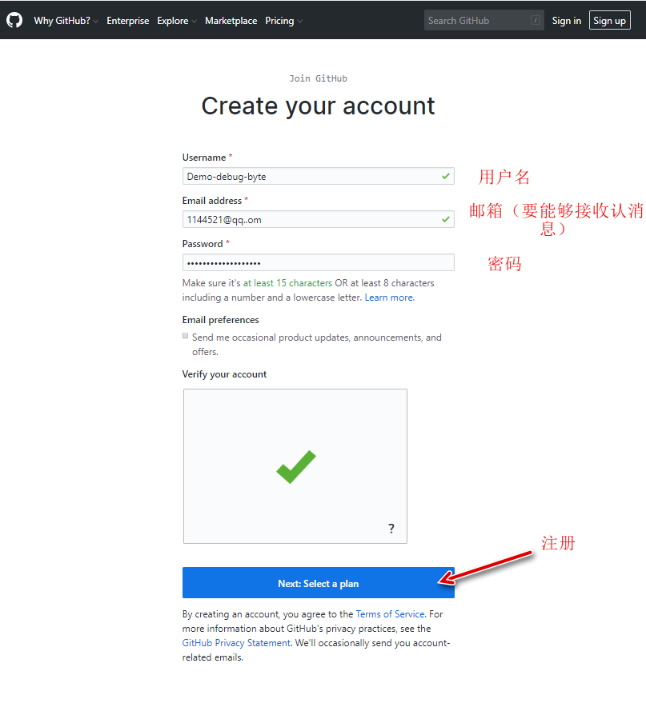
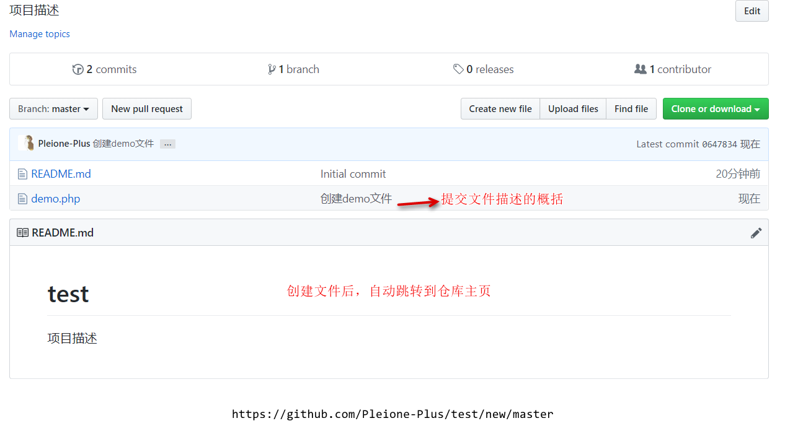

Git和GitHub


# 使用GitHub

## 目的

​		借助GitHub托管项目代码

## 基本概念

### 仓库（Repository）

​		仓库即你的项目，你想在Github上开源一个项目，那就必须新建一个Repository，如果你的开源项目多了，你就拥有多个Repositories。


### 收藏（Star）

​		star意为收藏项目的人数，收藏项目方便再次查看，在GitHub上如果你有一个项目获得100个star都算很不容易了！


### 复制克隆项目（Fork）

​		你开源了一个项目，别人想在你这个项目的基础上做一些改进，然后应用到自己的项目中，这个时候他就可以Fork你的项目，然后他的Github主页上就多了一个项目，只不过这个项目是基于你的项目基础（**本质上是在原有项目的基础上新建了一个分支**），他就可以随心所欲的去改进，但是丝毫不会影响原有项目的代码与结构。


### **发起请求（Pull Request）**

​		发起请求，这个其实是基于Fork的。如果别人在你的基础上做了改进，后来觉得改进不错，应该要把这些改进让更多人收益，于是就像把他的改进合并到原有项目里，这个时候他就可以发起一个Pull  Request（简称PR），原有项目的创建人，就可以收到这个请求，这个时候创建人会仔细review他的代码，并且测试觉得OK，就会接受他的PR，这个时候他做的改进原有项目就会拥有。


### **关注（Watch）**

​		如果你Watch了某个项目，那么以后只要这个项目有任何更新，你都会第一时间收到关于这个项目的通知提醒。


### **事务卡片（Issue）**

​		发现代码Bug，但是目前没有成型代码，需要讨论时用。你开源了一个项目，别人发现你的项目中有bug，后者哪些地方做的不够好，他就可以给你提一个Issue，即问题，提的问题多了，也就是Issues，然后你看到了这些问题就可以逐个去修复，修复OK了就可以一个一个的close掉。


### **Github主页**

​		账号创建成功或点击网址导航栏GitHub图标即可进入GitHub主页，该主页左侧主要显示用户动态以及关注用户或关注仓库的动态，右侧显示所有Git库。


### **仓库主页**

​		仓库主页主要显示项目的信息，如：项目代码、版本、收藏/关注/Fork等情况。


### **个人主页**

​		个人信息：头像、个人简介、关注我的人、我关注的人、我关注的Git库、我的开源项目、我贡献的开源项目等信息


## 注册GitHub账号

### 官方网址

[GitHub](https://github.com/)


### 操作步骤

**GitHub主界面**

.png)

**GitHub注册界面**



**注册成功后进入GitHub主界面**


注：

- 因为GitHub在国外服务器所以访问较慢或者无法访问，需要翻墙（Shadowsocks）
- 私有仓库只能自己或者指定的朋友才有权限操作（私有仓库的收费的）
- 新注册的用户**必须验证邮箱**后才可以创建Git库仓库


## 创建仓库/创建新项目

​		<font color="red">创建仓库/闯进啊新项目之前必须认证邮箱</font>

新建仓库


仓库主页


## 仓库管理

### 创建文件


创建新文件后跳转至test仓库主页



### 修改文件

在仓库中点击要修改的文件名后进入文件详情页面


点击文件详情页中的触笔后，进入修改文件页，在其中对文件内容进行修改后，需提交修改信息


### 删除文件

在仓库主页中点击文件名进入文件详情页，点击删除图标


### 上传文件

在仓库主页点击上传文件按钮


### 搜索文件


### 下载/检出项目


## GitHub Issues

作用：发现代码Bug，但是目前没有成型代码，需要讨论时用；或者使用开源项目出现问题时使用


### 新建Issue


### 提交/关闭Issue


# 使用Git

## Git基本工作流程

### Git工作区


### 向仓库中添加文件流程


## Git初始化及仓库创建和操作

### 基本信息设置

设置用户名：

```git
git config --global user.name 'Pleione-Plus'
```

设置用户名邮箱：

```git
git config --global user.email '2603350388@qq.com'
```


### 初始化一个新的Git仓库

1. 新建一个文件夹
2. 在文件夹内初始化git（创建git仓库）

```git
mkdir demo
cd demo
git init
```


注：

- 初始化仓库后，文件夹内生成一个.git的隐藏文件


### 向仓库添加文件

```git
git status
touch a.php
git status
git add a.php
git status
git commit -m 'add a.php'
```


### 修改仓库文件

```git
git status
vi a.php
git status
git add a.php
git status
git commit -m 'add a.php'
```


### 删除仓库文件

删除文件

```git
rm -rf a.php
```

从Git中华删除文件

```git
git rm a.php
```

提交操作

```git
git commit -m '提交描述'
```


## Git远程仓库

### 使用远程仓库目的

作用：备份，实现代码共享集中化管理


### Git克隆操作

目的：

​		将远程仓库（github对应的项目）复制到本地

代码：

```git
git clone 仓库地址
```


### 将本地仓库同步到git远程仓库中

```git
git push
```


