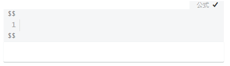

> ---
>
> Title：《在Typora编辑数学表达式》
>
> Author：Pleione_Plus
>
> Started Date：September 8th. 2019.
>
> Finished Date：
>
> ---

# 编辑器简述

​		Typora是一款免费的Markdown编辑器，其主要特点为所见即所得。Typora内嵌LaTex数学表达式语法，即在Typora中可以通过LaTex语法来编辑数学表达式。

# 基本语法

​		`$`是编辑数学表达式的重要符号。被`$`包裹的语句会按LaTex语法解析成数学表达式形式展示。

- 行内表达式写在`$...$`之间，行间表达式写在`$$...$$`之间

- 如果要在同一行输入多个公式，只需要在公式之间加上`\(空格)`或者`\quad`

- 如果要输入多行公式，只需要在上一行公式的末尾加上`\\`

## 公式模块打开姿势

- **点击**【段落】--> 【公式块】
- **快捷键**：Ctrl + Shift + M
- **代码模式**：`$$`+ 回车

数学表达式编辑栏，如下所示：

# 常用表达式

## 上/下标

| 表达式 | LaTex语法 |
| :----: | :-------: |
| $x^2$  |  `$x^2$`  |
| $x_2$  |  `$x_2$`  |

## 分式

|      表达式       |      LaTex语法      |
| :---------------: | :-----------------: |
|       $1/2$       |       `$1/2$`       |
| $\frac{a+1}{b+2}$ | `$\frac{a+1}{b+2}$` |
| ${a+1}\over{b+2}$ | `${a+1}\over{b+2}$` |
|    $\frac ab$     |    `$\frac ab$`     |

## 均值

|     表达式     |    LaTex语法     |
| :------------: | :--------------: |
| $\overline{x}$ | `$\overline{x}$` |

## 开方

|      表达式      |     LaTex语法      |
| :--------------: | :----------------: |
|    $\sqrt{x}$    |    `$\sqrt{x}$`    |
|  $\sqrt[n]{x}$   |  `$\sqrt[n]{x}$`   |
| ${x}^{\frac 12}$ | `${x}^{\frac 12}$` |

## 矢量

|  表达式   |  LaTex语法  |
| :-------: | :---------: |
| $\vec{a}$ | `$\vec{a}$` |

## 积分

|     表达式      |     LaTex语法     |
| :-------------: | :---------------: |
|   $\int{x}dx$   |   `$\int{x}dx$`   |
| $\int_0^1{x}dx$ | `$\int_0^1{x}dx$` |
|   $\iint xdx$   |   `$\iint xdx$`   |
|  $\iiint xdx$   |  `$\iiint xdx$`   |
| $\idotsint xdx$ | `$\idotsint xdx$` |

## 极限

|         表达式         |        LaTex语法         |
| :--------------------: | :----------------------: |
|        $lim n$         |        `$lim n$`         |
| $\lim_{n\to+\infty} n$ | `$\lim_{n\to+\infty} n$` |

## 累加

|         表达式          |         LaTex语法         |
| :---------------------: | :-----------------------: |
|        $\sum{a}$        |        `$\sum{a}$`        |
| $\sum_{n=1}^{100}{a_n}$ | `$\sum_{n=1}^{100}{a_n}$` |

## 阶乘

|          表达式           |          LaTex语法          |
| :-----------------------: | :-------------------------: |
|         $\prod x$         |         `$\prod x$`         |
| $\prod _{n=1} ^{100} x_n$ | `$\prod _{n=1} ^{100} x_n$` |

## 三角函数

|  表达式  | LaTex语法  |
| :------: | :--------: |
| $\sin x$ | `$\sin x$` |
| $\cos x$ | `$\cos x$` |
| $\tan x$ | `$\tan x$` |
| $\cot x$ | `$\cot x$` |
| $\sec x$ | `$\sec x$` |
| $\csc x$ | `$\csc x$` |

## 反三角函数

|   表达式    |   LaTex语法   |
| :---------: | :-----------: |
| $\arcsin x$ | `$\arcsin x$` |
| $\arccos x$ | `$\arccos x$` |
| $\arctan x$ | `$\arctan x$` |

## 对数

|    表达式    |   LaTex语法    |
| :----------: | :------------: |
|   $\ln 2$    |   `$\ln 2$`    |
| $\log _2{8}$ | `$\log _2{8}$` |
|    $\lg8$    |    `$\lg8$`    |

## 省略号

|  表达式  | LaTex语法  |
| :------: | :--------: |
| $\cdots$ | `$\cdots$` |

## 运算符

|      运算符       |      LaTex语法      |
| :---------------: | :-----------------: |
|       $\pm$       |       `$\pm$`       |
|     $\times$      |     `$\times$`      |
|      $\cdot$      |      `$\cdot$`      |
|      $\div$       |      `$\div$`       |
|      $\neq$       |      `$\neq$`       |
|     $\equiv$      |     `$\equiv$`      |
|       $\lt$       |       `$\lt$`       |
|       $\gt$       |       `$\gt$`       |
|    $\leqslant$    |    `$\leqslant$`    |
|    $\geqslant$    |    `$\geqslant$`    |
|      $\leq$       |      `$\leq$`       |
|      $\geq$       |      `$\geq$`       |
|       $\le$       |       `$\le$`       |
|       $\ge$       |       `$\ge$`       |
|      $\leqq$      |      `$\leqq$`      |
|      $\geqq$      |      `$\geqq$`      |
|      $\land$      |      `$\land$`      |
|      $\lor$       |      `$\lor$`       |
|      $\lnot$      |      `$\lnot$`      |
|       $\to$       |       `$\to$`       |
|   $\rightarrow$   |   `$\rightarrow$`   |
|   $\leftarrow$    |   `$\leftarrow$`    |
| $\leftrightarrow$ | `$\leftrightarrow$` |
|   $\Rightarrow$   |   `$\Rightarrow$`   |
|   $\Leftarrow$    |   `$\Leftarrow$`    |
| $\Leftrightarrow$ | `$\Leftrightarrow$` |
|      $\top$       |      `$\top$`       |
|      $\bot$       |      `$\bot$`       |
|     $\vdash$      |     `$\vdash$`      |
|     $\vDash$      |     `$\vDash$`      |
|     $\subset$     |     `$\subset$`     |
|    $\subseteq$    |    `$\subseteq$`    |
|   $\subsetneq$    |   `$\subsetneq$`    |
|       $\in$       |       `$\in$`       |
|     $\notin$      |     `$\notin$`      |
|      $\cup$       |      `$\cup$`       |
|      $\cap$       |      `$\cap$`       |
|   $\mathbb{R}$    |   `$\mathbb{R}$`    |
|   $\mathbb{Q}$    |   `$\mathbb{Q}$`    |
|   $\mathbb{Z}$    |   `$\mathbb{Z}$`    |
|   $\mathbb{N}$    |   `$\mathbb{N}$`    |

## 括号

|   括号    |  LaTex语法  |
| :-------: | :---------: |
|   $(x)$   |   `$(x)$`   |
|   $[x]$   |   `$[x]$`   |
| $\{ x \}$ | `$\{ x \}$` |
|   $|x|$   |     `$|x|$`     |
| $\vert x \vert$ | `$\vert x \vert$` |
| $\Vert x \Vert$ | `$\Vert x \Vert$` |
| $\langle x \rangle$ | `$\langle x \rangle$` |
| $\lceil x \rceil$ | `$\lceil x \rceil$` |
| $\lfloor x \rfloor$ | `$\lfloor x \rfloor$` |
| $\left\lbrace\frac12\right\rbrace$ | `$\left\lbrace\frac12\right\rbrace$` |
| $\Biggl(\biggl(\Bigl(\bigl((x)\bigr)\Bigr)\biggr)\Biggr)$ | `\Biggl(\biggl(\Bigl(\bigl((x)\bigr)\Bigr)\biggr)\Biggr)` |

## 其他特殊字符

|     符号      |    LaTex语法    |
| :-----------: | :-------------: |
|   $\forall$   |   `$\forall$`   |
|   $\exists$   |   `$\exists$`   |
|   $\infty$    |   `$\infty$`    |
|  $\emptyset$  |  `$\emptyset$`  |
| $\varnothing$ | `$\varnothing$` |
|   $\nabla$    |   `$\nabla$`    |
|   $\angle$    |   `$\angle$`    |
|  $\because$   |  `$\because$`   |
| $\therefore$  | `$\therefore$`  |
|   $\vdash$    |   `$\vdash$`    |
|   $\vDash$    |   `$\vDash$`    |
|   $\nvDash$   |   `$\nvDash$`   |

## 希腊字母

|    大写    |  LaTex语法   |     小写      |    LaTex语法    |
| :--------: | :----------: | :-----------: | :-------------: |
|  $\Alpha$  |  `$\Alpha$`  |   $\alpha$    |   `$\alpha$`    |
|  $\Beta$   |  `$\Beta$`   |    $\beta$    |    `$\beta$`    |
|  $\Gamma$  |  `$\Gamma$`  |   $\gamma$    |   `$\gamma$`    |
|  $\Delta$  |  `$\Delta$`  |   $\delta$    |   `$\delta$`    |
| $\Epsilon$ | `$\Epsilon$` |  $\epsilon$   |  `$\epsilon$`   |
|            |              | $\varepsilon$ | `$\varepsilon$` |
|  $\Zeta$   |  `$\Zeta$`   |    $\zeta$    |    `$\zeta$`    |
|   $\Eta$   |   `$\Eta$`   |    $\eta$     |    `$\eta$`     |
|  $\Theta$  |  `$\Theta$`  |   $\theta$    |   `$\theta$`    |
|  $\Iota$   |  `$\Iota$`   |    $\iota$    |    `$\iota$`    |
|  $\Kappa$  |  `$\Kappa$`  |   $\kappa$    |   `$\kappa$`    |
| $\Lambda$  | `$\lambda$`  |   $\lambda$   |   `$\lambda$`   |
|   $\Mu$    |   `$\Mu$`    |     $\mu$     |     `$\mu$`     |
|   $\Nu$    |   `$\Nu$`    |     $\nu$     |     `$\nu$`     |
|   $\Xi$    |   `$\Xi$`    |     $\xi$     |     `$\xi$`     |
| $\Omicron$ | `$\Omicron$` |  $\omicron$   |  `$\omicron$`   |
|   $\Pi$    |   `$\Pi$`    |     $\pi$     |     `$\pi$`     |
|   $\Rho$   |   `$\Rho$`   |    $\rho$     |    `$\rho$`     |
|  $\Sigma$  |  `$\Sigma$`  |   $\sigma$    |   `$\sigma$`    |
|   $\Tau$   |   `$\Tau$`   |    $\tau$     |    `$\tau$`     |
| $\Upsilon$ | `$\Upsilon$` |  $\upsilon$   |  `$\upsilon$`   |
|   $\Phi$   |   `$\Phi$`   |    $\phi$     |    `$\phi$`     |
|            |              |   $\varphi$   |   `$\varphi$`   |
|   $\Chi$   |   `$\Chi$`   |    $\chi$     |    `$\chi$`     |
|   $\Psi$   |   `$\Psi$`   |    $\psi$     |    `$\psi$`     |
|  $\Omega$  |  `$\Omega$`  |   $\omega$    |   `$\omega$`    |

# 常用公式

## 函数

### 一元函数

eg1:
$$
y = x \ \ (x \subset \mathbb{R})
$$
eg2:
$$
y = x^2 \ \ (x \subset \mathbb{R})
$$
eg3:
$$
y = |x| \ \ (x \subset \mathbb{R})
$$

### 多元函数

eg1:
$$
y = a + b \ \ (a \subset \mathbb{R},b \subset \mathbb{R})
$$
eg2:
$$
y = 2a^2 + b^2 \ \ (a \subset \mathbb{R},b \subset \mathbb{R})
$$
eg3:
$$
y = |a| - 2b \ \ (a \subset \mathbb{R},b \subset \mathbb{R})
$$

### 三角函数

eg1:
$$
y = \sin x \ + \ \frac{\pi}{6} \ \ ( -\pi \leq x \leq \pi )
$$
eg2:
$$
y = \cos(x + \frac{\pi}{6}) \ \ ( -\pi \leq x \leq \pi )
$$

### 分段函数

eg1:
$$
f(x)=
\begin{cases}
1 & x \geq 0 \\
0 & x < 0
\end{cases}
$$
eg2:
$$
c(u)=
\begin{cases} 
\sqrt\frac{1}{N}，u = 0 \\ 
\sqrt\frac{2}{N}，u \neq 0
\end{cases}
$$

## 等式

eg1:
$$
1 + 1 = 2
$$
eg2:
$$
1 \div 2 = \frac{1}{2} = 0.5
$$

eg3:

eg4:
$$
\sum_{i=0}^n i^2 = \frac{(n^2+n)(2n+1)}{6}
$$
eg5:
$$
e^{i\pi} + 1 = 0
$$

# 附录

参考链接：

[如何用在Typora中添加数学公式?](https://blog.csdn.net/Ernest_YN/article/details/84064233#31__195)

[MathJax basic tutorial and quick reference - Mathematics Meta Stack Exchange](https://math.meta.stackexchange.com/questions/5020/mathjax-basic-tutorial-and-quick-reference/5044 MathJax basic tutorial and quick reference))